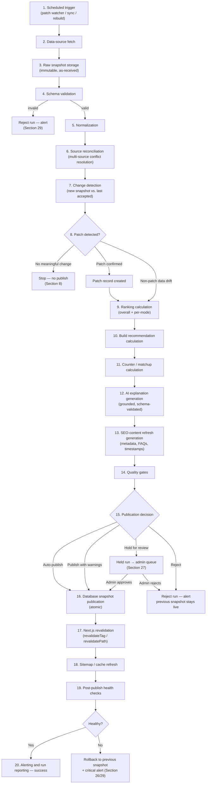
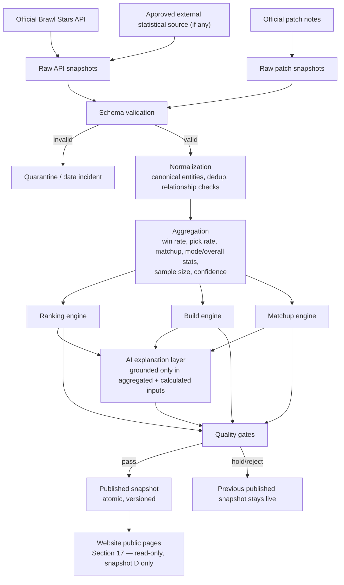
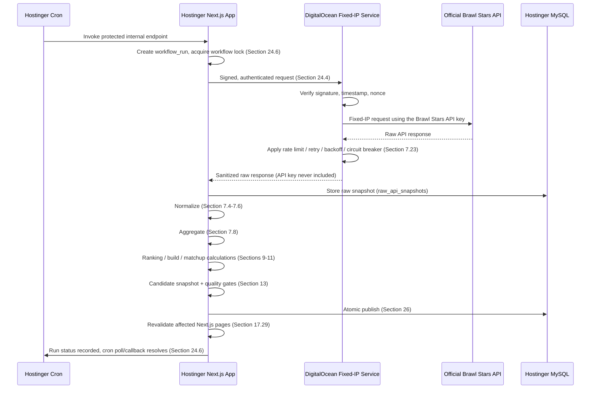
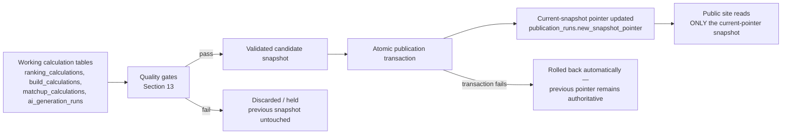

# BrawlRanks — Website & Platform Specification

**Domain:** https://brawlranks.com
**Status:** Draft specification for implementation planning. No application code has been written against this document.
**Audience:** Product, engineering (frontend/backend/automation), SEO, and the coding agent(s) that will build this platform.
**Operating model:** Automation-first. Routine content — Brawler data, stats, builds, gadgets, star powers, gears, counters, tier lists, meta scores, and ranking explanations — is produced, validated, and published by scheduled workflows, not by a human editing a CMS. The admin dashboard is a monitoring, configuration, override, and emergency-control surface.

> This document is the single source of truth for what BrawlRanks is, how it is structured, how its data flows through automated pipelines, and how it will rank in Google. Any implementation decision not covered here should be raised as an open question (Section 52) rather than improvised. **For building any public page, [Section 17 — Public Page Specifications](#17-public-page-specifications) is the authoritative, build-ready reference** (UX, content, data, SEO, responsive, loading, and error behavior for every route). **For how data is actually collected, calculated, and published, [Section 7 — Data Architecture and Data Operating Model](#7-data-architecture-and-data-operating-model) is authoritative** — it explicitly distinguishes what the official Brawl Stars API provides from what BrawlRanks must calculate internally, and no other section should be read as contradicting it; Sections 8–15 and 25–26 remain authoritative for pipeline control flow and publication mechanics built on top of Section 7's data model.

---

## Table of Contents

1. [Executive Summary](#1-executive-summary)
2. [Product Goals](#2-product-goals)
3. [Target Audience](#3-target-audience)
4. [User Problems Solved](#4-user-problems-solved)
5. [Core Platform Features](#5-core-platform-features)
6. [Automation-First Architecture](#6-automation-first-architecture)
7. [Data Architecture and Data Operating Model](#7-data-architecture-and-data-operating-model) — **the authoritative source for every data-related implementation decision**
    - 7.1 [Official Brawl Stars API](#71-official-brawl-stars-api)
    - 7.2 [API Access Infrastructure](#72-api-access-infrastructure)
    - 7.3 [Player-Sampling Strategy](#73-player-sampling-strategy)
    - 7.4 [Battle-Log Collection](#74-battle-log-collection)
    - 7.5 [Raw, Normalized, Aggregated, and Published Data Layers](#75-raw-normalized-aggregated-and-published-data-layers)
    - 7.6 [Canonical Entity Model](#76-canonical-entity-model)
    - 7.7 [Official Patch Notes Pipeline](#77-official-patch-notes-pipeline)
    - 7.8 [Statistical Aggregation](#78-statistical-aggregation)
    - 7.9 [Pick-Rate Definition](#79-pick-rate-definition)
    - 7.10 [Win-Rate Bias Correction](#710-win-rate-bias-correction)
    - 7.11 [Ranking Engine Input Contract](#711-ranking-engine-input-contract)
    - 7.12 [Overall Score vs. Mode Score](#712-overall-score-vs-mode-score)
    - 7.13 [Tier Assignment](#713-tier-assignment)
    - 7.14 [Build Data Limitation](#714-build-data-limitation)
    - 7.15 [Counter Data Limitation](#715-counter-data-limitation)
    - 7.16 [AI Data-Usage Contract](#716-ai-data-usage-contract)
    - 7.17 [Confidence System](#717-confidence-system)
    - 7.18 [Cold-Start Strategy](#718-cold-start-strategy)
    - 7.19 [External Data Sources](#719-external-data-sources)
    - 7.20 [Data Retention](#720-data-retention)
    - 7.21 [Database Tables (Data-Collection Layer)](#721-database-tables-data-collection-layer)
    - 7.22 [Collection Schedule](#722-collection-schedule)
    - 7.23 [Rate-Limit Budget](#723-rate-limit-budget)
    - 7.24 [Data-Quality Gates](#724-data-quality-gates)
    - 7.25 [Public Data Contract](#725-public-data-contract)
    - 7.26 [Fallback Behavior](#726-fallback-behavior)
    - 7.27 [Public Disclosure Boundary](#727-public-disclosure-boundary)
    - 7.28 [Owner Decisions](#728-owner-decisions)
8. [Change Detection](#8-change-detection)
9. [Automatic Ranking Engine](#9-automatic-ranking-engine)
10. [Automatic Build Recommendation Engine](#10-automatic-build-recommendation-engine)
11. [Automatic Counters and Matchups Engine](#11-automatic-counters-and-matchups-engine)
12. [AI Explanation Layer](#12-ai-explanation-layer)
13. [Quality Gates](#13-quality-gates)
14. [Auto-Publish Rules](#14-auto-publish-rules)
15. [Workflow Frequencies](#15-workflow-frequencies)
16. [Complete Route and Page Architecture](#16-complete-route-and-page-architecture)
17. [Public Page Specifications](#17-public-page-specifications) — **the authoritative, build-ready spec for every route**
    - 17.1 [Global Public-Site Rules](#171-global-public-site-rules)
    - 17.2 [Global Site Layout](#172-global-site-layout)
    - 17.3 [Homepage — `/`](#173-homepage--)
    - 17.4 [Tier List — `/tier-list`](#174-tier-list---tier-list)
    - 17.5 [Meta — `/meta`](#175-meta---meta)
    - 17.6 [Best Brawlers — `/best-brawlers`](#176-best-brawlers---best-brawlers)
    - 17.7 [Brawler Directory — `/brawlers`](#177-brawler-directory---brawlers)
    - 17.8 [Brawler Detail — `/brawlers/[slug]`](#178-brawler-detail---brawlersslug)
    - 17.9 [Game Modes Directory — `/game-modes`](#179-game-modes-directory---game-modes)
    - 17.10 [Game Mode Detail — `/game-modes/[slug]`](#1710-game-mode-detail---game-modesslug)
    - 17.11 [Counters Hub — `/counters`](#1711-counters-hub---counters)
    - 17.12 [Builds Hub — `/builds`](#1712-builds-hub---builds)
    - 17.13 [Guides Hub — `/guides`](#1713-guides-hub---guides)
    - 17.14 [Guide Detail — `/guides/[slug]`](#1714-guide-detail---guidesslug)
    - 17.15 [Updates Hub — `/updates`](#1715-updates-hub---updates)
    - 17.16 [Update Detail — `/updates/[slug]`](#1716-update-detail---updatesslug)
    - 17.17 [Compare Hub — `/compare`](#1717-compare-hub---compare)
    - 17.18 [Comparison Detail — `/compare/[a]-vs-[b]`](#1718-comparison-detail---compareavsb)
    - 17.19 [Search — `/search`](#1719-search---search)
    - 17.20 [Removed Page Slot (CANCELLED)](#1720-removed-page-slot-cancelled)
    - 17.21 [About — `/about`](#1721-about---about)
    - 17.22 [Contact — `/contact`](#1722-contact---contact)
    - 17.23 [Editorial Policy — `/editorial-policy`](#1723-editorial-policy---editorial-policy)
    - 17.24 [Disclaimer — `/disclaimer`](#1724-disclaimer---disclaimer)
    - 17.25 [Privacy Policy — `/privacy-policy`](#1725-privacy-policy---privacy-policy)
    - 17.26 [Terms of Service — `/terms-of-service`](#1726-terms-of-service---terms-of-service)
    - 17.27 [Custom 404 Page](#1727-custom-404-page)
    - 17.28 [Error Page / Error Boundaries](#1728-error-page--error-boundaries)
    - 17.29 [Public-Page Automation Matrix](#1729-public-page-automation-matrix)
    - 17.30 [Internal-Linking Map](#1730-internal-linking-map)
    - 17.31 [Page-Component Inventory](#1731-page-component-inventory)
    - 17.32 [Responsive Rules](#1732-responsive-rules)
    - 17.33 [Accessibility Requirements](#1733-accessibility-requirements)
    - 17.34 [SEO Output Summary (All Pages)](#1734-seo-output-summary-all-pages)
    - 17.35 [Analytics Events by Page](#1735-analytics-events-by-page)
18. [Homepage Specification (superseded — see 17.3)](#18-homepage-specification)
19. [Tier-List System (superseded — see 17.4)](#19-tier-list-system)
20. [Brawler Detail Page (superseded — see 17.8)](#20-brawler-detail-page)
21. [Game-Mode Pages (superseded — see 17.10)](#21-game-mode-pages)
22. [Meta, Best-Brawlers, and Tier-List Differentiation (superseded — see 17.5/17.6)](#22-meta-best-brawlers-and-tier-list-differentiation)
23. [Page Behavior Under Automation (superseded — see 17.29)](#23-page-behavior-under-automation)
24. [Final Hosting and Infrastructure Architecture](#24-final-hosting-and-infrastructure-architecture) — **Hostinger Business + Hostinger MySQL + DigitalOcean fixed-IP service; no Supabase**
    - 24.1 [Responsibility Split](#241-responsibility-split)
    - 24.2 [Official API Data Flow](#242-official-api-data-flow)
    - 24.3 [Hard Boundary: What the Public Browser Must Never Call](#243-hard-boundary-what-the-public-browser-must-never-call)
    - 24.4 [DigitalOcean Proxy Security](#244-digitalocean-proxy-security)
    - 24.5 [Workflow Execution Split](#245-workflow-execution-split)
    - 24.6 [Hostinger Cron Design](#246-hostinger-cron-design)
    - 24.7 [Database Access Layer and ORM Choice](#247-database-access-layer-and-orm-choice)
    - 24.8 [Authentication and Admin Authorization](#248-authentication-and-admin-authorization)
    - 24.9 [File and Image Storage](#249-file-and-image-storage)
    - 24.10 [Backups](#2410-backups)
    - 24.11 [Environment Variable Inventory](#2411-environment-variable-inventory)
25. [Database Schema](#25-database-schema)
26. [Publication Snapshot Model](#26-publication-snapshot-model)
27. [Admin Dashboard](#27-admin-dashboard)
28. [Emergency Overrides](#28-emergency-overrides)
29. [Failure Handling](#29-failure-handling)
30. [Observability and Alerting](#30-observability-and-alerting)
31. [SEO Architecture](#31-seo-architecture)
32. [SEO Automation](#32-seo-automation)
33. [Keyword-to-Page Mapping Strategy](#33-keyword-to-page-mapping-strategy)
34. [Internal-Linking Strategy](#34-internal-linking-strategy)
35. [Structured Data](#35-structured-data)
36. [Sitemap and Indexing Strategy](#36-sitemap-and-indexing-strategy)
37. [Performance Requirements](#37-performance-requirements)
38. [Security Requirements](#38-security-requirements)
39. [Legal and Trademark Requirements](#39-legal-and-trademark-requirements)
40. [Analytics and Tracking](#40-analytics-and-tracking)
41. [MVP Scope](#41-mvp-scope)
42. [Phase-Two Features](#42-phase-two-features)
43. [Development Order](#43-development-order)
44. [Acceptance Criteria](#44-acceptance-criteria)
45. [Risks and Open Decisions](#45-risks-and-open-decisions)
46. [Automation-First Architecture Summary](#46-automation-first-architecture-summary)
47. [Required Data-Source Decisions](#47-required-data-source-decisions)
48. [Ranking-Engine Open Decisions](#48-ranking-engine-open-decisions)
49. [Auto-Publish Safety Decisions](#49-auto-publish-safety-decisions)
50. [Recommended MVP Automation Scope](#50-recommended-mvp-automation-scope)
51. [Recommended First Implementation Task](#51-recommended-first-implementation-task)
52. [Owner-Approval Questions](#52-owner-approval-questions)

---

## 1. Executive Summary

BrawlRanks is an **automated** Brawl Stars data, ranking, and SEO platform — not a blog, and not a CMS that happens to be about Brawl Stars. Its core asset is a structured, versioned dataset — Brawlers, builds, gadgets, star powers, gears, game modes, matchups, and patch history — that is **fetched, validated, calculated, explained, quality-checked, and published by scheduled automated workflows**, then rendered through SEO-optimized, fast, mobile-first pages.

Routine updates do not depend on a human administrator opening a dashboard and typing in a tier. When Supercell ships a patch, or new statistical data accumulates, BrawlRanks' pipeline detects the change, recalculates rankings/builds/counters from configured rules, generates grounded (non-hallucinated) explanations from the same structured data, runs the result through quality gates, and — if the gates pass — publishes automatically, revalidates the affected pages, refreshes the sitemap, and confirms site health. A human is only in the loop for configuration, source approval, low-confidence review, emergency override, pause/resume, manual rerun, rollback, and incident response — never for entering a Brawler's tier by hand as routine operation.

The business model is organic search traffic. The product model is "useful tool first, content second," now with a third pillar: **the tool must stay current without waiting on a person**. Every page must answer a real question a Brawl Stars player has, backed by an explicit, visible, and now *machine-enforced* methodology (every ranking, build, and matchup carries a stored input breakdown and confidence score), which is precisely the kind of verifiable, freshness-consistent signal Google's helpful-content and E-E-A-T systems reward.

The technical foundation is Next.js 16 (App Router) + TypeScript + Tailwind, **Hostinger MySQL** for data/workflow state (via a server-only Prisma/Drizzle data-access layer, Section 24.7), **Auth.js-based application-level authentication** for the admin surface (Section 24.8), static version-controlled assets for imagery (Section 24.9), **Hostinger Business Web App** for hosting and cron orchestration, a **DigitalOcean fixed-IP service** for all official Brawl Stars API access (Section 24), and GitHub for source control, with rendering strategy (SSG/ISR/SSR) chosen per route and revalidation triggered by **publication events emitted by the automation pipeline**, not by an admin clicking "publish" on a content form.

This document defines product scope, an end-to-end automation architecture, database schema (content + automation), publication and rollback semantics, admin monitoring/override workflows, SEO architecture, and a phased build plan starting from data contracts rather than UI. It intentionally excludes code and migrations.

---

## 2. Product Goals

| Goal | Description | Primary Metric |
|---|---|---|
| G1 | Become the top organic result for "brawl stars tier list" and its cluster | Organic ranking position, organic sessions |
| G2 | Provide genuinely useful, patch-current data so users bookmark/return | Returning-visitor rate, pages/session |
| G3 | **Keep rankings, builds, and counters current within hours of a patch without human data entry** | Time from patch release to automated publish, % of publishes with zero manual intervention |
| G4 | Build durable topical authority (E-E-A-T) in the Brawl Stars niche, backed by reproducible, inspectable calculations | Indexed pages, backlinks, branded search volume |
| G5 | Keep the automation pipeline and codebase scalable for new sources, new modes, and new features without re-architecture | Engineering velocity on Phase 2 features |
| G6 | Avoid thin/duplicate/cannibalizing pages that dilute ranking signal | Search Console: query-to-page overlap, indexed vs. crawled ratio |
| G7 | **Never let a bad or partial automated run reach production** | Zero incidents of a failed/low-confidence run overwriting a healthy published snapshot |

Non-goals for v1: user accounts, community voting, monetization mechanics, multi-language content. These are evaluated in Section 42 but are explicitly out of MVP scope. Manual, human-typed tier assignment as the *primary* content mechanism is also explicitly a non-goal — it is retained only as an emergency/override path (Sections 27–28).

---

## 3. Target Audience

| Audience | Search Intent | Needs | Entry Point |
|---|---|---|---|
| **Tier-list checkers** | "brawl stars tier list", "brawl stars best brawler" — broad, high-volume, informational | Fast answer, current patch, clear tier grouping, no clutter | `/tier-list`, `/` |
| **Upgrade planners** | "who should I upgrade in brawl stars", "best brawler to level up" | A ranked, trustworthy recommendation to avoid wasting in-game currency | `/best-brawlers`, `/tier-list` |
| **Ranked/competitive players** | "best brawlers for ranked", "brawl stars ranked meta" | High-skill-ceiling picks, matchup awareness, current competitive meta | `/meta`, `/game-modes/ranked` |
| **Mode-specific players** | "best brawlers for brawl ball", "gem grab tier list" | Mode-relevant picks, team comps, map awareness | `/game-modes/[slug]` |
| **Beginners** | "brawl stars beginner guide", "easiest brawler to use" | Low-skill-floor picks, simple explanations, avoid overwhelming detail | `/guides`, `/best-brawlers?goal=beginner` |
| **Build researchers** | "mortis best build", "mortis best gears", "mortis best star power" | One comprehensive, specific, current, *evidence-backed* answer per Brawler | `/brawlers/[slug]` |
| **Counter-pick researchers** | "who counters mortis", "mortis counters" | Matchup data, both directions, backed by real matchup sample sizes | `/brawlers/[slug]#counters`, `/counters` |
| **Post-patch returners** | "brawl stars new update", "brawl stars patch notes" | What changed, who moved tiers, why — generated automatically as soon as the patch is confirmed | `/updates`, `/updates/[slug]` |
| **General informational searchers** | "brawl stars game modes", "how to play [brawler]" | Explainers, guides, onboarding content | `/guides/[slug]`, `/game-modes/[slug]` |

Every route in Section 16 is built to serve one or more of these groups without overlapping intent with another route (Section 31 on cannibalization).

---

## 4. User Problems Solved

1. "Which Brawler is actually strong right now?" → an automatically recalculated, patch-versioned tier list, refreshed by the pipeline as soon as new data justifies a change — not whenever a person gets around to updating it.
2. "I only have one Brawler at high power — should I upgrade someone else?" → upgrade recommendations tied to tier + rarity + accessibility, derived from the same automated ranking engine.
3. "What's the best build for X?" → one canonical, current, evidence-based build recommendation per Brawler, with a stored metric breakdown (usage rate, win rate, sample size).
4. "Who beats me / who do I beat?" → counters and strong-against matchups calculated from matchup data with confidence thresholds, not hand-guessed.
5. "What's good in this specific mode?" → per-mode tier lists calculated independently from the overall list.
6. "What changed in the last patch?" → a patch-watcher workflow detects the patch, diffs the previous vs. new ranking snapshot, and generates the update page automatically.
7. "Can I trust this ranking?" → every published number carries a visible confidence score, sample size, and calculation timestamp, plus plain-language independence and trust statements on `/disclaimer` and `/about`.
8. "I'm new — what should I even play?" → beginner-specific recommendation surface, computed from the same tagged recommendation logic.

---

## 5. Core Platform Features

**P0 (MVP-blocking):**
- Automated data-ingestion pipeline (fetch → raw snapshot → normalize → reconcile)
- Change-detection and patch-watcher workflows
- Automated ranking engine (overall + per-mode)
- Automated build-recommendation engine
- Automated counters/matchup engine
- Grounded AI explanation layer (ranking reasons, strengths/weaknesses, how-to-play, FAQs)
- Quality gates and auto-publish decisioning
- Atomic publication snapshots + on-demand Next.js revalidation
- Dynamic overall tier list, per-game-mode tier lists
- Brawler directory + detail pages, Meta page, Best-Brawlers page
- Basic guides (editorially authored — see Section 12.6 on why guides stay human-written)
- Admin authentication + automation monitoring dashboard (status, runs, alerts, health)
- Pause/resume, manual rerun, rollback, emergency override
- Dynamic SEO metadata, sitemap, robots.txt, JSON-LD, all automation-refreshable per Section 32
- Legal/trust pages (About, Editorial Policy, Privacy, ToS, Disclaimer)

**P1 (fast-follow):**
- Updates/patch-notes hub with full historical diffing
- Search
- Compare (curated two-Brawler comparison pages)
- Held-run review UI polish, weight/threshold tuning UI, internal-link-suggestion tooling

**P2 (Phase 2, post-launch):**
- Community voting, accounts, saved builds, historical charts, public API, i18n. See Section 42.

---

## 6. Automation-First Architecture

### 6.1 Operating principle

BrawlRanks' database is **not** primarily edited by a person typing into forms. It is maintained by a chain of scheduled and event-triggered **workflows**, each with a defined input, output, retry policy, and quality gate. A human administrator configures the rules the workflows follow (ranking weights, tier thresholds, confidence minimums, source list), watches the system's health, and steps in only when the system itself flags something it cannot safely decide on its own.

### 6.2 The end-to-end pipeline



### 6.3 Workflow types (distinct schedules, distinct scope)

| Workflow | Scope | Triggers ranking recalculation? | Publishes? |
|---|---|---|---|
| **Scheduled sync** | Fetch + normalize + reconcile all configured sources; detect drift | Only if change detection finds a meaningful, non-patch data shift | Only if quality gates pass on the resulting calculations |
| **Patch watcher** | Lightweight, frequent check specifically for a new patch/version identifier | Always, once a patch is confirmed (full pipeline runs) | Yes, subject to gates |
| **Ranking rebuild** | Full recalculation of overall + per-mode rankings from the latest accepted normalized snapshot | Yes, this *is* the recalculation step | Yes, subject to gates |
| **Build/counter refresh** | Recalculates build recommendations and matchup relationships; lighter-weight than a full ranking rebuild, can run more often | No (reuses last accepted ranking snapshot as context) | Yes, for build/counter data only |
| **SEO freshness workflow** | Regenerates metadata, FAQs, internal links, sitemap, structured data for pages whose underlying data changed since the last SEO pass | No | Yes, for SEO-layer fields only (never rankings) |
| **Health-monitoring workflow** | Independent check of source uptime, last-successful-run age, published-snapshot availability, page health | No | No — read-only, alert-only |

Each workflow type is defined as a `workflow_definitions` row (Section 25) with its own schedule, retry policy, and quality-gate profile — this table-driven design means adding a new workflow (e.g., a new mode-specific refresh) is a configuration change, not a code change.

---

## 7. Data Architecture and Data Operating Model

This section is the **authoritative source for every data-related implementation decision** on BrawlRanks: where every important data point comes from, how often it is collected, how it is validated and normalized, how it is stored, how calculations are performed, how confidence is derived, how snapshots are published, how public pages consume the result, what happens when data is unavailable, what requires human approval, and what is safe to auto-publish. Sections 8–13 (Change Detection, Ranking/Build/Matchup Engines, AI Layer, Quality Gates) remain in force for pipeline *control flow*; this section is where the underlying *data mechanics* those steps depend on are actually specified. Where the two overlap, this section is authoritative on data mechanics and Sections 8–13 are authoritative on workflow sequencing — they are cross-referenced, not duplicated.

**Ground rule for this entire section:** BrawlRanks does not assume any data source, endpoint, or field exists or is licensed for use until explicitly verified against current, official documentation or an approved provider agreement. No API is invented in this document, and no capability is described as available without a caveat where its existence is not yet confirmed. Every subsection below distinguishes explicitly between (1) data the official Brawl Stars API is realistically expected to provide, (2) data BrawlRanks must calculate internally from that raw data, (3) data sourced from official patch notes, (4) data that may come from a legally permitted external statistical source *if one is approved*, (5) data generated by AI strictly from validated inputs, and (6) data that must never be presented as fact unless one of the above actually supports it.

### 7.1 Official Brawl Stars API

The official Brawl Stars API is BrawlRanks' **primary first-party runtime data source** for identity, catalog, and player/battle-activity data. It is explicitly **not** a ready-made tier-list API, does not expose global win-rate/pick-rate statistics, and does not expose aggregate community build-usage data — none of that exists as a queryable endpoint; all of it must be **calculated by BrawlRanks** from raw data the API does provide (Sections 7.4, 7.8). Nothing in this document claims otherwise anywhere else, and Section 30 below corrects any place the earlier draft could have been read that way.

**Rule:** no endpoint may be used in production until it has been verified against the current official Brawl Stars API documentation at implementation time. The categories below describe what *should be evaluated and confirmed* — they are not a guarantee that every field named exists in the exact shape described; exact field names, nesting, and availability must be checked against the live docs before any ingestion code is written.

| Capability | Purpose | Endpoint category | Expected fields (to be verified) | Update frequency | Storage destination | Reliability | Rate-limit considerations | Auth requirements | IP allowlisting | Fallback behavior | Legal/policy constraints |
|---|---|---|---|---|---|---|---|---|---|---|---|
| Brawler catalog data | Canonical Brawler/Gadget/Star Power/Gear identity and existence | Brawler catalog / static game-data endpoint | Brawler ID, name, rarity, class (if exposed), gadget/star power/gear names and IDs | Low (checked on schedule, changes only with a content patch) | `canonical_brawlers`, `gadgets`, `star_powers`, `gears` (Section 25.1) via `raw_api_snapshots` | High — this is core, stable, first-party identity data | Cheap; small, infrequent payload | API key | Per Section 7.2 | Serve last accepted catalog snapshot; do not remove a Brawler from the public site on a single failed fetch (Section 8.1 `brawler_removed_or_deprecated` requires confirmation, not one bad fetch) | Standard API ToS; no personal data involved |
| Player profile data | Identity/profile fields for sampled players (trophies, brawlers owned, club membership) | Player-lookup-by-tag endpoint | Player tag, name, trophy count, club tag (if any), per-Brawler trophy/power level (if exposed) | Per player, on its crawl schedule (Section 7.22) | `normalized_players` (Section 7.21) | High for reachable, valid tags; player tags can go stale (renamed, deleted, privacy-restricted) | One request per sampled player per crawl cycle — budgeted (Section 7.23) | API key | Per Section 7.2 | If a tag becomes unreachable, mark inactive in `player_crawl_schedule` rather than retrying indefinitely | Minimize retained personal data (Section 7.20); player tag is a public game identifier, not private personal data by itself, but is still handled conservatively |
| Club data | Club membership/roster context, optionally used to seed additional players | Club-lookup-by-tag endpoint | Club tag, name, member list (tags) | Low, opportunistic (only fetched when a club is a seed source, Section 7.3) | `normalized_clubs` (Section 7.21) | High | Low volume | API key | Per Section 7.2 | Skip club-based discovery if unavailable; not a blocking dependency | Same as player profile data |
| Rankings (global/local leaderboards) | Seed source for the player sample — top players by trophies, per country/region if exposed | Rankings/leaderboard endpoint | Rank position, player tag, name, trophy count, per-country variants (if exposed) | Daily (seed refresh, Section 7.22) | Feeds `seed_players` (Section 7.21) | High — official leaderboard data | Low volume (paginated top-N fetch) | API key | Per Section 7.2 | If rankings are unreachable, seed refresh is skipped for that cycle; existing seed pool remains valid | None beyond standard ToS |
| Battle logs | **The core statistical raw material** — a given player's recent battles (mode, result, teammates/opponents, Brawlers used) | Player battle-log endpoint | Battle time, mode, map/event (if exposed), result, team/opponent Brawler identifiers per participant — **whether Gadget/Star Power/Gear selection is included is not assumed and must be verified (Section 7.14)** | Continuous, queued per player (Section 7.4/7.22) | `raw_api_snapshots` → `normalized_battles`/`battle_teams`/`battle_participants` (Section 7.21) | Medium-high per request, but the endpoint is understood to expose only a **limited recent window** per player (exact depth to be confirmed) — this is why continuous, broad sampling is required to build history (Section 7.4) | The highest-volume endpoint category in the whole pipeline — the primary driver of the rate-limit budget (Section 7.23) | API key | Per Section 7.2 | If a player's battle log fetch fails, retry per backoff policy (Section 7.23), then reschedule normally — one failure does not remove the player from the sample | Public gameplay-outcome data about the sampled player, not the requester; still handled under the retention/minimization posture in Section 7.20 |
| Current event/rotation data | Active event modes/maps, if exposed, for context on `/game-modes/[slug]` and mode-scoped aggregation filters | Events endpoint (if one exists) | Active event mode, map, rotation window | Frequent (event rotations can change multiple times a day) | `battle_events`/`canonical_maps` context (Section 7.21) | Unconfirmed — must be verified; if unavailable, event-scoped filtering is simply not offered rather than guessed | Low volume | API key | Per Section 7.2 | If unavailable, mode/map aggregation proceeds without event-rotation granularity; never fabricated | None beyond standard ToS |
| Any other officially documented endpoint | Anything else confirmed present in the live documentation at implementation time (e.g., additional catalog metadata) | To be catalogued in `source_endpoints` (Section 7.21) as discovered/confirmed | To be confirmed | To be confirmed | To be confirmed | To be confirmed | To be confirmed | API key | Per Section 7.2 | Not used until catalogued and confirmed | Reviewed against ToS before use |

**What the official API does *not* provide (must not be claimed anywhere in this document or the product):** a pre-computed tier list; global win rate, pick rate, or ban rate for any Brawler; aggregate or global Gadget/Star Power/Gear usage statistics; matchup/counter data; any notion of a "meta score." All of these are BrawlRanks-calculated outputs derived from raw data the API *does* expose (primarily battle logs), per Sections 7.4–7.13.

### 7.2 API Access Infrastructure

**This is now a final infrastructure decision, not an evaluated option set — [Section 24](#24-final-hosting-and-infrastructure-architecture) is the authoritative, complete specification.** Summary for continuity with the rest of Section 7: BrawlRanks accesses the official Brawl Stars API exclusively through an **existing DigitalOcean service with a fixed public IP** (Section 24.1). That service holds the Brawl Stars API key, presents the allowlisted IP, and is the only component in the entire architecture that ever talks to the official API. The Hostinger-hosted Next.js application and its MySQL database never call the official API directly (Section 24.3) — every fetch flows Hostinger cron/workflow trigger → signed request to DigitalOcean (Section 24.4) → DigitalOcean's fixed-IP call to the official API → sanitized response back to Hostinger → raw storage in MySQL (Section 24.2's full sequence diagram).

**The API key must never be exposed in:** client-side JavaScript, public repositories, browser network requests, application logs, analytics payloads, or error messages/stack traces surfaced to any client — and, per the final architecture, it is never present anywhere in the Hostinger environment at all (Section 24.11), which is a stronger guarantee than "never exposed" alone.

**API key rotation, secret storage, request signing, retry/backoff, rate limiting, request queues, circuit breakers, and monitoring** are all specified in full in Section 24.4 (proxy security) and Section 7.23 (rate-limit budget) — not re-derived here to avoid two descriptions of the same mechanism.

### 7.3 Player-Sampling Strategy

Because battle logs are tied to individual players, BrawlRanks cannot query "global win rate" directly — it must **build a representative sample of players, continuously crawl their battle logs, and aggregate the results** (Section 7.8). The validity of every downstream ranking, build recommendation, and matchup depends entirely on this sample being broad and representative, not skewed toward whoever happened to be easiest to discover. **The sampling strategy is versioned and documented** (a `sampling_strategy_version` recorded alongside every aggregation run, Section 7.21) precisely because changing it changes what the numbers mean — a shift in sampling methodology is treated with the same seriousness as a ranking-rule-set change (Section 9.8).

**Seed sources evaluated:**

| Seed source | What it contributes | Risk if used alone |
|---|---|---|
| Global rankings (top trophies) | High-visibility, high-skill players | Skews toward top-bracket play only; won't represent how most players experience a Brawler |
| Country/regional rankings | Regional spread | Without deliberate multi-region sampling, defaults to whichever regions the API surfaces most easily |
| High-ranked/ranked-mode players | Competitive-relevance signal, useful for a "ranked" mode-specific score | Over-indexes on competitive meta, understates casual/ladder performance |
| Clubs (member rosters) | A cheap way to expand the sample from a small number of API calls (one club fetch yields many player tags) | Club membership clusters by social group, not skill/region — risks correlated, non-independent samples if over-relied upon |
| Previously observed players | Players discovered as battle-log participants in someone else's log | Grows the sample organically without new seed calls, but compounds any existing bias in the seed set if not deliberately diversified |
| Battle participants (opponents/teammates encountered) | Same as above — a natural discovery mechanism | Same risk; must be balanced against deliberate stratified seeding, not relied on exclusively |

**Sampling rules:**
- **Seed-player table (`seed_players`, Section 7.21):** the deliberately-chosen starting set, tagged by source (global rank, regional rank, club, etc.) and stratum (region, trophy bracket).
- **Discovery rules:** players encountered as battle participants are added to `observed_players` (Section 7.21), not directly promoted to the actively-crawled set — promotion happens only if they fill an underrepresented stratum, preventing the sample from organically drifting toward whatever social cluster the seed players belong to.
- **Re-crawl priority:** active, frequently-playing players are re-crawled more often than inactive ones (`player_crawl_schedule`, Section 7.21), weighted by how much new battle data they're likely to have produced since their last crawl.
- **Sampling across regions:** the seed set deliberately includes players from multiple regions/countries (not just whichever region the default rankings endpoint returns first), tracked per-player so aggregation can be checked for regional balance.
- **Sampling across trophy/rank brackets:** the seed set deliberately spans brackets (not top-only), tracked per-player so a Brawler's score isn't accidentally just "how good is this Brawler at the very top of the leaderboard."
- **Avoiding overrepresentation of the same players:** a per-player cap on how much any single player's battles can contribute to an aggregation window (Section 7.10) prevents one extremely active player from dominating a Brawler's statistics.
- **Avoiding one-region or one-mode bias:** aggregation-time stratification and, where needed, weighting (Section 7.10) correct for a sample that's structurally uneven across regions/modes, rather than assuming the raw sample is already balanced.
- **Sample-size targets:** a configured minimum number of distinct players and distinct battles per Brawler per mode per patch before a statistic is considered usable at standard confidence (feeds Section 7.17); exact target numbers are an owner decision (Section 7.28) since they trade off launch speed against statistical reliability.
- **Cold-start behavior:** a brand-new sample (pre-launch, or immediately after a major sampling-strategy change) starts with too little data to be reliable — handled by the cold-start strategy (Section 7.18), never by silently publishing thin-sample statistics as if they were robust.
- **Retention policy:** raw per-battle data is retained per Section 7.20, not indefinitely at full granularity.
- **Inactive-player handling:** players who stop appearing in fresh battle logs are deprioritized in the crawl schedule and eventually marked inactive (not deleted outright — their historical battle contributions remain valid for the aggregation windows they occurred in).

### 7.4 Battle-Log Collection

A continuous battle-log ingestion workflow — distinct from, but feeding into, the scheduled-sync workflow type defined in Section 6.3 — is what turns the player sample (Section 7.3) into usable statistics. **The official battle-log endpoint is expected to expose only a limited, recent window per player** (exact depth to be confirmed against live documentation, Section 7.1); it is not a historical archive. This is precisely why continuous, broad, frequent collection is required to build a meaningful historical dataset — BrawlRanks assembles its own history by repeatedly capturing each player's recent-battles window over time, not by requesting "give me last month's battles" from the API.

**Pipeline steps:**

1. **Select due players** — pull the next batch from `player_crawl_schedule` (Section 7.21) ordered by priority (Section 7.3/7.23).
2. **Fetch latest battle logs** — one request per due player, via the proxy (Section 7.2).
3. **Store raw API response** — unmodified, into `raw_api_snapshots` (Section 7.21), before any parsing.
4. **Validate schema** — confirm the response matches the currently-known contract for this endpoint (Section 7.24); a mismatch halts processing of that response and raises a `schema change` failure (Section 29), it does not get force-parsed.
5. **Normalize battles** — map raw fields to the canonical `normalized_battles` shape (Section 7.6/7.21).
6. **Generate deterministic battle identifiers** — a battle ID derived from stable fields (e.g., a hash of participant tags + battle timestamp + mode), so the same real-world battle always normalizes to the same internal ID regardless of which participant's log it was observed from.
7. **Deduplicate** — the same battle is very often observed multiple times (once per participant whose log includes it); the deterministic ID from step 6 makes this a straightforward upsert-if-not-exists rather than a fuzzy-matching problem.
8. **Store participants** — each battle's participant list, with their Brawler used and any other per-participant fields confirmed available (Section 7.1/7.14 — Gadget/Star Power/Gear selection is not assumed present).
9. **Store teams** — team groupings within the battle (for team-based modes).
10. **Store mode/map/event context** — from `canonical_game_modes`/`canonical_maps` (Section 7.6).
11. **Store result** — win/loss/draw, from the perspective of each participant/team.
12. **Store timestamps** — battle time as reported by the source, plus BrawlRanks' own collection timestamp (these are tracked separately — Section 7.20/7.24 both depend on knowing when a battle actually happened vs. when BrawlRanks observed it).
13. **Mark source and collection time** — every normalized battle row carries its originating `data_fetch_runs` id and collection timestamp for full traceability back to the raw response.
14. **Update player crawl schedule** — record that this player was crawled, when, and adjust their next-due time per the re-crawl priority rules (Section 7.3).

**Handling rules:**

| Condition | Handling |
|---|---|
| Repeated battle-log entries (same battle seen from multiple participants' logs) | Deduplicated via the deterministic battle ID (step 6/7) — the row is upserted, not duplicated, and participant data from each observation is merged if any participant is newly seen |
| Missing timestamps | Battle is quarantined (not normalized into the working set) and flagged for review (Section 7.24) — a battle without a reliable timestamp cannot be correctly scoped to a patch window (Section 7.8) |
| Unknown modes | Stored with a placeholder `game_mode_id` reference pending manual/automated mapping (Section 7.6's alias-handling for renamed/new modes), quarantined from aggregation until resolved — never silently dropped or silently guessed into an existing mode |
| Unknown Brawlers | Same quarantine pattern — likely signals a new-Brawler release not yet synced from the catalog endpoint (Section 7.1); triggers a catalog re-sync check before quarantine resolution |
| Ties/draws | Stored as a distinct result value, included in match-count denominators but handled explicitly (not silently folded into either win or loss) in win-rate calculations (Section 7.8) |
| Solo modes | One participant per "team" — team grouping is trivial (team size 1) |
| Duo modes | Two-participant teams, stored via `battle_teams` grouping |
| Team modes (3v3 etc.) | Full team grouping via `battle_teams` |
| Bot/training matches, if identifiable | Excluded from aggregation entirely if the source data provides a reliable signal to identify them (e.g., a known bot-tag pattern or a mode flag) — if no reliable signal exists, this is documented as a known limitation (Section 7.24/7.27) rather than assumed solved |
| Incomplete participant data | Battle is still stored (for completeness/debugging) but excluded from any aggregation that depends on the missing field, rather than either dropped entirely or backfilled with guesses |
| Schema changes at the source | Detected by step 4's validation; triggers the same `source schema change` failure handling as any other source (Section 29) — ingestion halts for that endpoint until the new shape is confirmed and the normalization mapping is updated |

### 7.5 Raw, Normalized, Aggregated, and Published Data Layers

Every piece of data in BrawlRanks moves through four distinct, deliberately separated layers. Public pages (Section 17) are only ever allowed to read from layer D.

**A. Raw data** — the exact, unmodified source payload (API responses, patch-note page fetches), stored immutably in `raw_api_snapshots`/`raw_patch_snapshots` (Section 7.21). Never transformed in place. Used for debugging, reprocessing (e.g., if a normalization bug is found, raw data can be re-normalized without re-fetching), and as the evidentiary record for any data-quality dispute.

**B. Normalized data** — cleaned, canonical entities: unified Brawler/mode/map IDs and slugs (Section 7.6), deduplicated battles, validated relationships (a battle's participants actually reference real canonical Brawlers, its mode references a real canonical mode). This is the first layer where "is this record structurally valid and internally consistent" has been established — it is not yet aggregated into statistics.

**C. Aggregated/calculated data** — win rates, pick rates, mode performance, matchup figures, sample sizes, confidence scores, ranking-engine inputs, build statistics (Sections 7.8–7.17). This is BrawlRanks' own analytical output, computed from layer B, not sourced from anywhere externally.

**D. Published snapshots** — the stable, versioned, atomically-published data public pages actually read (Section 26). Never partially updated; a page either sees the complete prior snapshot or the complete new one, never a mix.



This diagram is the same shape as the Section 6.2 pipeline diagram, viewed from the data side rather than the workflow side — the two are two views of one system, not two different systems.

### 7.6 Canonical Entity Model

Every entity that data can be attached to has exactly one canonical internal identifier, generated once and never reused, regardless of how many different source representations (names, tags, slugs) refer to it over time.

| Entity | Canonical identifier | Source ID mapping | Alias handling |
|---|---|---|---|
| Brawlers | Internal UUID (`canonical_brawlers.id`) | Official API's Brawler identifier (numeric or string, per Section 7.1) mapped 1:1 to the UUID at first sync | `brawler_aliases` (Section 25.1) covers name variations, old names, and localized-name drift; a slug never changes meaning once assigned — a renamed Brawler gets an alias entry, not a new canonical row |
| Players | Internal UUID | Official player tag (the API's native identifier) mapped to the UUID | Players don't get "slugs" (not public entities), but a changed in-game name is tracked as a name-history entry on the same canonical row, never treated as a new player |
| Clubs | Internal UUID | Official club tag mapped to the UUID | Same pattern as players |
| Battles | Internal UUID, keyed by the deterministic battle identifier (Section 7.4 step 6) | Derived, not sourced directly (the API doesn't expose a stable global battle ID) | N/A — deterministic derivation is itself the alias-proofing mechanism |
| Battle participants | Internal UUID, FK to battle + player | Derived from the battle payload's participant list | N/A |
| Teams | Internal UUID, FK to battle | Derived from the battle payload's team grouping | N/A |
| Game modes | Internal UUID (`canonical_game_modes.id`) | Official mode identifier/name mapped to the UUID | A `mode_aliases` mapping (mirroring `brawler_aliases`) handles renamed modes — Supercell has renamed modes before, and a rename must never fragment historical data into two separate mode entities |
| Maps | Internal UUID (`canonical_maps.id`) | Official map identifier/name, if exposed (Section 7.1) | Same alias pattern; maps rotate in and out but a returning map is the same canonical entity, not a new one |
| Events | Internal UUID | Official event identifier, if exposed | Time-boxed by nature; not aliased, just time-scoped |
| Patches | Internal UUID (`patches.id`, Section 25.1) | Official version/patch identifier from patch notes (Section 7.7) | A patch is never renamed after the fact; corrections are handled via the correction mechanism in Section 17.16, not by mutating the patch identity |
| Gadgets / Star Powers / Gears | Internal UUID, FK to Brawler | Official item identifier from the catalog endpoint (Section 7.1) | Name changes (rare, but possible via a rework) are aliased the same way as Brawler name changes |
| Builds | Internal UUID (`brawler_builds.id` / `build_calculations.id`, Section 25) | Derived (a build is a BrawlRanks-calculated combination, not a source entity) | N/A |
| Matchups | Internal UUID (`brawler_matchups.id` / `matchup_calculations.id`) | Derived, keyed by the ordered Brawler pair + mode + patch | N/A |
| Ranking snapshots | Internal UUID (`tier_lists.id` / `ranking_calculations.id`) | Derived | N/A |

**Rule:** no core relationship in the schema is ever allowed to rely only on a display name (Brawler name, mode name, player name) as its join key — every relationship joins on the canonical UUID, with display names treated as a presentation-layer concern that can change without breaking data integrity. This is what makes the alias-handling above possible at all: if a foreign key referenced "Brawl Ball" the string instead of the mode's UUID, a rename would silently orphan every historical record instead of being a one-row alias update.

**Unknown future entities:** any entity the pipeline encounters that doesn't map to a known canonical ID (a new Brawler, a new mode, a new map) is quarantined per Section 7.4's handling table and Section 7.24's quality gates — never auto-created as a canonical entity without passing through catalog-sync confirmation first, which prevents a transient API glitch or misparsed field from permanently polluting the canonical entity set.

### 7.7 Official Patch Notes Pipeline

Patch notes are a **separate official source** from the runtime API (Section 7.1) — they arrive as published text/announcements, not structured API responses, and are handled by a dedicated pipeline:

1. **Detect a new official patch or update** — the patch-watcher workflow (Section 6.3/15) checks for a new version/announcement.
2. **Store source URL and fetch timestamp** — recorded immediately on detection.
3. **Preserve the raw source** — the fetched page/announcement content stored unmodified in `raw_patch_snapshots` (Section 7.21), mirroring the raw-storage rule in Section 7.5.
4. **Extract structured changes** — parse the raw content into structured fields (which Brawlers/items/modes changed, and how) — method (structured parsing, editorial transcription, or AI-assisted structuring, see below) to be confirmed based on how consistently Supercell's actual announcement format can be parsed.
5. **Identify affected Brawlers, Gadgets, Star Powers, Gears, modes, and maps** — resolved against the canonical entity model (Section 7.6), not against display-name string matching alone (aliases are checked).
6. **Validate extracted values** — any numeric claim (e.g., "damage increased from X to Y") is checked for plausibility against the previous known value for that stat; an implausible jump is quarantined for review rather than accepted (Section 7.24).
7. **Create a patch record** (`patches`, Section 25.1) once extraction passes validation.
8. **Trigger a new calculation window** — the ranking-rebuild workflow is invoked for the confirmed patch (Section 6.3/9).
9. **Apply freshness rules** — the "last updated" and confidence-dampening rules for post-balance-change entities (Section 9.6) key off this patch record.
10. **Generate a patch-impact page** (`/updates/[slug]`, Section 17.16) **after** quality checks pass, not before — the page is a downstream output of a validated patch record, never generated speculatively from an unconfirmed extraction.

**What AI may assist with:** structuring raw announcement text into the structured-change schema (step 4); summarizing the extracted changes into readable prose for `/updates/[slug]` and `/meta` (Section 12.1); linking mentioned Brawlers/items/modes to their canonical entities by name-matching against the alias table (Section 7.6) — always as a *suggestion* that still passes through the same validation as step 6, not as an unchecked write.

**What AI may not do:** invent a missing numeric value that the source text didn't actually state; guess at an undocumented balance change based on pattern-matching against past patches; publish any patch-impact claim that isn't traceable to the extracted, validated source text. These are the same grounding rules as Section 12.2, applied specifically to patch content.

**Copyright posture:** BrawlRanks never reproduces official patch-note text verbatim beyond brief, clearly-attributed, legally-safe excerpts (a short quoted phrase with attribution, not a full copy-paste of the announcement) — every `/updates/[slug]` page is BrawlRanks' own summary and analysis (Section 39/17.16).

### 7.8 Statistical Aggregation

This is where normalized battle data (layer B, Section 7.5) becomes the calculated statistics (layer C) that feed the ranking, build, and matchup engines. Every metric below is defined precisely — no metric in this document is left as an unspecified "calculate win rate."

| Metric | Numerator | Denominator | Required filters | Min. sample size | Time window | Patch scope | Excluded matches | Weighting | Storage table | Refresh frequency |
|---|---|---|---|---|---|---|---|---|---|---|
| Match count | — | Count of normalized battles where the Brawler appears as a participant | Valid battle, resolved mode/Brawler | N/A (this *is* the sample-size input to every other metric) | Rolling window (Section 7.8 note below) | Current patch by default, configurable to include prior-patch comparison windows | Quarantined/incomplete battles (Section 7.4) | None | `brawler_overall_aggregates` / `brawler_mode_aggregates` (Section 7.21) | Per Section 7.22 |
| Win count | Count of that Brawler's participant-rows with result = win | — | Same | Same | Same | Same | Same | None | Same | Same |
| Loss count | Count of that Brawler's participant-rows with result = loss | — | Same | Same | Same | Same | Same | None | Same | Same |
| Draw count | Count of that Brawler's participant-rows with result = draw | — | Same | Same | Same | Same | Same | None | Same | Same |
| Win rate | Win count | Win count + Loss count (draws excluded from the denominator by default — a configurable choice, Section 7.28) | Sample-size floor met (Section 7.10) | Configured minimum matches (Section 7.28) | Rolling window, most-recent-N-days or since-current-patch-start (configurable — Section 7.28) | Scoped to the current patch's aggregation by default; a separate "previous patch" figure is retained for delta calculations (Section 8) | Bot/training matches (if identifiable), quarantined battles | Recency weighting + player-level cap (Section 7.10) | `brawler_overall_aggregates` / `brawler_mode_aggregates` | Section 7.22 |
| Pick rate | Battles including that Brawler (per the chosen definition, Section 7.9) | Total qualifying battles/slots (per the chosen definition) | Same base filters | Same | Same | Same | Same | Same recency/cap logic | Same tables | Section 7.22 |
| Mode-specific win rate | Win count filtered to one `game_mode_id` | Win + loss count filtered to the same mode | Same, plus valid mode resolution | Configured minimum, evaluated **per mode** (a Brawler can clear the overall threshold but not a specific mode's threshold) | Same | Same | Same | Same | `brawler_mode_aggregates` | Section 7.22 |
| Mode-specific pick rate | Same mode-scoped numerator logic as pick rate | Same mode-scoped denominator | Same | Same | Same | Same | Same | Same | `brawler_mode_aggregates` | Section 7.22 |
| Rank/trophy-bracket performance | Win rate computed within one trophy/rank stratum (using the sampled player's trophy count at battle time, if available) | Same, stratum-scoped | Stratum boundaries configured (Section 7.28) | Configured minimum **per stratum** | Same | Same | Same | Stratum-level weighting feeds the overall figure per Section 7.10's stratification approach | `brawler_mode_aggregates` (stratum as an additional dimension) | Section 7.22 |
| Regional performance | Win rate computed within one region/country stratum | Same | Region resolved from the sampled player's profile | Configured minimum per region | Same | Same | Same | Region-level weighting (Section 7.10) | Same | Section 7.22 |
| Patch-specific performance | Win rate scoped strictly to battles that occurred within one patch's active window | Same, patch-window-scoped | Battle timestamp falls within the patch's active date range | Patch-scoped minimum | Fixed to the patch's actual active window, not a rolling window | Exact | Same | Recency weighting still applies within the window | `brawler_overall_aggregates` / `brawler_mode_aggregates`, keyed by `patch_id` | On patch confirmation + periodic refresh during the patch's lifetime |
| Recent-window performance | Win rate over the most recent N days regardless of patch boundary | Same | Rolling N-day cutoff | Configured minimum | Rolling | Spans patch boundary if the window does — used for trend/momentum signals, not the primary published figure | Same | Recency weighting is implicit (it *is* the recency filter) | `brawler_overall_aggregates` | Section 7.22 |
| Matchup win rate | Win count in battles where the Brawler faced a specific opponent Brawler (Section 7.15's confidence caveats apply) | Total such battles | Opponent resolved via canonical entity, valid outcome | Configured minimum **per pair** | Same as win rate | Same | Same, plus Section 7.15's matchup-specific limitations | Same | `matchup_aggregates` | Section 7.22 |
| Team-composition performance | Win rate for a specific multi-Brawler team grouping (team modes only) | Total battles with that exact grouping | Valid team-mode battle | Configured minimum (typically higher than single-Brawler thresholds, since combinations are more numerous and thinner) | Same | Same | Same | Same | `matchup_aggregates` (extended for compositions) or a dedicated future table if this is built out further (Section 42 candidate) | Section 7.22 |
| Data freshness | — (a derived property, not a ratio) | — | — | — | Time since the underlying aggregation window's most recent contributing battle | — | — | Feeds the freshness component of confidence (Section 7.17) directly | `aggregation_runs` | Computed at aggregation time |
| Sample size | — (the match count itself, surfaced explicitly) | — | — | — | — | — | — | — | Stored alongside every aggregate row | Section 7.22 |
| Confidence score | — (composed from the above, Section 7.17) | — | — | — | — | — | — | — | `confidence_calculations` (Section 7.21) | Section 7.22 |

**Rolling window note:** the default aggregation window is configurable (Section 7.28) — options include "since the current patch went live" (cleanest for patch-specific accuracy, but thin immediately post-patch) and "trailing N days regardless of patch" (more stable sample size, but blends pre/post-patch data during a transition, addressed by the recency weighting and patch-transition handling in Section 7.10). Both are computable from the same normalized battle data; the choice is a rule-set parameter, not a schema constraint.

### 7.9 Pick-Rate Definition

"Pick rate" is not a single unambiguous metric — it can legitimately mean several different things, and the choice materially affects what the number implies. This is called out explicitly rather than silently picking one:

| Definition | Formula | Strengths | Weaknesses |
|---|---|---|---|
| **Slot-share pick rate** | Brawler appearances ÷ total participant slots across all sampled battles | Simple, directly comparable across Brawlers of any rarity; matches how most community tier-list sites define it | Can be skewed by a small number of very-active players spamming one Brawler (mitigated by the player-level cap, Section 7.10) |
| **Battle-inclusion rate** | Battles containing the Brawler at least once ÷ total battles | Reduces the multi-copy-in-one-battle edge case (relevant in modes where the same Brawler can appear on both sides) | Slightly less intuitive; diverges from slot-share only in specific mode structures |
| **Within-mode pick share** | Picks of the Brawler within one mode ÷ total picks within that mode | Directly answers "how often is this picked *for this mode*," which is what most best-brawlers-for-mode queries actually want | Not comparable across modes without normalization; requires mode-scoped denominators everywhere |
| **Unique-player usage rate** | Distinct players who used the Brawler at least once in the window ÷ total distinct players in the sample | Resistant to single-player spam entirely; answers "how many players choose this," a genuinely different question from "how often does it appear" | Loses information about *how much* a player used it; requires distinct-player tracking per window, more expensive to compute |

**This is an explicit owner decision (Section 7.28)** — the specification does not pick one silently. Whichever formula is selected, it is versioned (alongside the ranking-rule-set version, Section 9.8) and its exact definition is stated in plain language on the site's trust pages (e.g., `/disclaimer`, `/about`) so users know precisely what "pick rate" means on BrawlRanks. The **recommended default**, absent an owner override, is **slot-share pick rate with the per-player cap from Section 7.10 applied** — it is the simplest to compute and explain, and the player-level cap addresses its main weakness directly, while unique-player usage rate is flagged as a strong Phase-2 candidate once the aggregation pipeline is proven stable.

### 7.10 Win-Rate Bias Correction

Raw win-rate and pick-rate figures computed naively from a battle sample are subject to well-understood distortions. These are named explicitly, with a mitigation approach for each, so the ranking engine's inputs (Section 7.11) are not silently biased.

| Bias/risk | Description | Mitigation |
|---|---|---|
| Mirror matches | Two instances of the same Brawler in one battle guarantee a 50/50 split for that matchup, diluting matchup signal | Mirror-match battles are still counted in overall win rate but excluded from matchup-pair aggregation specifically (Section 7.8's matchup win rate) |
| Unequal player skill | A Brawler's win rate reflects the skill of the players who picked it, not purely the Brawler's power | Stratification by trophy/rank bracket (Section 7.8) lets the ranking engine weight high-bracket performance more heavily (Section 9.2) rather than blending all skill levels into one number |
| Trophy/rank bracket concentration | If the sample over-represents one bracket, the aggregate looks like that bracket's meta, not the whole game's | Deliberate multi-bracket seeding (Section 7.3) plus bracket-level minimum sample-size checks before an aggregate is considered representative |
| Premade vs. solo queue | Coordinated premade teams likely perform differently than solo-queued teams for the same Brawler | Flagged as a known limitation for MVP (team-composition data, Section 7.8, is the mechanism that could eventually separate these, but premade-vs-solo detection depends on whether the API exposes a reliable signal — not assumed, Section 7.1) |
| Map bias | Some Brawlers perform very differently on different maps within the same mode | Addressed at the mode-page level via map-type notes (Section 17.10) using editorial/configured guidance until per-map aggregation (Section 42, pending `maps`/`battle_events` population) is built out |
| Mode bias | A Brawler strong in one mode can distort an improperly-weighted overall score | Directly addressed by Section 7.12's overall-vs-mode weighting model — mode bias in the *overall* score is a first-class concern, not an afterthought |
| Small samples | Thin data produces noisy, unstable win rates | Minimum sample-size thresholds (Section 7.8) plus confidence penalties (Section 7.17) — a thin-sample statistic is never presented with the same confidence as a robust one |
| New-Brawler release spikes | A brand-new Brawler's early win rate is often unrepresentative (novelty picks by very strong or very weak players, unfamiliarity from opponents) | Cold-start handling (Section 7.18) plus the post-balance-change confidence dampener pattern (Section 9.6), applied identically to new releases |
| Overrepresented top players | A small number of extremely active/skilled players can dominate a Brawler's sample | Per-player cap on contribution to any single aggregation window (below) |
| Repeated players in the sample | The same player crawled repeatedly contributes many correlated data points, not independent ones | Same per-player cap; also considered in sample-size floors, which count distinct qualifying contributions, not raw battle rows, where the chosen pick-rate definition is unique-player-based (Section 7.9) |
| Survivorship bias | Players who stop playing (and thus stop being crawled) drop out of the sample, potentially skewing toward currently-engaged playstyles | Acknowledged as a structural property of any live-sampled dataset; not fully "solvable," but the retention/re-crawl policy (Section 7.3) ensures the *active* population is what's measured, which is arguably the more useful figure for a live meta anyway (documented as such on the site's trust pages, not hidden) |
| Regional bias | Regional meta differences get flattened into one global figure if not stratified | Regional stratification (Section 7.8) plus the same weighting approach as trophy brackets |
| Patch-transition noise | Data collected in the hours immediately after a patch mixes pre-patch and post-patch battles/behavior | Patch-scoped aggregation windows (Section 7.8) anchored to the patch's actual active-date boundary, plus the confidence dampener (Section 9.6) for the immediate post-patch period |

**Mitigation techniques available to the architecture** (not all required for MVP, but the schema and pipeline must support adding them without a redesign):

- **Stratification** (by bracket/region/mode) — required for MVP at a basic level (Section 7.8's stratum-scoped tables).
- **Weighted aggregation** (blending strata back into an overall figure with configured weights rather than a flat average) — required for MVP for the overall-vs-mode weighting specifically (Section 7.12); full bracket/region weighting can start simple (equal weight) and be refined later.
- **Minimum sample thresholds** — required for MVP (Section 7.8/7.17).
- **Bayesian shrinkage** (pulling thin-sample estimates toward a prior, e.g., the rarity/class baseline used in cold-start, Section 7.18) — **not required for MVP**, but the architecture supports it as a Phase 1.5+ refinement to the confidence-scoring model (Section 7.17) since it only needs the sample-size and prior data already being tracked.
- **Wilson score intervals** (a statistically sounder confidence interval than a naive win-rate ± margin, especially for small samples) — **not required for MVP**; evaluated as a Phase 1.5+ refinement to how `confidence_score` is computed, again requiring no new inputs beyond what's already tracked.
- **Recency weighting** — required for MVP at a basic level (more recent battles count more than older ones within a window, addressing patch-transition noise and general drift).
- **Player-level caps** — required for MVP (directly addresses overrepresentation).
- **Region caps / mode caps** — same pattern as player-level caps, required for MVP wherever a single stratum could otherwise dominate an aggregate.

**MVP posture:** advanced statistical methods (Bayesian shrinkage, Wilson intervals) are explicitly **not required** for launch — stratification, minimum thresholds, recency weighting, and per-player/region/mode caps are the MVP baseline, and they are sufficient to avoid the worst distortions. The architecture (separate aggregation tables keyed by stratum, an explicit `confidence_calculations` table, versioned rule sets) is deliberately built so the more advanced methods can be added later as a calculation-logic change, not a schema migration.

### 7.11 Ranking Engine Input Contract

The ranking engine (Section 9) **never queries raw API responses or normalized battle data directly** — it consumes only a validated, structured input contract assembled by the aggregation layer (Section 7.8). This is a hard boundary, matching the same "AI never sees raw data" grounding principle (Section 12) applied one layer earlier in the pipeline. For each Brawler × each scope (overall, or one game mode) × one patch, the contract is:

| Field | Type | Source |
|---|---|---|
| `patch_id` | UUID | `patches` |
| `brawler_id` | UUID | `canonical_brawlers` |
| `game_mode_id` | UUID, nullable (null = overall) | `canonical_game_modes` |
| `matches` | integer | `brawler_overall_aggregates` / `brawler_mode_aggregates` |
| `wins` | integer | Same |
| `losses` | integer | Same |
| `draws` | integer | Same |
| `win_rate` | decimal | Computed per Section 7.8 |
| `pick_rate` | decimal | Computed per Section 7.9's selected definition |
| `rank_bracket_score` | decimal | Composed from stratified bracket performance (Section 7.8/7.10) |
| `sample_size_score` | decimal | Normalized function of `matches` relative to the configured minimum (Section 7.8) |
| `freshness_score` | decimal | Derived from the aggregation window's recency (Section 7.8's "data freshness" row) |
| `source_reliability_score` | decimal | From `data_sources.reliability_weight` for whichever source(s) contributed |
| `cross_source_agreement_score` | decimal | Per Section 7.19's multi-source reconciliation, if more than one source contributes |
| `patch_impact_score` | decimal | Derived from `detected_changes` tied to this Brawler and the current patch (Section 8.1), feeding the post-balance-change dampener (Section 9.6) |
| `matchup_coverage_score` | decimal | Derived from how many of this Brawler's matchups (Section 7.15) clear the confidence floor |
| `build_strength_score` | decimal | Derived from whether this Brawler has a build recommendation clearing the minimum-evidence bar (Section 10.4) |
| `previous_meta_score` | decimal | The prior patch's `ranking_calculations.meta_score` for this Brawler/scope, for momentum/stability calculations |
| `previous_tier` | enum (S/A/B/C/D) | The prior patch's tier, for the anti-flapping logic (Section 7.13) |
| `confidence_score` | decimal | Composed per Section 7.17, itself partly derived from several of the fields above |

Every field above is stored on the corresponding `ranking_calculation_inputs` row (Section 25.2) so the full breakdown behind any published score remains inspectable (Section 9.8) — this contract *is* what gets persisted there, not a transient in-memory shape.

### 7.12 Overall Score vs. Mode Score

The overall meta score is **not a flat average of a Brawler's per-mode scores** — an unweighted average would let one mode with an unusually large sample (or one where a Brawler happens to be a niche pick) distort the headline number in a way that doesn't reflect the Brawler's actual general-purpose strength. Overall score is a **configurably weighted composite**, with weighting inputs including:

- **Mode popularity** — modes with more overall play volume in the sample contribute more to the overall score, since they represent more of the actual player experience.
- **Ranked relevance** — a mode flagged as competitively significant (e.g., Ranked itself, and modes commonly played competitively) can be weighted up relative to purely casual modes, if the owner wants overall score to skew toward competitive relevance (a configuration choice, Section 7.28).
- **Sample size** — a mode where this specific Brawler has too little data contributes less (or is excluded entirely below the minimum-mode-coverage threshold) rather than pulling the overall score toward a noisy number.
- **Data freshness** — a mode's contribution is discounted if its aggregation window is stale relative to others.
- **Competitive importance** — a configurable per-mode multiplier, separate from raw popularity, letting the owner express "this mode should count more toward 'overall strength' even if it's not the most-played" if that matches product intent.
- **Minimum mode coverage** — a Brawler must have qualifying data in at least a configured minimum number of modes before an overall score is published at standard confidence; below that, the overall score is either withheld or published with an explicit reduced-confidence label (Section 7.17), never presented as equivalent to a fully-covered Brawler's score.

**Preventing one mode from dominating:** a per-mode weight cap (a configured maximum share of the overall score any single mode's contribution can represent, regardless of how much play volume it has) ensures that even an extremely popular mode can't single-handedly define "overall" — this is the direct mechanism that keeps the overall score meaningfully different from "whatever the most-played mode says."

**Versioning:** the weighting configuration (per-mode weights, popularity/ranked-relevance/importance multipliers, the dominance cap) lives in `ranking_rule_weights` (Section 25.2) as part of a versioned `ranking_rule_sets` entry — changing how overall score is composed is a rule-set version bump, with the same reproducibility guarantee as any other ranking-rule change (Section 9.8).

### 7.13 Tier Assignment

This subsection supplements Section 9.3 (which already defines the fixed-vs-percentile threshold mechanism and its storage in `tier_thresholds`) with the **stability and anti-flapping logic** required to make tier assignment usable in practice — without it, a Brawler could visibly bounce between two tiers across successive aggregation runs on statistically insignificant score noise, which would directly undermine user trust (Section 19/31.9).

| Threshold model | Advantages | Risks |
|---|---|---|
| Fixed thresholds | Stable, comparable meaning across patches ("S tier" means the same absolute bar every time) | With a small roster, can leave a tier empty or overcrowded, especially early on (Section 9.3 already flags this) |
| Percentile-based thresholds | Roster-size-independent, guarantees a populated distribution across tiers | "S tier" doesn't mean a fixed absolute bar — a patch where the whole roster is closely balanced still produces an S tier, which can read as manufactured differentiation |
| Hybrid thresholds | Percentile-based bands with a fixed absolute floor/ceiling override (e.g., nothing below a certain absolute score can be S tier even if it's in the top percentile) | More configuration surface, but directly addresses percentile's "manufactured differentiation" risk without losing its roster-size robustness |
| Distribution-aware thresholds | Bands set from the actual score distribution's natural breakpoints (e.g., gaps/clusters in the sorted score list) each run | Most representative of "real" tiers in the data, but the least predictable/explainable to users patch over patch, and the most complex to implement and reproduce |

**Recommendation (consistent with Section 9.3's existing guidance):** launch with percentile-based thresholds given roster size and lack of patch history, with a hybrid absolute-floor safeguard evaluated once enough patch history exists to set a sane floor — this is restated here as the anti-flapping section's starting assumption, not a new decision (Section 7.28 tracks final confirmation).

**Anti-flapping mechanisms (new in this subsection):**

- **Minimum movement threshold:** a Brawler's score must cross a tier boundary by more than a small configured margin (not just barely) for the tier to actually change — a score that crosses the boundary by a negligible amount doesn't trigger a tier change on its own.
- **Tier hysteresis:** once a Brawler is in a tier, moving *out* of it requires crossing further past the boundary than it took to enter — a wider "exit" threshold than "entry" threshold — so a score oscillating right around a boundary doesn't flip the displayed tier back and forth run over run.
- **Stability between runs:** the anti-flapping check compares the new candidate tier against `previous_tier` (Section 7.11) as part of the calculation itself, not as a separate post-hoc smoothing pass — this keeps the full reasoning reproducible and auditable (Section 9.8) rather than adding an opaque correction step.
- **Cold-start behavior:** anti-flapping logic does not apply to a Brawler's *first* tier assignment (there's no previous tier to compare against) — cold-start entries follow Section 7.18/9.6 instead.
- **Manual emergency override:** if anti-flapping logic itself produces a visibly wrong result (e.g., a genuinely large, patch-justified swing gets dampened more than it should), an admin can apply an emergency override (Section 28) to the specific entry — the override coexists with, and doesn't disable, the anti-flapping logic for every other Brawler in the same run.

### 7.14 Build Data Limitation

**This must be stated plainly and is treated as a first-class architectural constraint, not a footnote:** whether the official Brawl Stars battle-log endpoint exposes each participant's **Gadget, Star Power, and Gear selections** is not assumed — it must be verified against current API documentation at implementation time (Section 7.1), and this document does not claim usage or win-rate statistics for builds unless a verified source actually provides the underlying data.

**What is clearly available regardless:** the official catalog endpoint (Section 7.1) provides the **existence** of each Gadget/Star Power/Gear per Brawler — their names, IDs, and unlock requirements. This is catalog availability, not usage data, and the specification is explicit about the difference:

| Layer | What it tells you | Source |
|---|---|---|
| Catalog availability | *That* a given Gadget/Star Power/Gear exists for a Brawler | Official catalog endpoint (confirmed available, Section 7.1) |
| Actual usage statistics | *How often* and *how successfully* a specific Gadget/Star Power/Gear combination is used | Only available **if** battle-log participant data includes item selection (unconfirmed, must be verified) **or** an approved external statistical source provides it (Section 7.19) |
| Recommendation calculation | BrawlRanks' own computed "best build" output | Depends entirely on which of the above is actually available — see fallback tiers below |

**If build-selection data is unavailable from the official API and no external source is approved**, the build engine (Section 10) operates on this **fallback tier ladder**, most-preferred first, and the site is explicit on every affected page about which tier is currently active:

1. **Official static catalog data for available items**, combined with **structured editorial seed data** (a human-approved initial build dataset — configured, reviewed baseline recommendations per Brawler, entered once via the source-approval workflow, Section 7.19) — used at launch if no usage-statistics source exists yet.
2. **A legally permitted external statistical source**, if one is identified and approved (Section 7.19), feeding real usage/win-rate figures into the build engine's normal calculation path (Section 10).
3. **In-app/user-contributed build data**, evaluated as a Phase 2 feature (Section 42) once BrawlRanks has its own user base large enough to be a meaningful sample — not assumed or built at MVP.
4. **Build recommendations based on rule sets** — a configured, transparent scoring heuristic (e.g., weighting items by their stated numeric effect against the Brawler's role/class) used only as a last resort when no usage data of any kind exists, always labeled as "editorial/rule-based," never presented with the same confidence framing as a data-backed recommendation (Section 7.17).

**Hard rule:** BrawlRanks never presents a build recommendation's confidence badge, sample size, or "X% win rate" framing (Section 17.8) unless that specific figure is backed by tier 1 (if usage data is confirmed available) or tier 2 above — a rule-based (tier 4) or editorial-seed (tier 1 without usage stats) recommendation is labeled accordingly and never implies a statistic that doesn't exist.

### 7.15 Counter Data Limitation

Matchup/counter data (Section 11) is inferred from battle participants and outcomes, and this inference has **real, named limitations** that the specification does not paper over:

- **Team game result does not prove a direct lane matchup** — in team modes, a battle's win/loss reflects the whole team's performance, not necessarily a specific 1-on-1 interaction between two named Brawlers.
- **Team composition affects outcomes** — a Brawler's apparent performance "against" another is confounded by what else was on both teams.
- **Map and mode matter** — a matchup's real dynamic can vary significantly by map/mode, and a global, unscoped matchup figure can mask this.
- **Player skill matters** — the same unequal-skill confound from Section 7.10 applies here too.
- **A Brawler-vs-Brawler appearance in the same battle is not always a direct duel** — especially in objective-based modes (Brawl Ball, Gem Grab), two Brawlers can be "in the same battle" without ever meaningfully interacting.

**Confidence model for counters** — every matchup relationship is labeled with one of four confidence levels, not presented as a flat, undifferentiated fact:

| Level | Meaning | Requirement |
|---|---|---|
| High-confidence counter | Strong, consistent signal across a large, reasonably-controlled sample | Large sample size, consistent direction across multiple strata (region/bracket), ideally corroborated by 1v1-heavy modes (e.g., Showdown) where the interaction is more directly attributable |
| Probable counter | A real signal, but with caveats (smaller sample, less stratification, or drawn mostly from team modes where the confound above applies) | Moderate sample size, consistent but not exhaustively cross-validated direction |
| Weak signal | A directionally suggestive but statistically thin result | Below the "probable" sample-size bar but above the noise floor |
| Insufficient data | Not enough qualifying battles to say anything | Below the noise floor — **not published as a relationship at all**, per Section 11.3's exclusion rule |

**Hard rule:** the public site never presents a low-confidence correlation as an absolute fact. "Weak signal" matchups, if shown at all, are visually and textually distinguished (Section 17.8's `MatchupCard`/`LowConfidenceWarning` components) from high-confidence ones — never rendered identically. This confidence model is a specific application of the general confidence system defined next (Section 7.17), applied to the one data type (matchups) where the underlying inference is structurally weaker than a direct win-rate calculation.

### 7.16 AI Data-Usage Contract

This subsection makes the grounding rules already established in Section 12 concrete by specifying the **exact payload** the AI explanation layer receives and the **exact schema** it must return, for the data-generation use cases this section's calculations feed.

**Input payload (per generation call):**

| Field | Description |
|---|---|
| Brawler identity | Name, rarity, class — from `canonical_brawlers` |
| Patch | Current `patch_id` and version label |
| Calculated overall score | `meta_score`, `tier`, `confidence_score` from `ranking_calculations` |
| Per-mode scores | Same shape, per mode, for modes with qualifying data |
| Tier movement | Delta vs. `previous_tier` (Section 7.11), with the magnitude and the `detected_changes` events that plausibly explain it |
| Statistical inputs | The relevant subset of `ranking_calculation_inputs` (win rate, pick rate, sample size, etc.) |
| Build recommendation | Selected items + `build_calculations` input metrics, including which fallback tier (Section 7.14) produced it |
| Matchup signals | Relevant `matchup_calculations` rows with their confidence level (Section 7.15) |
| Confidence | The composed confidence score and its label (Section 7.17) |
| Source references | Which source(s) (Section 7.1/7.19) and which `data_fetch_runs`/`aggregation_runs` contributed |
| Allowed claims | An explicit list of fact types the model is permitted to state, derived mechanically from which fields in this payload are non-null and above their confidence floor |
| Prohibited claims | An explicit instruction not to state anything about fields absent from this payload (e.g., if no build recommendation is present because Section 7.14's minimum-evidence bar wasn't met, the model is told build claims are prohibited for this call, not left to infer that from absence) |

**Output schema (strict, validated post-generation — Section 12.2):**

| Field | Applies to |
|---|---|
| `ranking_reason` | Tier list / Brawler page |
| `strengths` | Brawler page |
| `weaknesses` | Brawler page |
| `build_reason` | Build card |
| `counter_explanations` | Matchup cards |
| `how_to_play_summary` | Brawler page |
| `common_mistakes` | Brawler page |
| `upgrade_recommendation` | Brawler page |
| `faq_answers` | Any FAQ-bearing page |

**Hard rule, restated from Section 12.2 and made concrete here:** every factual sentence in any of the fields above must be traceable to a specific field in the input payload, or must be explicitly labeled as editorial/configured guidance rather than a data-backed claim (e.g., a rule-based build recommendation, Section 7.14 tier 4, is described in language that says "based on item stats" rather than implying a usage statistic that doesn't exist). Post-generation validation checks numeric claims in the output against the payload's actual values (Section 12.2) — this is the specific mechanism, not just a prompt instruction.

### 7.17 Confidence System

Confidence is calculated **separately** for each of the five data-generation contexts below, because each has a different evidentiary basis — a single global "confidence" number would obscure which specific claim on a page is well-supported and which is thin.

| Context | Inputs feeding confidence |
|---|---|
| Ranking (overall/per-mode) | Sample size, source reliability, data freshness, cross-source agreement, statistical variance, regional coverage, rank-bracket coverage, number of modes represented (for overall), patch age (post-balance-change dampening) |
| Build recommendation | Sample size for the specific item combination, data freshness, which fallback tier produced it (Section 7.14 — tier 1/2 usage-backed vs. tier 4 rule-based carries structurally different confidence ceilings), patch age |
| Matchup | Sample size for the specific pair, cross-strata consistency (Section 7.15), mode-mix (team-mode-heavy vs. 1v1-mode-heavy samples), patch age |
| Patch extraction | Whether a numeric claim was directly stated in the source text vs. inferred, plausibility-check results (Section 7.7 step 6), whether affected-entity resolution was unambiguous |
| AI explanation | Whether the underlying calculation it's explaining is itself high-confidence (an AI explanation cannot exceed the confidence of the data it's grounded in), plus the post-generation grounding-check pass/fail record (Section 12.2) |

**Common input vocabulary** (not every context uses every input, per the table above): sample size, source reliability, data freshness, cross-source agreement, statistical variance, regional coverage, rank-bracket coverage, mode-count coverage, patch age, and missing-field count (how many expected inputs are simply absent, which directly caps confidence regardless of how good the present inputs are).

**Display labels (uniform across all five contexts, so users learn one vocabulary):**

| Label | Meaning | What can auto-publish |
|---|---|---|
| **High** | Sample size, freshness, and agreement all clear their configured thresholds with margin | Auto-publishes freely, eligible for promotional placement (homepage top-Brawlers, etc.) |
| **Medium** | Clears minimum thresholds but with a thinner margin, or is missing one non-critical input | Auto-publishes, but excluded from promotional placement (mirrors the existing cold-start exclusion rule, Section 9.6) |
| **Low** | Barely clears the minimum publish threshold, or a significant input is stale/missing | Auto-publishes with a visible "early data"/"limited data" badge (Section 17); never promoted; a large volume of Low-confidence entries in one run can itself trigger the mass-movement/hold-for-review check (Section 14.2) |
| **Insufficient data** | Below the minimum publish threshold entirely | **Does not publish** — the relevant section/entity is omitted or shown in its explicit empty state (Section 17's per-page empty-state rules), never fabricated to fill the gap |

This table is the single source of truth for "what does a confidence badge mean" referenced throughout Section 17 and is restated in plain language on the site's trust pages.

### 7.18 Cold-Start Strategy

BrawlRanks cannot launch with a mature battle-log sample already in place — the player-sampling and battle-log-collection pipelines (Sections 7.3–7.4) need real time in production to accumulate a representative dataset. The launch strategy is explicit about this rather than pretending otherwise:

**What the initial launch may use:**
- Official Brawler catalog data (Section 7.1) — available immediately, no cold-start problem.
- Official patch data (Section 7.7) — same.
- Structured seed rankings — a human-approved initial tier ordering, entered via the source-approval/editorial-configuration path (Section 7.19-adjacent), used to seed `previous_meta_score`/`previous_tier` (Section 7.11) so the very first calculated run has something to compare against rather than starting from an undefined baseline.
- Human-approved initial builds — tier 1 of the build fallback ladder (Section 7.14).
- Conservative confidence labels — every seed-derived figure launches at **Low** confidence (Section 7.17) by construction, never High or Medium, regardless of how well-reasoned the seed data is, because it isn't yet backed by BrawlRanks' own measured sample.
- Partial automation — the pipeline runs in full from day one (nothing is "turned on later"), it simply operates on a thin, low-confidence dataset until real collection catches up.
- Explicit "limited post-patch sample" messaging — surfaced on public pages per the Low/Insufficient-data display rules (Section 7.17), not hidden.

**What launch must never do:** fake statistical certainty — a seed-derived ranking is never displayed with a High-confidence badge, a fabricated sample size, or unlabeled win-rate language it hasn't earned.

**The transition from seed to calculated data is a defined, recorded progression, not a silent swap:**

```
Seed value (editorial configuration, Low confidence)
  → Blended value (seed + accumulating real data, weighted by how much real sample now exists, confidence rises toward Medium as sample size crosses intermediate thresholds)
  → Fully calculated value (seed weight reaches zero once the configured sample-size threshold is cleared; confidence reflects the real data alone, per Section 7.17)
```

Every calculation run records **which stage of this progression** produced a given Brawler/mode's current value (a `data_maturity_stage` field on `ranking_calculations`, Section 7.21), so this transition is visible internally (for monitoring/debugging and for the "outdated data" detection in Section 32.1) even though the public site simply shows the resulting confidence label rather than exposing internal stage machinery to users.

### 7.19 External Data Sources

No external statistical source is used — scraped, API-integrated, or otherwise — without going through this approval process first. **Nothing is silently scraped or assumed available.**

**Required for every proposed source before any integration work begins:**

| Requirement | What it covers |
|---|---|
| Legal permission | Explicit confirmation the source's terms allow BrawlRanks' intended use (automated fetching, redistribution/display of derived statistics) |
| Terms-of-service review | A documented read-through of the actual ToS, not an assumption based on the source's public reputation |
| Data provenance | Where the source itself gets its data (e.g., is it *also* battle-log sampling, and if so, what's its own methodology) — feeds BrawlRanks' own source-reliability weighting (Section 7.11) |
| Reliability evaluation | Historical uptime/accuracy, cross-checked against BrawlRanks' own internal figures once both exist |
| Update frequency | How often the source itself refreshes, which bounds how fresh BrawlRanks' derived figures can be |
| Rate limit | The source's own request limits, feeding the same rate-limit-budget model as the official API (Section 7.23) |
| Schema contract | A documented expected response shape, validated the same way as the official API (Section 7.24) |
| Attribution requirement | Whether the source's terms require public credit, and if so, where that credit is displayed (Section 7.27) |
| Fallback | What BrawlRanks does if the source becomes unavailable (Section 7.26) |
| Revocation plan | How quickly BrawlRanks can fully disable and remove dependency on the source if its terms change or access is revoked |

**Source registry statuses** (tracked per source in `data_sources`, Section 25.2, extended with a status field for this workflow):

| Status | Meaning |
|---|---|
| Proposed | Named as a candidate, no review started |
| Under legal review | Requirements above are being evaluated |
| Approved | Cleared for integration; only sources in this status may be wired into the aggregation pipeline |
| Disabled | Was approved, temporarily turned off (e.g., a ToS concern arose, or reliability degraded) — data already collected is not deleted, but no new fetches occur |
| Deprecated | Permanently removed from use; historical data collected under it is retained per Section 7.20's retention rules but clearly attributed to a since-deprecated source for any future data-quality review |

**At MVP, no external statistical source is assumed approved.** The ranking/build/matchup engines are architected to run correctly with **zero** external sources (official API + internal aggregation only, per the fallback tiers in Section 7.14 and the editorial-configuration-plus-official-data mode in Section 9.2) — an approved external source, if one is later identified, is additive, not a launch dependency.

### 7.20 Data Retention

| Data category | Retention policy | Append-only? | PII posture |
|---|---|---|---|
| Raw API responses (`raw_api_snapshots`) | Full fidelity for a bounded window (e.g., 90 days, configurable), then archived/pruned to cold storage or discarded — kept long enough to cover the rollback/debugging window (Section 26), not indefinitely | Append-only while retained | Contains player tags encountered in battle logs — see minimization note below |
| Raw patch-note pages (`raw_patch_snapshots`) | Retained indefinitely — small volume, high evidentiary/historical value | Append-only | None |
| Normalized battles/participants/teams | Retained at full detail for a bounded window sufficient to support the configured aggregation windows (Section 7.8) plus a debugging buffer; older detail may be pruned once it has been folded into aggregate statistics, since the aggregates (not the raw rows) are the long-term historical record | Append-only while retained; pruning is a retention-policy deletion, not a mutation | Contains player tags — minimized per below |
| Player profiles (`normalized_players`) | Retained for the life of the player's participation in the sample; inactive players (Section 7.3) are retained but deprioritized, not deleted outright, since their historical contributions remain valid | Mutable (profile fields like trophy count update), history of changes not necessarily preserved beyond what's needed for aggregation-window accuracy | Player tag + in-game name only — no attempt to link to real-world identity; minimized to what's operationally necessary (Section 7.20 note below) |
| Clubs (`normalized_clubs`) | Retained while used as a discovery source; low volume | Mutable | Club tag + name only |
| Aggregations (`brawler_overall_aggregates`, `brawler_mode_aggregates`, `matchup_aggregates`) | Retained indefinitely per patch — this is the long-term historical record of "what did the meta look like," and is cheap relative to raw battle data | Append-only per patch/window | None (aggregate, not per-player) |
| Ranking inputs/calculations | Retained indefinitely (Section 9.8's reproducibility guarantee depends on this) | Append-only | None |
| AI outputs (`ai_generation_runs`) | Retained indefinitely (audit trail, Section 12.4) | Append-only | None (unless a user-submitted contact-form message were ever fed to a model, which it is not, per Section 17.22's scope) |
| Published snapshots | Retained indefinitely (historical record, Section 26) | Append-only | None |
| Logs (fetch runs, workflow runs, error logs) | Retained per a configurable window (e.g., 12 months for `data_fetch_runs`, per Section 25.2), then archived | Append-only while retained | May contain request metadata; no credential values ever logged |
| Failed/quarantined payloads (`data_incidents`) | Retained long enough to support investigation and pattern analysis (e.g., 6–12 months), then archived | Append-only | Same as raw data of the same category |

**Personal player data is minimized, not maximized:** BrawlRanks only stores what's operationally necessary to run the aggregation pipeline — player tag, in-game name, trophy count, club tag, and Brawler-usage history. It does not attempt to collect, infer, or store real-world identity, contact information, device data, or anything beyond what the official API returns about public gameplay activity. Player-level data is never displayed on any public BrawlRanks page (Section 17) — it exists solely as aggregation input; only Brawler-level and mode-level aggregate statistics are ever public-facing. This posture is stated plainly on `/privacy-policy` (Section 17.25).

### 7.21 Database Tables (Data-Collection Layer)

This subsection adds or refines the tables specific to data collection, sampling, aggregation, and publication that this section's mechanics depend on — supplementing, not duplicating, the tables already fully specified in Section 25.2 (`data_sources`, `detected_changes`, `ranking_calculation_inputs`, `ranking_calculations`, `build_calculations`, `matchup_calculations`, `ai_generation_runs`, `quality_check_runs`/`results`, `publication_runs` are already defined there and are referenced, not redefined, below). No SQL is written here — this is enough detail for migrations to be authored safely later, matching the level of detail used in Section 25.

**Conventions:** same as Section 25 — `CHAR(36)` UUID primary keys (`BINARY(16)` for the highest-volume tables per Section 25's identifier-strategy note), `utf8mb4`/`utf8mb4_unicode_ci`, InnoDB, `created_at`/`updated_at` in UTC, append-only where noted, soft-delete only where content (not raw/log) tables warrant it.

| Table | Purpose | Key columns | Keys/constraints | Indexes | Retention | Append-only | PII |
|---|---|---|---|---|---|---|---|
| `api_credentials_metadata` | Tracks *metadata about* API credentials (rotation date, which proxy/environment uses which key reference) — never the credential value itself | `id`, `data_source_id` (FK), `credentials_ref` (secret-manager pointer), `rotated_at`, `expires_at`, `is_active` | PK `id`; FK `data_source_id → data_sources.id` | `data_source_id` | Persistent config | No | None (no secret values stored) |
| `source_endpoints` | Catalogues confirmed, in-use endpoints per source, satisfying the "no endpoint used until verified" rule (Section 7.1) | `id`, `data_source_id` (FK), `endpoint_category` (e.g., `player_profile`, `battle_log`, `catalog`, `rankings`, `club`, `events`), `verified_at`, `verified_against_doc_version`, `is_active` | PK `id`; FK `data_source_id`; unique `(data_source_id, endpoint_category)` | `data_source_id`, `endpoint_category` | Persistent config | No | None |
| `seed_players` | The deliberately-chosen player-sample starting set (Section 7.3) | `id`, `player_tag`, `seed_source` (`global_rank`/`country_rank`/`club`/`manual`), `region`, `trophy_bracket`, `added_at` | PK `id`; unique `player_tag` | `seed_source`, `region`, `trophy_bracket` | Persistent while active in the sampling strategy | No | Player tag only |
| `observed_players` | Players discovered as battle participants, pending promotion into the active crawl set (Section 7.3) | `id`, `player_tag`, `first_observed_at`, `observed_via_battle_id` (FK), `promoted_to_active` (bool) | PK `id`; unique `player_tag` | `promoted_to_active` | Pruned periodically for players never promoted and not re-observed within a configured window | No | Player tag only |
| `player_crawl_schedule` | Drives battle-log collection ordering (Section 7.4) | `id`, `player_tag` (FK-equivalent to `normalized_players`), `next_due_at`, `priority_score`, `last_crawled_at`, `is_active` | PK `id`; unique `player_tag` | `next_due_at`, `priority_score`, `is_active` | Mutable, current-state table; history of past due-times not retained beyond `last_crawled_at` | No | Player tag only |
| `data_fetch_runs` | *(Already defined in Section 25.2 — reused unmodified for both catalog/rankings fetches and per-player battle-log fetches, distinguished by `data_source_id`/`source_endpoints` category.)* | — | — | — | — | — | — |
| `raw_api_snapshots` | Immutable as-received API responses (Section 7.5 layer A) — the data-collection-specific counterpart to Section 25.2's generic `raw_source_snapshots`, scoped to API fetches specifically | `id`, `data_fetch_run_id` (FK), `endpoint_category`, `payload` (JSON/storage-ref), `checksum` | PK `id`; FK `data_fetch_run_id` | `data_fetch_run_id`, `endpoint_category` | Bounded window (Section 7.20) | Yes | May contain player tags |
| `raw_patch_snapshots` | Immutable as-fetched patch-note/announcement content (Section 7.7) | `id`, `source_url`, `fetched_at`, `content` (text/JSON), `checksum` | PK `id` | `fetched_at` | Indefinite (Section 7.20) | Yes | None |
| `normalized_players` | Canonical player entity (Section 7.6) | `id`, `player_tag` (unique), `display_name`, `trophy_count`, `club_id` (FK, nullable), `region`, `last_synced_at` | PK `id`; unique `player_tag` | `player_tag`, `club_id`, `region` | Life of sample participation (Section 7.20) | No (mutable profile fields) | Player tag + in-game name |
| `normalized_clubs` | Canonical club entity | `id`, `club_tag` (unique), `name`, `last_synced_at` | PK `id`; unique `club_tag` | `club_tag` | While used as a discovery source | No | Club tag + name |
| `normalized_battles` | Canonical, deduplicated battle entity (Section 7.4) | `id` (deterministic hash-derived), `game_mode_id` (FK), `map_id` (FK, nullable), `event_id` (FK, nullable), `patch_id` (FK), `occurred_at`, `collected_at`, `data_fetch_run_id` (FK, first observation) | PK `id`; FK `game_mode_id`, `map_id`, `event_id`, `patch_id`, `data_fetch_run_id` | `(game_mode_id, patch_id)`, `occurred_at`, `patch_id` | Bounded detail window, folded into aggregates thereafter (Section 7.20) | Yes (upsert-on-first-observation only, never mutated after) | None directly (participants carry player references) |
| `battle_teams` | Team groupings within a battle (Section 7.4) | `id`, `battle_id` (FK), `team_index`, `result` (win/loss/draw) | PK `id`; FK `battle_id`; unique `(battle_id, team_index)` | `battle_id` | Same as `normalized_battles` | Yes | None |
| `battle_participants` | Per-participant record within a battle (Section 7.4) | `id`, `battle_id` (FK), `battle_team_id` (FK), `player_id` (FK), `brawler_id` (FK), `gadget_id` (FK, nullable — only populated if confirmed available, Section 7.14), `star_power_id` (FK, nullable), `gear_ids` (array, nullable), `result` | PK `id`; FK `battle_id`, `battle_team_id`, `player_id`, `brawler_id`; unique `(battle_id, player_id)` | `battle_id`, `brawler_id`, `player_id` | Same as `normalized_battles` | Yes | Player reference only (via `player_id`, not raw tag) |
| `battle_events` | Event/rotation context for a battle, if available (Section 7.1/7.4) | `id`, `battle_id` (FK), `event_id` (FK to a canonical event, nullable) | PK `id`; FK `battle_id` | `battle_id` | Same as `normalized_battles` | Yes | None |
| `canonical_brawlers` | *(Refines the existing `brawlers` table, Section 25.1 — this is the canonical-identity anchor referenced throughout Section 7.6; treated as the same table, not a duplicate.)* | Adds: `source_brawler_id` (the official API's native identifier, mapped 1:1) | Unique `source_brawler_id` | `source_brawler_id` | Persistent | No | None |
| `canonical_game_modes` | *(Refines `game_modes`, Section 25.1)* | Adds: `source_mode_id`, `mode_aliases` (JSON or a linked alias table mirroring `brawler_aliases`) | Unique `source_mode_id` | `source_mode_id` | Persistent | No | None |
| `canonical_maps` | *(Refines `maps`, Section 25.1)* | Adds: `source_map_id` | Unique `source_map_id` | `source_map_id` | Persistent | No | None |
| `detected_changes` | *(Already defined in Section 25.2 — reused unmodified; battle-driven change types like `build_performance_change`/`matchup_performance_change` originate from this section's aggregation runs.)* | — | — | — | — | — | — |
| `aggregation_runs` | One row per execution of the statistical-aggregation step (Section 7.8) | `id`, `workflow_run_id` (FK), `patch_id` (FK), `scope` (`overall`/`per_mode`/`matchup`), `sampling_strategy_version`, `pick_rate_definition_version`, `started_at`, `completed_at`, `status` | PK `id`; FK `workflow_run_id`, `patch_id` | `patch_id`, `workflow_run_id` | Append-only | Yes | None |
| `brawler_mode_aggregates` | Per-Brawler-per-mode statistical output (Section 7.8), the direct input to `ranking_calculation_inputs` for mode scope | `id`, `aggregation_run_id` (FK), `brawler_id` (FK), `game_mode_id` (FK), `patch_id` (FK), `matches`, `wins`, `losses`, `draws`, `win_rate`, `pick_rate`, `rank_bracket_breakdown` (JSON), `region_breakdown` (JSON), `data_maturity_stage` (Section 7.18) | PK `id`; FK `aggregation_run_id`, `brawler_id`, `game_mode_id`, `patch_id`; unique `(brawler_id, game_mode_id, patch_id, aggregation_run_id)` | `(brawler_id, game_mode_id, patch_id)` | Indefinite (Section 7.20) | Yes | None |
| `brawler_overall_aggregates` | Per-Brawler overall statistical output (Section 7.8/7.12) | Same shape as `brawler_mode_aggregates` with `game_mode_id` null, plus `mode_coverage_count` and the per-mode weighting breakdown used to compose it | PK `id`; FK `aggregation_run_id`, `brawler_id`, `patch_id`; unique `(brawler_id, patch_id, aggregation_run_id)` | `(brawler_id, patch_id)` | Indefinite | Yes | None |
| `matchup_aggregates` | Per-pair statistical output (Section 7.8/7.15), input to `matchup_calculations` | `id`, `aggregation_run_id` (FK), `brawler_id` (FK), `opponent_brawler_id` (FK), `game_mode_id` (FK, nullable), `patch_id` (FK), `matches`, `win_rate`, `confidence_level` (Section 7.15's four-level enum) | PK `id`; FK as above; unique `(brawler_id, opponent_brawler_id, game_mode_id, patch_id, aggregation_run_id)`; check `brawler_id <> opponent_brawler_id` | `(brawler_id, opponent_brawler_id, patch_id)` | Indefinite | Yes | None |
| `build_source_records` | Tracks which fallback tier (Section 7.14) produced a given build data point, and from which source | `id`, `brawler_id` (FK), `patch_id` (FK), `fallback_tier` (1–4 per Section 7.14), `source_id` (FK → `data_sources`, nullable for tier 4), `usage_rate`, `win_rate`, `sample_size` | PK `id`; FK `brawler_id`, `patch_id`, `source_id` | `(brawler_id, patch_id)` | Indefinite | Yes | None |
| `ranking_calculation_inputs` / `ranking_calculations` | *(Already defined in Section 25.2 — the Section 7.11 input contract is what populates these rows; no schema change, only a clarified data-provenance path.)* | — | — | — | — | — | — |
| `confidence_calculations` | Stores the composed confidence score and its full input breakdown for any of the five contexts in Section 7.17 | `id`, `context_type` (`ranking`/`build`/`matchup`/`patch_extraction`/`ai_explanation`), `context_id` (polymorphic, per `context_type`), `sample_size_input`, `freshness_input`, `agreement_input`, `variance_input`, `coverage_input`, `composed_score`, `label` (High/Medium/Low/Insufficient) | PK `id`; index `(context_type, context_id)` | `(context_type, context_id)` | Indefinite (mirrors the lifecycle of what it scores) | Yes | None |
| `candidate_snapshots` | The pre-publish, quality-gate-pending bundle produced by one full pipeline run (Section 7.5 layer C→D boundary; conceptually the input to `publication_runs`, Section 25.2) | `id`, `workflow_run_id` (FK), `scope`, `ranking_calculation_ids` (array/link table), `build_calculation_ids`, `matchup_calculation_ids`, `ai_generation_run_ids`, `quality_check_run_id` (FK) | PK `id`; FK `workflow_run_id`, `quality_check_run_id` | `workflow_run_id` | Indefinite (needed to reconstruct exactly what a given publish decision evaluated) | Yes | None |
| `published_snapshots` | *(The concrete realization of the "current published snapshot" concept already described in Section 26 — this table names it explicitly for the data-collection-to-publication handoff.)* | `id`, `candidate_snapshot_id` (FK), `scope`, `patch_id` (FK), `is_current` (bool), `published_at`, `publication_run_id` (FK → Section 25.2's `publication_runs`) | PK `id`; FK as above; partial unique on `(scope, patch_id) where is_current = true` | `scope`, `is_current` | Indefinite (Section 26) | Yes | None |
| `published_snapshot_items` | The individual per-Brawler/per-mode/per-matchup rows belonging to one `published_snapshots` entry — what public pages actually query | `id`, `published_snapshot_id` (FK), `item_type` (`overall_tier`/`mode_tier`/`build`/`matchup`), `brawler_id` (FK), `game_mode_id` (FK, nullable), `payload` (the fully-resolved, public-facing shape — Section 7.25) | PK `id`; FK `published_snapshot_id`, `brawler_id`, `game_mode_id`; index `(published_snapshot_id, item_type, brawler_id)` | `(published_snapshot_id, item_type)` | Indefinite | Yes | None |
| `data_quality_results` | *(Extends Section 25.2's `quality_check_results` with data-specific check outcomes — same table family, referenced here for the data-quality checks defined in Section 7.24.)* | Adds: `data_category` (`api_response`/`battle`/`aggregation`/`patch_extraction`) to the existing shape | — | `(data_category, passed)` | Append-only | Yes | None |
| `data_incidents` | Records of quarantined/rejected data and the investigation outcome (Section 7.4/7.24) | `id`, `incident_type` (`schema_mismatch`/`invalid_value`/`unknown_entity`/`volume_collapse`/`source_disagreement`), `related_fetch_run_id` (FK, nullable), `related_battle_id` (FK, nullable), `detail` (JSON), `status` (`open`/`investigating`/`resolved`/`wont_fix`), `resolved_at` | PK `id`; FK as applicable | `incident_type`, `status` | Retained 6–12 months then archived (Section 7.20) | Yes | May reference player tags via `related_battle_id` |

### 7.22 Collection Schedule

All frequencies below are defaults stored in `workflow_definitions.schedule` (Section 25.2) and changeable via `/admin/workflows` without a code deploy — consistent with Section 15's existing principle, restated here with the data-collection-specific workflows this section adds.

| Workflow | Default frequency | Notes |
|---|---|---|
| Ranking seed refresh (global/regional rankings re-fetched to refresh the seed pool) | Daily | Cheap, low-volume; keeps the seed set current as the leaderboard shifts |
| Player discovery (promoting `observed_players` into the active crawl set where they fill an underrepresented stratum) | Every 6 hours | Frequent enough to keep the sample growing without wasting requests on redundant discovery passes |
| Battle-log crawl | Continuous, queued in batches — actual cadence (every 1–3 hours per batch, or a rolling continuous queue) depends on the confirmed rate-limit budget (Section 7.23) | This is the highest-volume workflow and the one most constrained by real infrastructure limits, not by product preference |
| Official patch watcher | Hourly | Matches Section 15's existing patch-watcher cadence — same workflow, this section only adds the detailed pipeline (7.7) it runs |
| Catalog sync (Brawlers/Gadgets/Star Powers/Gears identity) | Daily | Low-volume, low-change-frequency data |
| Statistical aggregation (Section 7.8) | Every 6–12 hours | Matches Section 15's build/counter-refresh cadence; ties directly to how much new battle data has accumulated since the last run |
| Full ranking rebuild | On confirmed patch (event-triggered); daily during the first several days after a patch while data is thin and shifting fastest; less frequent once the post-patch aggregate stabilizes | Mirrors Section 15's existing ranking-rebuild guidance, made specific to the post-patch stabilization curve |
| Build/counter refresh | Daily, if reliable underlying data exists (Section 7.14's fallback tier 1/2); otherwise only re-runs on catalog/editorial-config changes (tier 4) | |
| Health checks (source reachability, crawl-schedule backlog, aggregation freshness) | Hourly | Matches Section 15/30's existing health-monitor cadence |

**Explicit caveat:** the final cadence for the highest-volume workflows (battle-log crawl in particular) depends entirely on the official API's actual rate limits and BrawlRanks' infrastructure capacity (Section 7.23) — the numbers above are defaults to configure toward, not commitments independent of that constraint.

### 7.23 Rate-Limit Budget

| Concern | Model |
|---|---|
| Requests per endpoint | A configured ceiling per endpoint category (`source_endpoints`), set conservatively below whatever the official API's documented/observed limit is, leaving headroom rather than operating at the edge |
| Requests per player | One battle-log request per player per due-crawl cycle (Section 7.4) — never re-fetched more than the crawl schedule dictates, even if a request "fails soft" (a genuinely empty response is not retried as if it were an error) |
| Player batch size | A configured number of players processed per crawl batch, sized to fit within a rate-limit window without bursting |
| Priority queue | Due players are processed in priority order (Section 7.3's re-crawl priority) — active/high-value-stratum players are never starved by a large backlog of low-priority ones |
| Retry queue | Failed fetches (transient errors) go into a separate retry queue with its own budget allocation, so retries don't crowd out first-attempt fetches for other due players |
| Daily request budget | A hard daily ceiling across all endpoint categories combined, configured with margin below the actual API limit; the ingestion workflow tracks consumption against this budget in real time and throttles itself before hitting it |
| Emergency reserve | A held-back portion of the daily budget reserved for the patch watcher and catalog sync (low-volume, high-importance) so a battle-log crawl backlog can never starve patch detection |
| Backoff | Exponential backoff on any error response, per Section 29's failure-handling policy |
| Stop conditions | The crawl workflow stops issuing new requests for the remainder of a budget window if the daily budget is exhausted, if the circuit breaker (Section 7.2) is tripped, or if the health monitor reports the source as unhealthy — it does not "push through" any of these conditions |

**Avoiding wasted requests:** a player who was crawled recently and is known to be currently inactive (per `player_crawl_schedule`'s activity tracking, Section 7.3) is deprioritized rather than re-fetched on the standard cadence — the priority-scoring function factors in both "how much new data is this player likely to have produced" and "how valuable is this player's stratum to the overall sample," so budget is spent where it improves representativeness the most, not evenly across every known player regardless of value.

### 7.24 Data-Quality Gates

These are the **data-specific** checks that feed into the general quality-gate framework already defined in Section 13 — restated here at the data-mechanics level of detail this section operates at, rather than duplicating Section 13's publish-decision framing.

| Check | What it catches |
|---|---|
| Valid API response | The response is well-formed (parseable) at all, before any field-level validation |
| Known schema version | The response shape matches a version already catalogued in `source_endpoints` (Section 7.21) — an unrecognized shape halts processing for that endpoint (Section 7.7/29) rather than being force-parsed |
| Expected Brawler count | The catalog sync's returned Brawler count is within a plausible range of the last known count (a large unexplained drop is a red flag, not a real removal, per Section 8.1's `unexpected_mass_change`) |
| No duplicate battle ID | The deterministic battle-ID derivation (Section 7.4) is working correctly — a duplicate indicates a hashing bug, not a real duplicate battle |
| Valid player tags | Tags conform to the expected format before being used in any fetch or stored as canonical |
| Known game mode, or safely quarantined unknown mode | Per Section 7.4/7.6's unknown-mode handling |
| Participant count valid for mode | E.g., a "3v3" mode battle with 7 participants is structurally wrong and quarantined, not silently accepted |
| Result values valid | Win/loss/draw only, no unexpected enum values |
| Battle timestamp reasonable | Not in the future, not implausibly old relative to collection time |
| Patch association valid | The battle's timestamp actually falls within the claimed `patch_id`'s active window |
| No impossible stat values | E.g., a negative win count, a win rate outside [0,1] |
| Aggregation totals reconcile | Wins + losses + draws = matches, for every aggregate row, checked mechanically before the aggregate is allowed to feed the ranking engine |
| Ranking input count matches expected Brawler count | An aggregation run that silently dropped Brawlers (rather than correctly excluding them for insufficient data, which is logged distinctly) is caught here |
| Sample-size minimum satisfied | Per Section 7.8/7.17 — checked per metric, not just once globally |
| Confidence calculated | Every published entry has a non-null confidence score and label — an entry that somehow skipped confidence calculation is blocked, never published unlabeled |
| No unexpected data-volume collapse | A sudden, large drop in fetched/processed record counts relative to recent runs (distinct from the expected slow decline of an aging patch's data) triggers the same `unexpected_mass_change` escalation as Section 8.1 |
| No sudden source-wide zero values | E.g., every Brawler's win rate reporting exactly 0% or 100% in one run is a near-certain sign of a broken calculation, not a real result, and is blocked before publication regardless of how the numbers were arrived at |

**Quarantine behavior:** any record failing a structural check above (schema, duplicate, invalid enum, implausible timestamp) is written to `data_incidents` (Section 7.21) with the specific failure reason and excluded from normalization/aggregation — it is never dropped silently (there's always an incident record) and never force-corrected into a "best guess" shape. Quarantined records are periodically reviewed (surfaced in `/admin/alerts`, Section 27.2) and can be manually reprocessed once the underlying cause (e.g., a mapping gap for a genuinely new mode) is resolved.

### 7.25 Public Data Contract

This is the exact shape public pages (Section 17) are allowed to read — sourced from `published_snapshot_items` (Section 7.21), never by joining raw collection tables (`raw_api_snapshots`, `normalized_battles`, `battle_participants`, etc.) directly. This is a hard architectural boundary enforced at the data-access layer (Section 24.2/24.3).

**Per-Brawler public record:**

| Field | Description |
|---|---|
| Identity | Name, slug, rarity, class, portrait |
| Overall tier | S/A/B/C/D |
| Overall score | The composed `meta_score` |
| Confidence | Label (High/Medium/Low/Insufficient) per Section 7.17 |
| Mode tiers | Per-mode tier/score/confidence, for every mode with a published entry |
| Primary build | Selected items, confidence, which fallback tier (Section 7.14) produced it |
| Alternative build | Same shape, if one exists |
| Counters | Opponent + relationship label + confidence level (Section 7.15) |
| Strong against | Same, inverse |
| Patch | Version this record reflects |
| Last calculated | Timestamp of the underlying `ranking_calculations` row |
| Last published | Timestamp of the `published_snapshots` entry this record belongs to |
| Explanation | The AI-generated grounded prose (Section 7.16), or the appropriate empty/insufficient-data state |
| Data limitations | A machine-readable flag set (e.g., `build_data_source: "editorial_seed"`) that the UI uses to render the correct disclosure language (Section 7.14/7.15's "never imply a statistic that doesn't exist" rule), not just a human-readable caveat buried in prose |

**Per-mode public record:**

| Field | Description |
|---|---|
| Ranked Brawlers | The mode's S–D list |
| Tier | Per entry |
| Score | Per entry |
| Confidence | Per entry |
| Sample size | Per entry (shown or at least available to the confidence badge's tooltip/detail state) |
| Reason | AI-generated, grounded |
| Patch | Version this record reflects |

**Hard rule:** no Next.js page/component in Section 17 is permitted to query `normalized_battles`, `battle_participants`, `raw_api_snapshots`, or any other collection-layer table — only `published_snapshot_items` (or the higher-level content tables it's shaped from, per Section 25.1/26). This is what makes the "public pages never expose partial calculations" acceptance criterion (Section 44) mechanically true rather than aspirational.

### 7.26 Fallback Behavior

Consolidating and extending Section 29's failure-handling table with the data-architecture-specific conditions this section introduces:

| Condition | Behavior |
|---|---|
| Official API temporarily unavailable | Retain and continue serving the last accepted normalized/aggregated data; do not halt the whole site, only the ingestion workflow (Section 7.1/29) |
| API key invalid | Critical alert (Section 30) — this blocks all ingestion, not just one endpoint; the public site continues serving the last published snapshot indefinitely until resolved |
| Fixed-IP proxy unavailable | Same as API-key-invalid in effect (nothing can reach the API); Critical alert; last published snapshot remains live |
| Patch watcher fails | Warning alert if transient; Critical if sustained beyond the "no successful sync" threshold (Section 30.3) — the site simply doesn't know about a new patch yet, which is a freshness problem, not a correctness problem, so nothing incorrect is ever shown |
| Battle-log collection falls behind (crawl backlog grows) | Aggregation runs on whatever sample has actually been collected; confidence scores reflect the resulting smaller/staler effective sample honestly (Section 7.17) rather than pretending the backlog doesn't exist |
| Sample size too low for a given Brawler/mode/matchup | That specific entry publishes at Low confidence or, below the floor, is omitted per its page's empty-state rule (Section 17) — never blocks the rest of the run |
| External source disabled (Section 7.19) | The build/ranking engine falls back to the next tier in its fallback ladder (Section 7.14/9.2) automatically; this is a designed, not exceptional, path |
| AI generation fails | Per Section 12.2/29 — falls back to the last accepted published text for that field, or the field's empty state |
| Aggregation fails | The affected aggregation run is marked failed; the ranking engine for that scope simply doesn't get new inputs this cycle and the previous accepted aggregate remains the working baseline |
| Publication fails | Per Section 26.3 — the previous published snapshot remains the current one, atomically, with no partial state possible |

**The governing rule across every row above:** BrawlRanks always keeps serving the previous valid published snapshot rather than publishing partial or corrupt data. A stale-data notice is only shown to users once freshness crosses a configured threshold (Section 7.17's freshness input, surfaced via the `LastUpdated`/`PartialDataWarning` components, Section 17.31) — the site does not stay silent about staleness once it becomes material, but it also never manufactures false freshness or false certainty to hide a collection problem.

### 7.27 Public Disclosure Boundary

**Internal reference only — there is no public methodology/pipeline page.** Backend, pipeline, infrastructure, operational, deduplication, publication, ranking-guard, and other implementation details are never publicly exposed. The independence and non-affiliation statements live on `/disclaimer` and `/about`. The table below is retained purely as internal guidance for how a given internal concept *could* be described in plain language, should any short trust copy ever be written for `/disclaimer` or `/about` — it is not a page spec, and nothing here is a commitment to publish.

| Internal concept (this section) | Plain-language description (internal reference only — surfaced, if ever, only on `/disclaimer` or `/about`) |
|---|---|
| Official API usage (7.1) | "We use Supercell's official Brawl Stars API for Brawler data and player battle activity" — stated plainly, without exposing endpoint names, internal field mappings, or infrastructure detail |
| Player sample (7.3) | "We track a large, ongoing sample of players across regions and skill levels" — general description of the sampling philosophy, not the exact seed-source list or current sample size (which would be exploitable/gameable if published precisely) |
| Battle-log limitations (7.4) | "We continuously collect battle data over time to build a full picture, since any single snapshot only shows recent activity" |
| Win-rate calculation (7.8) | The plain-language formula and window definition actually in use, kept in sync with whatever is currently configured — never allowed to drift out of sync with the real calculation |
| Pick-rate calculation (7.9) | The specific chosen definition (Section 7.28), stated explicitly so users know exactly what the number means |
| Mode weighting (7.12) | "Overall rankings weigh performance across modes, not just the most popular one" — conceptual explanation, not the exact weight values (which are configuration detail, not user-facing) |
| Confidence (7.17) | The full High/Medium/Low/Insufficient-data table from Section 7.17, in plain language |
| Patch timing (7.7) | How quickly BrawlRanks reflects a new patch, and why there's a brief "limited post-patch sample" period afterward |
| Build-data limitations (7.14) | An honest statement of which fallback tier is currently active and what that means for how much to trust a given build recommendation |
| Counter-data limitations (7.15) | An honest statement of the team-game/lane-matchup caveat and the four-level confidence model |
| AI's role (7.16/12) | That explanations are AI-written but strictly grounded in the calculated data shown alongside them, and never the source of a number |
| Update frequency (7.22) | Realistic, current cadence expectations — kept honest and specific rather than vaguely "frequently" |

**What is never exposed publicly:** API credentials or proxy infrastructure details; exact rate-limit numbers or request budgets (Section 7.23); the precise current sample size or seed-player list (gameable/scrapeable if exposed); exact ranking-rule weight values (configuration detail, not a user-facing fact); anything that would help a bad actor game the ranking system or abuse the ingestion pipeline.

### 7.28 Owner Decisions

| Decision | Options | Recommendation | Risk | Owner choice |
|---|---|---|---|---|
| Official API key already available? | Yes / No, needs to be requested | Confirm before any Section 7.1 implementation work starts | Blocks the entire data-collection pipeline until resolved | **Unresolved** |
| Fixed-IP proxy or VPS? (Section 7.2/24) | Direct Hostinger access / dedicated proxy / VPS | N/A | N/A | **Resolved — the existing DigitalOcean fixed-IP service is used (Section 24); this row is retained only for document-history continuity** |
| Target player sample size? (Section 7.3) | A specific number (e.g., low thousands to tens of thousands of tracked players) vs. an open-ended "as many as budget allows" | Start with a modest, explicitly-sized target validated against the rate-limit budget (Section 7.23), scale up once the pipeline is proven | Too small undermines statistical validity; too large blows the rate-limit budget or delays launch | **Unresolved** |
| Initial countries/regions? (Section 7.3) | All available regions from day one / a curated initial subset | A curated initial subset (BrawlRanks' primary target markets), expanded once the pipeline is proven, rather than maximal breadth at launch | Too narrow risks a non-representative global figure; too broad dilutes the initial sample's density per region | **Unresolved** |
| Target rank/trophy brackets? (Section 7.3) | Top-bracket only / broad multi-bracket / configurable stratified target | Broad, multi-bracket, stratified sampling from the start (Section 7.10 depends on this) | Top-bracket-only produces a "pro meta" site, not a general tier list, undermining the beginner/general-audience goals (Section 3) | **Unresolved** |
| Which modes are MVP? (Section 41) | All current modes / a curated subset | A curated subset of the most-played modes at launch, expanded once collection is proven, consistent with Section 41's non-negotiable pipeline-correctness-first MVP boundary | Too many modes at launch thins the sample per mode; too few limits `/game-modes` coverage at launch | **Unresolved** |
| Pick-rate formula? (Section 7.9) | Slot-share / battle-inclusion / within-mode share / unique-player usage | Slot-share with per-player cap, as the MVP default | Wrong choice isn't catastrophic (it's versioned and changeable) but does affect early user-facing numbers and their explainability | **Unresolved — recommended default stated above pending confirmation** |
| Overall-mode weighting model? (Section 7.12) | Popularity-only / ranked-relevance-weighted / fully configurable multi-factor | Fully configurable multi-factor from the start (the schema already supports it), with initial weights set conservatively (near-equal) until enough patch history exists to tune them | Premature aggressive weighting could visibly misrepresent "overall" before there's data to justify the weights | **Unresolved** |
| Minimum sample size? (Sections 7.8/7.17) | A specific numeric floor per metric | Set conservatively (favoring more Insufficient-data/Low-confidence labeling over false precision) for the first several patch cycles, loosened once the pipeline's real-world accuracy is validated | Too low risks publishing noisy, embarrassing numbers; too high risks most of the roster showing "insufficient data" at launch | **Unresolved** |
| Fixed vs. percentile tiers? (Section 7.13/9.3) | Fixed / percentile / hybrid / distribution-aware | Percentile at launch, hybrid-with-floor once patch history exists (already the standing recommendation in Section 9.3, restated here) | Wrong choice affects user trust in tier stability, not correctness | **Unresolved — recommended default stated above pending confirmation** |
| Build-data source? (Section 7.14) | Official battle-log item selections (if confirmed available) / approved external source / editorial seed + rule-based fallback | Verify battle-log item-selection availability first (Section 7.1); if unavailable, launch on editorial seed + rule-based fallback (tier 1/4) with honest labeling, upgrade later if a usage-data source is confirmed | Overclaiming build statistics that don't exist is a real trust/credibility risk if this isn't resolved before launch copy is written | **Unresolved — API verification required first** |
| External sources allowed? (Section 7.19) | None at MVP / specific named source(s) approved | None assumed at MVP; the architecture supports adding one later through the full approval process | Rushing an unapproved source risks ToS violation | **Unresolved (default: none until named and approved)** |
| Initial seed rankings source? (Section 7.18) | Purely editorial / derived from a public community consensus (with attribution) / derived from official rarity/class baselines only | Official rarity/class baselines plus conservative editorial judgment, explicitly labeled Low confidence, never presented as if community-sourced without permission/attribution | Using another site's rankings without permission is a real legal/ethical risk | **Unresolved** |
| AI provider? (Section 45/47) | To be selected | Carried forward from Section 47 — still unresolved here for the same reason (cost/latency/rate-limit characteristics unknown until chosen) | Affects Section 7.16's generation cadence and cost model | **Unresolved (tracked jointly with Section 47)** |
| Raw data retention duration? (Section 7.20) | A specific number of days/months per category | The defaults stated in Section 7.20's table (e.g., 90 days full-fidelity raw API responses), adjustable once real storage-cost data exists | Too long raises storage cost and PII-minimization concerns; too short limits debugging/reprocessing ability | **Unresolved — defaults proposed, confirmation needed** |
| Player-data minimization policy? (Section 7.20) | The stated minimal set (tag, name, trophies, club, Brawler-usage history) / an even narrower set | The stated minimal set is recommended as sufficient for the aggregation pipeline's actual needs | Collecting more than necessary increases privacy-policy scope and risk for no product benefit | **Unresolved — recommended posture stated, confirmation needed** |
| Crawl frequency budget? (Section 7.22/7.23) | Depends entirely on the confirmed official rate limit | Cannot be finalized until the official API's actual documented/observed limits are confirmed | Guessing wrong either wastes budget or risks throttling/suspension | **Unresolved — blocked on API documentation confirmation** |
| Launch confidence threshold? (Section 7.17/7.18) | How much collected data is "enough" to exit cold-start labeling for a given Brawler/mode | A specific, conservative sample-size and time-in-market threshold, set together with the minimum-sample-size decision above | Too eager undermines trust (Low-confidence data shown as High); too conservative delays the site ever looking "fully live" | **Unresolved** |

## 8. Change Detection

Every scheduled-sync or patch-watcher run produces a new `normalized_snapshots` row. Change detection compares this **new normalized snapshot against the last accepted normalized snapshot** (not against raw data, and not against the currently published snapshot — those are different checkpoints, see Section 26) and emits structured `detected_changes` events.

### 8.1 Detected event types

| Event type | Trigger condition | Downstream effect |
|---|---|---|
| `new_brawler` | A Brawler identifier present in the new snapshot, absent from the last accepted one | Triggers cold-start handling (Section 9.7) before the new Brawler is eligible for a full-confidence ranking |
| `brawler_removed_or_deprecated` | A previously present Brawler identifier is missing from the new snapshot | Does not delete the Brawler row (soft-delete only, Section 25); flags for review — Brawler removal is rare enough to always hold for review |
| `stat_change` | Any base-stat field differs from the last accepted snapshot | Feeds ranking recalculation input; if large enough (config threshold), also logged as a candidate patch signal |
| `gadget_change` / `star_power_change` / `gear_change` | New item added, item description/effect changed, or item removed for a Brawler | Feeds build-recommendation recalculation for that Brawler |
| `new_game_mode` | A mode identifier present in the new snapshot, absent before | Triggers `/game-modes/[slug]` page scaffolding once the mode has enough ranked Brawlers to pass the quality gate (Section 13) |
| `patch_version_change` | The source-reported patch/version identifier changed | Creates a new `patches` row, marks it as the pending-current patch, and is the primary signal the patch-watcher workflow is looking for |
| `build_performance_change` | Usage/win-rate signal for a build combination shifts beyond a configured delta since the last accepted snapshot | Feeds build-recommendation recalculation |
| `matchup_performance_change` | A stored matchup's win-rate signal shifts beyond a configured delta | Feeds matchup recalculation |
| `missing_source_data` | A previously-populated field is absent/null in the new snapshot without an explicit "removed" signal from the source | Treated as a data-quality problem, not a real-world change — held for review, never silently propagated as a deletion |
| `unexpected_mass_change` | More than a configured percentage of tracked entities change simultaneously (e.g., >30% of Brawlers' stats shift in one sync) | Strong signal of a source schema change or corrupted fetch — automatically escalated, publication blocked pending review (Section 13/14) |

### 8.2 No-change behavior

If change detection finds no event meeting the "meaningful" threshold (configurable per event type — e.g., a stat differing by a rounding-error-sized amount is not meaningful), **the run stops after Step 7 and does not proceed to recalculation or publication.** This is the mechanism that prevents fake freshness (Section 32): `updated_at` timestamps on public pages only move when a real, threshold-crossing change actually happened.

### 8.3 Storage

Every detected change is stored as a row in `detected_changes` (Section 25), linked to the `data_fetch_runs` id that produced it, with a structured payload (`entity_type`, `entity_id`, `field`, `old_value`, `new_value`, `change_type`, `severity`). This is what powers `/updates/[slug]` generation (Section 23) and gives the AI explanation layer (Section 12) grounded, specific facts to reference ("Mortis's Super Range increased by 1 tile") instead of vague text.

---

## 9. Automatic Ranking Engine

Automated calculation, not manual tier assignment, is the primary source of every published tier. Manual tier entry exists only as an emergency override (Section 28).

### 9.1 Scores produced

| Score | Scope | Purpose |
|---|---|---|
| **Overall meta score** | One per Brawler per patch | Drives `/tier-list`, the overall tier badge on `/brawlers/[slug]` |
| **Per-mode meta score** | One per Brawler per game mode per patch | Drives `/game-modes/[slug]` — independent from the overall score, so a Brawler can be S-tier in Brawl Ball, A-tier in Gem Grab, C-tier in Heist, and B-tier overall simultaneously, because each is a separately stored, separately calculated row (`ranking_calculations` scoped by `game_mode_id`, nullable = overall) |
| **Confidence score** | Attached to every meta score, overall or per-mode | Communicates how much evidence backs this number — see 9.4 |

### 9.2 Input signals (configurable, not a single hardcoded formula)

The engine is deliberately **not** specified here as one fixed formula, because the right weighting depends on configuration (Section 7.28) — instead, it is a configurable weighted model. **All signals below marked "internally calculated" are computed by BrawlRanks' own statistical-aggregation pipeline (Section 7.8) from battle-log data sampled via the official Brawl Stars API (Sections 7.3–7.4) — the official API itself does not expose win rate, pick rate, ban rate, or any other pre-aggregated statistic; these are BrawlRanks' own derived outputs, never a value read directly from a source response.**

| Signal | Availability | Notes |
|---|---|---|
| Win rate | Internally calculated (Section 7.8), from the official API's battle-log data via BrawlRanks' player-sampling pipeline (Section 7.3); optionally supplemented by an approved external statistical source (Section 7.19) if one exists | Primary competitive-performance signal; exact formula in Section 7.8, bias-corrected per Section 7.10 |
| Pick rate | Internally calculated (Section 7.8/7.9), same source | Popularity/viability signal; low pick rate + high win rate needs sample-size-aware handling (9.5); exact definition chosen per Section 7.9 |
| Ban rate | Internally calculated **only if** ranked-mode data exposes ban information (unconfirmed, Section 7.1 — must be verified) | Signals perceived competitive threat, if ranked-mode ban data exists; omitted from the model entirely if it doesn't, not estimated |
| High-rank performance | Internally calculated via trophy/rank-bracket stratification (Section 7.8/7.10) | Weighted higher than all-bracket aggregate performance where available, since it reflects skilled play |
| Mode-specific performance | Internally calculated, mode-scoped (Section 7.8) | Required input for per-mode scores |
| Recent buff/nerf impact | Derived from `detected_changes` (`stat_change`, `gadget_change`, etc.) joined to the current patch (Section 7.7/8.1) | Used as a temporary confidence-dampener immediately after a balance change (9.6) |
| Matchup coverage | Derived internally from `matchup_calculations`/`matchup_aggregates` (Section 11/7.8), subject to the counter-data limitations in Section 7.15 | A Brawler with poor matchup coverage (many unfavorable or low-confidence matchups) scores lower even at equal win rate |
| Build strength | Derived internally from `build_calculations` (Section 10), subject to the build-data limitations in Section 7.14 | A Brawler whose best build is weak, unclear, or only rule-based (Section 7.14 tier 4) contributes a small downward or lower-confidence signal |
| Sample size | From BrawlRanks' own aggregation, per Brawler/mode/rank-bracket (Section 7.8) | Directly feeds the confidence score (9.4/7.17), and can cap how much a score is allowed to move in one run (9.8) |
| Data freshness | Timestamp of the underlying aggregation window vs. current time (Section 7.8) | Feeds a freshness penalty (9.4/7.17) — stale inputs reduce confidence, they don't get silently treated as current |
| Source confidence | `data_sources.reliability_weight` | Feeds the confidence score directly |
| Cross-source agreement | From reconciliation (7.2/7.19), only relevant if more than one source (e.g., BrawlRanks' own aggregation plus an approved external source) contributes to the same field | Higher agreement across independent sources increases confidence; not applicable with a single source, which is the MVP default |

**If BrawlRanks' own battle-log sample is too thin to calculate a reliable statistic yet** (the expected state at launch and for some time after, per Section 7.18's cold-start strategy — not a hypothetical edge case), the engine falls back to an **editorial-configuration-plus-official-data mode**: rankings are calculated from official stat data, official balance-change deltas, and human-configured baseline weights per rarity/class, explicitly labeled with a lower confidence tier (Low, per Section 7.17) and a visible "early ranking"/"limited data" indicator on the page — this must never be silently presented with the same confidence as a fully data-backed ranking.

### 9.3 Tier thresholds

- Tier boundaries (S/A/B/C/D) are stored in `tier_thresholds` (Section 25), versioned per `ranking_rule_sets` version, and can be defined either as **fixed score bands** or as a **percentile-based** cut (e.g., top 10% of the score distribution = S) — both modes are supported; which mode is active is a configuration choice per rule-set, not hardcoded, because percentile-based thresholds behave better with a small roster (where an absolute-score S/A/B/C/D split can leave a tier empty or overcrowded) while fixed bands are more stable/comparable across patches. **Recommendation:** start with percentile-based thresholds for launch, given the roster size and until enough patch history exists to validate stable absolute bands (flagged in Section 48).
- Thresholds are recalculated per patch but only take effect through the normal publish/quality-gate flow — changing a threshold is itself a configuration change tracked in `ranking_rule_sets`, never a silent runtime tweak.

### 9.4 Confidence score composition

Confidence is a stored, explicit 0–100 (or equivalent) value per `ranking_calculations` row, composed from:

- Sample-size adequacy (below the configured minimum → confidence capped low, Section 9.5)
- Data freshness (older underlying snapshot → penalty)
- Source reliability weighting (Section 7.2)
- Cross-source agreement (Section 7.2)
- Recency of a relevant buff/nerf (temporary dampener, 9.6)

Confidence is surfaced to users subtly (e.g., an "early data" or "high-confidence" badge) rather than as a raw number, per the trust/UX guidance in Section 31.9.

### 9.5 Sample-size thresholds and outlier handling

- A minimum sample size (configurable per signal, e.g., minimum games/picks observed) must be met before a signal contributes at full weight; below that, the signal's weight is scaled down proportionally rather than excluded outright, and confidence is capped.
- Outliers (a single statistical data point wildly inconsistent with the Brawler's historical trend and with other sources) are detected via a configurable deviation threshold and down-weighted rather than blindly trusted — logged as a `detected_changes` event of type `unexpected_mass_change` if it's part of a broader pattern, or handled per-entity otherwise.

### 9.6 New-Brawler cold start and post-balance-change handling

- **Cold start:** a `new_brawler` event (Section 8.1) means there is little/no performance data yet. The engine assigns an initial score derived from rarity/class baseline configuration plus official stat comparison to similar existing Brawlers, flags `confidence = low`, and surfaces an "early ranking, subject to change" indicator on the public page (consistent with the trust commitment in Section 31.9). This never blocks the Brawler page from publishing (a Brawler page can exist with a clearly-labeled low-confidence ranking) but does affect whether it's eligible for prominent placement (e.g., homepage "top Brawlers" — low-confidence entries are excluded from promotional placement even if numerically high-scoring).
- **Post-balance-change:** immediately after a `stat_change`/`gadget_change`/etc. tied to the current patch, the engine applies a temporary confidence dampener for a configurable window (e.g., until enough post-change sample size accumulates), preventing an over-confident snap judgment on day one of a balance change.

### 9.7 Missing-data handling

If a required input is missing for a Brawler/mode combination (e.g., no matchup data exists yet for a brand-new mode), that combination is **not published** with a fabricated score — it is excluded from that scope's tier list until the quality gate's minimum-data requirement (Section 13) is met, consistent with the "no soft-404/thin page" rule in Section 31.6.

### 9.8 Stability, versioning, and reproducibility

- Every `ranking_calculations` row stores the full input breakdown (`ranking_calculation_inputs`, Section 25) used to produce it — every published score is reproducible and auditable, not a black box.
- Rule sets are versioned (`ranking_rule_sets.version`); a calculation always records which rule-set version produced it, so historical snapshots remain interpretable even after weights change later.
- A configurable **maximum single-run tier movement guard** limits how many tiers a Brawler can move in one publish cycle without triggering a hold-for-review (Section 14) — this is the primary defense against a bad data point causing a wild, implausible tier swing.

---

## 10. Automatic Build Recommendation Engine

**Data-availability caveat (see Section 7.14 for the full treatment):** whether Gadget/Star Power/Gear *selections* are visible in official battle-log data is not assumed — it must be verified. This engine is architected to run on whichever tier of the Section 7.14 fallback ladder is actually available (confirmed battle-log usage data, an approved external source, or an editorial-seed/rule-based baseline), and every output is labeled with which tier produced it (Section 7.25's "data limitations" field) rather than implying usage statistics that may not exist.

### 10.1 What it selects

- Primary Gadget, primary Star Power, primary Gears
- Alternative build (secondary viable combination)
- Best build per game mode, **only where mode-specific data actually supports a distinct recommendation** — if mode-specific build data is insufficient, the mode-specific build simply inherits the overall recommendation rather than fabricating a distinct one.

### 10.2 Input signals

Usage rate, win rate, sample size, mode performance, patch recency (recently changed items get the same temporary confidence dampener as Section 9.6), item synergy (configurable pairing rules, e.g., known complementary gadget+star power combinations), rank bracket (higher-bracket usage weighted more where available), and overall confidence composed the same way as Section 9.4.

### 10.3 Required stored output per recommendation

Every `build_calculations` row stores: selected items (gadget/star power/gear IDs), the input metrics that justified the selection, a structured reason (feeding the AI explanation layer, Section 12, as grounding facts — not free-form text stored here), confidence score, sample size, patch version, calculation timestamp, and the alternative-build logic/inputs alongside the primary.

### 10.4 Minimum-evidence rule

**The system must not publish a build recommendation when evidence is below the configured minimum threshold.** If no build meets the threshold for a Brawler (e.g., a brand-new Brawler with no usage data yet), the Brawler page ships without a "recommended build" section populated (or with an explicitly labeled "insufficient data yet" state) rather than guessing — consistent with the quality-gate rule in Section 13 that blocks publishing a Brawler page below the required completeness bar.

---

## 11. Automatic Counters and Matchups Engine

**Data-inference caveat (see Section 7.15 for the full treatment):** matchup relationships are *inferred* from battle participants and outcomes — the official API does not expose counter/matchup data directly, and a shared-battle appearance is not always a direct duel (team composition, map, and mode all confound the signal). Every relationship below is additionally tagged with one of Section 7.15's four confidence levels (high-confidence counter / probable counter / weak signal / insufficient data), and the public site never presents a low-confidence correlation as an absolute fact.

### 11.1 Relationship classification

Directional relationships are calculated, not hand-assigned, using **configurable thresholds** (not permanent hardcoded cutoffs) against matchup win-rate data:

| Relationship | Meaning | Determined by |
|---|---|---|
| Hard counter | Opponent wins decisively and consistently against this Brawler | Matchup win rate below a configurable low threshold, with adequate sample size |
| Counter | Opponent has a clear but not overwhelming advantage | Matchup win rate moderately below 50% |
| Neutral | No statistically meaningful advantage either way | Matchup win rate within a configurable band around 50%, or sample size too low to classify |
| Strong against | This Brawler has a clear advantage over the opponent | Matchup win rate moderately above 50% |
| Hard advantage | This Brawler wins decisively and consistently | Matchup win rate above a configurable high threshold, with adequate sample size |

### 11.2 Required stored fields

Every `matchup_calculations` row (and the published `brawler_matchups` row it feeds) preserves: Brawler, opponent, mode (nullable = mode-agnostic), matchup win rate, sample size, confidence, patch, source, calculation-rule version, and the structured explanation inputs (fed to Section 12, not stored as free text here).

### 11.3 Duplicate/contradiction prevention

- The existing unique constraint on `(brawler_id, opponent_brawler_id, relationship, patch_id)` (Section 25) is enforced at the database level, same as before.
- The **calculation layer** additionally enforces directional consistency: if A's calculated relationship to B is "hard counter," B's calculated relationship to A must resolve to the mathematically consistent inverse ("hard advantage") rather than being independently (and potentially contradictorily) calculated — the matchup engine calculates the pair once and derives both directions from one win-rate figure, which structurally prevents contradictory rows.
- Low-sample-size matchups are excluded from publication (classified `neutral`/unpublished with a "not enough data" state) rather than forced into a directional classification that isn't statistically supported.

---

## 12. AI Explanation Layer

### 12.1 Scope — strictly grounded generation

The AI layer generates **human-readable prose** from **already-calculated, already-validated structured data**. It never decides a number. It receives only validated structured inputs (the `ranking_calculation_inputs`, `build_calculations`, `matchup_calculations`, and `detected_changes` rows relevant to what it's explaining) and is prohibited from introducing claims not traceable to those inputs.

AI-generated fields, per content type:

| Content type | AI-generated fields |
|---|---|
| Ranking entry | Ranking reason, strengths, weaknesses, "why this Brawler moved tiers" (when applicable) |
| Build | Build explanation (why this Gadget/Star Power/Gears combination) |
| Matchup | Counter/strong-against explanation |
| Brawler page | How-to-play summary, common mistakes, upgrade recommendation framing, FAQs |
| Patch | Patch-impact summary (which Brawlers/rankings changed and the calculated reason) |

### 12.2 Grounding and safety requirements

- **Prompt versioning:** every generation call records which `ai_prompt_versions` row was used; prompt changes are versioned, never edited in place silently, so past generations remain explainable.
- **Output schema validation:** every AI response is validated against a strict output schema (expected fields, length limits, no embedded markup beyond what's allowed) before it's accepted — malformed output is rejected and retried or held, never patched/guessed into shape.
- **Fact-reference mapping:** the generation prompt requires the model to reference only the specific structured facts provided (e.g., "Super Range increased by 1 tile," "62% win rate over 40,000 matches") — the system cross-checks that numeric claims in the output actually match values present in the grounding input (a post-generation validation pass, not just a prompt instruction), rejecting output that introduces numbers not present in the grounding data.
- **Regeneration rules:** if grounding validation fails, the system retries generation once with the same inputs (in case of a transient model error), and if it fails again, that specific field falls back to the last accepted published value for that field rather than publishing unverified text, and the run is flagged for review if this happens repeatedly for the same entity.
- **Confidence checks:** AI generation is skipped entirely (not attempted) when the underlying `ranking_calculations`/`build_calculations`/`matchup_calculations` confidence is below a configured floor — there is nothing grounded to explain yet.
- **Hallucination prevention:** achieved structurally (grounding-input restriction + post-generation fact cross-check + schema validation), not by prompt instruction alone.
- **Content-length limits:** enforced per field type (e.g., ranking reason capped at 1–2 sentences per Section 19) to keep output consistent with the page specifications already defined.
- **Duplicate-content detection:** generated text is checked against previously generated text for other entities (similarity check) to avoid template-feeling, near-duplicate prose across Brawler pages — a real risk with LLM-generated content at scale, and a real SEO risk (Section 32) if unaddressed.
- **Human-readable but data-grounded language:** the prompt and post-processing enforce plain, specific language ("wins 62% of matches against Colt at high ranks" rather than vague "performs well against Colt").
- **Rejection when inputs are insufficient:** if the grounding inputs don't meet the same minimum-evidence bar as Sections 9.7/10.4/11.3, generation is not attempted for that field — an empty/insufficient-data state is used instead of generating vague filler text to cover the gap.

### 12.3 AI output never becomes the source of numeric rankings

This is a hard boundary: the ranking engine (Section 9), build engine (Section 10), and matchup engine (Section 11) run entirely on structured calculation before the AI layer is invoked. The AI layer's output is prose attached *to* an already-final number — it cannot influence, adjust, or be treated as evidence for the number itself in any subsequent run (no feedback loop from generated text back into `ranking_calculation_inputs`).

### 12.4 Storage

Every generation call is stored as an `ai_generation_runs` row (Section 25) — prompt version, model, inputs used, raw output, validation result, and whether it was accepted, regenerated, or fell back — giving full auditability of every piece of AI-authored text on the site.

### 12.5 Human review path

Held runs (Section 14) that failed AI grounding checks route to the admin queue for exceptional review — an editor can manually approve, edit, or reject the specific generated field without touching the underlying (already-validated) numeric calculation.

### 12.6 Why guides remain human-authored

Long-form `/guides/[slug]` content (Section 17.11) is **not** part of the automated AI explanation layer. Guides are editorial, opinion-and-technique-driven content (combo write-ups, strategic deep dives) that doesn't reduce to grounded structured facts the way a ranking reason or build explanation does. Guides continue to be authored by a human editor/reviewer through a lightweight draft→review→publish flow (retained from the original CMS model, scoped down to just this content type) — this is a deliberate, narrow exception to the automation-first principle, not a contradiction of it, because guides are not "routine data-driven content" in the sense Section 1 defines.

---

## 13. Quality Gates

No automated run publishes without passing this gate. Checks run against the **candidate snapshot** (Section 26) before it is allowed to become the current published snapshot.

| Check | Failure meaning |
|---|---|
| All expected Brawlers present | A Brawler silently disappeared from the source without a confirmed `brawler_removed_or_deprecated` event |
| No duplicate slugs | Slug-generation or import bug |
| No duplicate tier entries | Same Brawler appears twice in one tier-list snapshot |
| No impossible stats | Negative HP, zero-division reload speed, etc. — schema/range validation |
| Valid score range | `meta_score`/confidence outside their defined bounds |
| Valid tier value | Tier isn't one of S/A/B/C/D |
| Minimum sample size satisfied | Below the configured floor for the ranking/build/matchup being published (Sections 9.5/10.4/11.3) |
| Required ranking reasons present | Every `tier_list_entries`/`brawler_mode_rankings` row has a non-empty, schema-validated AI-generated (or override) reason |
| Build confidence above threshold | Per 10.4 |
| Matchup confidence above threshold | Per 11.3 |
| No suspicious mass tier movement | Per the movement guard in 9.8 |
| Patch source verified | The patch record backing this run traces to a confirmed patch-watcher detection or an approved manual "confirm patch" action |
| No source-fetch failure | The run didn't proceed on a partial/failed fetch (Section 29) |
| No major cross-source disagreement | Per 7.2's hold threshold |
| No broken relations | FK integrity across the candidate snapshot |
| No empty SEO-critical page | A page that would publish with a required section (Section 17) unpopulated is blocked |
| No duplicate intent page | Automated SEO refresh (Section 32) hasn't created a competing page for an existing intent cluster (Section 33) |
| No invalid canonical | Every generated canonical resolves to a real, intended URL |
| No temporary Hostinger-domain canonical | Structural check against the environment-driven canonical-domain constant (Section 31.14) |
| AI outputs pass schema and grounding checks | Per Section 12.2 |

### 13.1 Outcomes

| Outcome | Meaning |
|---|---|
| **Auto-publish** | All critical checks pass; proceeds straight to Step 16 |
| **Publish with warnings** | Non-critical checks flagged (e.g., a handful of low-confidence entries) but nothing blocking; publishes, and the warnings are recorded and surfaced in `/admin/alerts` as Info/Warning, not Critical |
| **Hold for review** | A defined hold condition (Section 14) is met; the candidate snapshot is retained but not promoted to current; queued in `/admin/runs` for human approve/reject |
| **Reject run** | A defined reject condition (Section 14) is met; run is discarded, previous published snapshot is untouched, Critical alert fires |
| **Roll back after failed health check** | The run *did* publish, but Step 19's post-publish health check failed; the system automatically reverts the current-snapshot pointer to the prior snapshot (Section 26) and fires a Critical alert |

**The current production snapshot always remains live when a run fails**, at any stage — this is the single most important guarantee the publication model (Section 26) provides.

---

## 14. Auto-Publish Rules

### 14.1 Auto-publish when

- All critical quality-gate checks pass (Section 13)
- Confidence is above the configured publish threshold for the affected entities
- Change volume is within expected limits (not flagged as `unexpected_mass_change`)
- All sources used in this run are currently marked healthy (Section 30)
- Patch version (if this run is patch-triggered) is confirmed, not inferred

### 14.2 Hold for review when

- A new Brawler has low sample size (cold start, Section 9.6) *and* is calculated to land in a placement that would be editorially prominent (e.g., S-tier) — low-confidence entries elsewhere on the roster don't need review, but a headline-grabbing result on thin data does
- More than a configured percentage of Brawlers change tier in one run (mass-movement guard, 9.8)
- Source disagreement exceeds the configured threshold (7.2)
- Important fields are missing for entities that would otherwise be included in the publish
- An AI explanation fails grounding validation after retry (12.2)
- A new, unrecognized source schema/shape appears (the fetch succeeded, but the response doesn't match any known contract — safer to hold than to guess a mapping)

### 14.3 Reject when

- Source data is corrupted (fails schema validation at Step 4)
- Core Brawler count unexpectedly drops below a sane floor (distinct from a single `brawler_removed_or_deprecated` event — this is a bulk-loss signal)
- Duplicate IDs/slugs appear in the candidate snapshot
- Scores are outside valid range
- The database transaction for publication itself fails
- The post-publish health check (Step 19) fails, triggering the rollback outcome specifically (14.4 below)

### 14.4 Rollback trigger

A **published** run that subsequently fails its post-publish health check (Section 30) automatically triggers rollback to the immediately prior snapshot — this is distinct from "reject," which stops a run *before* it ever goes live. Rollback is logged as a `publication_runs` entry with `outcome = rolled_back` and a Critical alert.

---

## 15. Workflow Frequencies

All frequencies below are **defaults, stored in `workflow_definitions.schedule` and changeable via `/admin/workflows` without a code deploy** — not fixed constants. The guiding principle is: don't run more often than the underlying data actually changes.

| Workflow | Default frequency | Rationale |
|---|---|---|
| Patch watcher | Hourly | Patches are infrequent but time-sensitive to detect fast; hourly is frequent enough to catch a patch within an hour without hammering the source |
| Scheduled data sync (non-patch stats) | Every 6–12 hours | Statistical signals (win rate, pick rate) don't meaningfully shift faster than this at typical sample-size accumulation rates |
| Build and counter recalculation | Daily, or immediately after a meaningful `build_performance_change`/`matchup_performance_change` event from a sync | Doesn't need a full ranking rebuild to justify recalculating; event-triggered runs keep it responsive without a tighter schedule |
| Full ranking rebuild | On confirmed patch (event-triggered), or when accumulated statistical data since the last rebuild crosses a configured volume threshold | Ties rebuilds to actual justification (a patch, or "enough new evidence") rather than a blind calendar cadence |
| SEO freshness workflow | Weekly | Metadata/FAQ/internal-link refresh doesn't need to be faster than content actually changes; ties to Section 32's "no fake freshness" rule |
| Health monitor | Hourly | Cheap, read-only check; frequent enough to catch an extended outage well within the "no successful sync for 24 hours" Critical alert window (Section 30) |
| Sitemap/internal-link audit | Daily | Cheap relative to a full ranking rebuild; catches orphan/broken-link drift promptly without being wastefully frequent |

No workflow is scheduled more aggressively than the rationale column justifies — in particular, there is no reason for the ranking engine itself to run hourly, since competitive-performance data doesn't move meaningfully on that timescale; only the *patch watcher* (a cheap existence check) runs that often.

---

## 16. Complete Route and Page Architecture

The route structure, rendering strategy, and per-route reasoning from the original architecture are preserved — they are SEO-sound and don't conflict with automation. What changes is **who/what produces the data behind each route** (Section 23) and **what triggers revalidation** (also Section 23) — both now automation-driven, not admin-publish-driven.

### 16.1 Route Matrix (Overview)

| Route | Type | Rendering | Priority | Indexable |
|---|---|---|---|---|
| `/` | Hub | ISR (revalidate on publication event + 1h fallback) | P0 | Yes |
| `/tier-list` | Hub | ISR (revalidate on publication event + 6h fallback) | P0 | Yes |
| `/tier-list?mode=X` (filter) | Filtered view | Client-side filter over ISR data | P0 | Canonical to `/game-modes/[slug]` (16.3) |
| `/meta` | Editorial/generated hub | ISR (revalidate on publication event + 6h) | P0 | Yes |
| `/best-brawlers` | Recommendation hub | ISR (revalidate on publication event + 6h) | P0 | Yes |
| `/brawlers` | Directory | SSG + ISR (revalidate 24h, plus on `new_brawler`/`brawler_removed_or_deprecated`) | P0 | Yes |
| `/brawlers/[slug]` | Detail | SSG + ISR (revalidate on that Brawler's publication event + 24h) | P0 | Yes |
| `/game-modes` | Directory | SSG + ISR (revalidate 24h, plus on `new_game_mode`) | P0 | Yes |
| `/game-modes/[slug]` | Detail | SSG + ISR (revalidate on that mode's publication event + 24h) | P0 | Yes |
| `/builds` | Directory | SSG + ISR (revalidate 24h) | P1 | Yes |
| `/builds/[slug]` | Detail | SSG + ISR (revalidate on publish) | P1 | Yes |
| `/counters` | Hub | ISR (revalidate 24h) | P1 | Yes |
| `/guides` | Directory | SSG + ISR (revalidate 24h) | P0 | Yes |
| `/guides/[slug]` | Detail | SSG + ISR (revalidate on editorial publish — human-authored, Section 12.6) | P0 | Yes |
| `/updates` | Directory | ISR (revalidate on confirmed-patch publication) | P1 | Yes |
| `/updates/[slug]` | Detail | SSG (immutable once generated) | P1 | Yes |
| `/about` | Static | SSG | P0 | Yes |
| `/contact` | Static | SSG | P0 | Yes |
| `/editorial-policy` | Static | SSG | P0 | Yes |
| `/privacy-policy` | Static | SSG | P0 | Yes |
| `/terms-of-service` | Static | SSG | P0 | Yes |
| `/disclaimer` | Static | SSG | P0 | Yes |
| `/compare` | Tool hub | SSR (form-driven) | P1 | Yes (hub only) |
| `/compare/[a]-vs-[b]` | Tool detail | ISR (revalidate on relevant Brawlers' publication events) | P1 | Yes, curated pairs only (16.4) |
| `/search` | Utility | SSR | P1 | Noindex |
| `/sitemap-html` | Utility | SSG (revalidate 24h) | P2 | Yes |
| `/admin/**` | Protected | SSR, dynamic, auth-gated | P0 | Noindex, disallowed in robots.txt |
| `404` / `500` | Error | Static | — | Noindex |

**Rendering rationale, generally (updated):** SSG+ISR remains the default for data-driven pages, but "revalidate on publish" now means **revalidate on a publication event emitted by the automation pipeline's Step 17** (Section 6.2), scoped by tag (`brawler:${slug}`, `mode:${slug}`, `tier-list:overall`, etc.) so that only pages whose underlying published data actually changed are regenerated — this is the acceptance-criterion "revalidation only affects changed pages" (Section 44). Admins retain the ability to trigger the same revalidation manually (`/admin/runs`, "run workflow now" / emergency override), but it is not the primary trigger.

### 16.2–16.4 Retained decisions

The intent-consolidation and anti-cannibalization decisions from the original architecture are unchanged and remain load-bearing:

- **16.2** `/tier-list` mode filters stay client-side, non-indexed, canonical to `/game-modes/[slug]` (originally 7.2.1) — this is a routing/SEO decision independent of who produces the underlying data.
- **16.3** One page per game mode absorbs "tier list," "best brawlers for," and "meta" phrasings (originally Section 11) — unchanged.
- **16.4** `/compare/[a]-vs-[b]` pages are generated only for a curated allowlist, never combinatorially — unchanged; now additionally gated by the quality-gate rule "no duplicate intent page" (Section 13).

---

## 17. Public Page Specifications

This section is the **single authoritative, build-ready specification for every public route** on BrawlRanks. It supersedes the shorter route-by-route notes that previously lived in Sections 18–23 (those sections are retained only as short pointers back here, to avoid two conflicting descriptions of the same page). A designer or coding agent should be able to implement any page from its subsection here without consulting the earlier architecture sections for missing detail — though Sections 6–15 (automation pipeline) and 25–26 (schema/publication model) remain the source of truth for *how the data behind these pages is produced*.

Every page subsection below (17.3 onward) follows the same structure: **Overview** (route, name, purpose, primary user, problem solved, search intent, keyword clusters, page type, rendering, index/canonical decision, automation source/trigger, navigation placement), **Section Order & Detail** (every content block top to bottom with its data/components/copy requirements), **Interactions** (filters, sorting, URL state), **Responsive Behavior** (mobile/tablet/desktop/wide), **States** (loading, empty, partial-data, error), **Accessibility**, **SEO Output** (title/description/H1/H2 templates, OG, schema, internal links), **Analytics Events**, **Trust & Freshness Signals**, **Performance Notes**, and an **Acceptance Checklist**. Pages that are structurally simpler (static legal pages, utility pages) use a condensed version of the same structure rather than omitting fields.

### 17.1 Global Public-Site Rules

These rules apply to **every** public page and are not repeated in full inside each page subsection — each subsection only calls out exceptions to these defaults.

**Domain & URLs**
- Production canonical domain: `https://brawlranks.com`. Every canonical tag, sitemap entry, structured-data `url` field, and internally-generated absolute link is built from one environment-sourced constant — never hardcoded per file (carried forward from Section 31.14).
- Hostinger preview/staging/temporary domains are **always** noindexed (`X-Robots-Tag: noindex`, blanket `robots.txt: Disallow: /`) and are **never** used as a canonical target, regardless of environment misconfiguration risk — this is enforced as a quality-gate check (Section 13) on every generated canonical, not just a deploy-time setting.
- URL policy: lowercase only; kebab-case segments (`/game-modes/brawl-ball`, not `/gameModes/BrawlBall`); no unnecessary trailing slash (`trailingSlash: false`, slash variants 308-redirect to the canonical); exactly one canonical URL per search intent (Section 33's cluster-to-page mapping is the authority on what counts as "one intent").
- Query parameters that represent client-side filtering/sorting of an already-indexable page (e.g., `?rarity=epic` on `/brawlers`) never get their own canonical or sitemap entry; they canonical back to the base page unless a subsection below explicitly says otherwise (e.g., curated `/compare` pairs).

**Rendering & data**
- Mobile-first design: every layout is authored for a ~375–414px viewport first, then progressively enhanced for tablet/desktop (full rules in 17.32).
- Fast server-rendered first load: above-the-fold content for every indexable page is server-rendered (SSG/ISR/SSR per route), never dependent on a client-side fetch to appear.
- Server Components by default; a component becomes a Client Component only when it needs real browser interactivity (filters, search input, drag interactions, accordions with client-only state, share buttons) — never for static content display.
- Every public page reads **only** from the current published automation snapshot (Section 26) for a given scope — never a partially-updated working/calculation table. If the current snapshot for a scope is temporarily unavailable, the page falls back to the **previous valid published snapshot** rather than rendering empty or erroring (Section 26.3/29).
- No fake freshness: a "last updated" date only changes when a real, threshold-crossing change actually published (Section 8.2). No page may bump a timestamp cosmetically.
- No thin pages: every indexable page must clear its template's minimum-content bar (defined per page below) before it is eligible to publish/index — enforced by the quality gate (Section 13), not a manual checklist.
- No duplicate-intent pages and no programmatic-SEO explosion: new indexable URLs are only created through the curated mechanisms defined in this document (entity pages for real Brawlers/modes/guides/patches, curated `/compare` pairs) — never auto-generated combinatorially or per keyword variant.

**Trust signals (shown wherever relevant, defined per page below)**
- Visible current patch version.
- Visible last-updated date (and, where relevant, "last reviewed" for human-touched content).
- Visible data confidence indicator on any calculated ranking/build/matchup with variable evidence quality (Section 9.4/10.3/11.2).
- No unsupported claims: every AI-generated numeric claim traces to a grounding fact (Section 12.2); pages never state a number that isn't backed by a stored calculation.

**Shared UI conventions**
- Consistent card/badge/table/filter/breadcrumb components across all pages — one component library (17.31), not per-page bespoke variants.
- Keyboard navigation works on every interactive element; no mouse-only interaction anywhere on the public site.
- Semantic heading hierarchy: exactly one `<h1>` per page, `<h2>`s for major sections in document order, no skipped levels.
- All meaningful images (Brawler portraits, gadget/star power/gear icons, mode thumbnails) carry descriptive alt text (`"{Brawler name} portrait"`, `"{Item name} icon"`); purely decorative images use empty alt (`alt=""`).
- Skeleton loading is used only where a section is genuinely client-fetched post-navigation (rare — most content is server-rendered); server-rendered sections never show a skeleton.
- Every page has an error boundary that shows a friendly, on-brand error state (17.28) rather than a raw stack trace, and logs the underlying error server-side.
- Every list/collection page defines an explicit empty state (17.3–17.19 each specify their own) rather than rendering a blank section.
- Internal-linking and related-content modules are present per the map in 17.30 — no page is allowed to be a link-graph dead end.
- Share behavior (native Web Share API on mobile, copy-link fallback on desktop) is available on `/tier-list`, `/brawlers/[slug]`, `/game-modes/[slug]`, `/meta`, `/guides/[slug]`, `/updates/[slug]`, and `/compare/[a]-vs-[b]` — not on utility/legal pages.

### 17.2 Global Site Layout

**Header** (present on every public page, sticky on scroll for mobile/tablet, static-then-sticky on desktop):
- BrawlRanks logo/wordmark, left-aligned, links to `/`.
- Main navigation (desktop: horizontal inline; tablet: condensed with a "More" overflow if needed; mobile: hidden behind a hamburger menu), in this order: **Tier List** (`/tier-list`) · **Brawlers** (`/brawlers`) · **Game Modes** (`/game-modes`) · **Meta** (`/meta`) · **Best Brawlers** (`/best-brawlers`) · **Guides** (`/guides`) · **Updates** (`/updates`).
- Search icon/entry point, right-aligned, opens the search overlay (17.19) — does not navigate to a dedicated page on click, opens in place.
- Mobile menu: a full-height slide-in/overlay panel triggered by the hamburger icon, listing the same nav items stacked, plus Search, plus a condensed footer-link group (legal/trust pages) at the bottom so mobile users aren't forced to scroll a long footer to find them.
- Current-patch badge: small pill (e.g., "Patch 45.1") shown in the header on desktop/tablet next to the logo or nav; on mobile it's omitted from the header (space-constrained) and instead shown on the homepage hero and relevant data pages via the shared `PatchBadge` component (17.31).

**Footer** (present on every public page):
- SEO hub links: Tier List, Meta, Best Brawlers, Brawlers, Game Modes, Guides, Updates, Counters, Builds, Compare.
- Trust/legal links: About, Editorial Policy, Contact, Privacy Policy, Terms of Service, Disclaimer.
- Contact email: `support@brawlranks.com`.
- Unofficial fan-site disclaimer (short form — full text lives on `/disclaimer`): *"BrawlRanks is an independent fan site and is not affiliated with or endorsed by Supercell."*
- Copyright line: `© {current year} BrawlRanks. Brawl Stars is a trademark of Supercell.`
- Social links: reserved layout slot, not populated at MVP (no confirmed social accounts yet — Section 52).

**Global elements and exactly where they appear:**

| Element | Appears on | Notes |
|---|---|---|
| Breadcrumbs | Every page except `/`, utility pages (`/search`), and error pages | Positioned directly below the header, above the H1 |
| Patch badge | `/`, `/tier-list`, `/meta`, `/best-brawlers`, `/brawlers/[slug]`, `/game-modes/[slug]`, `/updates/[slug]` | Near the H1/hero, not buried below the fold |
| Last-updated component | Every page listed above for Patch badge, plus `/counters`, `/guides/[slug]` | Adjacent to the patch badge where both appear |
| Confidence badge | `/tier-list` (per entry), `/brawlers/[slug]` (tier + build + counters), `/game-modes/[slug]` (per entry), `/counters` (per matchup) | Never on pages without a calculated score |
| Share button | Listed in 17.1 | Top-right of the page's hero/header block |
| Related-content module | Every entity detail page (`/brawlers/[slug]`, `/game-modes/[slug]`, `/guides/[slug]`, `/updates/[slug]`, `/compare/[a]-vs-[b]`) | Positioned near the end of main content, before FAQs/footer |
| Mobile sticky CTA | `/tier-list` (sticky "Filters" button), `/brawlers/[slug]` (sticky "Jump to Build" on long pages), `/compare` (sticky "Compare" button once both Brawlers selected) | Bottom of viewport, thumb-reachable |
| Search overlay | Triggered from header search icon on any page | Full-screen on mobile, centered modal on desktop, per 17.19 |
| Toasts | Contact form submission (17.22), copy-link share confirmation | Bottom-center on mobile, bottom-right on desktop; auto-dismiss ~4s |
| Error notification | Any page where a non-critical section fails to load (e.g., "latest guides" widget on the homepage) | Inline within that section only — the section degrades/hides gracefully (17.1), never a page-wide toast for a non-critical failure |

---

### 17.3 Homepage — `/`

**Overview**

| Field | Value |
|---|---|
| Route | `/` |
| Page name | Homepage |
| Purpose | A live data hub proving, in one screen, that BrawlRanks is current and useful — not a marketing splash page |
| Primary user | First-time organic visitors on broad/brand-adjacent queries; returning users checking "what's new" |
| Problem solved | "Is this site current? Where do I find the tier list / what changed?" |
| Primary search intent | Navigational/informational — brand-adjacent and broad category queries |
| Primary keyword cluster | brawl stars tier list, brawl stars meta |
| Secondary keyword cluster | brawl stars best brawler, brawl stars update |
| Page type | Hub |
| Rendering strategy | ISR — pre-rendered, revalidated on publication event |
| Index/noindex | Index |
| Canonical strategy | Self-canonical, `https://brawlranks.com/`, no query-param variants |
| Automatic data source | Current published overall tier snapshot (top entries), latest `publication_runs`, latest confirmed `patches` row, latest published guides, recommendation-tagged subsets |
| Automatic revalidation trigger | Any publication event tagged `homepage-relevant` (top-tier movement, new confirmed patch, new guide publish) + 1h fallback timer |
| Main navigation entry | Logo click target (implicit "Home") |
| Breadcrumb structure | None (root page) |

**What must NOT appear on the homepage:** a full S–D tier list (that's `/tier-list`'s job — the homepage shows only a short preview, item 6 below); long-form meta narrative (that's `/meta`'s job — the homepage shows only a 2–3 sentence summary); the full goal-based recommendation matrix (`/best-brawlers`'s job — homepage shows only 1–2 curated rows). Every homepage section that overlaps a hub page's topic must be a **teaser with a "see full list" link**, never a re-publication of that hub's complete content — this is what prevents the homepage from cannibalizing `/tier-list`, `/meta`, and `/best-brawlers`.

**Above-the-fold content (mobile, ~375×667 viewport):** header, patch badge + "last updated," hero headline, one-line supporting copy, primary CTA button. Nothing else is guaranteed visible without scrolling on a small device — the hero must not be padded with decorative content that pushes the CTA down.

**Hero:**
- **Headline:** `The Brawl Stars Tier List, Updated Automatically Every Patch` (template — exact copy may be refined once Section 33's keyword mapping is finalized against live Search Console data; the override rule is the same as every other page's title/H1: `seo_pages`/component-level copy config wins over this default).
- **Supporting copy:** one sentence naming the current patch and headline meta observation, e.g., `"Patch {version}: {N} Brawlers recalculated, {M} tier changes since last patch."` — generated from the same grounded deltas `/meta` uses (Section 12.1), never hand-written per patch.
- **Primary CTA:** `View Full Tier List` → `/tier-list`.
- **Secondary CTA:** `See What Changed` → `/updates/[latest-slug]` (only rendered once at least one `/updates/[slug]` page exists; omitted entirely, not shown broken, before that).

**Section order:**

1. Header (17.2)
2. Hero / current-meta summary
3. Current patch & freshness row
4. Primary CTA to Tier List
5. Top Brawlers right now
6. Tier List preview
7. Biggest risers and fallers
8. Best Brawlers by game mode
9. Trending builds
10. Best Brawlers for beginners
11. Best Brawlers to upgrade
12. Latest patch impact
13. Latest guides
14. Trust block
15. FAQ
16. Footer (17.2)

**Section-by-section detail:**

| # | Section | Purpose | Required content | Data source | Component | Mobile layout | Click destination | SEO value | Analytics event | Empty state | Revalidation trigger |
|---|---|---|---|---|---|---|---|---|---|---|---|
| 2 | Hero | Orient instantly | Headline, supporting copy, CTA | Current patch + overall snapshot summary | `Hero` | Single column, CTA full-width | `/tier-list` | Targets primary cluster in H1/lede | `homepage_hero_cta_click` | N/A (always has a patch once launched) | homepage-relevant publish |
| 3 | Patch & freshness row | Concrete recency proof | Patch badge, last-updated date | `patches` current, latest `publication_runs.published_at` | `PatchBadge` + `LastUpdated` | Inline row under hero | — | Freshness signal | — | N/A | Any publish |
| 4 | Primary CTA | Route highest-intent segment fast | Button | Static | Button | Full-width, thumb zone | `/tier-list` | Anchor-text reinforcement | `homepage_tier_list_click` | N/A | Static |
| 5 | Top Brawlers right now | Preview flagship asset | 5–8 S-tier cards | Current overall snapshot, top N by rank, confidence ≥ medium only (cold-start entries excluded from this promotional slot per Section 9.6) | `BrawlerCard` (compact) | Horizontal scroll-snap carousel | `/brawlers/[slug]` ×N | Internal links to top pages | `brawler_view` (source=`homepage_top`) | Hidden entirely if fewer than 3 qualifying entries exist (pre-launch fallback only) | homepage-relevant publish |
| 6 | Tier List preview | Visual proof of depth | Mini S–D grid, 2–3 Brawlers per tier row, "View full tier list" link | Current overall snapshot | `TierGroup` (condensed variant) | Stacked tier rows, horizontally scrollable Brawler chips within each | `/tier-list` | Reinforces `/tier-list` relevance without duplicating it | `homepage_tier_preview_click` | Shows S/A tiers only if roster is small pre-launch, never an empty grid | homepage-relevant publish |
| 7 | Biggest risers and fallers | Surface change, invite return visits | Up to 3 risers, 3 fallers, tier delta shown | `detected_changes` + `ranking_calculations` diff vs. previous snapshot | `MovementBadge` list | Two stacked short lists (Risers, Fallers) | `/brawlers/[slug]` | Long-tail "brawler buffed/nerfed" relevance | `brawler_view` (source=`homepage_movers`) | Section omitted if the latest publish had zero qualifying movement (never fabricated) | homepage-relevant publish |
| 8 | Best Brawlers by game mode | Surface mode hubs | Top 3 modes (by traffic/config), 2–3 Brawlers each | Current per-mode snapshot, top modes | `ModeCard` + mini list | Horizontal scroll-snap by mode | `/game-modes/[slug]` | Internal links into mode cluster | `mode_view` (source=`homepage`) | Falls back to showing modes with the most data if traffic ranking unavailable | Relevant mode publish |
| 9 | Trending builds | Show build depth | 3–4 builds flagged `is_trending` | `build_calculations` where trending flag set | `BuildCard` (compact) | Horizontal scroll-snap | `/brawlers/[slug]#build` | Long-tail build-keyword links | `build_expand` (source=`homepage`) | Section omitted if no build currently qualifies as trending | Build/counter refresh publish |
| 10 | Best Brawlers for beginners | Serve a distinct segment | 3–4 curated cards | `recommendation_tag = beginner` subset | `BrawlerCard` (compact) | Horizontal scroll-snap | `/best-brawlers?goal=beginner` | Reduces bounce for new-player traffic | `homepage_beginner_click` | Falls back to a static "coming soon" only pre-launch | Ranking rebuild publish |
| 11 | Best Brawlers to upgrade | Serve upgrade-planner intent | 3–4 curated cards with 1-line reason | `recommendation_tag = upgrade_priority` subset | `BrawlerCard` (compact) | Horizontal scroll-snap | `/best-brawlers` | Targets upgrade-intent long-tail | `homepage_upgrade_click` | Same as above | Ranking rebuild publish |
| 12 | Latest patch impact | Answer "what changed" directly | Patch version, 1–2 sentence AI-generated summary, link | Latest confirmed `patches` + grounded delta summary | `UpdateCard` (featured) | Full-width card | `/updates/[slug]` | Targets "brawl stars new update" cluster | `update_view` (source=`homepage`) | Section omitted until the first `/updates/[slug]` page exists | New-patch publish |
| 13 | Latest guides | Depth + freshness | 3 latest published guides | `guides` latest 3 published | `GuideCard` | Stacked cards | `/guides/[slug]` | Discovery of long-form content | `guide_view` (source=`homepage`) | Section omitted if fewer than 3 guides published (never pads with placeholders) | Guide editorial publish |
| 14 | Trust block | E-E-A-T signal on the highest-traffic page | 1–2 sentence pipeline summary + link | Static copy + link | Inline trust link | Full-width band | `/disclaimer` | Trust signal | `trust_link_click` (source=`homepage`) | N/A | Static |
| 15 | FAQ | Capture featured-snippet opportunities | 3–5 Q&A pairs (what is BrawlRanks, how often updated, is this official, etc.) | Curated `faqs` tagged `homepage` | `FAQAccordion` | Stacked accordion | Some entries link out (e.g., to `/disclaimer`) | `FAQPage` schema eligibility | `faq_expand` | N/A (static minimum set) | Rare manual edit |

**Interactions / filters / URL state:** No filters on the homepage. Carousels (sections 5, 8, 9) are swipe/scroll on mobile, arrow-button-navigable on desktop, with no URL-state persistence — this is a browsing surface, not a shareable filtered view.

**Responsive behavior:**

| Breakpoint | Layout |
|---|---|
| Mobile (<640px) | Single column; all "N Brawlers" rows become horizontal scroll-snap carousels; patch badge visible under hero, not in header |
| Tablet (640–1023px) | Two-column grid for card sections where space allows (e.g., risers/fallers side by side); carousels remain for 5+ item rows |
| Desktop (1024–1439px) | Multi-column grids (3–4 cards per row) replace carousels for sections 5, 8, 9 where content fits without scroll; patch badge moves into header |
| Wide desktop (≥1440px) | Content max-width constrained (e.g., ~1280px), centered; no additional columns beyond desktop — extra space is margin, not more density |

**Loading:** fully server-rendered; no homepage section shows a client-side skeleton on first load. **Empty state:** pre-launch only (no patch data yet) — a minimal "ranking in progress" hero with no CTA to `/tier-list`, and the whole page is noindexed until real data exists. **Partial-data behavior:** any single section (5–13) whose data is temporarily unavailable is hidden entirely rather than rendered broken/empty — the rest of the page renders normally (Section 17.1's graceful-degradation rule). **Error behavior:** if the core hero/patch data itself fails to resolve, serve the last successfully cached full page (ISR fallback) rather than an error page.

**Accessibility:** single `<h1>` in the hero; carousels are keyboard-navigable (arrow keys / tab-through) with visible focus rings; all card links have accessible names (Brawler/mode/guide name, not "click here"); FAQ accordion uses proper `aria-expanded`/`aria-controls`.

**SEO output:**
- **Title template:** `BrawlRanks — Brawl Stars Tier List, Meta & Builds, Updated Every Patch`
- **Meta description template:** `The current Brawl Stars tier list, meta, and best builds — automatically recalculated every patch. Patch {version}, updated {date}.`
- **H1:** matches the hero headline field above.
- **H2 structure:** one H2 per numbered content section (5–14) using the section's own name as a natural-language heading (e.g., "Top Brawlers Right Now," "Biggest Risers and Fallers").
- **OG title/description:** same as meta title/description; **OG image:** a generated/static BrawlRanks brand image (not per-patch dynamic at MVP — Phase 2 candidate).
- **Twitter card:** `summary_large_image`, same title/description/image as OG.
- **Structured data:** `WebSite` (with `SearchAction` once `/search` ships), `Organization`, `FAQPage` (section 15).
- **Internal-link targets:** `/tier-list`, `/meta`, `/best-brawlers`, `/brawlers`, `/game-modes/[slug]` ×3, `/guides/[slug]` ×3, `/updates/[slug]`.

**Trust/freshness signals:** patch badge, last-updated row, trust block. **Performance:** hero and patch row must be part of the initial server-rendered payload (no client fetch for above-the-fold content); carousels lazy-load images below the first 2–3 visible cards.

**Acceptance checklist:**
- [ ] Renders from the current published overall snapshot, never a stale hardcoded list
- [ ] No section duplicates the full content of `/tier-list`, `/meta`, or `/best-brawlers`
- [ ] Unique H1 and metadata (not reused from `/tier-list`)
- [ ] All carousels keyboard-navigable
- [ ] Patch badge and last-updated visible above the fold on mobile
- [ ] Sections 5–13 each degrade gracefully when their data is unavailable
- [ ] `FAQPage`/`WebSite`/`Organization` schema validates
- [ ] No temporary Hostinger domain referenced in any link, canonical, or OG image URL

---

### 17.4 Tier List — `/tier-list`

**Overview**

| Field | Value |
|---|---|
| Route | `/tier-list` |
| Page name | Overall Tier List |
| Purpose | The site's flagship, exhaustive, all-modes-weighted ranking of every Brawler |
| Primary user | Tier-list checkers, upgrade planners |
| Problem solved | "Which Brawler is actually strong right now?" |
| Primary search intent | Informational, high-volume | 
| Primary keyword cluster | brawl stars tier list (~40,500/mo) |
| Secondary keyword cluster | brawlstars tier list, brawl stars character tier list, brawl stars rankings, brawl stars tier |
| Page type | Hub / reference tool |
| Rendering strategy | SSG + ISR, `revalidateTag('tier-list:overall')` on publish, 6h fallback |
| Index/noindex | Index |
| Canonical strategy | Self-canonical `/tier-list`; all `?mode=`/`?rarity=`/`?class=`/`?sort=` combinations canonical back to `/tier-list` (never to a filtered URL) |
| Automatic data source | Current published overall `tier_list_entries` snapshot joined to `brawlers`, `ranking_calculations`, `ai_generation_runs` |
| Automatic revalidation trigger | Overall ranking-rebuild workflow publish (Section 9) |
| Main navigation entry | Header nav "Tier List"; homepage primary CTA |
| Breadcrumb structure | `Home > Tier List` |

**Top section:**
- H1: `Brawl Stars Tier List — Patch {version}`
- Current patch badge, last-updated date, overall confidence indicator (aggregate — e.g., "High confidence" if the median entry confidence clears a threshold, "Early data" banner if a large share of entries are still cold-start)
- One-sentence AI-generated summary of the current tier-list state (grounded in the same deltas `/meta` uses, capped at one sentence here — `/meta` is where the full narrative lives)
- Disclaimer trust link — `"Read our disclaimer →"` → `/disclaimer`
- Share button (native share / copy-link)

**Tier controls (sticky on scroll, mobile: collapses into a "Filters" sheet trigger):**
- Search-within-page (client-side, filters visible cards by Brawler name, debounced)
- Rarity filter (multi-select chips: Trophy Road, Rare, Super Rare, Epic, Mythic, Legendary, Chromatic)
- Class filter (multi-select chips: Damage Dealer, Tank, Support, Controller, Assassin, Marksman)
- Sort control: Tier order (default) / Alphabetical / Meta score (descending)
- Mode quick-selector: a row of mode chips that **navigate** (not filter in place) to `/game-modes/[slug]` — this is explicitly not a client-side filter, per the anti-cannibalization rule (17.4 Canonical/Indexable URLs below)
- "Reset filters" text link, appears only once a filter is active

**Tier display:**
- Five tier groups, S/A/B/C/D, each a labeled, colored band (color + text label together — never color alone, per accessibility 17.33) containing ranked `BrawlerCard` entries in rank-within-tier order
- Each `BrawlerCard` in this context shows: portrait image, name, class icon, rarity icon, meta score, confidence badge, one-line AI-generated ranking reason, up to 2 "best modes" chips, movement-since-previous-snapshot indicator (`MovementBadge`: ▲N / ▼N / — no change), and is a full-card link to `/brawlers/[slug]`

**Additional sections (below the tier groups, in order):**
1. Biggest movers this patch (risers/fallers, same data as homepage section 7 but the complete list, not a 3-item preview)
2. Disclaimer trust link (link to full `/disclaimer`)
3. Patch impact (short, links to `/updates/[slug]` for full detail — this section must not duplicate `/updates/[slug]`'s content, only summarize and link)
4. FAQ (5–8 Q&A: "How often is this updated," "What does S tier mean," "Why did X move tiers," "Is this the same for ranked," etc.)
5. Related mode pages (grid linking to all `/game-modes/[slug]`)
6. Related guides (2–3 relevant guides)

**Interactions / filters / URL state:**
- Search, rarity, class, and sort are **client-side only**, reflected in the URL as query params for shareability (`/tier-list?rarity=epic&class=tank&sort=meta-score`) but every such combination **canonicals back to `/tier-list`** and is **excluded from the sitemap** — these are convenience states, not distinct indexable pages.
- The mode quick-selector is a **navigation**, not a filter: clicking "Brawl Ball" routes to `/game-modes/brawl-ball`, it does not filter `/tier-list` in place. This is the mechanism (carried forward from Section 16.2) that prevents `/tier-list?mode=X` and `/game-modes/[slug]` from competing for the same search intent.
- Filter state persists only in the URL (shareable) and is not stored client-side beyond the session — reloading `/tier-list` with no params always shows the unfiltered, tier-ordered default view.

**Which URLs are indexable:** only `/tier-list` itself. **Noindex rules:** no filtered/sorted query-param URL ever renders server-side with different content for crawlers — the server always returns the same canonical HTML; filtering is a client-side re-render of already-delivered data, so there is nothing distinct for a crawler to index even without an explicit noindex tag (defense in depth: a `rel=canonical` to the bare `/tier-list` is still emitted regardless of query params, per Section 31).

**Responsive behavior:**

| Breakpoint | Layout |
|---|---|
| Mobile (<640px) | Tier groups stack vertically full-width; `BrawlerCard` is a compact horizontal row (image left, text right); filter bar collapses behind a sticky bottom "Filters" button that opens a `MobileFilterSheet` |
| Tablet (640–1023px) | Tier groups stack vertically; cards arrange 2-per-row within each tier band; filter bar becomes a sticky horizontal strip below the top section |
| Desktop (1024–1439px) | Tier groups stack vertically (still the clearest layout for a ranked list); cards arrange 3–4-per-row within each tier band; filter bar is a persistent sticky row |
| Wide desktop (≥1440px) | Same as desktop with a constrained max-width and larger card grid (up to 5-per-row) |

Tier bands are never rendered as a single giant table on any breakpoint — the card-grid-within-band pattern is used at all sizes; a dense "table" view is a Phase 2 alternative view toggle, not MVP.

**Empty filter result:** if a filter combination matches zero Brawlers (e.g., an implausible rarity+class combo given the current roster), show an inline `EmptyState` within the tier area: `"No Brawlers match these filters"` + a `Reset filters` button — the page shell (header, top section) remains intact. **Partial-data behavior:** if a subset of Brawlers have low-confidence entries, they render normally but with a visible low-confidence badge, never hidden from the list (hiding them would misrepresent the roster). **Loading:** fully server-rendered; filter changes are instant client-side re-renders with no network request or skeleton. **Error behavior:** if the current snapshot is temporarily unfetchable at revalidation time, ISR serves the last successfully generated page rather than an error.

**Accessibility:** tier bands use both color and a text label (`S`, `A`, `B`, `C`, `D`) — never color-only differentiation; filter chips are keyboard-toggleable with visible focus and `aria-pressed` state; the mobile filter sheet traps focus while open and restores focus to the trigger button on close.

**SEO output:**
- **Title template:** `Brawl Stars Tier List (Patch {version}) — Updated {date} | BrawlRanks`
- **Meta description template:** `The current Brawl Stars tier list, automatically recalculated for Patch {version}. See S–D rankings, confidence scores, and why each Brawler is ranked where they are.`
- **H1:** `Brawl Stars Tier List — Patch {version}`
- **H2 structure:** `Top Brawlers Right Now` (implicit via tier bands, each band itself is not a separate H2 — the five tier bands share one H2 `The Full Tier List`), `Biggest Movers This Patch`, `How Tiers Are Calculated`, `Patch {version} Impact`, `Frequently Asked Questions`, `Related Game Modes`.
- **Structured data:** `ItemList` (the ranked Brawler list), `BreadcrumbList`, `FAQPage` (FAQ section).
- **Internal-link targets:** every referenced `/brawlers/[slug]`, `/updates/[slug]` (current patch), `/game-modes` hub + individual mode pages, 2–3 `/guides/[slug]`.

**Analytics events:** `tier_list_view` (page load), `tier_filter_change` (params: filter type/value), `tier_sort_change` (params: sort key), `brawler_view` (source=`tier_list`), `share_tier_list`, `trust_link_click` (source=`tier_list`).

**Trust/freshness signals:** patch badge, last-updated date, per-entry confidence badges, disclaimer link — all required, none optional on this page.

**Performance:** the full tier-list dataset is part of the initial server-rendered payload (no client fetch to populate tiers); filtering/sorting operates on already-delivered data client-side; Brawler portrait images use `next/image` with explicit dimensions to avoid layout shift when cards re-flow on filter change.

**Acceptance checklist:**
- [ ] Renders the current published overall snapshot only
- [ ] Every entry shows tier, rank-in-tier, meta score, confidence, ranking reason, movement indicator
- [ ] Filters/sort are client-side, non-indexed, canonical to bare `/tier-list`
- [ ] Mode quick-selector navigates to `/game-modes/[slug]`, does not filter in place
- [ ] `ItemList`/`FAQPage`/`BreadcrumbList` schema validates
- [ ] Tier bands use color + text label
- [ ] Empty filter state renders correctly
- [ ] No temporary Hostinger domain referenced anywhere on the page

---

### 17.5 Meta — `/meta`

**Overview**

| Field | Value |
|---|---|
| Route | `/meta` |
| Page name | Current Meta Explainer |
| Purpose | Explain *why* the meta looks the way it does — narrative/analysis, not a re-listing of the full ranked table |
| Primary user | Ranked/competitive players, returning users wanting context |
| Problem solved | "Why is the meta like this, and what should I do about it?" |
| Primary search intent | Informational |
| Primary keyword cluster | brawl stars meta (~4,400/mo) |
| Secondary keyword cluster | meta brawl stars, brawl star meta |
| Page type | Editorial/generated hub |
| Rendering strategy | ISR, revalidate on overall-ranking or patch-confirmation publish + 6h fallback |
| Index/noindex | Index |
| Canonical strategy | Self-canonical `/meta` |
| Automatic data source | Current patch record, tier-movement deltas (`detected_changes` + `ranking_calculations` diff vs. previous snapshot), AI-generated patch-impact narrative (Section 12.1) |
| Automatic revalidation trigger | Any overall-ranking or patch-confirmation publication event |
| Main navigation entry | Header nav "Meta" |
| Breadcrumb structure | `Home > Meta` |

**What's automated vs. AI-generated vs. never-fabricated:** the *deltas* (which Brawlers moved, by how much, since when) are 100% calculated by the pipeline (Section 8/9) — never estimated. The *narrative prose* explaining those deltas (dominant strategies, "what players should do now") is AI-generated (Section 12.1) strictly grounded in those calculated deltas — it may summarize and contextualize, but every specific claim (a win-rate figure, a tier change) must trace to a stored calculation. Nothing on this page is freehand editorial opinion by default; an editor can attach a genuinely novel observation (e.g., a notable tournament result not derivable from the pipeline's own data) only via the emergency-override/annotation path (Section 28), clearly labeled as such.

**How this page differs from `/tier-list`:** `/tier-list` is the exhaustive S–D reference for every Brawler; `/meta` never repeats the full ranked list — it only names specific Brawlers when they're part of a *story* (a riser, a faller, a dominant strategy). **How it differs from `/best-brawlers`:** `/best-brawlers` is goal-based recommendation ("what should I play"); `/meta` is state-of-the-game analysis ("what is happening and why"). If a paragraph on this page starts to read like a recommendation list, it belongs on `/best-brawlers` instead.

**Section order:**
1. Breadcrumbs
2. Current meta summary (2–3 paragraphs, AI-generated, grounded)
3. Current patch context (version, release date, link to `/updates/[slug]`)
4. Dominant strategies (2–4 named strategies/comps with the Brawlers driving them, linked)
5. Top meta Brawlers (short list, 5–8, each linked — not the full tier list)
6. Biggest risers (with tier-delta and grounded reason)
7. Biggest fallers (same)
8. Buff and nerf impact (grounded in `detected_changes` `stat_change`/`gadget_change`/etc. tied to the current patch)
9. Meta by game mode (1–2 sentences per top mode + link to full `/game-modes/[slug]`)
10. Build trends (which builds are trending and why, links to `/brawlers/[slug]#build`)
11. Counter trends (notable shifting matchups, links to `/counters`)
12. Comparison with previous snapshot (a compact before/after framing — "last patch vs. this patch")
13. What players should do now (actionable, grounded takeaway — the page's practical payoff)
14. Trust note (link to `/disclaimer`)
15. FAQ
16. Related pages (Tier List, Best Brawlers, current Updates entry, top mode pages)

**Responsive:** single-column article layout at all breakpoints; risers/fallers render as two stacked lists on mobile, side-by-side on tablet+; inline Brawler mentions are always tap/click-through chips, not just plain text names.

**Empty/partial/error:** if insufficient delta data exists (e.g., immediately post-launch with no "previous snapshot" to compare against), sections 6–8 and 12 are omitted and section 2's summary explicitly states this is the first published meta snapshot — never fabricated deltas. Error/fallback behavior matches `/tier-list` (serve last valid cached page).

**SEO output:**
- **Title template:** `Brawl Stars Meta — Patch {version} Analysis | BrawlRanks`
- **Meta description template:** `What's driving the Brawl Stars meta in Patch {version}: dominant strategies, biggest risers and fallers, and what to play now.`
- **H1:** `Brawl Stars Meta — Patch {version}`
- **H2 structure:** `Current Meta Summary`, `Dominant Strategies`, `Biggest Risers`, `Biggest Fallers`, `Buff and Nerf Impact`, `Meta by Game Mode`, `What to Play Now`, `Frequently Asked Questions`.
- **Structured data:** `Article`, `BreadcrumbList`.
- **Internal-link targets:** `/tier-list`, `/updates/[slug]` (current), `/game-modes/[slug]` (top modes), `/brawlers/[slug]` (movers), `/counters`, `/best-brawlers`.

**Analytics events:** `meta_view`, `brawler_view` (source=`meta`), `trust_link_click` (source=`meta`), `share_click` (source=`meta`).

**Trust/freshness signals:** patch badge, last-updated date, explicit "AI-generated analysis grounded in calculated data" note near the top (transparency, per Section 31.9).

**Acceptance checklist:**
- [ ] Never repeats the full S–D tier table
- [ ] Every specific numeric/tier claim traces to a stored calculation
- [ ] Distinct H1/title from `/tier-list` and `/best-brawlers`
- [ ] `Article`/`BreadcrumbList` schema validates
- [ ] Section 6–8/12 correctly omitted when no prior snapshot exists
- [ ] No temporary Hostinger domain referenced anywhere

---

### 17.6 Best Brawlers — `/best-brawlers`

**Overview**

| Field | Value |
|---|---|
| Route | `/best-brawlers` |
| Page name | Best Brawlers by Goal |
| Purpose | Goal-based recommendations — "best Brawler *for me*," not a re-listing of the full ranking |
| Primary user | Beginners, upgrade planners, casual searchers |
| Problem solved | "I don't want the whole tier list, I want to know what to play for my situation" |
| Primary search intent | Informational/navigational |
| Primary keyword cluster | best brawlers in brawl stars (~12,100/mo), brawl stars best brawler (~1,900/mo) |
| Secondary keyword cluster | brawl stars top brawlers, best brawler right now, best brawler for beginners, best brawler for wins, best legendary/mythic/rare brawler |
| Page type | Recommendation hub |
| Rendering strategy | ISR, revalidate on ranking-rebuild publish + 6h fallback |
| Index/noindex | Index |
| Canonical strategy | Self-canonical `/best-brawlers`; `?goal=` query variants canonical back to the bare page |
| Automatic data source | Current published tier snapshot filtered by configured `recommendation_tag` rules (not manually curated per publish) |
| Automatic revalidation trigger | Same trigger as `/tier-list` (ranking rebuild) |
| Main navigation entry | Header nav "Best Brawlers"; homepage sections 10–11 |
| Breadcrumb structure | `Home > Best Brawlers` |

**Goal groups and their ranking logic:**

| Goal | Ranking logic | Cards shown | Confidence handling |
|---|---|---|---|
| Best overall | Top N by overall meta score | 5–8 | Cold-start (low-confidence) entries excluded from this promotional group even if numerically high |
| Best for beginners | Low skill-floor class + top-40th-percentile score + simple/forgiving build, per configured rule | 5–8 | Same exclusion rule |
| Best for ranked | Top N by ranked-mode-specific score (falls back to overall if no ranked-specific data exists yet, clearly labeled) | 5–8 | Confidence badge shown per card |
| Best for solo queue | Top N by solo-relevant signal (self-sufficiency weighting in the rule config) | 5–8 | Same |
| Best for trophy pushing | Top N by high-bracket performance signal where available | 5–8 | Same |
| Best for F2P players | Top N filtered to Trophy Road/Rare/Super Rare rarity (excludes Legendary/Chromatic-gated picks) | 5–8 | Same |
| Best Brawlers to upgrade | Tier + rarity-accessibility weighting (a strong Brawler that's cheap to max is prioritized over an equally strong but resource-heavy one) | 5–8, each with a 1-line reason | Same |
| Easiest to play | Configured low-skill-floor class/mechanic tag | 5–8 | Same |
| Highest skill ceiling | Configured high-skill-ceiling class/mechanic tag | 5–8 | Same |
| Best by rarity | One row per rarity tier, top 3 each | 3 × N rarities | Same |
| Best by class | One row per class, top 3 each | 3 × N classes | Same |

Every card in every group carries: portrait, name, one-line AI-generated explanation grounded in the specific goal's calculated signal (not a generic reason reused from `/tier-list`), confidence badge, link to `/brawlers/[slug]`. **Empty state per group:** if a goal's configured rule matches zero qualifying Brawlers (only plausible pre-launch with a very small roster), that goal section is omitted entirely rather than shown empty.

**Goal selector behavior:** rendered as horizontally scrollable chips on mobile, a horizontal tab row on desktop; selecting a goal scrolls to (does not navigate away from) that section's anchor on the same page — **all groups are server-rendered on the same page load**, the selector is a same-page jump navigation, not a client-side content swap, so every goal group remains fully crawlable regardless of which chip is "active." URL state (`?goal=beginner`) only controls which chip visually appears selected/scrolled-to on load (for shareable deep links) and canonicals back to the bare `/best-brawlers` — it does not gate server-rendered content.

**Cannibalization avoidance vs. `/tier-list`:** this page never renders the full S–D roster in one place — each goal group is a small, explicitly-curated subset (5–8 cards), and the page's primary heading/positioning is "what to play for your situation," a different search intent (navigational/recommendation) from `/tier-list`'s "show me the full ranking" (reference) intent. If a future goal group's logic would require showing more than ~10 Brawlers, that's a signal the group is too broad and should be tightened, not a reason to expand toward tier-list parity.

**Responsive:** goal groups stack vertically; cards within a group scroll horizontally on mobile/tablet, grid on desktop (3–4 per row).

**SEO output:**
- **Title template:** `Best Brawlers in Brawl Stars (Patch {version}) | BrawlRanks`
- **Meta description template:** `The best Brawl Stars Brawlers for every goal — beginners, ranked, F2P, upgrading, and more — recalculated every patch.`
- **H1:** `Best Brawlers in Brawl Stars`
- **H2 structure:** one H2 per goal group, using natural phrasing (`Best Brawlers for Beginners`, `Best Brawlers to Upgrade`, etc. — these H2s directly absorb the secondary keyword cluster).
- **Structured data:** `ItemList` per goal group, `BreadcrumbList`.
- **Internal-link targets:** `/brawlers/[slug]` (every card), `/tier-list`, `/guides/[slug]` (beginner guide).

**Analytics events:** `best_brawlers_view`, `goal_select` (param: goal), `brawler_view` (source=`best_brawlers:{goal}`).

**Acceptance checklist:**
- [ ] No goal group renders more than ~10 cards
- [ ] All groups are server-rendered regardless of selected chip (crawlable without JS)
- [ ] `?goal=` variants canonical to the bare page
- [ ] Distinct H1/positioning from `/tier-list`
- [ ] `ItemList`/`BreadcrumbList` schema validates
- [ ] No temporary Hostinger domain referenced anywhere

---

### 17.7 Brawler Directory — `/brawlers`

**Overview**

| Field | Value |
|---|---|
| Route | `/brawlers` |
| Page name | Brawler Directory |
| Purpose | Crawlable index of every Brawler; entry point to all detail pages |
| Primary user | Browsing users, crawlers |
| Problem solved | "Show me every Brawler so I can pick one to research" |
| Primary search intent | Navigational |
| Primary keyword cluster | brawl stars brawlers list |
| Secondary keyword cluster | all brawl stars brawlers, brawl stars characters |
| Page type | Directory |
| Rendering strategy | SSG + ISR, revalidate on `new_brawler`/`brawler_removed_or_deprecated` + 24h fallback |
| Index/noindex | Index |
| Canonical strategy | Self-canonical `/brawlers`; filter/sort/search params canonical back to bare page |
| Automatic data source | Full `brawlers` table joined to current published tier badges |
| Automatic revalidation trigger | `new_brawler` / `brawler_removed_or_deprecated` change-detection events; 24h fallback for badge refresh |
| Main navigation entry | Header nav "Brawlers" |
| Breadcrumb structure | `Home > Brawlers` |

**Page intro:** one sentence + total Brawler count, e.g., `"All {N} Brawlers in Brawl Stars, ranked and updated every patch."` — count is computed, never hardcoded.

**Controls:** search-within-page (name match, debounced); filter by rarity (multi-select chips); filter by class (multi-select chips); filter by tier (S/A/B/C/D chips); filter by best mode (dropdown/chips); sort by rank (default, tier order then meta score), alphabetical, release date, meta score (desc). No grid/list toggle at MVP — a single responsive card grid serves both dense and scannable needs, so a separate list view isn't justified until user research says otherwise.

**Brawler card fields:** portrait, name, rarity icon, class icon, current overall tier badge, meta score (small/secondary), link to `/brawlers/[slug]`.

**Pagination:** none — the full roster (~70–90 entries) renders on one page with client-side filtering, since paginating a finite, small, high-value set would only hurt crawlability and internal-link density for no benefit (Section 31.4).

**Crawlability without JavaScript:** the full, unfiltered card grid (all Brawlers, all links) is present in the server-rendered HTML; filters/search/sort are a progressive client-side enhancement layered on top — a crawler or JS-disabled browser sees every Brawler and every link regardless.

**Responsive:** mobile 2-column card grid; tablet 3-column; desktop 4–5-column; wide desktop up to 6-column with max-width constraint. Filter controls collapse into a `MobileFilterSheet` on mobile/tablet, persistent sidebar-or-top-bar on desktop.

**Empty state:** filtered-to-zero shows `EmptyState` + reset link, same pattern as `/tier-list`.

**SEO output:** Title: `All Brawl Stars Brawlers ({N} Total) | BrawlRanks`. Description: `Browse every Brawler in Brawl Stars with current tier, rarity, and class — updated every patch.` H1: `All Brawl Stars Brawlers`. Structured data: `ItemList`, `BreadcrumbList`. Internal links: every `/brawlers/[slug]`.

**Analytics events:** `brawler_directory_view`, `brawler_view` (source=`directory`), `directory_filter_change`.

**Acceptance checklist:**
- [ ] Full roster server-rendered without requiring JS
- [ ] No pagination; filters are client-side only
- [ ] `ItemList`/`BreadcrumbList` schema validates
- [ ] No temporary Hostinger domain referenced anywhere

---

### 17.8 Brawler Detail — `/brawlers/[slug]`

This is the single most important page template on the site and receives the fullest specification.

**Overview**

| Field | Value |
|---|---|
| Route | `/brawlers/[slug]` (e.g., `/brawlers/mortis`) |
| Page name | Brawler Detail |
| Purpose | The one authoritative page for everything about a specific Brawler — tier, build, gadget, star power, gears, counters, playstyle |
| Primary user | Build researchers, counter-pick researchers, upgrade planners |
| Problem solved | "Everything I need to know about playing {Brawler} well" |
| Primary search intent | Informational, entity-specific |
| Primary keyword cluster | `{brawler} build`, `best build for {brawler}` |
| Secondary keyword cluster | `{brawler} best gears`, `{brawler} best star power`, `{brawler} best gadget`, `{brawler} counters`, `who counters {brawler}`, `how to play {brawler}`, `is {brawler} good`, `should I upgrade {brawler}` |
| Page type | Entity detail |
| Rendering strategy | SSG for all published Brawlers at build time; ISR with `revalidateTag('brawler:${slug}')` on that Brawler's publish event + 24h fallback |
| Index/noindex | Index once the Brawler clears the completeness quality gate (below); never index a thin/incomplete Brawler page |
| Canonical strategy | Self-canonical; old/alias names 308-redirect to the canonical slug (`brawler_aliases`) rather than serving duplicate content |
| Automatic data source | Current published `ranking_calculations` (overall + per-mode), `build_calculations` (primary + alternative), `matchup_calculations`, `ai_generation_runs` (prose) for this Brawler |
| Automatic revalidation trigger | Any change to this Brawler's ranking, build, matchup, or AI-explanation data in a newly published snapshot |
| Main navigation entry | Linked from `/brawlers`, `/tier-list`, `/game-modes/[slug]`, `/best-brawlers`, related-Brawler modules |
| Breadcrumb structure | `Home > Brawlers > {Brawler Name}` |

**Full section order:**

1. Breadcrumbs
2. Brawler hero (portrait, name, rarity, class, one-line description)
3. Overall tier and rank (tier badge, rank-in-tier, meta score)
4. Patch / freshness / confidence row
5. Quick summary (2–3 sentence AI-generated overview — the page's featured-snippet target)
6. Rank by game mode (compact table linking to each `/game-modes/[slug]`)
7. Best build (Gadget + Star Power + Gears, with reasoning)
8. Alternative build (secondary viable combination + when to prefer it)
9. Best Gadget (if not already fully covered inline in 7 — a dedicated subsection with its own H3 to directly target the `{brawler} best gadget` query)
10. Best Star Power (same, dedicated H3 for `{brawler} best star power`)
11. Best gears (same, dedicated H3 for `{brawler} best gears`)
12. Build by mode (only rendered where mode-specific build data clears the minimum-evidence bar — Section 10.1; otherwise omitted, not filled with a repeated overall build)
13. Counters (Brawlers that beat this one)
14. Strong against (Brawlers this one beats)
15. Best modes
16. Weak modes
17. How to play
18. Tips
19. Common mistakes
20. Upgrade recommendation
21. Patch impact (current-patch changes affecting this Brawler, linking to `/updates/[slug]`)
22. Tier movement history preview (short sparkline/list of the last few patches' tier, linking to the full history once Phase 2's historical-rankings UI ships — Section 42)
23. FAQs
24. Related Brawlers
25. Related game modes
26. Related guides
27. Author/reviewer/transparency block
28. Footer

**Section-by-section detail:**

| # | Section | Required data fields | Component | Explanation requirement | Confidence/sample-size display | Empty state | Low-confidence behavior | Mobile behavior |
|---|---|---|---|---|---|---|---|---|
| 2 | Hero | Name, portrait URL, rarity, class, short description | `BrawlerHero` | Short description is AI-generated, ≤1 sentence, grounded in identity data only | N/A | N/A (identity data is never optional) | N/A | Portrait scales down, name/rarity/class stack under it |
| 3 | Overall tier | Tier, rank-in-tier, meta score | `TierBadge` + `MetaScore` | Ranking reason (1–2 sentences, AI-generated, grounded in `ranking_calculation_inputs`) shown adjacent | `ConfidenceBadge` always shown here | N/A — page doesn't publish without this | "Early ranking, subject to change" badge replaces the normal confidence badge (Section 9.6) | Tier badge large and first thing visible after hero |
| 4 | Freshness row | Patch version, last-updated date | `PatchBadge` + `LastUpdated` | — | — | N/A | — | Inline row, compact |
| 5 | Quick summary | 2–3 sentence AI overview | Plain text block | Grounded, references tier + best build + best mode at a high level | — | N/A | Summary explicitly notes low confidence if applicable | Full-width text |
| 6 | Rank by mode | Per-mode tier + rank | `TierBadge` list / mini table | — | Per-row confidence badge | Modes with no ranking yet are omitted from the table, not shown as blank rows | Per-row "early data" badge | Horizontally scrollable mini-table or stacked rows |
| 7 | Best build | Gadget/Star Power/Gears selection + input metrics + reason | `BuildCard` | AI-generated reason grounded in `build_calculations` input metrics (usage rate, win rate, sample size) | Confidence + sample size shown on the card | Section shows an explicit "Not enough data yet for a build recommendation" state rather than guessing (Section 10.4) | Same explicit insufficient-data state | Full-width stacked card |
| 8 | Alternative build | Same shape as 7, `build_type = alternative` | `BuildCard` (secondary variant) | Reason includes "prefer this when…" framing | Same | Omitted entirely if no alternative clears the threshold (not forced) | Omitted | Same |
| 9 | Best Gadget | Selected gadget + reason | `ItemChoiceCard` | 1–2 sentence grounded reason | Inline confidence note if low | Omitted if 7 has no qualifying build | — | Compact card |
| 10 | Best Star Power | Selected star power + reason | `ItemChoiceCard` | Same | Same | Same | — | Same |
| 11 | Best gears | Selected gears (usually 2) + reason | `ItemChoiceCard` ×2 | Same | Same | Same | — | Side-by-side on desktop, stacked on mobile |
| 12 | Build by mode | Mode-specific build overrides where they exist | `BuildCard` list | Same grounding rule as 7 | Same | Entire section omitted if no mode has a distinct qualifying build | — | Horizontally scrollable by mode |
| 13 | Counters | Opponent Brawler, win rate, sample size, relationship label | `MatchupCard` list | AI-generated explanation grounded in `matchup_calculations` | Confidence + sample size per matchup | "No statistically significant counters identified yet" if none clear the threshold (Section 11.3) | Low-sample matchups excluded, not shown weakly-labeled | Stacked cards, each linking to the opponent's page |
| 14 | Strong against | Same shape as 13, inverse relationship | `MatchupCard` list | Same | Same | Same | Same | Same |
| 15 | Best modes | Mode names + short reason | Chip list | Derived from section 6's data, not separately calculated | — | Omitted if section 6 is empty | — | Chip row |
| 16 | Weak modes | Same, inverse | Chip list | Same | — | Same | — | Same |
| 17 | How to play | AI-generated playstyle summary | Plain text | Grounded in class/role + calculated strengths | — | N/A (always generatable once identity + tier data exists) | Notes reduced confidence if the Brawler is a cold-start entry | Full-width text |
| 18 | Tips | 3–5 bullet AI-generated tips | Bullet list | Grounded, specific (references actual mechanics, not generic advice) | — | N/A | Same note | Full-width |
| 19 | Common mistakes | 3–5 bullet AI-generated | Bullet list | Same | — | N/A | Same | Full-width |
| 20 | Upgrade recommendation | Priority framing + reason | Callout box | Grounded in tier + rarity-accessibility weighting (same logic as `/best-brawlers`' upgrade group) | Confidence note | N/A | Same | Callout, full-width |
| 21 | Patch impact | Changes from `detected_changes` tied to current patch + this Brawler | `UpdateCard` (compact) | Grounded, factual (e.g., "Super Range increased by 1 tile") | — | Omitted if this Brawler had no changes this patch | — | Compact card |
| 22 | Tier movement preview | Last 3–5 patches' tier | Sparkline/mini list | — | — | Omitted pre-launch until enough patch history exists | — | Horizontal mini-chart or list |
| 23 | FAQs | 3–6 Q&A grounded in this Brawler's data | `FAQAccordion` | Each answer grounded, no generic filler | — | N/A (minimum FAQ set always generatable) | — | Stacked accordion |
| 24 | Related Brawlers | Same class/role or common pairings | `BrawlerCard` (compact) ×3–5 | — | — | — | — | Horizontal scroll |
| 25 | Related game modes | Top 2–3 modes this Brawler ranks well in | `ModeCard` (compact) ×2–3 | — | — | — | — | Horizontal scroll |
| 26 | Related guides | Guides referencing this Brawler via `guide_brawlers` | `GuideCard` (compact) ×2–3 | — | — | Omitted if none exist | — | Stacked or horizontal |
| 27 | Author/reviewer/transparency | Transparency statement | `AuthorByline` (system variant) | States whether this page's content is "Generated + passed quality gates" (default) or "Includes a human-reviewed correction" (Section 28) | — | N/A | — | Compact footer-style block |

**Intent coverage on this one URL:** `{brawler} build`, `best build for {brawler}` → section 7; `{brawler} best gears` → section 11; `{brawler} best star power` → section 10; `{brawler} best gadget` → section 9; `{brawler} counters` → section 13; `who counters {brawler}` → section 13 (phrased as the inverse framing within the same section); `how to play {brawler}` → section 17; `is {brawler} good` → sections 3 + 5; `should I upgrade {brawler}` → section 20.

**When a separate guide IS justified vs. NOT:** a separate `/guides/[slug]` is justified only when the content is (a) substantially longer/deeper than a Brawler-page section can hold, and (b) targets a genuinely distinct, advanced-player intent — e.g., a frame-by-frame "Mortis combo guide." It is **not** justified for any of the ten intents listed above, all of which are fully served inline on this page; spinning those out into separate pages would fragment backlink equity and create thin, competing pages for overlapping long-tail traffic (Section 33's Mortis worked example is the canonical illustration of this rule).

**Dynamic metadata templates** (defaults — overridable per-page via `seo_pages`, never hardcoded final copy since Section 33's keyword mapping may refine these once live Search Console data exists):
- **Title:** `{Brawler Name} Build, Tier, Gears & Counters | BrawlRanks`
- **Meta description:** `{Brawler Name}'s current tier, best build, gadget, star power, gears, and counters — updated for Patch {version}.`
- **H1:** `{Brawler Name} Build, Tier, Counters and Best Modes`
- **H2 structure:** `Overall Tier & Ranking`, `Best {Brawler Name} Build`, `Best Gadget`, `Best Star Power`, `Best Gears`, `{Brawler Name} Counters`, `Strong Against`, `Best Game Modes`, `How to Play {Brawler Name}`, `Tips & Common Mistakes`, `Should You Upgrade {Brawler Name}?`, `Frequently Asked Questions`.
- **OG title/description:** same as meta title/description; **OG image:** Brawler portrait on a branded background template (dynamically composited per Brawler, not a generic site-wide image).
- **Structured data:** `BreadcrumbList`, `FAQPage` (section 23); factual page content is attributed to the `Organization` entity (BrawlRanks' automated pipeline, per Section 35), not a named `Person`, unless a human-reviewed correction is active (Section 28), in which case the reviewing editor's `Person` schema is added alongside.

**Responsive behavior:**

| Breakpoint | Layout |
|---|---|
| Mobile (<640px) | Single column, full section order top to bottom; sticky bottom "Jump to Build" CTA appears once the user scrolls past the hero, scrolling to section 7 |
| Tablet (640–1023px) | Single column, wider content well; gears (section 11) go side-by-side |
| Desktop (1024–1439px) | Two-column layout below the hero: main content column (sections 5, 7–23) + a sticky sidebar (sections 3–4 patch/tier summary, quick nav to Build/Counters/How-to-play anchors) |
| Wide desktop (≥1440px) | Same two-column layout, constrained max-width, larger imagery |

**Loading:** fully server-rendered/SSG; no client fetch for any section. **Empty state:** not applicable in production (a Brawler page never exists without clearing the completeness gate). **Partial-data behavior:** sections 8, 12, 21, 22, 26 are individually omittable per their own empty-state rules above without blocking the rest of the page. **Error behavior:** ISR fallback to last valid generated page.

**Accessibility:** one H1; H2s in document order matching the section list; tier/confidence badges carry text labels; matchup cards have accessible names ("Counters: {Opponent Name}, {win rate}% win rate"); sticky mobile CTA doesn't obscure focused form/interactive elements.

**Analytics events:** `brawler_view`, `build_expand` (which build card), `counter_view`, `faq_expand`, `share_click` (source=`brawler_detail`), `trust_link_click` (source=`brawler_detail`).

**Trust/freshness signals:** patch badge, last-updated date, confidence badges throughout, author/reviewer transparency block (section 27) — a key trust surface on the site alongside `/disclaimer` and `/about`.

**Performance:** portrait and item icons use `next/image` with explicit dimensions; below-the-fold sections (20+) lazy-load images only, never lazy-load the text content itself (which is server-rendered and crawlable regardless of viewport).

**Acceptance checklist:**
- [ ] Never indexed/published below the completeness quality gate
- [ ] All ten target intents (see "Intent coverage" above) are served on this one URL
- [ ] Every AI-generated claim traces to a stored calculation
- [ ] Confidence/sample-size shown wherever data is variable-quality
- [ ] Alias/old-name URLs 308-redirect to canonical slug
- [ ] `BreadcrumbList`/`FAQPage` schema validates
- [ ] Author/reviewer transparency block correctly distinguishes generated vs. human-corrected content
- [ ] No temporary Hostinger domain referenced anywhere

---

### 17.9 Game Modes Directory — `/game-modes`

**Overview**

| Field | Value |
|---|---|
| Route | `/game-modes` |
| Purpose | Index of all game modes, entry to per-mode tier lists |
| Primary user | Mode-specific players |
| Primary search intent | Navigational |
| Primary keyword cluster | brawl stars game modes (~170/mo) |
| Secondary keyword cluster | brawl stars modes list, game mode brawl stars |
| Rendering strategy | SSG + ISR, revalidate on `new_game_mode` + 24h fallback |
| Index/noindex | Index |
| Canonical strategy | Self-canonical |
| Automatic data source | `game_modes` table + top-Brawler preview from current per-mode snapshot |
| Automatic revalidation trigger | `new_game_mode` event; 24h fallback |
| Breadcrumb structure | `Home > Game Modes` |

**Intro:** one sentence + mode count. **Mode grid:** card per mode. **Mode card fields:** icon, name, one-line objective description, top-3-Brawler preview (mini avatars), link to `/game-modes/[slug]`. **Current mode meta summary:** a single sentence per card surfacing the top Brawler or a notable recent change (grounded, not generic). **Search/filter:** not justified at MVP — mode count is small enough (≈8–10) that a plain grid is more useful than filter UI. **Recently changed modes:** a small "recently updated" badge on cards whose per-mode snapshot changed in the last publish cycle. **Related guides:** 2–3 mode-strategy guides linked below the grid.

**Responsive:** mobile 1–2 column grid; tablet 2–3 column; desktop 3–4 column.

**SEO output:** Title: `Brawl Stars Game Modes | BrawlRanks`. H1: `Brawl Stars Game Modes`. Structured data: `ItemList`, `BreadcrumbList`. Internal links: every `/game-modes/[slug]`.

**Acceptance checklist:**
- [ ] Every mode links to its detail page
- [ ] `ItemList`/`BreadcrumbList` schema validates
- [ ] No temporary Hostinger domain referenced anywhere

---

### 17.10 Game Mode Detail — `/game-modes/[slug]`

**Overview**

| Field | Value |
|---|---|
| Route | `/game-modes/[slug]` (e.g., `/game-modes/brawl-ball`) |
| Purpose | The authoritative page for "[best brawlers for X] / [X tier list] / [X meta]" — one page absorbing all three intents |
| Primary user | Mode-specific players |
| Problem solved | "What's good in this specific mode right now?" |
| Primary search intent | Informational |
| Primary keyword cluster | e.g., `brawl ball tier list` / `best brawlers for brawl ball` |
| Secondary keyword cluster | `{mode} meta`, `{mode} brawlers`, `{mode} strategy`, `{mode} team comp` |
| Rendering strategy | SSG + ISR, `revalidateTag('mode:${slug}')` on that mode's publish + 24h fallback |
| Index/noindex | Index once the mode has enough ranked Brawlers to clear the quality gate (at minimum S/A tier populated) |
| Canonical strategy | Self-canonical; this is the canonical target for `/tier-list?mode=X` |
| Automatic data source | Current published `brawler_mode_rankings` snapshot filtered by `game_mode_id`, calculated independently from the overall ranking (Section 9.1) |
| Automatic revalidation trigger | That mode's ranking-rebuild/build-counter-refresh publish |
| Breadcrumb structure | `Home > Game Modes > {Mode Name}` |

**Why this one page serves three phrasings:** "best brawlers for Brawl Ball," "Brawl Ball tier list," and "Brawl Ball meta" are the same underlying intent (which Brawlers are good in Brawl Ball right now) expressed three ways. Splitting them into three pages would force three thin pages to compete for the same SERP real estate. This page's `<title>`/H1 target the highest-volume phrasing; secondary phrasings are covered via H2s, FAQ schema, and body copy (Section 33).

**How mode-specific rankings differ from overall rankings:** a Brawler's mode tier here is an **independently calculated** `brawler_mode_rankings` row, not derived from or averaged with the overall `tier_list_entries` row (Section 9.1/19.4) — a Brawler can be S-tier here and B-tier on `/tier-list` simultaneously, and the page must never imply these are the same number.

**Full section order:**
1. Breadcrumbs
2. Mode hero (icon, name, one-line tagline)
3. Objective and how it works (2–3 sentence explainer)
4. Current patch / freshness / confidence row
5. Mode-specific tier list (S–D, same `TierGroup` component as `/tier-list` but scoped to this mode's snapshot)
6. Best Brawlers (top-N callout, redundant-but-scannable summary of the top of section 5)
7. Best team compositions (2–3 named comps with the Brawlers involved, grounded where synergy data supports it, otherwise editorial-configuration-based and labeled as such)
8. Beginner picks (subset tagged for this mode + `recommendation_tag = beginner`)
9. Advanced picks (subset requiring higher skill ceiling per configured tag)
10. Best roles/classes for this mode
11. Map-type notes (general guidance; full per-map granularity is a Phase 2 feature pending `maps` table population, Section 42)
12. Open-map recommendations
13. Closed-map recommendations
14. Strategy (2–4 paragraphs, AI-generated, grounded in the mode's ranking data + configured strategic notes)
15. Common mistakes
16. Counter-pick advice (mode-specific matchup notes, links to `/counters`)
17. Patch impact (this mode's changes this patch, links to `/updates/[slug]`)
18. FAQs (targeting the "best brawlers for X" / "X tier list" / "X meta" phrasing variants directly in the Q&A text)
19. Related Brawlers (top performers, linked)
20. Related guides
21. Trust note (link to `/disclaimer`)

**Filters:** a lightweight rarity/class filter over section 5's tier groups, same client-side/non-indexed pattern as `/tier-list` (17.4) — no separate filtered URLs.

**Mobile tier groups:** identical rendering pattern to `/tier-list` (17.4) — stacked bands, compact cards, color + text label.

**SEO output:** Title: `{Mode Name} Tier List & Best Brawlers (Patch {version}) | BrawlRanks`. Description: `The best Brawlers for {Mode Name} right now, with team comps and strategy — updated for Patch {version}.` H1: `{Mode Name} Tier List & Best Brawlers`. H2s: `How {Mode Name} Works`, `{Mode Name} Tier List`, `Best Team Compositions`, `Strategy`, `Frequently Asked Questions`. Structured data: `ItemList`, `FAQPage`, `BreadcrumbList`.

**Analytics events:** `mode_view`, `mode_filter_change`, `brawler_view` (source=`mode:{slug}`).

**Acceptance checklist:**
- [ ] Mode tier is independently calculated from overall tier (never derived/averaged)
- [ ] Absorbs all three phrasing variants without a separate page per phrasing
- [ ] Noindexed until S/A tier data exists for this mode
- [ ] `ItemList`/`FAQPage`/`BreadcrumbList` schema validates
- [ ] No temporary Hostinger domain referenced anywhere

---

### 17.11 Counters Hub — `/counters`

**Overview**

| Field | Value |
|---|---|
| Route | `/counters` |
| Purpose | A browsable/searchable matchup lookup tool, distinct from any single Brawler's counters section |
| Primary user | Counter-pick researchers wanting to browse rather than look up one Brawler |
| Primary search intent | Informational/tool |
| Primary keyword cluster | brawl stars counters |
| Secondary keyword cluster | who counters {brawler}, brawl stars matchups |
| Rendering strategy | ISR, revalidate on matchup-calculation publish + 24h fallback |
| Index/noindex | Index (hub level) |
| Canonical strategy | Self-canonical `/counters`; `?brawler=`/`?opponent=`/`?mode=` states canonical back to the bare hub unless they resolve to a state better served by `/brawlers/[slug]#counters` |
| Automatic data source | Current published `brawler_matchups` snapshot |
| Automatic revalidation trigger | Matchup/counter-refresh workflow publish |
| Breadcrumb structure | `Home > Counters` |

**How this hub adds value without duplicating every Brawler page:** `/brawlers/[slug]#counters` shows one Brawler's counters in context; `/counters` is a **cross-Brawler lookup/browse tool** — its value is the selector UX (pick any two Brawlers, or browse "hardest counters in the game" editorial callouts), not re-publishing the same list of facts under a new URL. The hub's server-rendered default state (no selection) shows curated "hardest counters in the game" highlights, which is unique content not present elsewhere.

**Required features:** Brawler selector (searchable dropdown/combobox); optional opponent selector; optional game-mode selector; results show relationship label (hard counter / counter / neutral / strong against / hard advantage), matchup win rate, sample size, confidence, patch, grounded explanation, links to both Brawler pages.

**Default state:** no Brawler selected → curated highlight list ("Notable counters this patch"), server-rendered, indexable. **Query parameter behavior:** selecting a Brawler updates `?brawler=` for shareability; this state is rendered server-side (SSR-like on demand) but is **not** added to the sitemap and carries a canonical back to `/counters` unless the specific pair+mode combination has been separately curated as worth its own indexable state (rare, and if so it's still `/counters?...`, not a new route). **Search UX:** type-ahead combobox, keyboard-navigable. **Mobile selector UX:** full-screen selection sheet, one Brawler at a time. **Empty results:** if a selected pair has no matchup data meeting the sample-size threshold, show `EmptyState`: "Not enough matchup data yet for this pairing." **Low sample-size warning:** shown inline on any result below the confidence-display threshold, never hidden.

**Analytics events:** `counter_view`, `counter_selector_change`, `matchup_lookup`.

**Acceptance checklist:**
- [ ] Default (no-selection) state is server-rendered, indexable, and distinct content from any Brawler page
- [ ] Selected-pair states canonical appropriately, never duplicate `/brawlers/[slug]#counters` content as a new indexable URL
- [ ] Low-sample-size results are visibly flagged, not silently omitted or overstated
- [ ] No temporary Hostinger domain referenced anywhere

---

### 17.12 Builds Hub — `/builds`

**MVP behavior:** trending builds (cross-Brawler, `is_trending` flagged), recently changed builds (from `build_performance_change` events), best builds by class, best builds by game mode — all as **preview cards linking to `/brawlers/[slug]#build`**, never as standalone duplicate build pages. This page is a discovery/browse surface over build data that already lives canonically on Brawler pages.

**Future (Phase 1.5+):** standalone `/builds/[slug]` archetype pages (e.g., "poke comp builds," "tank builds") are justified only when the content doesn't map 1:1 to a single Brawler — a genuinely distinct cross-Brawler intent, not a repackaging of one Brawler's recommended build.

**Build card fields:** Gadget, Star Power, Gears, confidence, patch, one-line reasoning, link. **Indexing rules:** `/builds` hub is indexable once ≥5 sections have real content; it must never create a thin per-Brawler duplicate of `/brawlers/[slug]`'s build section.

**Acceptance checklist:**
- [ ] No duplicate build content exists at a separate URL from `/brawlers/[slug]`
- [ ] All build cards link through to the canonical Brawler page
- [ ] No temporary Hostinger domain referenced anywhere

---

### 17.13 Guides Hub — `/guides`

**Overview:** Route `/guides`; directory of long-form editorial content; rendering SSG + ISR (revalidate 24h + on editorial publish); indexable; canonical self; automatic data source is the `guides` table (published only); revalidation trigger is an editorial publish action (the one route still human-publish-triggered by design, Section 12.6); breadcrumb `Home > Guides`.

**Required content:** guide categories (Beginner, Ranked, Strategy, Upgrade, Patch Analysis — via `guide_categories`); search-within-page; one featured guide (most recent or editor-pinned); latest guides grid; category-filtered sections (Beginner guides, Ranked guides, Strategy guides, Upgrade guides, Patch analysis guides); related-Brawler guide callouts where relevant; author/reviewer byline shown on each `GuideCard`. **Pagination:** once guide count exceeds ~24, paginate with `?page=N`, each page self-canonical (not all pointing to page 1), clear prev/next links (Section 31.4). **Indexing:** hub and all paginated pages indexable. **Mobile cards:** stacked, full-width, image-title-excerpt-byline layout. **Internal linking:** every `GuideCard` links to its `/guides/[slug]`; category sections link relevant Brawler/mode pages inline where natural.

**SEO output:** Title: `Brawl Stars Guides & Strategy | BrawlRanks`. H1: `Brawl Stars Guides`. Structured data: `ItemList`, `BreadcrumbList`.

**Acceptance checklist:**
- [ ] Pagination pages are each self-canonical with correct prev/next
- [ ] Every guide card shows author/reviewer byline
- [ ] No temporary Hostinger domain referenced anywhere

---

### 17.14 Guide Detail — `/guides/[slug]`

**Overview:** Route `/guides/[slug]`; rendering SSG + ISR (revalidate on editorial publish); indexable once published and reviewed (never a draft); canonical self; automatic data source is one published `guides` row plus `guide_brawlers`/`guide_categories` joins; breadcrumb `Home > Guides > {Category} > {Guide Title}`.

**How AI may assist drafting, and why human review is required:** guides are the one content type explicitly **outside** the automated AI explanation layer's grounded-generation scope (Section 12.6) — they're opinion-and-technique-driven editorial content that doesn't reduce to structured facts the way a ranking reason does. An editor may use AI as a drafting aid, but every guide must pass through the human draft → review → publish flow before it is ever publicly rendered; there is no auto-publish path for guide content, unlike every ranking/build/matchup/Brawler-page-prose field.

**When a Brawler-specific topic belongs on the Brawler page vs. a standalone guide:** default to the Brawler page (Section 17.8) for anything answerable in a few sentences or a structured section (build, counters, how-to-play basics). A standalone guide is justified only for genuinely deep, advanced content that would bloat the Brawler page — e.g., a frame-by-frame combo breakdown, a multi-Brawler team-composition strategy piece, or a broad conceptual guide (e.g., "how gear stacking works") that isn't about one Brawler at all.

**Required sections:** breadcrumbs; title; subtitle; author byline (`AuthorByline`); reviewer byline (`ReviewerByline`, if reviewed); published date; last-updated date; estimated reading time; table of contents (auto-generated from H2/H3 structure); main content (structured H2/H3 body); callout boxes (tips/warnings); data-backed examples (pulling live figures from published snapshots where relevant, e.g., "as of Patch {version}, {Brawler} sits in A tier" — sourced live, not hand-typed, so it can't silently go stale); related Brawlers (`guide_brawlers`); related game modes; related guides; FAQs where applicable; sources/methodology note where the guide references calculated data; share buttons.

**Table of contents behavior:** mobile — collapsible, positioned after the subtitle/byline, before main content; desktop — sticky sidebar (`TableOfContents` component), scroll-spy highlighting the active section.

**Content freshness rules:** `last_updated_at` only changes on a real content edit (same no-fake-freshness principle as automated content, Section 8.2/32.2) — a guide that hasn't been substantively touched keeps its original date, and the SEO freshness workflow's "outdated page" detection (Section 32.1) flags stale guides for editorial review rather than silently re-timestamping them.

**SEO output:** Title template: `{Guide Title} | BrawlRanks Guides`. H1: matches guide title. Structured data: `Article`, `FAQPage` (where applicable), `BreadcrumbList`, `Person` (author + reviewer — the one page type where named-individual `Person` schema is the default, per Section 35).

**Acceptance checklist:**
- [ ] Never published without passing human review
- [ ] Live data references (if any) pull from current published snapshots, not hardcoded figures
- [ ] `Article`/`FAQPage`/`BreadcrumbList`/`Person` schema validates
- [ ] Last-updated date only changes on real edits
- [ ] No temporary Hostinger domain referenced anywhere

---

### 17.15 Updates Hub — `/updates`

**Overview:** Route `/updates`; rendering ISR (revalidate on confirmed-patch publication); indexable; canonical self; automatic data source is `patches` + `detected_changes` aggregates; revalidation trigger is a confirmed-patch pipeline publish; breadcrumb `Home > Updates`.

**Required content:** current patch highlighted at the top (featured `UpdateCard`); previous patches listed reverse-chronologically; per-patch summary line (new Brawlers, new modes, biggest buffs/nerfs counts); search/filter by patch version or year; update cards linking to `/updates/[slug]`. **Mobile layout:** stacked cards, featured card visually distinct (larger, top of page).

**SEO output:** Title: `Brawl Stars Updates & Patch Notes | BrawlRanks`. H1: `Brawl Stars Updates`. Structured data: `ItemList`, `BreadcrumbList`.

**Acceptance checklist:**
- [ ] Current patch always featured at top
- [ ] Every historical patch remains linked (no orphaned old `/updates/[slug]` pages)
- [ ] No temporary Hostinger domain referenced anywhere

---

### 17.16 Update Detail — `/updates/[slug]`

**Overview:** Route `/updates/[slug]`; rendering SSG, generated once at the moment a patch-triggered pipeline run completes a successful publish, then effectively immutable (a historical record — not revalidated afterward except for a rare, explicitly-logged correction); indexable; canonical self; breadcrumb `Home > Updates > {Patch Title}`.

**Automatic generation trigger:** the ranking-rebuild workflow's successful publish for a `patch_version_change`-triggered run (Section 8.1/15) is what generates this page — there is no manual "write the patch page" step.

**What must be extracted from validated data (never fabricated):** patch title/version, release date, buffed/nerfed Brawler lists, gadget/star power/gear changes, game-mode changes, ranking recalculation results, tier movements, build changes, counter changes — all sourced directly from `detected_changes` and the diff between the previous and new published snapshots.

**What AI may summarize:** the narrative "meta impact" prose, connecting the factual changes into a readable summary — grounded per Section 12.2, same rules as `/meta`.

**What cannot be copied verbatim:** official Supercell patch-note text — BrawlRanks publishes its own summary/analysis of official changes, never a verbatim reproduction (Section 39 copyright guidance).

**Required sections, in order:**
1. Patch title
2. Release date
3. Official source attribution (a factual note + link crediting Supercell's official announcement as the origin of the balance changes, without reproducing its text)
4. Summary (AI-generated, grounded)
5. New content (new Brawlers/modes this patch, if any)
6. Buffed Brawlers (list + specifics)
7. Nerfed Brawlers (list + specifics)
8. Gadget changes
9. Star Power changes
10. Gear changes
11. Game-mode changes
12. Ranking recalculation results (headline numbers: N Brawlers recalculated, N tier changes)
13. Tier movements (full list, each linked)
14. Build changes
15. Counter changes
16. Meta impact (AI-generated narrative, grounded)
17. Affected Brawler links (consolidated link list)
18. Related Tier List link
19. Related Meta page link
20. FAQ (only if the patch is significant enough to generate genuine distinct questions — not forced on every patch)

**Historical immutability & corrections:** once generated, this page does not silently change. If a factual error is later discovered (e.g., a source data bug), a correction is applied via the emergency-override path (Section 28), and the page visibly notes `"Corrected on {date}: {what changed}"` rather than quietly editing history — consistent with the transparency principle applied to Brawler-page overrides.

**Canonical behavior:** self-canonical, permanent (no slug reuse across patches).

**SEO output:** Title: `Brawl Stars Patch {version} — Balance Changes & Tier Impact | BrawlRanks`. H1: `Brawl Stars Patch {version} Update`. Structured data: `Article`, `BreadcrumbList`.

**Acceptance checklist:**
- [ ] Generated automatically on confirmed-patch publish, never hand-written
- [ ] No verbatim reproduction of official patch-note text
- [ ] Immutable except for visibly-logged corrections
- [ ] `Article`/`BreadcrumbList` schema validates
- [ ] No temporary Hostinger domain referenced anywhere

---

### 17.17 Compare Hub — `/compare`

**Overview:** Route `/compare`; rendering SSR (form-driven); indexable (hub only); canonical self; breadcrumb `Home > Compare`.

**Required features:** two Brawler selectors (searchable combobox, same component pattern as the Counters hub selector); validation (can't select the same Brawler twice; both must be selected before the CTA activates); swap button (reverses selection order); "Compare" CTA, which navigates to the canonical-ordered `/compare/[a]-vs-[b]` URL **only if that pair is curated** (17.18) — if not curated, the CTA is disabled with an inline note ("This comparison isn't available yet") rather than generating a low-quality page on the fly. Popular comparisons: a list of curated pairs shown below the selectors as quick links. Search-volume-driven suggestions: populated from Section 33's keyword-mapping process, not guessed. **Empty state:** before both Brawlers are selected, show the popular-comparisons list as the default content (so the hub is never a blank form). **Mobile selector flow:** full-screen selection sheet, one Brawler at a time, same pattern as Counters. **Indexing:** hub indexable; **Analytics:** `compare_submit` (params: brawler_a, brawler_b, curated: bool).

**Acceptance checklist:**
- [ ] Never routes to an uncurated/non-existent comparison page
- [ ] Popular comparisons list is populated from real keyword data, not guessed
- [ ] No temporary Hostinger domain referenced anywhere

---

### 17.18 Comparison Detail — `/compare/[a]-vs-[b]`

**Overview:** Route `/compare/[a]-vs-[b]` with **canonical pair ordering** (alphabetical by slug, e.g., always `edgar-vs-mortis`, never both `edgar-vs-mortis` and `mortis-vs-edgar` existing as separate URLs — a request for the reversed order 308-redirects to the canonical-ordered URL, preventing duplicate content); rendering ISR (revalidate on either Brawler's publication event); indexable **only for curated pairs**; breadcrumb `Home > Compare > {A} vs {B}`.

**Curation rule (hard constraint):** BrawlRanks does not generate every possible Brawler pair — with a ~70–90 Brawler roster that would be thousands of combinatorial pages, almost all thin/low-demand (Section 31.6/33). Only pairs with **meaningful confirmed search demand or clear editorial justification** (e.g., two Brawlers frequently confused, or a genuinely common "which one should I get" decision) are generated and indexed. This is enforced structurally: a quality-gate check (Section 13, "no duplicate intent page") blocks any auto-generation path from creating a pair page outside the curated allowlist, and non-curated pairs simply do not have a route — they are not rendered client-side, noindexed-but-live, or otherwise half-built; they don't exist until curated.

**Required sections:** breadcrumbs; side-by-side hero (both portraits, names, rarities); overall tier (both, side by side); tier by mode (both, side by side, only for modes where both have data); stats comparison (base stats table); build comparison (both Brawlers' primary builds, side by side); counter relationship (does one counter the other — pulled directly from `matchup_calculations`, never re-derived independently on this page, so it can never disagree with `/brawlers/[slug]#counters`); difficulty (skill-floor/ceiling framing for both); upgrade priority (which is the better upgrade target given typical accessibility, grounded); best use cases (situational framing for each); final recommendation by goal (e.g., "for beginners: X; for ranked: Y" — grounded, not a coin flip); FAQs; related comparisons (other curated pairs); internal links to both individual Brawler pages.

**Data consistency guarantee:** because this page and the two Brawlers' individual pages all read from the same current published snapshot, a comparison page and its source pages can never show contradictory information — there is no separate "comparison calculation," only a side-by-side presentation of the same underlying `ranking_calculations`/`build_calculations`/`matchup_calculations` rows.

**SEO output:** Title: `{A} vs {B} — Which Is Better in Brawl Stars? | BrawlRanks`. H1: `{A} vs {B}`. Structured data: `BreadcrumbList`; no `Product`/`Review` schema (this is guidance content, not a product comparison in the schema.org commerce sense).

**Acceptance checklist:**
- [ ] Only exists for curated pairs
- [ ] Canonical pair ordering prevents reversed-URL duplicates
- [ ] All comparative claims trace back to the same snapshot the individual Brawler pages use
- [ ] `BreadcrumbList` schema validates
- [ ] No temporary Hostinger domain referenced anywhere

---

### 17.19 Search — `/search`

**Overview:** Route `/search`; rendering SSR (client submits query, server returns results); **noindex** (standard practice for internal search result pages, preventing infinite thin-content URL generation); canonical: self, but irrelevant given noindex; breadcrumb: none (utility page).

**Required features:** search input (also reachable via the header search overlay, Section 17.2); instant suggestions (debounced, as-you-type, client-fetched from a lightweight search endpoint); result groups, each labeled and capped (Brawlers, Game Modes, Guides, Updates — in that priority order, reflecting typical query intent); no-result state offers suggested links (Tier List, Brawlers, popular guides) rather than a dead end; query sanitization (input is escaped/validated server-side before any query execution — standard XSS/injection defense, Section 38); pagination: results beyond the first page are a simple "load more," not indexed paginated URLs (irrelevant given noindex); keyboard navigation (arrow keys move through suggestions, Enter selects, Escape closes the overlay).

**Mobile behavior:** full-screen overlay/page (not a small dropdown) given limited viewport space; results scroll within the overlay.

**Analytics:** `internal_search` (params: query, result_count — query text handled per the privacy considerations in 17.35, not logged with any user-identifying data).

**Acceptance checklist:**
- [ ] Noindexed, never appears in the sitemap
- [ ] Query input is sanitized before use
- [ ] No-result state offers real navigational alternatives
- [ ] Keyboard-navigable end to end

---

### 17.20 Removed Page Slot (CANCELLED)

> **CANCELLED — no public page exists at this slot.** A public methodology/pipeline page (`/methodology`) was previously planned here and has been removed from scope entirely. Backend, pipeline, infrastructure, operational, deduplication, publication, ranking-guard, and other implementation details are never publicly exposed. There is no route, navigation entry, footer link, internal link, structured-data entry, sitemap entry, or test associated with this slot. The independence and non-affiliation statements remain on `/disclaimer` and `/about`; the internal-only concept reference is [Section 7.27](#727-public-disclosure-boundary).

---

### 17.21 About — `/about`

**Overview:** Route `/about`; SSG; indexable; canonical self; breadcrumb `Home > About`.

**Required content:** what BrawlRanks is (one paragraph); why it exists (useful-tool-first vision — Section 1); automation and data transparency (short summary of the data pipeline); unofficial fan-site status (short version, linking to `/disclaimer` for full legal text); team/author information if available (reserved slot — populated once real bylines exist, not fabricated); link to Editorial Policy; contact CTA linking to `/contact`.

**SEO output:** Title: `About BrawlRanks`. H1: `About BrawlRanks`. Structured data: `Organization`, `Person` (team, only if named individuals are actually disclosed).

**Acceptance checklist:**
- [ ] No fabricated team bios
- [ ] Links to Editorial Policy, Contact all present
- [ ] No temporary Hostinger domain referenced anywhere

---

### 17.22 Contact — `/contact`

**Overview:** Route `/contact`; SSR (form submission via Server Action); indexable; canonical self; breadcrumb `Home > Contact`.

**Required fields:** name, email, category (select: Report wrong data / Suggest correction / Copyright request / Partnership / Technical issue / General inquiry), message, honeypot/anti-spam field (invisible to real users). **Support email displayed:** `support@brawlranks.com`. **Spam protection:** honeypot field + server-side rate limiting on submission (Section 38) — no third-party CAPTCHA widget assumed available unless confirmed (kept consistent with "no invented dependencies," Section 47-style caution extended to tooling). **Success state:** inline confirmation + toast ("Thanks — we'll get back to you"), form resets. **Error state:** inline validation errors per field; a submission-level error banner if the server action fails, with a retry option, never a silent failure. **Privacy notice:** short inline note near the submit button linking to `/privacy-policy`, stating what's done with submitted data. **Accessibility:** every field has a visible, associated label (not placeholder-only); errors are announced via `aria-live`; category select is keyboard-operable.

**Analytics:** `contact_submit` (params: category — never message content).

**Acceptance checklist:**
- [ ] All six categories available
- [ ] Honeypot + rate limiting present
- [ ] Errors are field-level and accessible
- [ ] No temporary Hostinger domain referenced anywhere

---

### 17.23 Editorial Policy — `/editorial-policy`

**Overview:** Route `/editorial-policy`; SSG; indexable; canonical self; breadcrumb `Home > Editorial Policy`.

**Required content:** what is automated (the ranking/build/matchup engines, Sections 9–11); what is AI-assisted (explanation prose, Section 12); what is data-calculated vs. what is editorial judgment (the rare emergency-override path, Section 28, and the human-authored guides content type, Section 12.6); how content is reviewed (quality gates for automated content, human draft/review/publish for guides); how unsupported claims are prevented (grounding/schema validation, Section 12.2); correction policy (links to `/contact`); conflict-of-interest policy (a statement that BrawlRanks has no undisclosed sponsorship relationships affecting rankings — draft, marked for legal/business review); update policy (freshness commitment, no fake-freshness); source-attribution policy (how sources are credited, consistent with Section 7); the difference between ranking data (calculated) and opinion (guide content, editorial annotations).

**SEO output:** Title: `Editorial Policy | BrawlRanks`. Structured data: `Article`, `BreadcrumbList`.

**Acceptance checklist:**
- [ ] Clearly distinguishes automated, AI-assisted, and human-editorial content
- [ ] Consistent with Section 12/28's actual mechanisms (no overstatement)
- [ ] No temporary Hostinger domain referenced anywhere

---

### 17.24 Disclaimer — `/disclaimer`

**Overview:** Route `/disclaimer`; SSG; indexable; canonical self; breadcrumb `Home > Disclaimer`.

**Required content:** unofficial status; no affiliation with Supercell; Brawl Stars trademark ownership (Supercell); Fan Content Policy compliance statement; explicit note that rankings are BrawlRanks' own calculations and editorial analysis, not official Supercell statements; note that data may change after game updates; not professional or financial advice (relevant given "upgrade recommendation" framing could otherwise be misread as purchase advice). **Draft wording** (carried forward from Section 39, marked for legal review, not final):

> *"BrawlRanks is an independent, fan-made resource and is not affiliated with, endorsed by, sponsored by, or associated with Supercell in any way. Brawl Stars and all related characters, names, and assets are trademarks and copyrights of Supercell. All rankings, scores, and recommendations on this site are BrawlRanks' own automated calculations and editorial analysis, not official statements from Supercell. Game data may change after updates and is provided for informational and entertainment purposes only — not professional, competitive, or financial advice."*

**SEO output:** Title: `Disclaimer | BrawlRanks`. Structured data: `BreadcrumbList`.

**Acceptance checklist:**
- [ ] Wording explicitly marked "pending legal review" until reviewed
- [ ] Linked from the footer on every page
- [ ] No temporary Hostinger domain referenced anywhere

---

### 17.25 Privacy Policy — `/privacy-policy`

**Overview:** Route `/privacy-policy`; SSG; indexable; canonical self; breadcrumb `Home > Privacy Policy`.

**Required sections:** analytics (GA4 usage, Section 40); cookies (what's set, consent posture per Section 39/52); IP/device data (what's logged server-side and why); contact-form data (what's collected via `/contact`, Section 17.22, and retention); log data (server logs, retention window); third-party services named explicitly (Google Analytics; any AI provider is **not** user-data-facing so is out of scope here, but is noted if it ever processes user-submitted content); data retention (how long each data category is kept); user rights (access/deletion request process, via `/contact`); security (brief, links to Section 38's posture at a plain-language level); contact; policy-update log.

**SEO output:** Title: `Privacy Policy | BrawlRanks`. Structured data: `BreadcrumbList`.

**Acceptance checklist:**
- [ ] Names every third-party data processor actually in use (no more, no less)
- [ ] No temporary Hostinger domain referenced anywhere

---

### 17.26 Terms of Service — `/terms-of-service`

**Overview:** Route `/terms-of-service`; SSG; indexable; canonical self; breadcrumb `Home > Terms of Service`.

**Required sections:** acceptance of terms; permitted use; prohibited use (scraping/abuse, automated querying beyond reasonable use); intellectual property (BrawlRanks' own content vs. Supercell's trademarks, cross-referencing `/disclaimer`); user submissions (reserved section, not applicable until a Phase 2 feature like user-submitted builds ships, Section 42); disclaimer of warranties (rankings are provided "as is," no guarantee of competitive accuracy); limitation of liability; external links (BrawlRanks isn't responsible for third-party sites it links to); service changes (features may change without notice); termination (of access, for abuse); governing law placeholder (jurisdiction TBD — Section 52); contact; legal-review note (this entire page is draft wording pending legal review, same as the Disclaimer).

**SEO output:** Title: `Terms of Service | BrawlRanks`. Structured data: `BreadcrumbList`.

**Acceptance checklist:**
- [ ] Explicitly marked pending legal review
- [ ] Consistent with the automated-rankings framing used in the Disclaimer (no contradiction between the two pages)
- [ ] No temporary Hostinger domain referenced anywhere

---

### 17.27 Custom 404 Page

**Overview:** Any unmatched route; **must return a real HTTP 404 status** (never a soft-404 — a 200 response with "not found" text, Section 31.6); noindex; no breadcrumb (there's no real page context).

**Required content:** clear, friendly message ("We couldn't find that page"); search input (reuses the `SearchInput` component, triggers the search overlay); suggested links: Tier List, Brawlers, Game Modes, Guides. **Mobile layout:** centered, single-column, search input prominent above the suggested links.

**Analytics:** `error_404_view` (param: attempted path — for internal broken-link monitoring, not user-identifying).

**Acceptance checklist:**
- [ ] Returns real HTTP 404, not a 200
- [ ] Noindexed
- [ ] Offers a working search input and at least 4 suggested links
- [ ] No temporary Hostinger domain referenced anywhere

---

### 17.28 Error Page / Error Boundaries

**Overview:** Applies to any unhandled server/render error on any route; noindex; no raw stack traces ever shown to a user.

**Required behavior:** friendly, on-brand error message ("Something went wrong on our end"); retry action (re-attempt the failed render/navigation); return-home link; where the error is scoped to a non-critical section of an otherwise-healthy page (e.g., the homepage's "latest guides" widget), the section degrades/hides per Section 17.1's graceful-degradation rule rather than taking down the whole page; where the error affects a full page's core data (e.g., the current snapshot is unreachable), the page falls back to the **last valid cached/ISR-served version** rather than showing a hard error, per Section 26.3 — a hard error page is the last resort, not the default response to a transient data issue. All errors are logged server-side (with stack trace, request context) for engineering visibility — never exposed client-side.

**Acceptance checklist:**
- [ ] No stack trace or internal error detail ever reaches the client
- [ ] Retry and return-home actions both work
- [ ] Non-critical section failures never take down a whole page
- [ ] Server-side logging captures full error detail

---

### 17.29 Public-Page Automation Matrix

The authoritative per-route table of what data each public page reads, what triggers its revalidation, what it falls back to, what must pass before it publishes, how often it's expected to change, and its index status. This supersedes the narrower table originally in Section 23.

| Route | Published snapshot source | Revalidation trigger | Fallback snapshot | Quality checks required | Update frequency | Index status |
|---|---|---|---|---|---|---|
| `/` | Current overall snapshot (top entries) + latest `publication_runs` + latest `patches` | Any `homepage-relevant`-tagged publication event | Previous valid page render (ISR) | Standard publish gate on the underlying overall/mode publishes it summarizes | Real-time relative to publishes; 1h fallback | Index |
| `/tier-list` | Current overall `tier_list_entries` snapshot | Overall ranking-rebuild publish (`tier-list:overall` tag) | Previous overall snapshot | Full quality gate (Section 13) | Patch-triggered or threshold-triggered | Index |
| `/meta` | Current patch + tier-movement deltas + AI patch-impact summary | Overall-ranking or patch-confirmation publish | Previous `/meta` render | Full gate + AI grounding check | Same as `/tier-list` | Index |
| `/best-brawlers` | Current overall snapshot filtered by `recommendation_tag` | Same trigger as `/tier-list` | Previous snapshot | Full gate | Same as `/tier-list` | Index |
| `/brawlers` | `brawlers` table + current tier badges | `new_brawler`/`brawler_removed_or_deprecated` events + 24h | Previous snapshot | Identity-table validation | Rare (roster changes) + daily badge refresh | Index |
| `/brawlers/[slug]` | That Brawler's `ranking_calculations`/`build_calculations`/`matchup_calculations`/`ai_generation_runs` | Change affecting that Brawler (`brawler:${slug}` tag) | Previous published Brawler snapshot | Full gate incl. completeness bar (Section 13) | Per-Brawler, event-driven | Index once complete |
| `/game-modes` | `game_modes` table | `new_game_mode` event + 24h | Previous snapshot | Identity-table validation | Rare | Index |
| `/game-modes/[slug]` | That mode's `brawler_mode_rankings` snapshot | Change affecting that mode (`mode:${slug}` tag) | Previous mode snapshot | Full gate incl. minimum-populated-tiers bar | Per-mode, event-driven | Index once S/A populated |
| `/counters` | Current `brawler_matchups` snapshot | Matchup/counter-refresh publish | Previous snapshot | Full gate | Daily or event-driven | Index (hub) |
| `/builds` | Current `build_calculations` (trending/cross-Brawler view) | Build/counter-refresh publish | Previous snapshot | Full gate | Daily or event-driven | Index once populated |
| `/guides` | `guides` table (published only) | Editorial publish | Previous snapshot | Human review (not the automated gate) | Editorial cadence | Index |
| `/guides/[slug]` | One `guides` row | Editorial publish for that guide | Previous version of that guide | Human review | Editorial cadence | Index once published |
| `/updates` | `patches` + aggregate `detected_changes` | New confirmed-patch publish | Previous snapshot | Full gate (this reflects the same publish as `/tier-list`) | Patch-triggered | Index |
| `/updates/[slug]` | One patch's `detected_changes` + diff, generated once | Generated once at successful patch-triggered publish; not revalidated after (immutable) | N/A (immutable historical record) | Full gate at generation time | Once per patch | Index |
| `/compare` | Curated-pair allowlist + popular-comparison config | Config change (rare) | Previous render | N/A (static config) | Rare | Index (hub) |
| `/compare/[a]-vs-[b]` | Both Brawlers' current snapshots | Either Brawler's publish event | Previous comparison render | Full gate (inherits both Brawlers' completeness) | Event-driven | Index (curated pairs only) |
| `/search` | Live query against current published entities | N/A (request-time) | N/A | N/A | Real-time | Noindex |
| `/about`, `/editorial-policy`, `/disclaimer`, `/privacy-policy`, `/terms-of-service`, `/contact` | Static content | Manual edit | Previous version | Manual review | Rare | Index |
| `404` / error pages | N/A | N/A | N/A | N/A | N/A | Noindex |

---

### 17.30 Internal-Linking Map

The complete route-to-route linking graph. Every arrow below must be a real, crawlable `<a href>` in server-rendered HTML — not a client-only navigation with no underlying link.

```
Homepage (/)
  → /tier-list (primary CTA + preview section)
  → /brawlers/[slug] ×N (top Brawlers, movers)
  → /game-modes/[slug] ×N (best-by-mode section)
  → /best-brawlers (beginner/upgrade sections)
  → /guides/[slug] ×3 (latest guides)
  → /updates/[slug] (latest patch impact)
  → /disclaimer (trust block)

/tier-list
  → /brawlers/[slug] ×ALL (every tier entry)

  → /updates/[slug] (current patch)
  → /game-modes ×ALL (related mode pages section)
  → /guides/[slug] ×2–3 (related guides)

/meta
  → /tier-list, /updates/[slug] (current), /game-modes/[slug] ×top modes,
    /brawlers/[slug] ×movers, /counters, /best-brawlers

/best-brawlers
  → /brawlers/[slug] ×ALL cards, /tier-list, /guides/[slug] (beginner guide)

/brawlers/[slug]
  → /game-modes/[slug] ×2–3 (best modes)
  → /counters or inline matchup links (counters/strong-against)
  → /updates/[slug] (patch impact)
  → /guides/[slug] ×2–3 (related guides)
  → /brawlers/[slug] ×3–5 (related Brawlers)


/game-modes/[slug]
  → /brawlers/[slug] ×ALL mode-tier entries
  → /tier-list (cross-reference to overall)
  → /meta (mode-in-context)
  → /guides/[slug] ×2–3
  → /counters (counter-pick advice section)

/updates/[slug]
  → /brawlers/[slug] ×ALL affected Brawlers
  → /tier-list
  → /meta

/guides/[slug]
  → /brawlers/[slug] ×referenced (guide_brawlers)
  → /game-modes/[slug] ×referenced
  → /guides/[slug] ×2–3 related guides

/compare/[a]-vs-[b]
  → /brawlers/[slug] ×2 (both source pages)
  → /compare/[a]-vs-[b] ×2–3 (related comparisons)

/counters
  → /brawlers/[slug] ×2 per lookup result

Footer (every page)
  → all hub pages + all trust/legal pages
```

**Anchor-text rules:** automated links use the entity's canonical name as anchor text (Brawler name, mode name, guide title) — never generic "click here" or "read more." Editorial in-body links (guides, `/meta` narrative) vary phrasing naturally across the primary/secondary keyword themes assigned to the target page (Section 33) rather than repeating one exact-match anchor site-wide, avoiding over-optimization signals.

**Orphan-page prevention:** the SEO freshness workflow's automated orphan-detection pass (Section 32.1) checks every published page against this link graph and flags any page with zero inbound internal links for the admin `/admin/alerts` queue — a page is never allowed to exist reachable only via direct URL or sitemap with no in-content link pointing to it.

---

### 17.31 Page-Component Inventory

Reusable components referenced throughout 17.3–17.28. Every page must be built from this shared set — no page introduces a bespoke one-off card/badge/table pattern that duplicates an existing component's purpose.

| Component | Purpose | Required props/data | Used on | Mobile behavior | Accessibility requirements |
|---|---|---|---|---|---|
| `Header` | Global site navigation | Current patch (optional badge) | Every page | Collapses to hamburger menu | Landmark `<header>`, skip-to-content link |
| `Footer` | Global links, legal, disclaimer | Static config | Every page | Stacks link groups vertically | Landmark `<footer>` |
| `Breadcrumbs` | Hierarchy + `BreadcrumbList` schema | Path segments (label + href) | Every page except `/`, `/search`, error pages | Truncates/scrolls horizontally if long | `<nav aria-label="Breadcrumb">`, ordered list |
| `PatchBadge` | Shows current patch version | Patch version string | `/`, `/tier-list`, `/meta`, `/best-brawlers`, `/brawlers/[slug]`, `/game-modes/[slug]`, `/updates/[slug]` | Compact pill, may hide in header on mobile | Text content includes "Patch" label, not icon-only |
| `LastUpdated` | Shows freshness date | ISO date, rendered relative + absolute on hover/tap | Same as PatchBadge + `/counters`, `/guides/[slug]` | Inline text | Real `<time datetime>` element |
| `ConfidenceBadge` | Communicates evidence quality | Confidence level (high/medium/low/early-data) | Any calculated entry (tier, build, matchup) | Compact pill or icon+label | Text label always present, never color/icon-only |
| `TierBadge` | Shows S/A/B/C/D | Tier letter, color token | `/tier-list`, `/brawlers/[slug]`, `/game-modes/[slug]`, `BrawlerCard` | Fixed-size badge | Color + visible letter, `aria-label="Tier {X}"` |
| `MovementBadge` | Shows tier/rank change since last snapshot | Delta value + direction | `/tier-list`, `/brawlers/[slug]`, homepage risers/fallers | Small inline icon+number | `aria-label` states direction and magnitude in words |
| `MetaScore` | Shows numeric meta score | Score value | `/tier-list`, `/brawlers/[slug]`, `BrawlerCard` | Secondary/small text | Labeled, not a bare number |
| `BrawlerCard` | Brawler summary link card (multiple density variants: compact/full) | Slug, name, portrait, rarity, class, tier, score | `/brawlers`, `/tier-list`, `/best-brawlers`, homepage, related-content modules | Horizontal-scroll item or grid cell depending on context | Whole card is one accessible link with a descriptive name |
| `TierGroup` | Renders one S/A/B/C/D band of `BrawlerCard`s | Tier letter, entries array | `/tier-list`, `/game-modes/[slug]` | Stacked band, horizontally scrollable cards within | `<section aria-labelledby>` per band |
| `RankingReason` | Displays the AI-generated grounded reason text | Reason text, grounding reference (optional) | `/tier-list`, `/brawlers/[slug]` | Inline/expandable text | Plain readable text, no truncation without a "read more" control |
| `BuildCard` | Displays a build recommendation | Gadget/Star Power/Gears, confidence, sample size, reason | `/brawlers/[slug]`, `/builds`, homepage trending builds | Full-width stacked | Item icons carry alt text naming the item |
| `ItemChoiceCard` | Single gadget/star power/gear choice | Item name, icon, reason | `/brawlers/[slug]` | Compact card | Same as above |
| `MatchupCard` | Displays one counter/strong-against relationship | Opponent, relationship label, win rate, sample size, confidence | `/brawlers/[slug]`, `/counters` | Stacked card, links to opponent | Accessible name states both Brawlers and the relationship |
| `ModeCard` | Game-mode summary link card | Slug, name, icon, top Brawlers preview | `/game-modes`, homepage, related-content modules | Grid cell or carousel item | Descriptive link name |
| `GuideCard` | Guide summary link card | Slug, title, excerpt, author, date | `/guides`, homepage, related-content modules | Stacked full-width | Descriptive link name, byline in text not just avatar |
| `UpdateCard` | Patch/update summary link card | Slug, patch version, date, summary | `/updates`, homepage, `/brawlers/[slug]` patch-impact | Stacked or featured variant | Descriptive link name |
| `FilterBar` | Filter/sort controls container | Active filters, available options | `/tier-list`, `/brawlers`, `/game-modes/[slug]` | Collapses into `MobileFilterSheet` trigger | Each control keyboard-operable, `aria-pressed`/`aria-expanded` as appropriate |
| `SearchInput` | Text search field | Value, onChange, placeholder | Header overlay, `/search`, directory pages | Full-width on mobile | Associated `<label>` (visually hidden if needed) |
| `SortSelect` | Sort-order control | Options, current value | `/tier-list`, `/brawlers`, `/game-modes/[slug]` | Native select on mobile for OS-native UX | Labeled control |
| `MobileFilterSheet` | Bottom-sheet filter panel | Wrapped `FilterBar` content | Any page with `FilterBar` on mobile | Full-height slide-up sheet | Focus trap while open, returns focus on close |
| `ShareButton` | Native share / copy-link | Share URL, title | `/tier-list`, `/brawlers/[slug]`, `/game-modes/[slug]`, `/meta`, `/guides/[slug]`, `/updates/[slug]`, `/compare/[a]-vs-[b]` | Uses Web Share API where available, falls back to copy-to-clipboard + toast | Button has accessible name "Share this page" |

| `RelatedContent` | Generic related-items module | Item list, item type | Every entity detail page | Horizontal scroll or stacked grid | Section landmark with heading |
| `FAQAccordion` | Expandable Q&A list | Question/answer pairs | Any page with FAQ content | Full-width stacked | `aria-expanded`, `aria-controls`, keyboard togglable |
| `AuthorByline` | Author credit (human or system) | Name/identity, avatar, role | `/guides/[slug]`, `/brawlers/[slug]` footer transparency block | Compact inline row | Text name always present, not avatar-only |
| `ReviewerByline` | Reviewer credit | Name, date reviewed | `/guides/[slug]` | Same as AuthorByline | Same |
| `EmptyState` | "Nothing here" pattern | Message, optional action (e.g., reset filters) | Any filterable/list page | Centered, full-width within its container | Message is real text, not an image-only illustration |
| `PartialDataWarning` | Inline notice that a section has incomplete data | Message | `/brawlers/[slug]`, `/game-modes/[slug]` | Inline banner | Not color-only, includes text |
| `LowConfidenceWarning` | Inline "early data" notice | Message | Any calculated entry below the confidence threshold | Inline banner or badge | Same |
| `ErrorState` | Friendly error display | Message, retry action | Error boundaries, failed sections | Centered | Retry button keyboard-operable |
| `Skeletons` | Loading placeholders (used only for genuinely client-fetched content) | Shape variant | `/search` results, rare client-fetched widgets | Matches the shape of the content it replaces | `aria-busy` on the containing region |
| `Pagination` | Prev/next + page links | Current page, total pages | `/guides` (once paginated) | Simplified prev/next only on mobile | Each page link has an accessible name including the page number |
| `TableOfContents` | Guide navigation | Heading list | `/guides/[slug]` | Collapsible, positioned before content | Scroll-spy updates `aria-current` |
| SEO preview component | Google SERP snippet preview | Title, description, URL | Admin only (`/admin/seo`) | N/A (admin surface, not public) | N/A |

### 17.32 Responsive Rules

Breakpoints (consistent across the entire site, Tailwind-default-aligned): **Mobile** <640px · **Tablet** 640–1023px · **Desktop** 1024–1439px · **Wide desktop** ≥1440px.

| Concern | Mobile | Tablet | Desktop | Wide desktop |
|---|---|---|---|---|
| Grid columns (card grids) | 1–2 | 2–3 | 3–4 | 4–6 (max-width constrained, not infinite density) |
| Filter controls | Collapsed behind a sticky "Filters" button → `MobileFilterSheet` (bottom sheet, full focus trap) | Persistent horizontal strip below page header | Persistent horizontal or sidebar strip | Same as desktop |
| Sticky elements | Header sticky on scroll-up; page-specific sticky CTA (17.2) at bottom of viewport | Header sticky; filter strip sticky below it | Header sticky; sidebar (where used, e.g., Brawler detail) sticky within viewport | Same as desktop |
| Table-to-card transforms | Any data table (e.g., "rank by mode") renders as stacked label/value rows or a horizontally-scrollable mini-table, never a shrunk multi-column table | Same, transitions to a true table once ≥5 columns fit without horizontal scroll | True table where it fits | True table |
| Horizontal scroll | Used deliberately for card carousels (with scroll-snap); never used as a workaround for content that should reflow | Same, wider viewport reduces how many sections need it | Rare — most carousels become full grids | Same as desktop |
| Font scaling | Base 16px, H1 ~28–32px | Base 16px, H1 ~32–36px | Base 16–18px, H1 ~36–40px | Same as desktop, capped (no unbounded scaling on ultra-wide) |
| Touch targets | Minimum 44×44px for every interactive element (buttons, chips, card tap areas) | Same | Pointer-based, minimum 32×32px acceptable but 44px preferred for consistency | Same as desktop |
| Modal/bottom-sheet behavior | Full-height slide-up sheet for filters/selectors (Counters, Compare); full-screen overlay for search | Centered modal for search/selectors; sheet pattern retained for filters if content is long | Centered modal for search/selectors; filters as inline/sidebar, not a modal | Same as desktop |
| Navigation | Hamburger menu, full-screen slide-in panel | Full horizontal nav if it fits, otherwise hamburger | Full horizontal nav | Full horizontal nav, more breathing room |

No page relies on vague "it's responsive" behavior — every page subsection (17.3–17.28) states its specific mobile/tablet/desktop layout, and any pattern not explicitly overridden there inherits this table's defaults.

### 17.33 Accessibility Requirements

- **Contrast:** WCAG AA minimum (4.5:1 for body text, 3:1 for large text/UI components) across both light and dark presentations if/when a dark theme exists.
- **Keyboard navigation:** every interactive element (links, buttons, filters, accordions, carousels, form fields) is reachable and operable via keyboard alone; no mouse-only interaction anywhere.
- **Visible focus:** a clear, non-suppressed focus ring on every focusable element (never `outline: none` without a replacement indicator).
- **Semantic landmarks:** `<header>`, `<nav>`, `<main>`, `<footer>` used correctly on every page; exactly one `<main>` per page.
- **Heading order:** exactly one `<h1>` per page; `<h2>`s in document order for major sections; no skipped levels (`<h2>` directly to `<h4>`).
- **Alt text:** Brawler portraits get `"{Name} portrait"`; item icons get `"{Item name} icon"`; mode icons get `"{Mode name} icon"`; purely decorative images get `alt=""`; no image conveying unique information is alt-text-less.
- **Tier colors:** every tier badge pairs its color with a visible text label (S/A/B/C/D) — color is never the sole differentiator, satisfying both accessibility and general legibility.
- **Screen-reader labels:** icon-only buttons (share, search trigger, filter trigger, hamburger menu) all carry `aria-label`s describing their action, not their icon.
- **Form errors:** associated with their field via `aria-describedby`, announced via `aria-live="polite"` regions, never color-only.
- **Dialog focus trap:** the mobile filter sheet, search overlay, and any modal trap focus while open and restore focus to the triggering element on close; `Escape` closes them.
- **Reduced motion:** carousel auto-scroll (if any) and non-essential animations respect `prefers-reduced-motion` and are disabled/minimized accordingly.
- **Touch targets:** minimum 44×44px on mobile/tablet per 17.32.
- **Data tables:** any true `<table>` (e.g., stats comparison on `/compare/[a]-vs-[b]`) uses proper `<th scope>` headers, not styled `<div>`s.
- **Accordion behavior:** `FAQAccordion` and `TableOfContents` collapsibles use `aria-expanded`/`aria-controls` correctly and are operable via Enter/Space.

### 17.34 SEO Output Summary (All Pages)

Consolidated cross-page reference — each page's own subsection (17.3–17.28) is authoritative for its specific copy; this table is the at-a-glance index confirming no two pages share a title/H1 pattern or schema misuse.

| Page | Title template pattern | H1 pattern | Canonical rule | Main schema | Index |
|---|---|---|---|---|---|
| `/` | `BrawlRanks — Brawl Stars Tier List, Meta & Builds, Updated Every Patch` | Hero headline | Self, root | `WebSite`, `Organization`, `FAQPage` | Index |
| `/tier-list` | `Brawl Stars Tier List (Patch {v}) — Updated {date}` | `Brawl Stars Tier List — Patch {v}` | Self; filters canonical here | `ItemList`, `FAQPage`, `BreadcrumbList` | Index |
| `/meta` | `Brawl Stars Meta — Patch {v} Analysis` | `Brawl Stars Meta — Patch {v}` | Self | `Article`, `BreadcrumbList` | Index |
| `/best-brawlers` | `Best Brawlers in Brawl Stars (Patch {v})` | `Best Brawlers in Brawl Stars` | Self; `?goal=` canonical here | `ItemList`, `BreadcrumbList` | Index |
| `/brawlers` | `All Brawl Stars Brawlers ({N} Total)` | `All Brawl Stars Brawlers` | Self | `ItemList`, `BreadcrumbList` | Index |
| `/brawlers/[slug]` | `{Name} Build, Tier, Gears & Counters` | `{Name} Build, Tier, Counters and Best Modes` | Self; aliases redirect | `BreadcrumbList`, `FAQPage` | Index (once complete) |
| `/game-modes` | `Brawl Stars Game Modes` | `Brawl Stars Game Modes` | Self | `ItemList`, `BreadcrumbList` | Index |
| `/game-modes/[slug]` | `{Mode} Tier List & Best Brawlers (Patch {v})` | `{Mode} Tier List & Best Brawlers` | Self; target of `/tier-list?mode=X` | `ItemList`, `FAQPage`, `BreadcrumbList` | Index (once populated) |
| `/counters` | `Brawl Stars Counters & Matchups` | `Brawl Stars Counters` | Self; selections canonical here | `BreadcrumbList` | Index (hub) |
| `/builds` | `Best Brawl Stars Builds` | `Best Brawl Stars Builds` | Self | `ItemList`, `BreadcrumbList` | Index (once populated) |
| `/guides` | `Brawl Stars Guides & Strategy` | `Brawl Stars Guides` | Self; paginated pages self-canonical | `ItemList`, `BreadcrumbList` | Index |
| `/guides/[slug]` | `{Guide Title} \| BrawlRanks Guides` | `{Guide Title}` | Self | `Article`, `FAQPage`, `BreadcrumbList`, `Person` | Index (once published) |
| `/updates` | `Brawl Stars Updates & Patch Notes` | `Brawl Stars Updates` | Self | `ItemList`, `BreadcrumbList` | Index |
| `/updates/[slug]` | `Brawl Stars Patch {v} — Balance Changes & Tier Impact` | `Brawl Stars Patch {v} Update` | Self, permanent | `Article`, `BreadcrumbList` | Index |
| `/compare` | `Compare Brawl Stars Brawlers` | `Compare Brawlers` | Self | `BreadcrumbList` | Index (hub) |
| `/compare/[a]-vs-[b]` | `{A} vs {B} — Which Is Better in Brawl Stars?` | `{A} vs {B}` | Canonical-ordered pair; reversed order 308s | `BreadcrumbList` | Index (curated only) |
| `/search` | `Search — BrawlRanks` | `Search` | Self (irrelevant) | None | Noindex |

| `/about` | `About BrawlRanks` | `About BrawlRanks` | Self | `Organization` | Index |
| `/contact` | `Contact BrawlRanks` | `Contact Us` | Self | `BreadcrumbList` | Index |
| `/editorial-policy` | `Editorial Policy \| BrawlRanks` | `Editorial Policy` | Self | `Article`, `BreadcrumbList` | Index |
| `/disclaimer` | `Disclaimer \| BrawlRanks` | `Disclaimer` | Self | `BreadcrumbList` | Index |
| `/privacy-policy` | `Privacy Policy \| BrawlRanks` | `Privacy Policy` | Self | `BreadcrumbList` | Index |
| `/terms-of-service` | `Terms of Service \| BrawlRanks` | `Terms of Service` | Self | `BreadcrumbList` | Index |
| 404 | `Page Not Found \| BrawlRanks` | `Page Not Found` | N/A | None | Noindex |

Every canonical/OG/sitemap URL is built from the `https://brawlranks.com` constant (17.1); no page in this table ever emits a Hostinger temporary-domain URL under any circumstance.

### 17.35 Analytics Events by Page

| Event | Trigger | Parameters | Privacy considerations |
|---|---|---|---|
| `homepage_hero_cta_click` | User clicks the homepage primary CTA | — | None (no PII) |
| `homepage_tier_list_click` | User clicks the homepage's dedicated Tier List CTA | — | None |
| `homepage_tier_preview_click` | User clicks through the homepage tier-list preview | — | None |
| `homepage_beginner_click` / `homepage_upgrade_click` | User clicks a homepage recommendation-section link | — | None |
| `tier_list_view` | `/tier-list` page load | patch version | None |
| `tier_filter_change` | A filter is applied/changed on `/tier-list`, `/brawlers`, or `/game-modes/[slug]` | filter type, filter value | None |
| `tier_sort_change` | Sort order changed | sort key | None |
| `brawler_view` | `/brawlers/[slug]` page load | slug, source (e.g., `tier_list`, `homepage_top`, `directory`) | None |
| `build_expand` | A build card is expanded/interacted with | brawler slug, build type | None |
| `counter_view` | Counters section viewed or `/counters` lookup performed | brawler slug(s) | None |
| `mode_view` | `/game-modes/[slug]` page load | mode slug, source | None |
| `mode_filter_change` | Filter changed on a mode page | filter type/value | None |
| `guide_view` | `/guides/[slug]` page load | guide slug, source | None |
| `update_view` | `/updates/[slug]` page load | patch slug, source | None |
| `compare_submit` | `/compare` form submitted | brawler_a, brawler_b, curated (bool) | None |
| `internal_search` | A query is submitted via `/search` or the header overlay | query text, result count | Query text is not linked to any user-identifying field; not used for anything beyond aggregate content-gap analysis |
| `share_click` | `ShareButton` used | source page/type | None |
| `trust_link_click` | A trust-page link is clicked | source page | None |
| `contact_submit` | `/contact` form submitted successfully | category only | Message body and email are never sent to analytics, only to the support inbox |
| `faq_expand` | An `FAQAccordion` item is expanded | source page, question id | None |
| `directory_filter_change` | Filter changed on `/brawlers` | filter type/value | None |
| `error_404_view` | 404 page rendered | attempted path | Path only, no user identifiers |
| `goal_select` | A goal chip selected on `/best-brawlers` | goal | None |
| `matchup_lookup` | A pair looked up on `/counters` | both slugs, mode (optional) | None |

All events above are **public GA4 events** (Section 40) — none of them are workflow/system automation events (those remain in `admin_audit_logs`/`workflow_runs`, never mixed into public analytics, per Section 40's public/internal separation principle).

---

## 18. Homepage Specification

**Superseded — full specification is now [Section 17.3](#173-homepage--).** This section is retained only to avoid renumbering; its prior content described the same page and has been consolidated above so there is exactly one authoritative homepage spec.

---

## 19. Tier-List System

**Superseded — full specification is now [Section 17.4](#174-tier-list---tier-list).**

---

## 20. Brawler Detail Page

**Superseded — full specification is now [Section 17.8](#178-brawler-detail---brawlersslug).**

---

## 21. Game-Mode Pages

**Superseded — full specification is now [Section 17.10](#1710-game-mode-detail---game-modesslug).**

---

## 22. Meta, Best-Brawlers, and Tier-List Differentiation

**Superseded — full specifications are now [Section 17.5](#175-meta---meta) (Meta) and [Section 17.6](#176-best-brawlers---best-brawlers) (Best Brawlers).** The differentiation principle (`/tier-list` = exhaustive reference, `/meta` = narrative/why, `/best-brawlers` = situational recommendation) is unchanged and is restated within each of those subsections.

---

## 23. Page Behavior Under Automation

**Superseded — full specification is now [Section 17.29](#1729-public-page-automation-matrix), the Public-Page Automation Matrix**, which covers every public route (not just the subset originally listed here).

---

## 24. Final Hosting and Infrastructure Architecture

**These infrastructure decisions are final** and supersede every earlier draft of this document that evaluated Supabase, Postgres, or an unspecified fixed-IP option:

1. The public Next.js application runs on **Hostinger Business Web App** hosting.
2. The primary production database is **Hostinger MySQL**.
3. **Supabase is not used** for the database, authentication, storage, workflows, or any other production dependency — every prior reference to Supabase Postgres, Supabase Auth, Supabase Storage, Supabase RLS, or Supabase Edge Functions anywhere else in this document is superseded by this section and Sections 25–27/38.
4. An existing **DigitalOcean** service with a **fixed public IP** is used for secure access to the official Brawl Stars API.
5. The Brawl Stars API key lives **only** on the DigitalOcean service — never on Hostinger, never in the Next.js application, never in a browser-reachable context.
6. Routine site data, calculations, snapshots, admin state, and public content are stored in **Hostinger MySQL**.
7. **Hostinger cron jobs** are used for scheduled orchestration where appropriate.
8. The architecture supports moving heavier workflow execution to the DigitalOcean service if Hostinger's resource/runtime limits make a workflow unsuitable for Hostinger cron.
9. **The public website never calls the official Brawl Stars API directly** — not from a Server Component, not from a Route Handler, not from a client-side request.

### 24.1 Responsibility Split

| Concern | Hostinger Business | DigitalOcean fixed-IP service |
|---|---|---|
| Next.js 16 application (public pages + admin dashboard) | ✅ Runs here | — |
| Server-side API routes / Route Handlers | ✅ | — |
| Production database (Hostinger MySQL) | ✅ Sole system of record | — |
| Environment variables (app-level) | ✅ | Separate, DO-scoped set (Section 24.11) |
| Scheduled cron triggers | ✅ Hostinger cron jobs | Optional: DO can also run its own internal schedules for worker-side retry/backoff, but orchestration is triggered from Hostinger |
| Publication snapshots (candidate → published) | ✅ Computed and stored here | — |
| SEO metadata, sitemap generation | ✅ | — |
| Runtime/deployment logs (application) | ✅ | Separate DO-side logs for proxy/worker activity |
| Production domain `brawlranks.com` | ✅ Resolves here | — |
| Official Brawl Stars API access | ❌ Never — hard boundary (24.3) | ✅ Sole holder of API access |
| Brawl Stars API key | ❌ Never present here | ✅ Stored only here |
| Fixed/allowlisted public IP | Not required (no longer a Hostinger dependency) | ✅ Provided by this service |
| Request budgeting, rate limiting, retry/backoff, circuit breaking for the official API (Section 7.23) | Not applicable | ✅ Enforced here |
| Raw official-API responses | Returned to Hostinger for storage, not retained long-term on DO | Received from the official API, forwarded |
| Optional heavy/background ingestion workers (Section 24.5) | Default: no | ✅ Available if Hostinger limits require offloading |

This table resolves, and replaces, every earlier "evaluate direct Hostinger access vs. a proxy vs. a VPS" framing in this document (originally Section 7.2) — the decision is made: **DigitalOcean, fixed-IP, proxy-first**, with optional worker offload.

### 24.2 Official API Data Flow



Step-by-step: **Hostinger cron or workflow trigger → authenticated request to the DigitalOcean service → DigitalOcean's fixed-IP request to the official Brawl Stars API → raw response returned through a secure ingestion path → Hostinger MySQL raw-snapshot storage → normalization → aggregation → calculations → candidate snapshot → atomic publication → public Next.js pages.** Every arrow in this chain is described in full in Sections 24.4–24.6 (security, workflow split, cron design) and Section 26 (the MySQL-specific atomic publication mechanics).

### 24.3 Hard Boundary: What the Public Browser Must Never Call

The public browser (any client-side JavaScript shipped to an end user) must **never** call:

- The DigitalOcean proxy directly — it has no public-facing contract for browser traffic and no reason to be reachable from outside Hostinger's server-side runtime.
- The official Brawl Stars API directly — the API key never leaves DigitalOcean, so a browser could never authenticate anyway, but this is stated as a hard architectural rule, not an incidental consequence.
- Hostinger MySQL directly — no browser-reachable code path ever holds a database credential; every read and write goes through the Next.js server-side data-access layer (Section 24.7).

This is enforced structurally (Section 24.7's layering, Section 38's security posture), not left as a convention that could be silently violated by a future Client Component importing the wrong module.

### 24.4 DigitalOcean Proxy Security

Communication between Hostinger and the DigitalOcean service is treated as a security-critical boundary, since it's the sole path to a credential (the Brawl Stars API key) that must never leak.

| Control | Requirement |
|---|---|
| Transport | HTTPS only, no plaintext fallback, for every request in both directions |
| Request authentication | A shared secret used to compute an HMAC signature over the request (method, path, timestamp, nonce, body hash); DigitalOcean recomputes and compares the signature before processing anything |
| Timestamp | Included in every signed request; DigitalOcean rejects requests outside a small allowed clock-skew window (e.g., ±60–120 seconds) |
| Nonce | A unique per-request value, checked against a short-lived server-side store on DigitalOcean to reject replayed requests within the validity window |
| Replay protection | The timestamp + nonce combination above is the mechanism — a captured, retried request is rejected once its timestamp window expires or its nonce is seen twice |
| Request allowlist | DigitalOcean only accepts requests from Hostinger's known outbound identity (validated via the HMAC signature, not IP-based, since Hostinger's outbound IP is not assumed static per Section 47) |
| Endpoint allowlist | DigitalOcean exposes only the specific, purpose-built endpoints this architecture needs (e.g., "fetch player battle log," "fetch rankings page," "fetch catalog") — never a generic pass-through proxy to the entire official API surface |
| Payload validation | Every inbound request to DigitalOcean is strictly schema-validated before it triggers any outbound call to the official API |
| Rate limits per endpoint | Enforced on the DigitalOcean side per Section 7.23's budget model, independent of whatever Hostinger requests |
| Maximum payload size | Enforced on both inbound (Hostinger → DO) and outbound (DO → Hostinger) directions to prevent abuse or accidental oversized transfers |
| Timeout | A firm request timeout on the DO → official-API call, with the failure surfaced back to Hostinger as a structured error rather than a hang |
| Retry policy | DigitalOcean owns retry/backoff for transient official-API failures (Section 7.23/29); Hostinger's cron-triggered caller does not itself retry the DO call blindly — it records the failure and lets the next scheduled cycle or an explicit admin retry handle it |
| Structured error format | Every DO response (success or failure) follows one consistent JSON contract so Hostinger's ingestion code has one parsing path, not per-endpoint special cases |
| Secret rotation | The HMAC shared secret and the Brawl Stars API key are both rotatable independently without a code deploy on either side (config/secret-store values, not hardcoded) |
| API key exposure | The Brawl Stars API key is **never** included in any response DigitalOcean sends back to Hostinger, in any log line, or in any error message — only the resulting game data is returned |
| Logging | Both sides log requests/responses with the shared secret, API key, and full HMAC signature **redacted** — logs are useful for debugging without ever being a credential-leak vector |

**Preferred flow (restated as the concrete sequence):** Hostinger creates a signed request → DigitalOcean verifies signature, timestamp, and nonce → DigitalOcean calls the Brawl Stars API using the fixed-IP connection and its locally-held key → DigitalOcean returns a sanitized response (game data only, no credential) → Hostinger stores the raw response in MySQL (`raw_api_snapshots`, Section 7.21).

### 24.5 Workflow Execution Split

| Runs on **Hostinger cron / Next.js** | Runs on **DigitalOcean worker** (optional offload) |
|---|---|
| Lightweight patch-watcher trigger (Section 7.7) — a quick existence check, not the full extraction | Large player-crawl batches (Section 7.3/7.22) — potentially thousands of sequential fetches, unsuitable for a short-lived cron invocation |
| Lightweight catalog-sync trigger (Section 7.1) | Battle-log ingestion at scale (Section 7.4) — the highest-volume workflow in the whole system |
| Health checks (Section 30) | Long-running normalization passes over a large batch of newly-collected battles |
| Sitemap checks (Section 36) | Large aggregation runs (Section 7.8) if the computation exceeds Hostinger's per-invocation time/CPU budget |
| Orchestration requests (creating workflow runs, acquiring locks, dispatching work to DigitalOcean) | Full ranking rebuilds, if Hostinger runtime limits are confirmed insufficient for the roster-wide recalculation (Section 24's verification task) |
| Publication and page revalidation (Section 26/17.29) — must run on Hostinger since that's where Next.js and MySQL both live | Retry queues for failed battle-log/player fetches (Section 7.23) |
| Small aggregation batches, if Hostinger's runtime allows (to be confirmed, Section 47/24.11) | Rate-limit-aware processing of the DigitalOcean-side request budget (naturally colocated with the proxy itself) |

**Hostinger MySQL remains the single source of truth regardless of where a workflow executes** — this is non-negotiable and shapes the recommendation below.

**If the DigitalOcean worker needs to write results back, two approaches were evaluated:**

| Approach | Description | Tradeoff |
|---|---|---|
| DigitalOcean connects directly to Hostinger MySQL over the network | The worker holds MySQL credentials and writes rows directly | Requires Hostinger MySQL to accept **remote connections** from a specific external IP — this is a real constraint on managed/shared-plan MySQL that is **not assumed available** (many Hostinger plans restrict remote MySQL access, or require an explicit allowlist/feature enablement) and must be verified (Section 24.11) before this approach is relied upon; it also means a second set of database credentials living outside Hostinger's own runtime, widening the credential-exposure surface |
| **DigitalOcean posts validated batches to a protected Hostinger ingestion API** (recommended) | The worker calls a signed, authenticated Hostinger Route Handler (mirroring the same HMAC pattern as Section 24.4, in the reverse direction) with a validated batch payload; Hostinger's own server-side code performs a **second** validation pass and writes to its local MySQL connection pool | Slightly more moving parts (an ingestion endpoint to build and secure) but keeps MySQL credentials confined entirely to Hostinger's own runtime, avoids any remote-MySQL-access assumption, and gives Hostinger a natural place to re-validate data before it's trusted — consistent with the "no unverified data reaches the database" principle already established in Section 7.24 |

**Recommendation:** the **DigitalOcean-posts-to-Hostinger-ingestion-API** pattern is the default, specifically because it does not depend on an unverified remote-MySQL-access capability, keeps the credential surface smaller (one set of MySQL credentials, living only where the application runtime already is), and reuses the same signed-request security model already required for the reverse direction (Section 24.4). Direct remote MySQL access from DigitalOcean is not ruled out permanently — it remains a valid future optimization once remote connectivity is explicitly confirmed and hardened (Section 24.11) — but it is not the MVP default.

### 24.6 Hostinger Cron Design

Hostinger Business supports cron jobs, but cron tasks must respect hosting CPU, RAM, and execution-duration constraints — **cron jobs are triggers/orchestrators, not permanent workers.** A cron job never itself performs a long-running crawl or computation; it kicks off a tracked, resumable process and returns quickly.

**Pattern:**

```
Cron invokes a protected internal endpoint (signed/secret-authenticated, Section 24.11)
  → endpoint creates a workflow_run row (status = running)
  → endpoint acquires a workflow lock (Section 25.2 workflow_locks, generated-column unique pattern)
  → endpoint requests DigitalOcean processing (Section 24.4's signed-request pattern), or performs a small in-process batch if the work fits Hostinger's runtime budget
  → status is stored in MySQL as the work progresses
  → a later callback (DigitalOcean posting results back, Section 24.5) or a subsequent cron poll completes the run and releases the lock
```

**Required mechanics:**

- **Workflow lock:** enforced via `workflow_locks` (Section 25.2) using the generated-column unique pattern plus a `SELECT ... FOR UPDATE` check-and-acquire transaction — a second cron firing for the same workflow while one is still active is rejected at the lock-acquisition step, not silently allowed to run concurrently.
- **Idempotency:** every cron-triggered endpoint call carries an idempotency key (or relies on the workflow lock itself) so a duplicate invocation (e.g., a retried cron dispatch) does not create a second `workflow_run` for the same logical trigger.
- **Duplicate-trigger prevention:** the lock plus idempotency key together are the mechanism — no workflow type can have two concurrently "running" `workflow_run` rows.
- **Maximum run duration:** every workflow type has a configured maximum duration (`workflow_definitions`, Section 25.2); a run exceeding it is treated as stuck (below), not left open indefinitely.
- **Retry behavior:** transient failures within a run follow Section 29's per-condition retry/backoff policy; the cron-level retry (re-invoking the trigger endpoint on the next scheduled cycle) is a separate, coarser retry layer that only matters if the run never got as far as creating a `workflow_run` row at all.
- **Timeout handling:** the trigger endpoint itself returns quickly (acknowledging receipt, not waiting for the full workflow to finish) specifically to stay within Hostinger's per-request execution limits — long-running work happens asynchronously (via DigitalOcean dispatch or a background continuation), never inside the cron-invoked request itself.
- **Stuck-run recovery:** a periodic health check (Section 30, itself cron-triggered) scans for `workflow_run` rows whose lock has exceeded `expires_at` without completing, marks them `failed`, releases the lock, and raises an alert — this is what prevents a crashed worker from permanently blocking that workflow type.
- **Callback authentication:** any callback from DigitalOcean back to Hostinger (reporting a completed batch, per Section 24.5's recommended pattern) is authenticated with the same signed-HMAC-request pattern as Section 24.4, in the reverse direction — a callback endpoint is exactly as security-sensitive as the outbound proxy call and is protected identically.
- **Run status lifecycle:** `running` → `succeeded` / `succeeded_with_warnings` / `held` / `failed` / `rolled_back`, matching the `workflow_runs.status` enum already defined in Section 25.2 — cron design doesn't introduce a new status vocabulary, it's the mechanism that drives transitions through the existing one.
- **Operational logging:** every cron invocation, lock acquisition/release, and DigitalOcean dispatch/callback is logged with enough detail to reconstruct what happened (timestamps, workflow_run id, outcome) without ever logging a secret or credential value (Section 24.4's redaction rule applies here too).

**Explicit non-reliance:** this design **does not rely on MySQL's Event Scheduler**, because it may not be available or enabled on managed/shared Hostinger plans — all scheduling is driven by Hostinger's cron-job feature invoking application code, never by database-internal scheduled events.

### 24.7 Database Access Layer and ORM Choice

**Layering (unchanged principle from the automation-first design, now MySQL-concrete):**

```
Public Server Components / Route Handlers
  → server-only repository/service layer (one module per entity family: rankings, brawlers, builds, matchups, guides, admin, workflows)
  → MySQL connection pool (one shared pool per runtime process)
  → Hostinger MySQL
```

**ORM/query-layer recommendation:** **Prisma with the MySQL connector** is the recommended default — it has first-class, actively-maintained MySQL support, generates type-safe query code that fits Next.js Server Components cleanly, has a mature migration workflow appropriate for a MySQL schema of this size, and its connection-pooling story is well-documented for Node.js serverless/long-running-process hosting patterns alike (relevant because Hostinger's exact Node.js execution model needs verification, Section 24.11). **Drizzle ORM with MySQL** is a credible, lighter-weight alternative (less abstraction overhead, SQL-closer query building) and is noted as the fallback choice if Prisma's binary/runtime footprint proves awkward under Hostinger's specific Node.js hosting constraints once verified — this is why the final ORM choice remains a tracked, verification-gated decision (Section 24.11) rather than declared with full certainty here.

**Required layer behavior:**

- **One shared database client/pool per runtime process** — the connection pool is instantiated once (module-level singleton in the Next.js server runtime) and reused across requests, never re-created per request, which would exhaust connections under load.
- **Environment variable names:** see Section 24.11's full inventory; at minimum `DATABASE_URL` (a single MySQL connection string) or the equivalent split `DB_HOST`/`DB_PORT`/`DB_USER`/`DB_PASSWORD`/`DB_NAME` variables, server-only.
- **Safe connection reuse:** pool size is configured conservatively against whatever connection limit Hostinger's MySQL plan actually enforces (a verification task, Section 24.11) — the application fails loudly (logged, alerted) rather than silently degrading if it's misconfigured against that limit.
- **Transaction helpers:** a shared `withTransaction()`-style utility wraps any multi-statement write (most importantly the atomic publication flow, Section 26) so `BEGIN`/`COMMIT`/`ROLLBACK` and `SELECT ... FOR UPDATE` locking are used consistently, not hand-rolled per call site.
- **Query timeouts:** every query carries a sane timeout so a slow/stuck query can't hold a pooled connection indefinitely and starve the rest of the application.
- **Pagination:** cursor- or offset-based pagination helpers standardized once in the repository layer (used by `/guides`, `/admin/runs`, etc. — Section 17.13/27.2), not reimplemented per route.
- **Retry rules:** transient connection errors (e.g., a brief network blip to the MySQL host) are retried with backoff at the pool/client level; application-level query errors (constraint violations, etc.) are never blindly retried.
- **Read vs. write services:** repository modules expose explicit read-only and write-capable functions rather than one generic "query" escape hatch, so it's structurally clear (and greppable in review) which code paths ever mutate data — this is what makes the "public pages never write" and "public pages only read published snapshots" rules (Section 7.25/17.1) enforceable in code review, not just in documentation.
- **Logging:** query logging exists for debugging but **never** logs full row payloads containing sensitive fields (player tags are the main such field, per Section 7.20's minimization posture) or credential values at any log level — structured, redacted logging matches the same posture as Section 24.4's proxy logging.

**Public pages must never import a database client into a Client Component** — all data access happens in Server Components, Route Handlers, or Server Actions, consistent with the Server-Components-by-default rule (Section 17.1) and enforced by the layering above (a Client Component has no code path to the repository layer at all, by module boundary, not just by convention).

### 24.8 Authentication and Admin Authorization

Replaces every prior reference to Supabase Auth. BrawlRanks has **no public user accounts at MVP** (Section 41/52) — authentication exists solely to protect the admin/automation-control surface (Section 27) for a small number of owner/operator accounts, which changes the risk profile and the right tool considerably versus a consumer-auth system.

**Recommended approach:** **Auth.js (NextAuth) with the Credentials provider**, backed by database-stored sessions in Hostinger MySQL (a `sessions` table, alongside the `authors` table already defined in Section 25.1 as the identity/role record) — chosen because it integrates natively with Next.js App Router, supports database sessions (not just JWT-only, which matters for the ability to revoke a session immediately from `/admin/users` or on suspected compromise), and doesn't require any external auth provider dependency for the credentials-only MVP case.

**Required security properties:**

- **Secure owner-only credentials:** a small, explicitly-provisioned set of admin accounts (Owner/Admin/Editor/Reviewer per Section 27.5) — no public self-registration path exists anywhere in the application.
- **Password hashing:** **Argon2id** (preferred, memory-hard, current best practice) or bcrypt as a documented fallback if the Hostinger Node.js runtime's native-module support for Argon2id needs verification (Section 24.11) — passwords are never stored in any reversible form, and this choice is made explicit rather than left to an ORM/library default.
- **Optional Google OAuth:** evaluated as an optional secondary login path for convenience (fewer credentials to manage for a small owner team), added via Auth.js's OAuth provider support without changing the underlying session/authorization model — not required for MVP.
- **Session cookies:** secure, `HttpOnly`, `SameSite=Lax` (or `Strict` where it doesn't break legitimate cross-site navigation into the admin), scoped to the production domain only.
- **CSRF protection:** Auth.js's built-in CSRF token handling for the credentials sign-in flow, plus Next.js Server Actions' own origin-checking for every mutating admin action (Section 38).
- **Login rate limiting:** failed login attempts are rate-limited per account and per source IP (Section 38), independent of whatever rate limiting protects the public-facing routes.
- **Account lockout:** a configurable threshold of consecutive failed attempts temporarily locks an account, with the lockout and its release logged to `admin_audit_logs`.
- **Admin roles:** unchanged from Section 27.5 (Owner/Admin/Editor/Reviewer) — role is a column on `authors`, checked on every admin mutation server-side (never trusted from client state).
- **Audit logging:** login, logout, and lockout events are recorded in `admin_audit_logs` alongside every other privileged action already specified there (Section 25.1/27).
- **Optional TOTP MFA:** evaluated as a recommended-but-not-strictly-MVP-blocking addition for Owner/Admin roles specifically, implemented as a standard TOTP secret stored per-account (encrypted at rest) and verified at login — tracked as an owner decision (Section 24.11/52) given it depends on how much friction the actual owner/operator team is willing to accept.

**The admin surface remains:** noindex (Section 17/31, unchanged); blocked from public navigation (never linked from any public page, header, footer, or sitemap); protected server-side on every route and every mutation (middleware/route-level session check, not just a client-side redirect that could be bypassed); inaccessible without a valid, current, database-verified session.

**No public user accounts are designed for MVP** — the schema and auth model above are deliberately scoped to admin-only use; a future public-accounts feature (Section 42, Phase 2) would be an additive extension, not a retrofit of this model.

### 24.9 File and Image Storage

Replaces every prior reference to Supabase Storage. The following assets need a home: Brawler images, Gadget images, Star Power images, Gear images, game-mode images, guide images, and Open Graph images.

**MVP recommendation: static, version-controlled assets served from Next.js's `/public` directory (or an equivalent static-assets path within the Hostinger deployment), committed to the same GitHub repository as the application code.** This is the simplest durable strategy available, requires no additional service, benefits from Next.js's built-in `<Image>` optimization pipeline (Section 37) regardless of where the source file lives, and is entirely consistent with how infrequently these specific assets change (Brawler/item art changes only on a content patch, not on every automated pipeline run).

- **Hostinger file storage** (assets uploaded/stored directly on the Hostinger Web App's filesystem outside the Git-versioned `/public` directory) is evaluated as a secondary option for any asset that genuinely needs to be admin-uploaded post-deploy (e.g., a guide's inline illustration added by an editor through `/admin/guides`) rather than shipped with a code deploy — acceptable for MVP volume, revisited if upload volume grows.
- **Object storage/CDN** (a dedicated service, e.g., something in the DigitalOcean Spaces family, given DigitalOcean infrastructure is already in place) is the recommended **future growth path** once asset volume or bandwidth makes static `/public` hosting or Hostinger file storage impractical — explicitly deferred, not built at MVP, and not assumed to be DigitalOcean Spaces specifically without a dedicated evaluation when the time comes.

**MySQL never stores binary image data.** For every image-bearing entity, MySQL stores only:

| Field | Purpose |
|---|---|
| `path` / `url` | Where to fetch the asset (a `/public`-relative path at MVP, or a full URL once/if object storage is adopted) |
| `alt_text` | Accessibility text (Section 17.33), required for every meaningful image |
| `source_attribution` | Where the asset came from (official game asset, original BrawlRanks illustration, etc. — feeds Section 39's asset-usage review) |
| `width` / `height` | Explicit dimensions, required to prevent layout shift (Section 37) |
| `checksum` | Detects accidental duplicate uploads and verifies integrity after any future migration to object storage |
| `created_at` / `updated_at` | Standard timestamp conventions |

### 24.10 Backups

- **Hostinger automatic backups:** used as the baseline recovery mechanism, per whatever cadence/retention the specific Hostinger Business plan provides (a verification task, Section 24.11 — not assumed to match any particular RPO without confirming the plan's actual backup schedule).
- **Application-level database export schedule:** a scheduled `mysqldump` (or equivalent logical export) run on a cron-triggered cadence independent of Hostinger's own backup system, giving a second, application-controlled recovery path and a portable export format usable for the off-host option below.
- **Pre-migration backup:** a mandatory export taken immediately before any schema migration is applied to production — no migration runs against production data without a fresh, verified-restorable backup immediately preceding it.
- **Pre-major-publish snapshot:** because the publication model (Section 26) is already append-only and snapshot-based at the application level, a *database-level* backup immediately before a major publish is a secondary safety net (for the rare case of a bug in the publish transaction itself, not ordinary rollback, which Section 26 already handles without needing a restore).
- **Restore-test cadence:** backups are tested by actually restoring them (to a scratch/staging database, not production) on a recurring schedule (e.g., monthly) — **a backup is not considered reliable until a restore has been tested**, stated as a hard rule, not a best-effort aspiration.
- **Off-host backup option:** exported dumps are additionally copied to a location outside Hostinger (the existing DigitalOcean service is a natural candidate, given it's already provisioned infrastructure) so a Hostinger-account-level incident doesn't also take out the only copy of a backup.
- **Backup encryption:** exports are encrypted at rest wherever they're stored off-host.
- **Retention:** a defined window (e.g., daily backups retained 14–30 days, weekly retained longer) — exact numbers are an owner decision (Section 24.11) balanced against storage cost.
- **Owner notification on backup failure:** a failed scheduled export triggers an alert (Section 30) through the same alerting channel as any other Critical automation failure — a silently-failing backup job is treated as seriously as a silently-failing ranking publish.

### 24.11 Environment Variable Inventory

Replaces every Supabase-specific environment variable (`NEXT_PUBLIC_SUPABASE_URL`, `SUPABASE_SERVICE_ROLE_KEY`, etc.) with the final Hostinger/DigitalOcean-appropriate set.

| Variable | Scope | Required/Optional | Purpose |
|---|---|---|---|
| `DATABASE_URL` (or split `DB_HOST`/`DB_PORT`/`DB_USER`/`DB_PASSWORD`/`DB_NAME`) | Server-only | Required | Hostinger MySQL connection |
| `APP_ENV` | Server-only (readable by build tooling) | Required | `development` / `staging` / `production` — gates the global noindex behavior (Section 17.1's environment-aware canonical rule) |
| `NEXT_PUBLIC_SITE_URL` | Public | Required | The canonical production URL (`https://brawlranks.com`) used to build absolute canonical/OG/sitemap URLs (Section 31.14) |
| `INTERNAL_CRON_SECRET` | Server-only | Required | Authenticates Hostinger cron's calls into the protected internal trigger endpoints (Section 24.6) |
| `DIGITALOCEAN_PROXY_URL` | Server-only | Required | The DigitalOcean service's base URL |
| `DIGITALOCEAN_PROXY_SIGNING_SECRET` | Server-only | Required | The shared HMAC secret for Hostinger → DigitalOcean signed requests (Section 24.4) |
| `CALLBACK_SIGNING_SECRET` | Server-only | Required if DigitalOcean-worker offload (Section 24.5) is in use | The shared HMAC secret for DigitalOcean → Hostinger signed callbacks; may be the same value as the proxy-signing secret or a distinct one (an owner/security decision, Section 24.11 verification list below) |
| `AUTH_SECRET` | Server-only | Required | Auth.js session/token signing secret |
| `ADMIN_EMAIL` (and initial admin credential provisioning values) | Server-only | Required | Bootstraps the first Owner account |
| `GOOGLE_OAUTH_CLIENT_ID` / `GOOGLE_OAUTH_CLIENT_SECRET` | Server-only | Optional | Only if optional Google OAuth (Section 24.8) is enabled |
| `AI_PROVIDER_API_KEY` | Server-only | Required (once an AI provider is selected, Section 47) | The AI explanation layer's provider credential (Section 12) |
| `MONITORING_ALERT_WEBHOOK` / equivalent | Server-only | Required | Where Critical/Warning alerts (Section 30) are delivered |
| — | — | — | — |
| **`BRAWL_STARS_API_KEY`** | **DigitalOcean-only** | Required | **Never present in any Hostinger/Next.js environment, build artifact, or repository — this is the one credential this entire architecture exists to isolate (per infrastructure decisions 5–6)** |

**Variables never present on Hostinger:** `BRAWL_STARS_API_KEY` and any DigitalOcean-internal configuration (its own rate-limit tuning, its own logging destination) — these live exclusively in the DigitalOcean service's own environment/secret store, which is a separate deployment target from the Hostinger application entirely.

**Verification tasks feeding this section** (tracked in Section 45/47/52 as owner decisions): confirm Hostinger MySQL's actual connection-limit and remote-access behavior; confirm Hostinger's Node.js runtime specifics relevant to Argon2id native-module support and Prisma/Drizzle compatibility; confirm whether `CALLBACK_SIGNING_SECRET` should be distinct from `DIGITALOCEAN_PROXY_SIGNING_SECRET` (recommended: distinct, so compromising one direction's secret doesn't compromise the other) once the DigitalOcean-worker-offload question (Section 24.5) is resolved.

---

## 25. Database Schema

Normalized schema on **Hostinger MySQL** (InnoDB storage engine throughout, for transactional integrity and foreign-key support — MyISAM is never used for any table in this schema). Full MySQL-specific conventions are defined in Section 24.7; the summary that applies to every table below and, where noted, the automation tables:

- **Storage engine:** InnoDB on every table, no exceptions — this is what makes the transactional publication model (Section 26) possible at all.
- **Character set/collation:** `utf8mb4` with `utf8mb4_unicode_ci` collation on every table and text column. `utf8mb4` (not `utf8`, which in MySQL is a legacy 3-byte-max alias) is required for full Unicode support (emoji, non-Latin Brawler/player names). `utf8mb4_unicode_ci` is chosen over `utf8mb4_0900_ai_ci` for broad compatibility across MySQL versions Hostinger may provision (Section 24's verification task confirms the exact version available) — both are acceptable case-insensitive options; `utf8mb4_unicode_ci` is the safer default absent that confirmation.
- **Primary keys:** `CHAR(36)` storing a UUID string (v4, application-generated — MySQL has no built-in `gen_random_uuid()`; UUIDs are generated in the Node.js application layer before insert) is the default identifier strategy across this schema, chosen for ORM ergonomics, human-readability in logs/debugging, and safe client-side generation without a round-trip. The highest-volume, append-only collection tables (`raw_api_snapshots`, `normalized_battles`, `battle_participants` — Section 7.21) may instead use `BINARY(16)` (a packed UUID, half the storage/index footprint of `CHAR(36)`) once real data volume justifies the extra serialization complexity; this is called out explicitly per-table where it applies and is not required for MVP.
- **Case-insensitive slugs (replacing `citext`):** MySQL has no `citext` type. Because `utf8mb4_unicode_ci` is already a case-insensitive collation, a `VARCHAR` slug column under this collation already enforces case-insensitive uniqueness via a standard `UNIQUE` index — no extra type is needed. Slugs are additionally always generated and stored pre-lowercased at the application layer (not relying on collation alone) so that displayed/logged/URL-rendered slugs are predictably lowercase, consistent with the URL policy in Section 17.1.
- **Timestamps:** `created_at`/`updated_at` (`DATETIME(3)` or `TIMESTAMP(3)`, both stored and compared in **UTC** — the application layer converts to a user's local time only at render time, never at storage time) on every table; `updated_at` maintained via application-layer logic or an `ON UPDATE CURRENT_TIMESTAMP(3)` column default where MySQL's native support for that is sufficient.
- **Soft delete:** unchanged principle — `deleted_at` on content (not raw/log) tables.
- **JSON columns:** MySQL's native `JSON` column type (not Postgres `JSONB` — MySQL's `JSON` type has its own binary storage format and is the direct, only equivalent) is used **only** where a relational (normalized, foreign-keyed, indexable) column would be inappropriate — free-form configuration blobs, raw API payload bodies, AI grounding-input snapshots. Wherever a value needs to be filtered, joined, or indexed on, it is a real column or a join table instead, per the "replace array columns with join tables" rule below.
- **No array columns:** MySQL has no native array type. Every place the automation-first schema previously described an array column (e.g., `selected_gear_ids`) is redesigned as either a small join table (preferred, fully relational and indexable) or a `JSON` array value (acceptable only for genuinely unqueried, small, denormalized lists — e.g., a UI-only ordered display list) — called out per-table below.
- **"Partial unique index" replacement:** Postgres's partial/filtered unique index (`UNIQUE ... WHERE condition`) has no direct MySQL equivalent. The MySQL-compatible pattern used throughout this schema wherever "only one row may currently be flagged as active/current per scope" is required: a **generated, stored column** that evaluates to a constant sentinel value (e.g., `1`) when the flag condition holds and `NULL` otherwise, combined with a standard `UNIQUE` index across `(scope_columns..., generated_column)` — because MySQL's `UNIQUE` index treats multiple `NULL`s as distinct (never conflicting), only rows where the condition is true can ever collide, which is exactly the Postgres partial-index behavior. Example shape: `is_current_flag TINYINT GENERATED ALWAYS AS (IF(is_current = 1, 1, NULL)) STORED` with `UNIQUE KEY (scope_id, patch_id, is_current_flag)`. This pattern is referenced by name — **"the generated-column unique pattern"** — everywhere it applies below, rather than re-deriving it per table.
- **Enums:** MySQL native `ENUM` is available but brittle to evolve (altering an `ENUM`'s value set is a schema migration, and application-level validation is needed regardless for the automation pipeline's structured event/status vocabularies) — this schema uses `VARCHAR` with application-layer validation (matching the "MySQL ENUM or preferably VARCHAR + application validation" guidance) for all status/type/category fields, reserving native `ENUM` only for genuinely small, stable, rarely-changing vocabularies (e.g., `tier` = S/A/B/C/D) where migration risk is negligible.
- **Upserts:** where the pipeline needs "insert, or update if it already exists" (e.g., deduplicating a battle observed from multiple participants' logs, Section 7.4), MySQL's `INSERT ... ON DUPLICATE KEY UPDATE` is the standard mechanism, relying on the row's natural unique key (e.g., the deterministic battle ID) — this replaces any Postgres `ON CONFLICT` pattern.
- **Foreign keys:** declared and enforced at the database level (InnoDB supports this natively) on every relationship described in this document — MySQL foreign-key enforcement is not optional or assumed absent.
- **Draft/publish `status` fields:** unchanged principle from the original spec.

### 25.1 Existing content tables — carried forward, with automation-linkage amendments

All tables from the original specification are retained (`brawlers`, `brawler_aliases`, `brawler_stats`, `rarities`, `brawler_classes`, `gadgets`, `star_powers`, `gears`, `brawler_builds`, `build_items`, `game_modes`, `maps`, `patches`, `tier_lists`, `tier_list_entries`, `brawler_mode_rankings`, `brawler_matchups`, `guides`, `guide_categories`, `guide_brawlers`, `faqs`, `seo_pages`, `authors`, `editorial_reviews`, `content_revisions`, `admin_audit_logs`) with their original purpose, keys, constraints, and indexes intact. The following columns are **added** where relevant to reflect automated production:

| Table(s) | Added columns | Purpose |
|---|---|---|
| `tier_list_entries`, `brawler_mode_rankings` | `ranking_calculation_id` (FK → `ranking_calculations.id`), `confidence_score`, `generated_by` (`system`/`override`) | Traces every published entry back to the exact calculation that produced it, or flags it as an active override |
| `brawler_builds`, `build_items` | `build_calculation_id` (FK → `build_calculations.id`), `confidence_score`, `generated_by` | Same traceability for builds |
| `brawler_matchups` | `matchup_calculation_id` (FK → `matchup_calculations.id`), `confidence_score`, `generated_by` | Same traceability for matchups |
| `tier_list_entries`, `brawler_mode_rankings`, `brawler_builds`, `brawler_matchups`, `guides` (ranking-reason/build-reason/matchup-reason/AI-generated prose fields) | `ai_generation_run_id` (FK → `ai_generation_runs.id`, nullable — null for human-authored guide content) | Traces AI-generated prose to its grounding/generation record (Section 12.4) |
| `authors` | unchanged — still the identity table for both human admin users and byline attribution; a system/automation "author" identity (`role = 'system'`) is added so automation-produced content can still carry a consistent, transparent byline distinguishing it from a human editor |

`admin_audit_logs` is retained but now records both human admin actions **and** a summary pointer to `workflow_runs` for system-initiated actions, so a single audit trail view can show the full timeline regardless of actor type.

### 25.2 New automation tables

#### `data_sources`
- **Purpose:** Registry of every configured external/internal data source.
- **Key columns:** `id`, `name`, `source_type` (`official_api`/`official_notes`/`first_party_import`/`statistical_provider`/`internal`), `reliability_weight`, `priority_rank`, `is_enabled`, `credentials_ref` (pointer to a secret manager entry, never the credential itself), `config` (JSON — endpoint, parsing rules).
- **Keys/constraints:** `id` PK; unique `name`.
- **Indexes:** `source_type`, `is_enabled`.
- **Retention:** persistent, not append-only (configuration record); changes tracked via `content_revisions`-style diffing if needed.
- **Status values:** `is_enabled` boolean; a disabled source is skipped by fetch workflows entirely (Section 27's "disable a source" admin action).

#### `data_fetch_runs`
- **Purpose:** One row per attempted fetch from a source.
- **Key columns:** `id`, `data_source_id` (FK), `workflow_run_id` (FK), `started_at`, `completed_at`, `status` (`success`/`partial`/`failed`/`timeout`), `http_status`, `error_detail`, `records_fetched`.
- **Indexes:** `data_source_id`, `workflow_run_id`, `started_at desc`.
- **Retention:** append-only, retained per a configurable window (e.g., 12 months) for debugging/trend purposes, then archived/pruned — not indefinitely kept at full granularity.

#### `raw_source_snapshots`
- **Purpose:** Immutable, as-received response body from a fetch, before any normalization.
- **Key columns:** `id`, `data_fetch_run_id` (FK), `payload` (JSON or storage-reference for large payloads), `checksum`.
- **Indexes:** `data_fetch_run_id`.
- **Retention:** append-only; retained at least long enough to cover the rollback window (Section 26) plus a compliance/debug buffer (e.g., 90 days full-fidelity, then archived to cold storage).

#### `normalized_snapshots`
- **Purpose:** The schema-validated, normalized, source-reconciled result of a fetch — the input to change detection.
- **Key columns:** `id`, `data_fetch_run_id` (FK), `entity_type`, `entity_id`, `normalized_payload` (JSON), `is_accepted` (bool — whether this became the new "last accepted" baseline).
- **Indexes:** `(entity_type, entity_id, is_accepted)`, `data_fetch_run_id`.
- **Retention:** append-only; the `is_accepted = true` chain per entity is the authoritative history used for change detection and reproducibility.

#### `detected_changes`
- **Purpose:** Structured record of every change-detection event (Section 8).
- **Key columns:** `id`, `data_fetch_run_id` (FK), `entity_type`, `entity_id`, `change_type` (enum per Section 8.1), `field`, `old_value`, `new_value`, `severity` (`info`/`warning`/`critical`).
- **Indexes:** `(entity_type, entity_id, created_at desc)`, `change_type`.
- **Retention:** append-only; this is the source data for `/updates/[slug]` generation and must be preserved indefinitely (or at minimum for the site's full operating history) since it's the evidentiary basis for patch-diff pages.

#### `workflow_definitions`
- **Purpose:** Table-driven configuration of every workflow type (Section 6.3).
- **Key columns:** `id`, `slug` (unique), `workflow_type` (`scheduled_sync`/`patch_watcher`/`ranking_rebuild`/`build_counter_refresh`/`seo_freshness`/`health_monitor`), `schedule` (cron-like expression), `quality_gate_profile_id`, `is_enabled`, `retry_policy` (JSON).
- **Indexes:** `slug`, `workflow_type`.
- **Retention:** persistent configuration record.

#### `workflow_runs`
- **Purpose:** One row per execution of a workflow.
- **Key columns:** `id`, `workflow_definition_id` (FK), `started_at`, `completed_at`, `status` (`running`/`succeeded`/`succeeded_with_warnings`/`held`/`failed`/`rolled_back`), `triggered_by` (`schedule`/`event`/`manual`), `triggered_by_actor_id` (FK → `authors`, nullable — null for schedule/event triggers).
- **Indexes:** `workflow_definition_id`, `status`, `started_at desc`.
- **Retention:** append-only; this is the primary object rendered by `/admin/runs`.

#### `workflow_steps`
- **Purpose:** Per-step breakdown within a `workflow_runs` execution (mirrors the 20 pipeline steps, Section 6.2).
- **Key columns:** `id`, `workflow_run_id` (FK), `step_name`, `step_order`, `started_at`, `completed_at`, `status`, `output_summary` (JSON), `error_detail`.
- **Indexes:** `workflow_run_id`, `(workflow_run_id, step_order)`.
- **Retention:** append-only, same window as `workflow_runs`.

#### `workflow_locks`
- **Purpose:** Prevents overlapping executions of the same workflow (e.g., a scheduled sync shouldn't start while the previous run is still processing).
- **Key columns:** `id`, `workflow_definition_id` (FK, unique while locked), `locked_at`, `locked_by_run_id` (FK → `workflow_runs`), `expires_at`.
- **Constraints:** the generated-column unique pattern (Section 25 conventions) on `workflow_definition_id` scoped to active locks, so only one active lock can exist per workflow definition at a time; `expires_at` provides a hard safety release if a run crashes without releasing its lock, checked at acquisition time via a `SELECT ... FOR UPDATE` transaction (Section 24.6).
- **Retention:** ephemeral — rows are deleted/expired on release, not kept as history (the history lives in `workflow_runs`).

#### `ranking_rule_sets`
- **Purpose:** Versioned configuration of the ranking engine's weighting/threshold logic (Section 9).
- **Key columns:** `id`, `version` (unique, incrementing), `description`, `is_active`, `activated_at`, `created_by` (FK → `authors`).
- **Constraints:** the generated-column unique pattern (Section 25 conventions) on `is_active`, guaranteeing only one active rule set at a time.
- **Retention:** append-only; old rule sets are never deleted, since historical calculations reference the rule-set version that produced them (Section 9.8).

#### `ranking_rule_weights`
- **Purpose:** Individual signal weights within a rule set (win rate weight, sample-size floor, freshness-penalty curve, etc.).
- **Key columns:** `id`, `ranking_rule_set_id` (FK), `signal_name`, `weight`, `min_sample_size`, `extra_config` (JSON).
- **Indexes:** `ranking_rule_set_id`.

#### `ranking_calculations`
- **Purpose:** One row per calculated meta score (overall or per-mode) per Brawler per patch per rule-set version.
- **Key columns:** `id`, `brawler_id` (FK), `game_mode_id` (FK, nullable = overall), `patch_id` (FK), `ranking_rule_set_id` (FK), `meta_score`, `confidence_score`, `tier` (derived from `tier_thresholds`), `workflow_run_id` (FK), `calculated_at`.
- **Unique constraints:** `(brawler_id, game_mode_id, patch_id, ranking_rule_set_id)`.
- **Indexes:** `(brawler_id, game_mode_id, patch_id)`, `workflow_run_id`.
- **Retention:** append-only; this is the reproducibility record referenced throughout Section 9.

#### `ranking_calculation_inputs`
- **Purpose:** The full input breakdown behind one `ranking_calculations` row (Section 9.8).
- **Key columns:** `id`, `ranking_calculation_id` (FK), `signal_name`, `raw_value`, `weighted_contribution`, `source_id` (FK → `data_sources`, nullable).
- **Indexes:** `ranking_calculation_id`.
- **Retention:** append-only, same lifecycle as its parent calculation.

#### `tier_thresholds`
- **Purpose:** Versioned tier-boundary configuration (Section 9.3), either fixed-band or percentile-based.
- **Key columns:** `id`, `ranking_rule_set_id` (FK), `mode_scope` (`overall`/specific `game_mode_id`, nullable), `threshold_type` (`fixed`/`percentile`), `s_cutoff`, `a_cutoff`, `b_cutoff`, `c_cutoff` (d is implicit as everything below c_cutoff).
- **Indexes:** `ranking_rule_set_id`.

#### `build_calculations`
- **Purpose:** One row per calculated build recommendation (Section 10).
- **Key columns:** `id`, `brawler_id` (FK), `game_mode_id` (FK, nullable), `patch_id` (FK), `build_type` (`primary`/`alternative`), `selected_gadget_id` (FK), `selected_star_power_id` (FK), `confidence_score`, `sample_size`, `workflow_run_id` (FK), `calculated_at`. Gear selections (typically two per build) are **not** an array column — they live in a small `build_calculation_gears` join table (`build_calculation_id` FK, `gear_id` FK, composite PK), consistent with the "no array columns, use a join table" rule.
- **Unique constraints:** `(brawler_id, game_mode_id, patch_id, build_type)`.
- **Indexes:** `(brawler_id, patch_id)`, `workflow_run_id`.
- **Retention:** append-only.

#### `matchup_calculations`
- **Purpose:** One row per calculated matchup pair (Section 11); both directions derived from the same row (11.3).
- **Key columns:** `id`, `brawler_id` (FK), `opponent_brawler_id` (FK), `game_mode_id` (FK, nullable), `patch_id` (FK), `win_rate`, `sample_size`, `relationship`, `confidence_score`, `workflow_run_id` (FK), `calculated_at`.
- **Unique constraints:** `(brawler_id, opponent_brawler_id, game_mode_id, patch_id)`; check `brawler_id <> opponent_brawler_id`.
- **Indexes:** `brawler_id`, `opponent_brawler_id`, `workflow_run_id`.
- **Retention:** append-only.

#### `ai_generation_runs`
- **Purpose:** Full audit record of every AI text-generation call (Section 12.4).
- **Key columns:** `id`, `content_type`, `content_id`, `ai_prompt_version_id` (FK), `model_name`, `grounding_input` (JSON), `raw_output`, `validation_status` (`accepted`/`rejected_schema`/`rejected_grounding`/`fallback_used`), `workflow_run_id` (FK), `generated_at`.
- **Indexes:** `(content_type, content_id, generated_at desc)`, `workflow_run_id`.
- **Retention:** append-only; supports both debugging and the "human review path" queue (Section 12.5).

#### `ai_prompt_versions`
- **Purpose:** Versioned prompt templates (Section 12.2).
- **Key columns:** `id`, `content_type`, `version`, `prompt_template`, `output_schema` (JSON schema definition), `is_active`, `created_by` (FK → `authors`).
- **Constraints:** the generated-column unique pattern (Section 25 conventions) on `(content_type, is_active)`, guaranteeing only one active prompt version per content type.
- **Retention:** append-only; never edited in place once used by a generation run.

#### `quality_check_runs`
- **Purpose:** One row per quality-gate execution (Section 13) against a candidate snapshot.
- **Key columns:** `id`, `workflow_run_id` (FK), `candidate_snapshot_id` (FK → the relevant snapshot-producing table, see Section 26), `overall_outcome` (`auto_publish`/`publish_with_warnings`/`hold`/`reject`), `evaluated_at`.
- **Indexes:** `workflow_run_id`.
- **Retention:** append-only.

#### `quality_check_results`
- **Purpose:** Individual check results within a `quality_check_runs` row.
- **Key columns:** `id`, `quality_check_run_id` (FK), `check_name`, `passed` (bool), `severity`, `detail` (JSON).
- **Indexes:** `quality_check_run_id`.
- **Retention:** append-only.

#### `publication_runs`
- **Purpose:** The authoritative record of every publish/hold/reject/rollback decision and its outcome — the anchor table for Section 26's snapshot model.
- **Key columns:** `id`, `workflow_run_id` (FK), `scope` (`overall_tier_list`/`mode_tier_list:{id}`/`build_set`/`matchup_set`/`seo_refresh`), `outcome` (`published`/`held`/`rejected`/`rolled_back`), `previous_snapshot_pointer`, `new_snapshot_pointer`, `published_at`, `approved_by` (FK → `authors`, nullable — null for auto-publish).
- **Indexes:** `scope`, `outcome`, `published_at desc`.
- **Retention:** append-only; this table alone is sufficient to reconstruct "what was live, when" for the entire site's history.

#### `system_alerts`
- **Purpose:** Alerting record (Section 30).
- **Key columns:** `id`, `level` (`info`/`warning`/`critical`), `source` (workflow/system component name), `message`, `related_workflow_run_id` (FK, nullable), `acknowledged_by` (FK → `authors`, nullable), `acknowledged_at`, `created_at`.
- **Indexes:** `level`, `created_at desc`, `acknowledged_at`.
- **Retention:** append-only, with a configurable UI-visible window (e.g., 90 days) and cold-archival beyond that.

#### `automation_config`
- **Purpose:** Global toggles and thresholds not scoped to a single rule set (e.g., pause/resume state, mass-movement-guard percentage, confidence floor for AI generation, hold-review percentage thresholds).
- **Key columns:** `id`, `key` (unique), `value` (JSON), `updated_by` (FK → `authors`), `updated_at`.
- **Retention:** persistent configuration, current-value-only (history via `content_revisions`-style diffing if needed).

#### `emergency_overrides`
- **Purpose:** Human-entered overrides to a calculated value (Section 28).
- **Key columns:** `id`, `target_type`, `target_id`, `overridden_value` (JSON), `previous_calculated_value` (JSON, preserved), `reason`, `created_by` (FK → `authors`), `created_at`, `expires_at` (nullable), `patch_scope_id` (FK → `patches`, nullable), `is_active`.
- **Indexes:** `(target_type, target_id, is_active)`, `expires_at`.
- **Retention:** append-only (never delete an override record — deactivate via `is_active`/`expires_at`), preserving full history of what was overridden and why.

#### `health_check_runs`
- **Purpose:** Post-publish and periodic health-monitor results (Section 6.2 Step 19, Section 30).
- **Key columns:** `id`, `workflow_run_id` (FK, nullable — null for the independent hourly health monitor), `check_type` (`post_publish`/`periodic`), `target` (page/source/snapshot being checked), `status` (`healthy`/`degraded`/`failed`), `detail` (JSON), `checked_at`.
- **Indexes:** `check_type`, `status`, `checked_at desc`.
- **Retention:** append-only, with the same archival window as `system_alerts`.

### 25.3 Cross-cutting schema decisions (updated)

- **Slug uniqueness, historical rankings, rollback, duplicate-matchup prevention:** mechanisms unchanged in intent from the original spec — case-insensitive-collation `VARCHAR` unique slugs (Section 25 conventions) with an alias/redirect table, immutable per-patch snapshot rows with an `is_current` flag, unique constraints on matchup tuples.
- **Selecting the one current published tier list:** enforced via the generated-column unique pattern (Section 25 conventions), now additionally exposed through `publication_runs.new_snapshot_pointer`/`previous_snapshot_pointer` for the atomic-publish/rollback semantics detailed in Section 26.
- **Draft vs. published separation:** unchanged principle; the automated pipeline's working/calculation tables (`ranking_calculations`, `build_calculations`, `matchup_calculations`, etc.) are the automation-era equivalent of "draft" — public queries never read them directly, only the `is_current`-flagged rows in the content tables they publish into (Section 26).
- **SEO metadata overrides:** unchanged `seo_pages` override-first, generated-default-fallback model (14.22) — now also populated by the SEO freshness workflow (Section 32) rather than only by hand, with the same override precedence rule applying regardless of whether the underlying default was hand-set or system-generated.
- **Append-only tables (explicit list):** `data_fetch_runs`, `raw_source_snapshots`, `normalized_snapshots`, `detected_changes`, `workflow_runs`, `workflow_steps`, `ranking_rule_sets`, `ranking_calculations`, `ranking_calculation_inputs`, `build_calculations`, `matchup_calculations`, `ai_generation_runs`, `ai_prompt_versions`, `quality_check_runs`, `quality_check_results`, `publication_runs`, `system_alerts`, `emergency_overrides`, `health_check_runs`, `content_revisions`, `admin_audit_logs`. **Mutable/current-state tables:** `data_sources`, `workflow_definitions`, `workflow_locks` (ephemeral), `automation_config`, and the published content tables' `is_current`/`status` flags (the rows themselves are still historically preserved — only the flag mutates).

---

## 26. Publication Snapshot Model

### 26.1 The model



### 26.2 Key guarantees

- **Public pages never read working/calculation tables directly** — only the content tables' rows flagged `is_current = true` within a successfully completed `publication_runs` entry. This is enforced at the data-access layer (24.2/24.3), not left as a convention.
- **Atomic publish:** the transition from "candidate snapshot" to "current" is a single database transaction — either every affected row's `is_current` flag flips together (overall tier list, per-mode rankings, builds, matchups, AI text, all consistent with one patch/rule-set version) or none of them do. There is no window where the public site could read a half-updated mix of old and new data.
- **Snapshot IDs:** every `publication_runs` row records `previous_snapshot_pointer` and `new_snapshot_pointer`, giving an explicit, queryable chain of every snapshot the site has ever served.
- **Current snapshot pointer:** a single source of truth (per scope — overall, per-mode, per-Brawler-build-set, etc.) for "what's live right now," which is what the public data-access layer resolves against.
- **Rollback:** setting `new_snapshot_pointer` of a fresh `publication_runs` row to a *prior* snapshot's ID is the entire rollback operation — no data re-entry, no recomputation, just a pointer change plus the same atomic-transaction and revalidation-trigger path as a normal publish (Sections 27/28 for who can trigger this and under what conditions).
- **Historical preservation:** every superseded snapshot remains queryable (append-only tables, Section 25.3) — this is what makes `/updates/[slug]` diffing and rollback both possible without special-casing.
- **Revalidation triggers:** Step 17 of the pipeline (Section 6.2) fires immediately after a successful atomic publish, scoped to exactly the tags affected by that publish (Section 23) — never a blanket full-site revalidation for a narrow change.
- **Cache safety:** because revalidation is tag-scoped and publish is atomic, there is no scenario where a cached page reflects one entity's new data alongside another (unrelated) entity's stale data in a way that contradicts the database — the database itself never held that inconsistent state to begin with.
- **Patch association:** every snapshot (overall, per-mode, build, matchup) carries its `patch_id`, so "what did the site say during patch X" is always answerable directly from `publication_runs` + the snapshot chain, independent of when the underlying calculation actually ran.

### 26.3 If publication fails

Per Section 13's outcome table and Section 14.3/14.4: a failed atomic-publish transaction leaves the previous `is_current` state completely untouched (standard transactional guarantee), and a run that publishes successfully but then fails its post-publish health check (Section 30) triggers an automated rollback publication (a *new* `publication_runs` row pointing back to the prior snapshot) rather than manually unwinding anything — rollback is just another publish, which is why the model only needs one mechanism, not two.

### 26.4 MySQL Transaction Mechanics

Sections 26.1–26.3 describe the model in database-agnostic terms; this subsection makes it concrete for **Hostinger MySQL / InnoDB**, replacing any prior assumption of Postgres-specific transactional behavior.

**The publish sequence, as actual InnoDB transaction steps:**

1. **Create candidate snapshot rows** — the ranking/build/matchup/AI-generation calculations for this run are written as new rows in their respective working tables (`ranking_calculations`, `build_calculations`, `matchup_calculations`, `ai_generation_runs`) and bundled into a `candidate_snapshots` row (Section 7.21) — this happens **outside** the publish transaction, since calculation can take real time and must not hold a lock.
2. **Run quality gates** (Section 13) against the candidate snapshot — also outside the publish transaction, for the same reason.
3. **Begin database transaction** (`START TRANSACTION`) — only once the candidate has passed quality gates and an auto-publish/publish-with-warnings decision has been made (Section 14).
4. **Lock the current-snapshot scope row** with `SELECT ... FOR UPDATE` against the relevant `published_snapshots` row for this scope (overall / a specific mode / a specific Brawler's build set / a specific matchup set) — this is what serializes concurrent publish attempts for the *same* scope (e.g., two ranking-rebuild runs somehow overlapping) without blocking unrelated scopes, since the lock is row-scoped, not table-scoped.
5. **Insert or finalize the candidate snapshot** — the candidate's rows are marked as belonging to the new `published_snapshots` entry (or, for high-volume tables, the relevant `published_snapshot_items` rows are inserted, Section 7.21).
6. **Update the current-snapshot pointer** — the previously-current `published_snapshots` row for this scope has its `is_current` flag cleared, and the new row's `is_current` flag is set, via the generated-column unique pattern (Section 25 conventions) so InnoDB itself enforces that only one row per scope can ever be flagged current, even under concurrent access.
7. **Commit** (`COMMIT`) — releases the row lock; from this instant, any new read of this scope sees the new snapshot, and no read ever saw a partial state, because every statement in steps 4–6 executed within one transaction.
8. **Revalidate affected Next.js pages** — triggered **after** commit, never before (revalidating before commit could serve a page reflecting data that a subsequent failure in steps 4–6 would have rolled back) — tag-scoped per Section 17.29, executed from the Hostinger application process that ran the transaction.
9. **Run post-publish health checks** (Section 30) — also after commit, checking that the newly-published scope actually renders correctly.
10. **If health checks fail, roll back the pointer through a new transaction** — this is **not** a `ROLLBACK` of the original transaction (which already committed) but a fresh `START TRANSACTION` → `SELECT ... FOR UPDATE` on the same scope row → flip `is_current` back to the prior snapshot → `COMMIT`, recorded as its own `publication_runs` row with `outcome = rolled_back` (Section 14.4) — consistent with the "rollback is just another publish" principle in Section 26.3, now stated as literally the same four-step transaction pattern run again with the pointer aimed at the older snapshot.

**Why `SELECT ... FOR UPDATE` and not a MySQL advisory-lock-equivalent:** MySQL has no direct equivalent to Postgres's session-level advisory locks; InnoDB's row-level locking via `SELECT ... FOR UPDATE` inside an explicit transaction is the standard, well-supported MySQL mechanism for "only one writer touches this logical resource at a time," and it has the added benefit of being tied to the same row that actually needs protecting (the scope's current-pointer row) rather than an arbitrary lock key that has to be remembered and matched elsewhere in the codebase. The same pattern is reused for `workflow_locks` (Section 24.6) for exactly this reason — one locking idiom, used consistently.

**Applied per scope:**

| Scope | What gets locked and flipped |
|---|---|
| Overall ranking | The single `published_snapshots` row where `scope = 'overall_tier_list'` and `patch_id` = current patch |
| Per-mode ranking | One `published_snapshots` row per `game_mode_id`, each independently lockable/publishable — a Brawl Ball publish never blocks or waits on a Gem Grab publish |
| Brawler builds | One `published_snapshots` row per build scope (overall or per-mode build set), following the same per-scope independence |
| Matchups | One `published_snapshots` row for the matchup set, scoped by patch (and by mode where matchup data is mode-specific) |
| Patch pages (`/updates/[slug]`) | Generated once, immediately after the confirmed-patch overall-ranking publish transaction commits (Section 7.7/17.16) — not itself a recurring publish target, since the page is immutable once generated |
| SEO snapshots (`seo_pages` overrides, sitemap-relevant metadata) | Updated within the SEO freshness workflow's own publish transaction (Section 32), following the identical lock-flip-commit pattern scoped to whichever pages' metadata actually changed |

Public pages read through the current-snapshot pointer exclusively (Section 24.7's repository layer never queries a working table), for every scope in the table above — this is what makes the "no partial calculations ever reach the public site" guarantee (Section 44) true specifically *because* of the transaction mechanics in this subsection, not merely as a design intention.

---

## 27. Admin Dashboard

### 27.1 Reframing

The admin dashboard is a **monitoring, configuration, override, and emergency-control system**. It is not the primary way BrawlRanks' content gets created or updated — that's the automation pipeline (Sections 6–15). Every routine tier assignment, build recommendation, and counter relationship the public site shows was produced by a workflow, passed quality gates, and published automatically; the dashboard's job is to let a human see that this is happening correctly, tune the rules it follows, and intervene when something needs a human judgment call the system correctly declined to make on its own.

### 27.2 Routes

| Route | Purpose |
|---|---|
| `/admin/automation` | Top-level automation status: paused/running, last successful run, last failed run, current patch, source health summary |
| `/admin/workflows` | List of all `workflow_definitions`, schedule, enable/disable, last-run status |
| `/admin/workflows/[id]` | One workflow's configuration, schedule, retry policy, run history |
| `/admin/runs` | List of `workflow_runs` across all workflow types, filterable by status (including the held-for-review queue) |
| `/admin/runs/[id]` | Full detail of one run: step-by-step breakdown (`workflow_steps`), inputs, outputs, quality-check results, approve/reject actions if held |
| `/admin/data-sources` | `data_sources` registry: health, reliability weight, priority, enable/disable |
| `/admin/ranking-rules` | `ranking_rule_sets`/`ranking_rule_weights` editor — adjust signal weights, activate a new rule-set version |
| `/admin/tier-thresholds` | `tier_thresholds` editor — fixed vs. percentile mode, cutoff values |
| `/admin/quality-checks` | Configuration of quality-gate check thresholds (sample-size floors, mass-movement guard %, confidence minimums) |
| `/admin/alerts` | `system_alerts` feed, acknowledge/resolve |
| `/admin/overrides` | `emergency_overrides` — create, view active, expire |
| `/admin/rollback` | Snapshot history per scope, trigger a rollback publication |
| `/admin/health` | `health_check_runs` results, source uptime, page-health status |
| `/admin/configuration` | `automation_config` global toggles |
| `/admin/audit-logs` | Unified timeline: human admin actions + system/workflow action summaries |
| `/admin/guides` | Retained CMS for the one human-authored content type (Section 12.6) |
| `/admin/users` | Admin user/role management (unchanged from the original spec) |

### 27.3 What the dashboard shows

Automation status; last successful/failed run; current patch; source health; records fetched/changed; rankings recalculated; pages revalidated; current snapshot pointer per scope; low-confidence records; held-for-review runs; active alerts; health-check results — all pulled directly from the tables in Section 25.2, not from a separate reporting layer that could drift out of sync with reality.

### 27.4 Admin actions

Pause automation; resume automation; run a workflow now (manual trigger, same code path as a scheduled trigger); retry a failed step; approve a held run (promotes its candidate snapshot to current via the same atomic-publish mechanism, Section 26); reject a held run; create an emergency override on one calculated value (Section 28); expire an override early; roll back to a previous snapshot (Section 26.2); disable a data source; adjust score weights (creates a new `ranking_rule_sets` version, doesn't mutate history); adjust tier thresholds; change confidence thresholds; view raw (`raw_source_snapshots`) and normalized (`normalized_snapshots`) data for any run; view calculation inputs (`ranking_calculation_inputs`); view AI grounding evidence (`ai_generation_runs.grounding_input`).

### 27.5 Roles (redefined for the automation-first model)

| Role | Scope |
|---|---|
| **Owner** | Full system configuration, data-source approval/onboarding, user management, kill-switch (pause all automation), ranking-rule-set activation |
| **Admin** | Approve/reject held runs, adjust weights/thresholds within owner-approved bounds, trigger rollback, create/expire emergency overrides, manage guides |
| **Editor** | Author/edit guides (the retained human-content path, Section 12.6), create emergency overrides with `admin`-role co-sign for anything affecting a live tier/build/matchup, view all monitoring data |
| **Reviewer** | Review held runs and flagged AI-generation content, approve/reject with notes (`editorial_reviews`), cannot change configuration or weights |

### 27.6 Manual content edits are explicitly labeled

Any admin action that changes what a public page shows — an override, a manual rollback, a manually-approved held run — is labeled in the UI and in `admin_audit_logs`/`emergency_overrides` as **"Emergency override"** or **"Exceptional editorial correction,"** never as "edit" or "update," to keep the distinction between the automated default path and human intervention visible everywhere it matters, including to future maintainers of this spec.

---

## 28. Emergency Overrides

### 28.1 What an override is

An override is a human-entered value that **temporarily takes precedence** over a calculated value, without deleting or corrupting the calculation that produced the original value. It exists for cases the automation correctly can't or shouldn't decide alone — a known data-source bug affecting one Brawler, a genuinely exceptional editorial judgment call, or an incident-response stopgap while a root cause is fixed.

### 28.2 Required fields (`emergency_overrides` table, Section 25.2)

Target type (`ranking`/`build`/`matchup`/`seo_field`/other), target ID, overridden value, previous calculated value (preserved, not overwritten), reason (required, free text), created-by, created-at, expiration date (nullable — indefinite overrides are allowed but discouraged; the UI defaults to prompting for one), patch scope (nullable — an override can be patch-specific or persist across patches until expired/deactivated), active/inactive status.

### 28.3 Non-destructive guarantee

**Overrides must not silently destroy calculated data.** The underlying `ranking_calculations`/`build_calculations`/`matchup_calculations` row that the pipeline produced continues to exist untouched; the override sits alongside it. The system preserves both:

- The **calculated value** (what the pipeline determined, always retrievable, always shown in `/admin/overrides` and `/admin/runs/[id]` next to the override for comparison)
- The **effective published value** (what the public site actually shows — the override's value, while the override is active; the calculated value, once it expires or is deactivated)

This means an override is reversible by construction: deactivating it (or letting it expire) simply causes the effective value to revert to whatever the pipeline is currently calculating, with no manual restoration step needed.

### 28.4 Expiration behavior

Expired overrides **automatically stop applying** — the data-access layer checks `is_active` and `expires_at` on every read of an overridden entity, not on a periodic sweep job alone (a sweep job also runs to flip `is_active = false` on expiry for clean reporting, but the read-time check is the actual safety guarantee, so an expired override can never linger due to a missed sweep).

### 28.5 Interaction with the pipeline

An active override does not stop the pipeline from continuing to calculate that entity's "real" value on schedule — the calculation keeps running and keeps producing fresh `ranking_calculations`/etc. rows, it's just that the override's value wins at the effective-value resolution step for as long as it's active. This means an admin never has to remember to "turn automation back on" for one entity — letting the override expire is sufficient, and the site instantly reflects current data the moment it does.

---

## 29. Failure Handling

| Failure | Retry policy | Backoff | Max attempts | Workflow continues? | Publication blocked? | Alert severity | What stays public |
|---|---|---|---|---|---|---|---|
| Source timeout | Retry | Exponential | 3 | No (that source's data is skipped for this run; run proceeds with remaining sources if partial-source operation is valid, otherwise the run halts) | Yes, if the timed-out source was required for a critical field | Warning (single timeout), escalates to Critical if repeated across consecutive scheduled runs | Last accepted published snapshot |
| Source schema change | No retry (retrying won't fix a shape mismatch) | — | 1 (immediate detection) | No — run halts at Step 4 (schema validation) | Yes | Critical (requires human investigation — a new/unknown shape needs a mapping decision, Section 8.1) | Last accepted published snapshot |
| Partial data | Retry once | Fixed short delay | 2 | Continues with a `missing_source_data` change event (Section 8.1) | Only for the specifically incomplete entities/fields, not the whole run | Warning | Unaffected entities publish normally; affected entities keep prior values |
| Invalid API response | Retry | Exponential | 3 | No | Yes | Warning, escalates to Critical after repeated failures | Last accepted published snapshot |
| Database failure (write/transaction) | Retry the transaction | Short fixed delay | 3 | No — halts immediately | Yes, inherently (the publish transaction itself failed) | Critical | Last accepted published snapshot (transactional guarantee, Section 26.3) |
| AI-generation failure | Retry once with same grounding inputs (12.2) | Fixed short delay | 2 | Continues; that specific field falls back to last accepted value or is held | Only for entities whose required prose is missing after fallback, per the quality gate's "required ranking reasons present" check | Warning, escalates if it recurs across many entities in one run (may indicate a prompt/model issue) | Last accepted published values for affected fields |
| Quality-gate failure | No retry of the gate itself; the *run* may be retried from scratch on the next schedule | — | N/A (gate is deterministic against its inputs) | Depends on outcome (hold vs. reject, Section 13.1) | Yes | Warning (hold) or Critical (reject) | Previous published snapshot |
| Revalidation failure | Retry | Short fixed delay | 3 | Yes — publication has already succeeded; a revalidation failure means the CDN/cache didn't refresh, not that data is wrong | No (data is already correctly published; this only affects cache freshness) | Warning, escalates to Critical if pages remain stale beyond a configured window | Correct data in the database; stale cached HTML until revalidation succeeds or the fallback ISR timer fires |
| Sitemap-generation failure | Retry | Short fixed delay | 3 | Yes | No | Warning | Last successfully generated sitemap remains served |
| Health-check failure (post-publish) | No retry — this is itself the signal | — | N/A | N/A — triggers rollback (Section 14.4) | Already published; triggers automatic rollback | Critical | Rolled back to prior snapshot automatically |
| Hostinger deployment issue | N/A (infrastructure-layer, outside the data pipeline) | Per hosting-platform deploy retry mechanics | Per platform | N/A | The last successfully deployed build remains live | Critical | Last successfully deployed build/version |
| Hostinger MySQL outage/unreachable | Retry with backoff | Exponential | Configurable (bounded, to avoid indefinite retry storms) | No — all DB-dependent workflow steps halt | Yes, inherently | Critical | Whatever was last served from cache/ISR before the outage (public reads may degrade to stale-cache-only until the outage resolves) |
| DigitalOcean fixed-IP service unreachable | Retry with backoff at the Hostinger-caller level, on top of DigitalOcean's own internal retry/circuit-breaker for the official API (Section 7.23/24.4) | Exponential | Configurable | No — ingestion halts, existing data is untouched | No (nothing gets published from this run, but nothing is corrupted either) | Critical | Last accepted published snapshot; the public site is entirely unaffected since it never talks to DigitalOcean directly (Section 24.3) |

---

## 30. Observability and Alerting

### 30.1 Tracked metrics

Workflow duration; step duration (per `workflow_steps`); source response time; source error rate; records fetched; records changed; ranking count (per run); low-confidence count; publication status; revalidation status; page-health status; sitemap status; last-successful-run age (per workflow type); AI-generation failure rate; duplicate-content detection hits (Section 12.2); unexpected tier-movement count (Section 9.8).

### 30.2 Alert levels

| Level | Meaning |
|---|---|
| **Info** | Normal operation worth logging (e.g., "patch detected and published successfully") |
| **Warning** | Something needs attention but the site is serving correct (if slightly stale or partially degraded) data |
| **Critical** | The site risks serving wrong/stale/unavailable data, or already has, and needs prompt human attention |

### 30.3 Example alerts

- **Critical:** no successful data sync for 24 hours.
- **Critical:** production snapshot unavailable (Section 26's "public pages never read working tables" guarantee has somehow been violated, or no `is_current` snapshot exists for a required scope).
- **Warning:** source disagreement elevated (7.2 threshold approached but not yet at the hold-for-review level).
- **Warning:** 20%+ of Brawlers changed tier unexpectedly (below the hard mass-movement-guard hold threshold, Section 9.8/14.2, but high enough to flag for a human glance).
- **Info:** patch detected and published successfully.

### 30.4 Health-check scope

Post-publish health checks (Section 6.2 Step 19) verify: the newly published snapshot is actually queryable and internally consistent; a sample of affected public pages render successfully (not a 500/empty state); revalidation actually completed for the expected tags; the sitemap reflects the new state. The independent hourly health-monitoring workflow (Section 15) additionally verifies source reachability and overall system liveness regardless of whether a publish just happened.

---

## 31. SEO Architecture

The SEO architecture from the original specification — hub-and-spoke topic clusters, one-primary-keyword-per-page, canonical strategy, pagination rules, faceted-navigation rules, duplicate/thin-content prevention, cannibalization prevention, freshness/E-E-A-T signals, redirect/404/URL policy, Core Web Vitals, i18n posture, and preview/staging noindex rules — is preserved in full; none of it conflicts with an automation-first production model, since it governs *what a page is and means*, not *who/what fills it with data*. The one substantive addition is Section 32 below, which defines exactly which parts of this SEO layer the pipeline is allowed to touch automatically and which parts require explicit configuration/approval.

Key unchanged points, restated briefly for continuity: production canonical domain is `https://brawlranks.com`; every canonical/sitemap/structured-data URL is sourced from one environment constant; temporary Hostinger domains are never indexable; `/tier-list` mode filters canonical to `/game-modes/[slug]`; directory pages (`/brawlers`) don't paginate a finite roster; `/compare` pairs are curated, never combinatorial; freshness timestamps only move on real, threshold-crossing change (now enforced *more* strictly than before, since Section 8.2's no-change-no-publish rule makes fake freshness structurally impossible rather than merely a policy).

### 31.9 Trust and confidence (updated)

The site's trust pages (`/disclaimer`, `/about`, `/editorial-policy`) explain, in plain language: that rankings are independently calculated, that data comes from the official Brawl Stars API, and that BrawlRanks is an unofficial fan site. *(The previously planned `/methodology` page — which would have described pipeline internals in detail — has been cancelled; backend implementation details are not publicly exposed.)*

---

## 32. SEO Automation

### 32.1 What the SEO freshness workflow (Section 15) MAY do automatically

- Refresh last-updated dates **only** when a substantive, threshold-crossing data change actually published (never on a timer alone — this ties directly to Section 8.2).
- Regenerate page metadata (`<title>`, meta description, OG fields) from **approved templates** (Section 33's keyword-mapping primary/secondary assignments), substituting current data (e.g., "Mortis Tier: A | Best Build & Counters — Updated [date]") — never inventing a new template or primary-keyword target on its own.
- Refresh Brawler/mode FAQs from grounded data via the AI explanation layer (Section 12), subject to the same grounding/schema checks as any other AI output.
- Update internal links based on new Brawlers/modes/patches appearing in the data (e.g., adding a "related Brawler" link once a new Brawler's page clears the publish bar) — link *targets*, not link *strategy* (anchor-text rules, over-optimization limits from Section 34 remain configuration, not something the workflow decides ad hoc).
- Detect orphan pages (Section 34.6) and flag them for the internal-link-suggestion admin panel.
- Detect duplicate keyword intent (cross-check new/changed pages' assigned primary keyword against the existing mapping table, Section 33) and flag conflicts — flag, not silently resolve.
- Detect outdated pages (no substantive change in longer than a configured threshold) and flag for review, distinct from bumping their timestamp.
- Regenerate the sitemap from the current published-content state (Section 36).
- Regenerate OG data and structured data (Section 35) from current published fields.
- Detect broken canonicals (a canonical pointing to a non-existent or non-canonical URL) and flag/alert.
- Detect accidental Hostinger temporary-domain references anywhere in generated metadata/canonicals/sitemap entries and block publication of that field if found (a quality-gate check, Section 13).

### 32.2 What it MUST NOT do

- Change a page's **primary keyword** assignment without an explicit configuration change reviewed against Section 33's cannibalization check — primary-keyword assignment is a strategic decision, not something the freshness workflow infers from traffic noise.
- Create new pages to chase keyword variants — the entity-consolidation rules (Sections 20, 21, 33) are fixed information architecture, not something SEO automation is allowed to route around by spinning up a new URL.
- Publish low-confidence AI-generated articles — this is enforced by the same confidence floor and grounding checks as any other AI output (Section 12.2), applied here specifically to FAQ/metadata generation.
- Create duplicate Brawler/build/counter pages — structurally prevented by the same unique-slug and quality-gate mechanisms as the rest of the pipeline (Section 13).
- Change canonical **strategy** (e.g., deciding filters should suddenly become indexable) without an explicit configuration change — the workflow applies the existing strategy to new URLs, it doesn't invent a new strategy.
- Fake freshness when no meaningful content changed — the hard rule carried over from Section 8.2/31, now doubly enforced because the SEO freshness workflow itself is one of the workflow types subject to the "no meaningful change → no publish" behavior.

---

## 33. Keyword-to-Page Mapping Strategy

Unchanged from the original specification in process and conclusions — this section is about *information architecture and keyword research*, which is independent of production mechanism. All content preserved: the 14-step CSV merge/normalize/dedupe/cluster/map process; the confirmed finding that the raw keyword CSVs (`Tier List.csv`, `Meta.csv`, `Game Modes*.csv`, `Player Intent*.csv`, `Star Power*.csv`) contain real Brawl Stars search volume mixed with cross-game noise (Genshin Impact, Honkai, Hero Wars, AFK Arena, MultiVersus, Brawlhalla, Persona terms) and non-viable queries (mod/hack/APK terms) that must be filtered before any page/content planning uses this data; the worked Mortis cluster example showing why one comprehensive `/brawlers/mortis` page serves "best build for mortis" (210/mo), "mortis best loadout," "mortis best gears," "mortis best star power," "mortis counters," and "how to play mortis" rather than splitting them; and the confirmed cluster-to-page mapping table for tier-list, meta, updates, best-brawlers, ranked, solo-showdown, and game-modes clusters.

**One addition:** the primary/secondary keyword assignment produced by this process (33's output table) is now the literal configuration input to the SEO freshness workflow's metadata-generation step (32.1) — the mapping isn't just documentation, it's the data the automated title/description generator reads from `seo_pages`-linked template configuration.

---

## 34. Internal-Linking Strategy

**Superseded in detail by [Section 17.30](#1730-internal-linking-map), the full Internal-Linking Map** — this section retains only the two automation-specific clarifications that don't fit neatly into that page-by-page map:

- **34.5 (automated links):** the automated portion of the link map (tier-list → Brawler pages, Brawler page → counters/modes, mode page → top Brawlers, update page → affected Brawlers) is now generated directly from the current published snapshot at render time (Section 17.29), which is actually a *stronger* guarantee of link-graph correctness than the original admin-driven model, since these links can never drift out of sync with what a person remembered to link when manually publishing.
- **34.6 (orphan-page detection):** the admin "internal-link suggestions" panel is now fed by the SEO freshness workflow's automated orphan-detection pass (Section 32.1) rather than requiring an admin to run the check manually, though the panel itself remains an admin-viewable/actionable surface (`/admin/*`, Section 27.2 — not built out as a dedicated route in this document's route list, but functionally covered by the SEO-check output surfaced in `/admin/alerts`).

---

## 35. Structured Data

Unchanged schema-type table and guidance from the original specification (`WebSite`/`Organization` on the homepage, `ItemList`/`BreadcrumbList` on hubs, `FAQPage` where applicable, `Article` on `/meta` and `/updates/[slug]`, `Person` for author/reviewer bylines, no `Product`/`Review`/`SoftwareApplication` misuse). One clarification: `Person` schema for a Brawler page's "reviewed by" byline now needs to correctly express **automated production with human oversight** rather than sole human authorship — the recommended approach is to attribute the page's factual content to the site/`Organization` entity (BrawlRanks' automated pipeline, described on the site's trust pages) and reserve `Person` schema specifically for guides and any page carrying a genuine named human reviewer/editor credit (e.g., an emergency-override annotation or a guide byline), rather than implying a named individual hand-wrote every Brawler page's ranking text.

---

## 36. Sitemap and Indexing Strategy

Unchanged generation mechanism, exclusion list, robots.txt rules, and environment-aware noindex behavior from the original specification. The sitemap is generated dynamically from `status = 'published'` / `is_current = true` entities — this was already automation-compatible; the only change is that the entity state it reads now reflects the automated publication model (Section 26) rather than an admin's manual publish flag, and sitemap regeneration is itself one of the SEO freshness workflow's automated steps (32.1) rather than a manual trigger.

---

## 37. Performance Requirements

Unchanged targets and rationale from the original specification (LCP ≤2.5s, INP ≤200ms, CLS ≤0.1, image/font/JS budget rules, Server-Components-by-default, ISR tuned per Section 16's rendering table). No automation-related change is needed here — the pipeline runs server-side and asynchronously from any user request, so it has no direct effect on request-time performance; if anything, automation reduces performance risk by eliminating a class of "admin forgot to optimize an uploaded image" issues via the ingestion pipeline's own validation step (Section 13's schema/quality checks extend naturally to asset validation on import).

---

## 38. Security Requirements

**MySQL has no equivalent to Postgres Row Level Security, so BrawlRanks' security model is defense-in-depth at the application layer rather than the database layer** — this is a deliberate architectural substitution, not a weaker posture, and every control below exists specifically because there is no database-enforced row-level policy to fall back on.

- **No database access from the browser, ever:** the MySQL connection (Section 24.7) exists only inside the Hostinger server-side runtime (Server Components, Route Handlers, Server Actions) — there is no code path, credential, or connection string reachable from any client-side bundle.
- **Database credentials are server-only:** the MySQL connection string/credentials live exclusively in Hostinger's server-side environment variables (Section 24.11), never exposed to the client, never logged in full, never committed to GitHub.
- **Least-privilege MySQL users, where the Hostinger plan supports creating more than one:** if Hostinger's MySQL offering allows provisioning separate database users, the application runtime uses a user scoped to only the schemas/tables it needs (verified per Section 24.11 — not assumed available on every plan tier; where only a single MySQL user is available, the same isolation is achieved entirely at the application/repository layer below).
- **Repository/service-layer authorization checks:** because there is no RLS to fall back on, every repository function (Section 24.7) that touches a privileged table explicitly checks the caller's authorization (public/anonymous read-only vs. workflow-service vs. authenticated admin role) in code, at the top of the function — this is the direct replacement for what RLS policies did in the earlier Supabase-based draft, and it is treated as equally mandatory, not optional hardening.
- **Admin-session checks on every mutation:** every admin-facing Server Action or Route Handler re-validates the current session and role (Section 24.8) server-side on every call — never trusting a role claim cached client-side or passed as a request parameter.
- **Workflow service identity:** the workflow execution layer (Section 24.5/24.6) uses its own internal-secret-authenticated identity (`INTERNAL_CRON_SECRET`, Section 24.11), distinct from any human admin session — workflow actions are attributed to the system identity in `admin_audit_logs`/`workflow_runs`, not to a human account, and this identity's repository-layer permissions are scoped to exactly the working/calculation tables and publish-transaction paths it needs (the application-layer equivalent of what a narrowly-scoped RLS policy would have done).
- **Signed cron requests:** every Hostinger-cron-triggered internal endpoint requires `INTERNAL_CRON_SECRET` authentication (Section 24.6) — an unauthenticated request to a trigger endpoint is rejected, not just ignored.
- **Signed DigitalOcean requests and callbacks:** the full HMAC-signature/timestamp/nonce scheme in Section 24.4 in both directions — this is the single most security-critical boundary in the system, since it's the only path to the Brawl Stars API key.
- **External source credentials:** any API key/credential for a `data_sources` entry (Section 25.2) is stored via a secrets-manager reference (`credentials_ref`), never in the `data_sources` row itself or in application config committed to GitHub — and the Brawl Stars API key specifically is never stored in `data_sources` or anywhere in Hostinger at all (Section 24.11), only referenced by the fact that DigitalOcean holds it.
- **AI-provider credentials:** same treatment — server-side only (on Hostinger, since AI generation runs as part of the Hostinger-side pipeline, Section 12), referenced not embedded.
- **Strict input validation:** every Server Action/Route Handler input is validated against a schema (e.g., Zod) before touching MySQL — both admin inputs and any public-facing form (`/contact`, `/search`).
- **Prepared statements / ORM parameterization:** all queries go through Prisma or Drizzle's parameterized query interface (Section 24.7) — no raw string-interpolated SQL anywhere in the codebase, which is what prevents SQL injection regardless of the absence of RLS.
- **Output sanitization:** rich-text/markdown content (guide bodies) rendered through a sanitizing renderer to prevent stored XSS via admin-authored content.
- **CSRF protection:** Next.js Server Actions' built-in origin-checking plus Auth.js's CSRF token handling for the credentials sign-in flow (Section 24.8).
- **Rate limiting:** applied to `/admin` login, `/search`, `/contact`, and any public route handler that touches MySQL, to prevent brute-force and scraping abuse.
- **Secure image uploads:** any admin-uploaded asset (Section 24.9) is validated by MIME type/size before accept and stored outside any web-executable path.
- **Secure headers:** standard security headers (CSP, `X-Content-Type-Options`, `Referrer-Policy`, etc.) set at the Next.js/Hostinger response layer.
- **Session management:** Auth.js database-backed sessions (Section 24.8), secure/`HttpOnly`/`SameSite` cookies, server-side revocation capability.
- **Password policy:** Argon2id hashing (bcrypt fallback), minimum length/complexity enforced at account creation (Section 24.8).
- **Workflow lock integrity:** `workflow_locks` (Section 25.2), enforced via the generated-column unique pattern plus `SELECT ... FOR UPDATE` (Section 24.6/26.4), prevents concurrent-execution race conditions that could otherwise produce inconsistent candidate snapshots.
- **Override authorization:** creating an `emergency_overrides` row requires an authenticated admin-or-above session (Section 27.5) — the repository-layer authorization check plus Server Action auth check (both described above) apply to overrides as to any other privileged write.
- **Audit logs:** every privileged write (admin mutation, override, workflow action) is recorded in `admin_audit_logs`/`workflow_runs`, giving a full accountability trail in place of what a database-level audit extension might otherwise provide.
- **Backups:** per Section 24.10.

---

## 39. Legal and Trademark Requirements

Unchanged from the original specification in full — fan-site disclaimer, Supercell Fan Content Policy compliance, no misleading official branding, the draft disclaimer wording (still marked for legal review), image/asset usage review, copyright-contact process, Privacy Policy, Terms of Service, cookie consent, analytics disclosure. Automation introduces one additional consideration, folded into the existing Terms of Service guidance rather than a new section: the ToS should note that rankings and recommendations are produced by an automated, rules-based system with human oversight (not purely hand-curated editorial opinion, and not a live/official game-affecting service), consistent with the disclaimer's existing "informational and editorial purposes only" framing.

---

## 40. Analytics and Tracking

Unchanged public GA4 event list from the original specification (`tier_list_view`, `tier_filter_change`, `brawler_view`, `build_view`, `counter_view`, `game_mode_view`, `guide_view`, `internal_search`, `share_tier_list`, `outbound_link_click`). One event is redefined and one category is added:

- `admin_publish_tier_list` is replaced by **`automated_publish`** (workflow-emitted, recorded in `publication_runs`/`admin_audit_logs`, not GA4 — same public/internal separation principle as before) and **`admin_override_applied`** (recorded in `emergency_overrides`/`admin_audit_logs`) — both remain internal operational events, never sent to public analytics, for the same reason as the original spec: keeping public behavioral data clean of internal operations.
- The Search Console monitoring loop described in the original spec (compare Performance report before/after each major publish, to validate the keyword-mapping decisions in Section 33) is now naturally aligned to `publication_runs` timestamps, giving a precise before/after boundary for every ranking-affecting publish rather than an approximate "around when an admin last updated things."

---

## 41. MVP Scope

**Included (P0) — revised to be automation-complete, not just page-complete:**

*Automation pipeline:*
- Official Brawl Stars API access confirmed and secured (Section 7.1/7.2 — resolved before this is buildable)
- Player-sampling and continuous battle-log collection (Sections 7.3–7.4), even at a modest initial sample size (Section 7.28), as the primary internal source of win rate/pick rate/matchup statistics — not dependent on an external statistics provider at MVP
- Statistical aggregation (Section 7.8) with MVP-baseline bias correction (stratification, minimum thresholds, recency weighting, per-player/region/mode caps — Section 7.10)
- Raw snapshot storage, normalization, source reconciliation, canonical entity resolution (Section 7.6)
- Change detection (all event types in Section 8.1)
- Patch watcher
- Ranking engine: overall + per-mode calculations, confidence scoring, tier thresholds, cold-start and missing-data handling
- Build-recommendation engine with minimum-evidence gating
- Matchup/counter engine with directional-consistency and duplicate prevention
- Grounded AI explanation layer for ranking reasons, strengths/weaknesses, how-to-play, FAQs, patch-impact summaries — with schema validation, grounding checks, and fallback behavior
- Full quality-gate set (Section 13) and auto-publish/hold/reject decisioning (Section 14)
- Atomic publication snapshot model (Section 26), with rollback
- On-demand, tag-scoped Next.js revalidation triggered by publication events
- Automation monitoring dashboard: status, runs, alerts, source health, current snapshot per scope
- Pause/resume, manual rerun, retry-failed-step
- Emergency override mechanism (create/expire, non-destructive)
- Post-publish health checks and rollback-on-failure

*Public site:*
- Homepage, `/tier-list`, `/game-modes` + `/game-modes/[slug]`, `/brawlers` + `/brawlers/[slug]`, `/meta`, `/best-brawlers`
- Basic guides (human-authored, Section 12.6) — enough to cover beginner onboarding and top informational queries
- Dynamic SEO metadata, sitemap, robots.txt, JSON-LD, all sourced from published snapshots
- Legal/trust pages including `/disclaimer`, `/about`, and `/editorial-policy` describing the site's independent status
- GA4 analytics (public events only)

**Explicitly deferred past MVP (does not block launch):**

- `/updates` and `/updates/[slug]` full historical hub (P1) — the underlying `detected_changes`/patch-confirmation mechanism is MVP-required regardless, since it feeds the ranking rebuild trigger; only the dedicated public-facing patch-notes *pages* are deferrable.
- `/builds` archetype directory, `/counters` hub, `/compare`, `/search` (P1) — same reasoning as the original spec; the underlying calculation data these would surface is already MVP-required for the Brawler/mode pages.
- Admin UI polish for weight/threshold tuning, full held-run review UX, internal-link-suggestion tooling (P1) — the underlying tables and enforcement exist at MVP for correctness; the dashboard's ergonomics can trail by a sprint.
- Community voting, accounts, comments, multilingual support, public API remain out of MVP and out of Phase 1 entirely (Section 42).

**Non-negotiable MVP boundary:** unlike the original spec's MVP (which could theoretically launch with an admin manually typing in the first tier list), this MVP **cannot launch on manual data entry as its steady-state operating model** — at minimum, the ranking engine, build engine, matchup engine, quality gates, and atomic publication model must all be functioning end-to-end before the site is considered launch-ready, even if that means a smaller initial roster of fully-automated Brawlers rather than a full roster with hand-typed data standing in for the pipeline. Manual entry is acceptable only as the *emergency override* mechanism it's specified to be (Section 28), not as a bootstrap-and-forget content strategy.

---

## 42. Phase-Two Features

Unchanged from the original specification: Compare Brawlers, community voting, user accounts, saved Brawlers/builds, personalized recommendations, patch-history charts, historical rankings UI, map-specific rankings, team-composition builder, deeper AI-assisted tooling, public API, i18n, newsletter, push notifications, mobile app, community comments, user-submitted builds — same value/complexity/risk/SEO-impact evaluation table applies, since none of these are automation-model-dependent decisions. One note: several of these (patch-history charts, historical rankings UI) become **easier**, not harder, under the automation-first model, since the append-only calculation/publication tables (Section 25) already contain the full history needed to power them — no retroactive data-modeling migration required, unlike under an admin-driven model where historical detail depended on what a person happened to record.

---

## 43. Development Order

Revised so the roadmap starts with infrastructure verification and data contracts, not UI, per the explicit requirement that **the UI must not be built before steps 1–16 (infrastructure verification through candidate/published snapshot flow) are working.** This sequence supersedes the earlier Supabase-oriented draft entirely.

| Phase | Deliverables | Dependencies | Validation | Definition of Done |
|---|---|---|---|---|
| 1. Verify Hostinger MySQL connection details and limits | Confirmed MySQL version, connection-limit, remote-access posture, storage quota (Section 24.11/45) | None | Real connection established from a local dev environment against the actual Hostinger MySQL instance | No "TBD" left on any MySQL capability this schema depends on |
| 2. Verify Hostinger cron execution model and limits | Confirmed max execution duration, CPU/RAM constraints, concurrency behavior for Hostinger cron jobs (Section 24.6/45) | None | A trivial cron-triggered endpoint round-trip tested in the actual Hostinger environment | Cron design (24.6) confirmed feasible as specified, or revised if not |
| 3. Verify DigitalOcean service availability and fixed IP | Confirmed the existing DigitalOcean service's fixed IP, available compute/runtime, and network reachability from Hostinger | None | A test HTTPS round-trip between a Hostinger-side script and the DigitalOcean service | DigitalOcean service is provisioned and reachable, fixed IP confirmed stable |
| 4. Verify official Brawl Stars API endpoints and battle-log fields | Confirmed endpoint shapes for catalog/player/club/rankings/battle-log data; confirmed whether Gadget/Star Power/Gear selection appears in battle-log participants (Section 7.1/7.14) | Phase 3 (need the fixed IP to actually call the API) | A real authenticated call to each endpoint category from the DigitalOcean service, response shape recorded in `source_endpoints` | Section 7.1's capability table fully resolved, no remaining "to be verified" entries for MVP-required endpoints |
| 5. Finalize MySQL identifier and ORM choices | Confirmed `CHAR(36)` vs. `BINARY(16)` per table (Section 25 conventions); confirmed Prisma vs. Drizzle (Section 24.7) against the real Hostinger Node.js runtime | Phases 1, 2 | A minimal schema migrated and queried successfully with the chosen ORM against the real Hostinger MySQL instance | ORM choice and identifier strategy locked, no longer a tracked open decision |
| 6. Finalize data contracts | Schema for normalized entity payloads per Section 7.6; source-reconciliation rules (Section 7.2/7.19) | Phase 4 | Contract reviewed against every downstream consumer (ranking, build, matchup engines) | Every engine's required input traces to a defined normalized field |
| 7. Create MySQL schema migrations | Migrations for all Section 25/7.21 tables, InnoDB/utf8mb4/generated-column-pattern conventions applied throughout | Phases 5, 6 | Migrations run cleanly on a fresh Hostinger MySQL database | Schema matches Sections 25/7.21 exactly |
| 8. Build database access layer | Repository/service modules, connection pool, transaction helpers (Section 24.7) | Phase 7 | Read and write repository functions exercised against the migrated schema | Server Components/Route Handlers can read and write through the layer; no direct query code outside it |
| 9. Build DigitalOcean proxy authentication | HMAC signing/verification, timestamp/nonce replay protection (Section 24.4) implemented on both sides | Phase 3 | A signed request from Hostinger is accepted by DigitalOcean; a tampered/replayed request is rejected | Section 24.4's full control table passes verification |
| 10. Test one official API request end to end | A single real battle-log or catalog fetch, routed Hostinger → DigitalOcean → official API → back to Hostinger → stored raw | Phases 4, 8, 9 | The full Section 24.2 sequence diagram completes against real infrastructure for one request | Raw snapshot lands correctly in MySQL, API key never appears outside DigitalOcean |
| 11. Build raw snapshot ingestion | `raw_api_snapshots`, `raw_patch_snapshots` write paths at scale (Section 7.21) | Phase 10 | Repeated real fetches produce stored, checksummed raw snapshots | Raw ingestion works end-to-end and repeatably |
| 12. Build normalization and deduplication | Schema validation, canonical-entity resolution, deterministic battle-ID dedup (Sections 7.4–7.6) | Phase 11 | Normalized output validates against the Phase 6 contract; duplicate battle observations correctly merge | Raw → normalized pipeline is correct and repeatable |
| 13. Build player sampling/crawl scheduling | `seed_players`, `observed_players`, `player_crawl_schedule` (Section 7.3/7.21) | Phase 12 | A real crawl cycle selects due players, respects the rate-limit budget (Section 7.23), and updates schedule state correctly | Sampling strategy operates end-to-end against real infrastructure |
| 14. Build aggregation | `aggregation_runs`, `brawler_mode_aggregates`, `brawler_overall_aggregates`, `matchup_aggregates` (Section 7.8/7.21) | Phase 13 | Aggregation totals reconcile (Section 7.24); bias-correction defaults (Section 7.10) applied | Statistics calculate correctly from real collected battle data |
| 15. Build ranking engine | `ranking_rule_sets`/`ranking_rule_weights`/`tier_thresholds`/`ranking_calculations`/`ranking_calculation_inputs` (Section 9/7.11–7.13) | Phase 14 | Calculations reproducible from stored inputs; cold-start and missing-data handling verified | Overall + per-mode scores calculate correctly, confidence scores populate |
| 16. Build candidate/published snapshot flow | Build/matchup engines (Sections 10–11), quality gates (Section 13), and the full MySQL transaction mechanics (Section 26.4) — candidate → gate → `SELECT ... FOR UPDATE` → publish → revalidate → health check → rollback-on-failure | Phase 15 | Simulated publish failure leaves prior snapshot untouched; simulated health-check failure triggers rollback | Section 26's guarantees hold under test against real MySQL transactions |
| 17. Build cron orchestration | Hostinger cron trigger endpoints, `workflow_locks`, idempotency, stuck-run recovery (Section 24.6) | Phases 2, 16 | A real cron-scheduled run completes the full pipeline unattended at least once | Section 24.6's full mechanic list operates correctly in the real Hostinger cron environment |
| 18. Build admin authentication | Auth.js credentials provider, database-backed sessions, roles (Section 24.8) | Phase 8 | Login/logout/lockout/role-check all function against real MySQL-stored sessions | Admin surface is inaccessible without a valid session, matching Section 24.8 exactly |
| 19. Build monitoring/admin dashboard | `/admin/automation`, `/admin/runs`, `/admin/alerts`, `/admin/health`, `/admin/rollback`, `/admin/overrides` (Section 27) | Phases 17, 18 | Dashboard reflects real run/alert/health data | An operator can understand system state without querying MySQL directly |
| 20. Build public pages | `/`, `/tier-list`, `/brawlers` + `/brawlers/[slug]`, `/game-modes` + `/game-modes/[slug]`, `/meta`, `/best-brawlers`, `/guides` + `/guides/[slug]`, `/updates` + `/updates/[slug]` (Section 17) | Phase 16 (needs a real published snapshot to render) | Each page renders the real published snapshot per its Section 17 spec | Matches the relevant Section 17 subsection exactly, including quality-gate-enforced completeness |
| 21. Add SEO/revalidation | Dynamic metadata (Section 33's mapping), JSON-LD (Section 35), tag-scoped revalidation (Section 17.29), sitemap/robots/canonical controls (Section 36) | Phase 20 | Validate with Google's Rich Results Test; sitemap contains only intended URLs; robots blocks non-prod | No schema errors/warnings; revalidation only affects changed pages |
| 22. Deploy and validate production | Production deploy pipeline from GitHub to Hostinger; DigitalOcean service confirmed live; domain `brawlranks.com` connected | Phases 1–21 | A real scheduled run completes, publishes, revalidates, and passes health checks in the actual production environment | Production automation is proven, not just staging-tested, before the site goes indexable |
| 23. Load test and capacity test | Battle-log crawl volume, aggregation runtime, and MySQL storage growth tested against Hostinger's real resource limits (Section 7.20/45) | Phase 22 | Sustained crawl/aggregation cycle run at the target sample size (Section 7.28) without exceeding Hostinger's CPU/RAM/storage budget | Capacity thresholds (Section 24.11/45) confirmed sufficient for the intended sample size, or scope adjusted before public launch |
| 24. Configure backups and alerts | Hostinger automatic backups confirmed enabled; application-level export schedule live; restore tested at least once; alerting wired for every Critical condition (Sections 24.10, 30) | Phase 22 | A real restore-from-backup test succeeds; a simulated Critical failure produces a real alert | Section 24.10's "a backup is not reliable until restore is tested" rule satisfied before launch |

**Search Console connection and sitemap submission** (previously the final development-order phase) now happens once Phase 22 is complete and the domain is confirmed live and canonical, per Section 36 — folded into Phase 22's production-validation scope rather than tracked as a separate final phase, since it's a one-time configuration step, not a build deliverable.

---

## 44. Acceptance Criteria

### Automation
- [ ] Site updates (new tier assignments, builds, counters, ranking explanations) can complete end-to-end without an administrator editing content
- [ ] A no-change run does not republish and does not bump any last-updated timestamp (Section 8.2)
- [ ] Failed runs never replace the active published snapshot (Section 26.3)
- [ ] Ranking calculations are reproducible from their stored input breakdown (Section 9.8)
- [ ] Every published score has a complete, queryable input breakdown (`ranking_calculation_inputs`)
- [ ] Every published tier has a confidence score, and low-confidence entries are visibly indicated on the page
- [ ] Every build recommendation has supporting metrics and fails to publish below the minimum-evidence threshold (Section 10.4)
- [ ] Every matchup has supporting data (win rate, sample size) and cannot publish below its confidence threshold (Section 11.3)
- [ ] AI explanations are grounded in stored structured inputs and fail schema/grounding validation correctly on out-of-bound test cases (Section 12.2)
- [ ] Suspicious mass tier movement blocks auto-publish and routes to hold-for-review (Section 9.8/14.2)
- [ ] Rollback restores the prior snapshot via a pointer change, with no data re-entry (Section 26.2)
- [ ] Revalidation only affects pages whose underlying published data actually changed (tag-scoped, Section 23)
- [ ] An admin can view every workflow step of any run, including timing, inputs, and outputs (`/admin/runs/[id]`)
- [ ] An admin can inspect raw (`raw_source_snapshots`) and normalized (`normalized_snapshots`) data for any run
- [ ] An active emergency override preserves both the calculated value and the effective published value, and reverts automatically on expiration (Section 28.3–28.4)

### Product
- [ ] Overall tier list is dynamic and automatically maintained (no code deploy or manual entry required to reflect a new ranking)
- [ ] Rankings vary correctly by game mode (a Brawler can hold different tiers in `/tier-list` vs. `/game-modes/[slug]`, each independently calculated)
- [ ] Every published Brawler's `/brawlers/[slug]` page renders all required sections (Section 20) with real, grounded data — no placeholder text, no unpublishable-yet-live pages
- [ ] The admin dashboard supports pause/resume, manual rerun, rollback, and override without any code change

### SEO
- [ ] Every indexable page has unique, non-templated-boilerplate `<title>` and meta description, correctly regenerated by the SEO freshness workflow
- [ ] Canonicals resolve correctly for every page type, including client-filtered states
- [ ] No Hostinger preview/staging/temporary domain is indexable
- [ ] Sitemap contains only valid, canonical, currently-published-snapshot URLs — no drafts, no held/rejected runs, no noindexed routes
- [ ] No two indexable pages share the same primary keyword theme
- [ ] All structured data validates with zero errors in Google's Rich Results Test
- [ ] Every hub page links to its child leaves; no orphaned published page
- [ ] Every data/ranking page displays a visible last-updated date and patch version, and that date only moves on a real, threshold-crossing change

### Backend
- [ ] Schema matches Section 25 exactly, with all specified constraints/indexes in place, including the automation tables
- [ ] Historical tier-list snapshots are provably immutable once superseded
- [ ] Public queries never read working/calculation tables directly — only current-pointer published snapshots (verified by direct test against the data-access layer)
- [ ] Repository/service-layer authorization checks (Section 38) correctly distinguish the public read-only path, the workflow service identity, and human admin roles on every privileged table — verified by direct test against the data-access layer, since MySQL has no RLS to fall back on
- [ ] Admin/system audit trail (`admin_audit_logs` + `workflow_runs`) captures every publish, override, rollback, role change, and login event
- [ ] Rollback works and is reflected on the public site within one tag-scoped revalidation cycle

### Performance / Security
- [ ] Mobile-first layouts verified on real device sizes
- [ ] Core Web Vitals targets (Section 37) met on `/`, `/tier-list`, `/brawlers/[slug]`
- [ ] No public (unauthenticated) write access to any table, including workflow/automation tables
- [ ] No service-role or workflow-service credential present in any client-shipped JS bundle
- [ ] Production remains available and serving correct data during a failed or in-progress workflow run

---

## 45. Risks and Open Decisions

| Risk | Impact | Mitigation |
|---|---|---|
| Official battle-log data proves insufficient for internal statistical aggregation (e.g., too shallow a recent-history window, or missing needed fields) at build time | The ranking engine's richest signals are unavailable; falls back to editorial-configuration-plus-official-data mode (Section 9.2/7.18), which is weaker but not broken | Explicit fallback mode is specified, not assumed away; verify battle-log depth/fields against live docs before Phase 5 of the development order (Section 7.1/47 Q2) |
| Assuming an official Brawl Stars API endpoint exists/is usable without verifying current availability/ToS | Legal/technical failure, ingestion pipeline breaks | Verify explicitly before Phase 5 of the development order; do not hardcode an assumed endpoint (Section 7.1) |
| DigitalOcean-Hostinger signed-request scheme (Section 24.4) has an implementation flaw (clock-skew handling, nonce-store sizing, secret rotation gap) | The one credential-isolation boundary the whole architecture depends on could be weaker in practice than on paper | Section 24.4's control table is exhaustive by design; Phase 9 of the development order (Section 43) explicitly tests tampered/replayed requests before any real API traffic flows through it |
| Hostinger MySQL's actual connection limit, remote-access posture, or storage quota is more restrictive than this schema assumes | Connection-pool exhaustion under load, or the DigitalOcean-direct-write alternative (Section 24.5) being entirely unavailable | Phase 1 of the development order (Section 43) verifies this before schema/pool design is finalized; the recommended DigitalOcean-posts-to-Hostinger-ingestion-API pattern (Section 24.5) is deliberately chosen to not depend on remote MySQL access at all |
| Hostinger cron's execution-duration/resource ceiling is tighter than the trigger/orchestrator pattern (Section 24.6) assumes | Even lightweight trigger endpoints could time out, or workflow dispatch could be throttled | Phase 2 of the development order verifies this directly; the DigitalOcean-worker-offload path (Section 24.5) exists specifically as the release valve if Hostinger's limits are tighter than expected |
| Player sample is not representative (skewed by region, rank bracket, or a small number of overactive players) despite the stratification/capping rules | Rankings reflect a biased subset of the playerbase rather than the general meta, undermining the core product promise | Section 7.3's deliberate multi-region/multi-bracket seeding, Section 7.10's bias-correction techniques, and Section 7.28's explicit sample-size/region/bracket owner decisions are all designed in from the start, not retrofitted |
| Gadget/Star Power/Gear selection is not exposed in battle-log data, and no external build-statistics source is approved | Build recommendations cannot be backed by real usage statistics at launch | Section 7.14's fallback ladder (catalog + editorial seed + rule-based) is the explicit, honestly-labeled MVP posture — the site never overclaims a usage statistic that doesn't exist |
| AI-generation cost/latency at scale (every Brawler × every mode × every patch) | Could make full-roster ranking rebuilds slow or expensive | Section 15's event-triggered (not blanket-scheduled) recalculation cadence limits how often generation actually runs; scope confirmed in Section 48 |
| Battle-log crawl volume at the target sample size (Section 7.28) exceeds Hostinger MySQL's practical storage/IO capacity before the retention/archival tiers (Section 7.20) are tuned correctly | Database growth outpaces the hosting plan, degrading performance or requiring an emergency capacity migration | Phase 23 of the development order (Section 43) load-tests this explicitly before public launch; Section 7.20's tiered retention and Section 24.10's backup posture both assume bounded, not unlimited, storage from day one |
| Keyword CSVs contain heavy cross-game/off-topic noise (confirmed in Section 33) | Wasted content effort if not filtered | Filtering step remains mandatory before any page/content planning uses this data |
| Supercell Fan Content Policy specifics not verified in this document | Legal/trademark exposure | Legal review pass required before any official asset use ships to production |
| Combinatorial `/compare` pages could balloon into thin-content risk if the curation guardrail isn't enforced at the code level | SEO harm (duplicate/thin-content risk) | Enforced structurally via the quality gate's "no duplicate intent page" check (Section 13), not just policy |
| A misconfigured ranking-rule-set change could cause a large, technically-valid-but-wrong tier shuffle | User trust damage, SEO volatility from mass URL content change | Section 9.8's movement guard + Section 14.2's hold-for-review conditions catch this before it reaches production; rule-set changes are versioned and reversible |
| Over-reliance on AI generation could produce templated-feeling prose across many Brawler pages | SEO/E-E-A-T risk (helpful-content systems penalize formulaic, low-value text) | Duplicate-content detection (Section 12.2) is a mandatory check, not optional |
| Storing player tags/profiles (even minimized) for aggregation could be read as over-collection if not clearly bounded | Privacy-policy scope creep, user trust risk | Section 7.20's explicit minimization posture (tag, name, trophies, club, Brawler-usage history only; no real-world identity; no public display of player-level data) is stated plainly on `/privacy-policy` (Section 17.25) |

---

## 46. Automation-First Architecture Summary

BrawlRanks' data plane is a chain of scheduled and event-triggered workflows — patch watcher, scheduled sync, ranking rebuild, build/counter refresh, SEO freshness, and health monitor (Section 6.3) — each reading from the last accepted normalized snapshot of its configured data sources (Section 7), detecting meaningful change against that baseline (Section 8), and, only when a real change justifies it, recalculating overall and per-mode rankings (Section 9), build recommendations (Section 10), and matchup relationships (Section 11) through configurable, versioned, fully-reproducible rule sets. A grounded AI layer (Section 12) turns those calculated facts into human-readable prose without ever being allowed to originate a number. Every candidate result passes a quality gate (Section 13) that decides, per configurable rule (Section 14), whether to auto-publish, publish with warnings, hold for human review, or reject outright — and a failed or rejected run never displaces the currently live, published snapshot (Section 26). Publication itself is atomic and snapshot-based: the public site only ever reads a `current`-flagged snapshot, never a partially-updated working table, and rollback is simply re-pointing to a prior snapshot, not a data-recovery operation. The admin dashboard (Section 27) exists to make this entire chain observable and tunable — status, runs, alerts, source health, weights, thresholds — and to provide a narrow, clearly-labeled, non-destructive override mechanism (Section 28) for the cases the system correctly declines to decide alone. The result is a platform where "the tier list is out of date" is a bug to alert on (Section 30), not a task on someone's to-do list.

## 47. Required Data-Source Decisions

**Infrastructure/hosting decisions are now final (Section 24) and are no longer open questions:** application hosting is Hostinger Business, the database is Hostinger MySQL, official-API access runs through the existing DigitalOcean fixed-IP service, and Supabase is not used anywhere. What remains open below are **data- and API-specific** decisions that are independent of that infrastructure choice, plus the narrower technical-verification tasks the infrastructure decision itself still requires (tracked in Section 24.11, not re-listed here). **Section 7.28 contains the complete, detailed owner-decision table for data architecture specifically — the questions below are the top-level blockers; Section 7.28 is authoritative on the full set (sample size, regions, brackets, pick-rate formula, mode weighting, thresholds, and more).**

1. **Is there a usable official Brawl Stars API** (public, documented, ToS-permitting programmatic access) for Brawler identity/catalog/player/battle-log data — and if so, what are its exact rate limits and authentication requirements (Section 7.1/24.11)? (The *architecture's* answer to "how do we present a fixed IP" is resolved — DigitalOcean, Section 24 — this question is now purely about the API's own documented behavior.)
2. **Does the official API's battle-log endpoint expose enough per-battle detail** (participants, results, mode/map, and — separately and not assumed, Section 7.14 — Gadget/Star Power/Gear selection) to support BrawlRanks' own internal statistical aggregation (Section 7.8)? BrawlRanks' primary path is to **calculate its own win rate/pick rate/matchup data from sampled battle logs** (Sections 7.3–7.8), not to depend on a third-party statistics provider — an external statistical source (Section 7.19) is an optional supplement, never the MVP's only path to real numbers. If battle-log detail turns out to be insufficient, the ranking engine launches in editorial-configuration-plus-official-data fallback mode (Section 9.2/7.18) instead.
3. **How will official patch notes/announcements be fetched and parsed** reliably enough for the patch watcher to trigger automatically (RSS? structured page? no reliable automated method, requiring a manual "confirm patch" admin action as the practical MVP approach — Section 7.7)?
4. **Which AI provider/model** will power the explanation layer, and what are its cost/latency/rate-limit characteristics at the expected generation volume (Section 45 risk)?
5. **What is Hostinger MySQL's actual connection-limit, remote-access posture, and storage quota**, and what is Hostinger cron's actual execution-duration/resource ceiling (Section 24.6/24.11)? These are the concrete technical-verification tasks the (already-decided) Hostinger architecture still requires before Sections 24.5–24.7 can be implemented exactly as specified rather than adjusted to whatever the real limits turn out to be.

## 48. Ranking-Engine Open Decisions

1. **Percentile-based vs. fixed-band tier thresholds at launch** — Section 9.3 recommends starting percentile-based given roster size and lack of patch history, but this should be confirmed rather than defaulted silently.
2. **Exact signal weights** for the overall meta score (win rate vs. pick rate vs. ban rate vs. matchup coverage vs. build strength) — cannot be finalized until Decision 2 in Section 47 (statistical source availability) is resolved; the weighting scheme itself is specified as configurable (Section 9.2), but initial default values need an owner/data-science judgment call once real data is available.
3. **Minimum sample-size floor** per signal type, and the exact mass-movement-guard percentage (Section 9.8/14.2) that triggers hold-for-review — recommend starting conservative (lower guard threshold, more holds) and loosening once the pipeline has a track record, but the starting numbers need to be set explicitly, not left as "TBD" in the shipped configuration.
4. **AI generation cadence** — whether every ranking-rebuild run regenerates prose for every affected entity, or only for entities whose *underlying facts* (not just score) changed meaningfully, to control cost (ties to Section 45's cost/latency risk).

## 49. Auto-Publish Safety Decisions

1. **Confirm the hold-for-review vs. auto-publish balance for launch** — recommend erring toward more holds in the first several patch cycles post-launch (even at the cost of slower initial freshness) while the ranking-rule-set weights and quality-gate thresholds are validated against real outcomes, then loosening as confidence in the pipeline's track record builds.
2. **Confirm who has authority to approve a held run** at launch (Owner only, or Admin-and-above per Section 27.5's default) — this affects on-call/response-time expectations for held runs, especially around a patch (when users most want fast updates).
3. **Confirm the post-publish health-check scope** — exactly which pages/checks must pass before a publish is considered "confirmed healthy" (Section 26/30), since an overly narrow health check risks missing a real problem, while an overly broad one risks false-positive rollbacks.
4. **Confirm rollback notification behavior** — whether an automatic rollback (Section 14.4) should also pause the triggering workflow type until a human acknowledges it, or resume on its normal schedule — recommend pausing that specific workflow type until acknowledged, to avoid repeatedly publishing and rolling back the same bad data.

## 50. Recommended MVP Automation Scope

Build the full pipeline — ingestion, normalization, change detection, ranking/build/matchup engines, grounded AI explanations, quality gates, atomic publication, monitoring dashboard, and override mechanism — against a **smaller initial data-source footprint** if needed (e.g., official stat/identity data plus editorial-configuration fallback, per Section 9.2, if no statistical source is confirmed by build time) rather than shrinking the automation architecture itself to hit a launch date. The architecture (Sections 6–15, 25–30) should not be a "Phase 2 upgrade" bolted onto a manually-seeded MVP — it should be exactly what produces the MVP's first published tier list, even if that first list is calculated from a thinner signal set than the long-term vision. This is the direct implication of Section 41's "non-negotiable MVP boundary": launch readiness is defined by pipeline correctness, not roster completeness or data-source richness.

## 51. Recommended First Implementation Task

**Resolve Section 47's data-source decisions, then build the raw-ingestion → normalization → change-detection chain (Development Order Phases 1–7) against whichever source(s) are confirmed real.** This is upstream of everything else — the ranking engine, build engine, matchup engine, AI layer, and quality gates all consume normalized snapshots and change events as their input; none of them can be meaningfully built, let alone tested against realistic data, until that chain exists and is proven against a live source. Concretely: get an explicit owner answer on Section 47's five questions, stand up `data_sources`/`data_fetch_runs`/`raw_source_snapshots`/`normalized_snapshots`/`detected_changes` (Section 25.2), wire a real scheduled fetch against the confirmed source, and verify a realistic change (a simulated stat tweak or an actual observed patch) produces the correct `detected_changes` events end-to-end before writing a single line of ranking-calculation logic.

## 52. Owner-Approval Questions

1. Approve the automation-first operating model as the platform's core architecture (Sections 6, 46) — confirming that routine content production is not expected to involve a human editor, and that the admin dashboard's role is monitoring/configuration/override only (Section 27.1).
2. Resolve the five data-source questions in Section 47, and the full detailed data-architecture decision table in Section 7.28 (sample size, regions, brackets, pick-rate formula, mode weighting, sample-size floors, tier-threshold model, build-data source, retention durations, player-data minimization) — these block the ranking, build, and matchup engines from being built against anything real.
3. Approve (or amend) the ranking-engine open decisions in Section 48, particularly the percentile-vs-fixed tier-threshold choice and the initial mass-movement-guard threshold.
4. Approve the auto-publish safety posture in Section 49, particularly how conservative (hold-heavy) the system should be during the first several patch cycles post-launch.
5. Confirm whether guides remaining human-authored (Section 12.6) — the one deliberate exception to automation-first — matches the owner's intent, or whether guide content should also be brought into the AI explanation layer's scope in a later phase.
6. Confirm the MVP boundary in Sections 41/50 — that launch is gated on pipeline correctness (even against a thinner data-source footprint) rather than on hitting a target roster size via manual data entry as a stopgap.
7. Confirm Hostinger MySQL's and Hostinger cron's exact technical limits (connection count, remote-access posture, storage quota, execution duration — Section 24.11/47 Q5) before Phases 1–2 of the development order (Section 43) proceed, since Sections 24.5–24.7 are specified against best-available assumptions pending that confirmation.
8. **Acknowledge that the hosting/database/API-access infrastructure itself (Hostinger Business, Hostinger MySQL, the existing DigitalOcean fixed-IP service, no Supabase) is final per Section 24** — no further owner input is needed on *which* platforms to use, only on the verification tasks and finer-grained choices in Section 24.11 (ORM, MFA, media-storage growth path, backup retention durations, and the `CALLBACK_SIGNING_SECRET` question).
