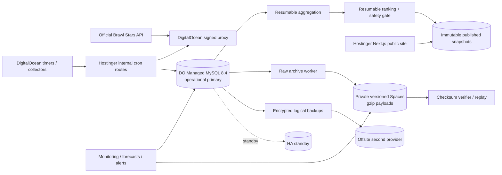
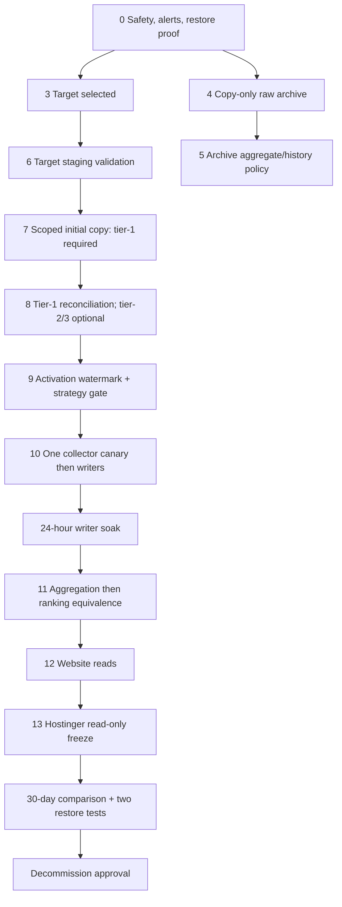

# BrawlRanks durable data workflow and storage migration plan

Status: planning plus partial, unproven implementation. The **primary objective is a durable, loss-resistant production data workflow** in which all newly collected Brawl Stars data flows continuously into DigitalOcean Managed MySQL, stays recoverable, and can be retried or replayed after failure. Migrating historical Hostinger data is a **secondary, non-blocking** concern. This document does not authorize a production cutover, deletion, production write, deployment, timer change, or secret rotation. Phase 8 incremental-sync tooling and Phase 9 role-aware pool abstraction exist in the repository (commit `035a0ff`) but have **not** been validated against production; no DigitalOcean cutover has occurred, and the durable workflow is **not yet active in production**.

## Official objective and non-loss contract

### Primary goal (authoritative)

The primary goal of this project is to establish a **durable, loss-resistant production data workflow** in which all newly collected Brawl Stars data flows continuously into **DigitalOcean Managed MySQL as the operational primary database**, remains recoverable, can be retried or replayed after failures, and does not silently disappear when a database, process, request, normalization step, or scheduled job fails.

Transferring historical rows out of the full Hostinger database is **not** the official objective. It is supporting work that may happen in whole, in part, in later batches, separately archived, or be omitted from the initial cutover. It must never block activation of the durable DigitalOcean workflow.

### Permanent production flow (the durable workflow)

This is the intended permanent path for **all new data**, before and after cutover:

```text
Official Brawl Stars API
  -> proxy and authenticated scheduler invocation
  -> ingestion workflow/run record (durable run identity)
  -> immutable raw snapshot or equivalent durable source evidence
  -> validation and normalization (idempotent)
  -> canonical battle / player / team / participant / observation records
  -> aggregation and ranking
  -> immutable published snapshots
  -> website reads
```

DigitalOcean Managed MySQL is intended to become the operational primary database for this durable workflow. Hostinger's role shrinks to legacy reference and rollback source only.

### Priorities

1. **Most important:** prevent loss of any data collected from the moment the new workflow becomes active, and all data collected after that point.
2. New incoming data must **not** depend on the historical Hostinger database continuing to accept writes.
3. Historical data already stored in Hostinger is **secondary and non-blocking**:
   - it may be migrated completely, partially, in later batches, archived separately, or omitted from the initial cutover;
   - failure to migrate all old Hostinger rows must **not** block activation of the new DigitalOcean ingestion workflow;
   - no claim is made that historical data is deleted unless that deletion is explicitly approved;
   - Hostinger can remain temporarily available as a legacy reference or rollback source.

### Distinct workstreams (do not conflate)

The rest of this document deliberately separates five different activities. They have different priorities, gates, and rollback stories:

1. **Historical migration / backfill** — moving old Hostinger rows (secondary, non-blocking; Phases 7–8).
2. **Operational cutover** — switching authoritative writers to DigitalOcean at an activation watermark (critical path; Phases 9–10).
3. **Permanent post-cutover ingestion** — the durable steady-state workflow (the objective; see “Permanent post-cutover workflow”).
4. **Archival and replay** — raw evidence retention, verification, and replay (Phase 4, Phase 14).
5. **Public read cutover** — pointing the website at the new primary (separate and later; Phase 12).

### Non-loss contract for new data

Every new fetch accepted after the workflow becomes active must satisfy all of the following. These are requirements on the durable workflow, not claims that they are already proven in production:

1. Every accepted fetch has a **durable run identity** (`data_fetch_runs` / `workflow_runs`).
2. The **raw response or equivalent source evidence is persisted before** the fetch can be considered successfully ingested.
3. Normalization is **idempotent** (re-processing the same raw evidence changes nothing).
4. **Deterministic keys and unique constraints** (`battle_key`, unique `(battle_id, …)` scopes) prevent duplicate battles.
5. **Cursor / checkpoint advancement happens only after durable completion**, never on partial failure.
6. Partial failures remain **retryable** without manual data surgery.
7. Failed rows are **visible** through workflow status or incident evidence, not silently dropped.
8. Raw evidence **can be replayed** through the existing validator/normalizer.
9. **No destructive cleanup** occurs before a verified archive and a restore/replay proof.
10. Website publication reads **only completed, immutable snapshots**.
11. A failed downstream aggregation or ranking run **must not destroy the last valid public snapshot**.

### Acceptance criteria for the new DigitalOcean workflow

The durable workflow is accepted only when a fresh production canary demonstrates all of the following (planned proof, not yet performed):

- a fresh canary fetch is recorded in a workflow/fetch run;
- raw source evidence exists durably;
- normalized records are committed;
- repeated processing of the same evidence is idempotent;
- battle observations preserve repeated sightings;
- retries do not create duplicate canonical battles;
- interrupted processing resumes from the last committed checkpoint;
- archive state is visible and verifiable;
- aggregation/ranking can resume safely;
- the website continues serving the last valid published snapshot during failures;
- **no new accepted write exists only in Hostinger after the activation watermark**;
- monitoring detects stalled workflows, expired locks, missing raw evidence, cursor stagnation, archive failures, and database capacity risk.

### Migration tooling is supporting infrastructure, not the production data path

The Phase 8 copy/sync tooling (`scripts/dataset-migration/*`) exists for continuity, backfill, validation, and rollback preparation. It is **not** the permanent ingestion mechanism. After cutover, new data must enter through the **normal production ingestion workflow directly into DigitalOcean** — not through migration scripts. The copy loop is decommissioned once cutover and reconciliation are proven.

### Decision hierarchy (when priorities conflict)

1. Preserve new raw and canonical data.
2. Keep ingestion resumable.
3. Maintain the last valid public snapshot.
4. Archive and control storage growth.
5. Backfill historical Hostinger data when capacity allows.

### Safety principles (unchanged)

- No uncontrolled dual-primary writing; one authoritative writer at a time.
- No cursor advancement on partial failure.
- No source deletion during Phase 8.
- Controlled pause rather than untracked write loss.
- Role-aware read/write pools.
- Canary writer before full collector cutover.
- Aggregation/ranking enabled only after ingestion validation.
- Website read cutover remains separate from writer cutover.
- Hostinger is frozen only after rollback and validation gates pass.

## Evidence, scope, and terminology

**Repository-confirmed facts** are based on migrations `migrations/0001_*.sql` through `migrations/0025_*.sql`, the runtime paths named below, and the Phase 3–5 operating documents. **Measured production facts** are the July 2026 figures supplied for this plan; no production query was run while writing it. **Recommendations** are future work and require the gates in each phase. Secret names are recorded, never values.

Measured starting point: the Hostinger database is 2,507.84 MB of a 3,072 MB limit (81.64% used; about 564 MB free), comprising 1,069.81 MB data and 1,438.03 MB indexes. In about 53 hours it accumulated 97,863 normalized battles; the current rate is about 42,000–49,000 battles/day. The largest reported objects are `matchup_aggregates` (~876 MB), `battle_participants` (~542 MB), `raw_api_snapshots` (~328 MB), `normalized_players` (~214 MB), `battle_teams` (~130 MB), `observed_players` (~130 MB), and `normalized_battles` (~83 MB).

The terms **hot** and **archive** mean online operational MySQL and durable object storage, respectively. Removing a hot payload or historical row is permitted only after the archive manifest and restore test prove that the data remains recoverable. “Keep forever” therefore means preserve durably, not necessarily keep indefinitely in the primary database.

## Phase 0 — Production safety and immediate capacity protection

### Entry criteria

1. Named migration owner and incident commander are available.
2. Current database size, table/index sizes, free space, collection rate, and all scheduler entries are captured.
3. A storage destination independent of the Hostinger account exists for backups.
4. No migration DDL, mass delete, `OPTIMIZE TABLE`, or aggregate rebuild is running.

### Immediate rules and tasks

1. Preserve all canonical and normalized records. Do not run the current destructive retention sweep until its configuration is reviewed: `lib/ingestion/retention.ts` currently defines `NORMALIZED_BATTLE_RETENTION_DAYS = 180` and `RAW_SNAPSHOT_RETENTION_DAYS = 90`, and `lib/ingestion/retentionQueries.ts` deletes battle children before battles and deletes raw payload rows. At the current 53-hour age it should not yet delete battles, but it is not an archival system.
2. Take a full transaction-consistent logical dump, schema-only dump, grants/user inventory (without secrets), scheduler inventory, and environment-key-name inventory. Encrypt and copy the dumps offsite. Complete the Phase 2 restore proof before any data removal.
3. Do not change collection coverage or discard normalized battles. Continue the seed, discovery, player-profile, and battle-log collection jobs at their present live settings while usage is below 90%, provided size is sampled at least hourly.
4. Pause **new aggregation and ranking rebuild invocations** until capacity is moved or a reviewed archive exists. This is the safest temporary growth reduction because `lib/aggregation/repository.ts` writes a new run-scoped set to `brawler_mode_aggregates`, `brawler_overall_aggregates`, and especially `matchup_aggregates`; old runs are not covered by retention. Publication remains available from `published_*` tables. Do not interrupt a run already in progress—let it finish or use the existing stale-run reconciliation.
5. The repository documents Hostinger cron examples in `PHASE4.md`; the supplied production context says DigitalOcean systemd timers invoke the jobs. Unit files and the live timer inventory are not in this repository. Capture `systemctl list-timers --all`, relevant unit definitions, and last-run status read-only before changing any schedule. Existing collection timers may continue. Retention may run only in `dryRun` mode until archival is deployed. Aggregation/ranking timers must not create repeated full rebuilds during the capacity emergency.
6. Safe temporary space measures, in priority order: stop avoidable full aggregate/ranking rebuilds; ensure failed/retried schedulers are not overlapping; lower logging verbosity outside MySQL; begin copy-only raw-payload export while leaving MySQL payloads intact; obtain an immediate Hostinger quota increase if available. Do not use `OPTIMIZE TABLE` under emergency pressure and do not drop indexes without query-plan proof.

### Capacity thresholds

| Threshold | Required action |
|---|---|
| 85% warning (already near) | Hourly size/growth alerts; complete backup and restore proof; provision target DB/object store; block discretionary rebuilds. |
| 90% (~2,765 MB) | Incident mode. Freeze new aggregation/ranking runs and destructive retention; request quota headroom; begin continuous migration work; preserve collection. |
| 95% (~2,918 MB) | Critical. Stop all rebuildable-data producers. If headroom cannot be added immediately, briefly pause scheduler invocations at the caller while retaining their last-run state; keep the public site read-only and online. Resume collectors first after capacity is available. |
| 98% (~3,011 MB) | Emergency. Prevent database-full corruption/failures: controlled pause of all DB writers after in-flight requests drain; keep public reads serving the last published snapshot; snapshot/dump; add capacity or cut writers to the validated target. No improvised deletion. |

At 78.16 MB/day of raw payload alone, the present 564 MB is only about 7.2 days of raw headroom; total-table growth makes the actual deadline shorter. Alerting must use projected days-to-limit, not percentage alone.

### Validation, rollback, completion

- Validate backup checksums, restored row invariants, public endpoint health, no running workflow older than 15 minutes, and no expired lock.
- A scheduler pause is rolled back by restoring the captured unit/timer state exactly; a quota change needs no application rollback. No payload is removed in this phase.
- Complete when a restorable backup exists, alerts are live, rebuildable growth is gated, target capacity is provisioned, and collection remains gap-free.

## Phase 1 — Current data-flow and schema audit

### Confirmed flow

```text
Official Brawl Stars API
  -> signed DigitalOcean proxy request (`lib/proxy.ts`)
  -> authenticated internal cron routes (`app/api/internal/cron/**/route.ts`)
  -> `data_fetch_runs` + immutable `raw_api_snapshots`
  -> validation/normalization (`lib/catalog/sync.ts`, `lib/ingestion/sync/*`)
  -> catalogs, players, battles, teams, participants, observations
  -> resumable run-scoped aggregation (`lib/aggregation/*`)
  -> resumable candidate ranking (`lib/ranking/*`)
  -> atomic immutable `published_*` snapshot
  -> `lib/publishedSnapshots/repository.ts`
  -> `/api/public/tier-list` and website pages
```

`lib/proxy.ts` uses `DIGITALOCEAN_PROXY_URL` and `PROXY_SHARED_SECRET`; internal routes use `INTERNAL_CRON_SECRET`. Database access is centralized in `lib/mysql.ts` using `DB_HOST`, `DB_PORT`, `DB_NAME`, `DB_USER`, and `BRAWL_DB_SECRET_V1`, with a `mysql2` pool limited to two connections. Raw catalog data is inserted before validation inside the catalog transaction. Battle-log sync inserts the raw response, then normalizes battles transactionally per battle. `battle_key` is the SHA-256 deterministic identity from `lib/ingestion/battleId.ts`; the database unique key is the final dedupe guard. A repeated sighting creates only a unique `(battle_id, data_fetch_run_id)` observation.

Aggregation resumes through `workflow_steps` in the order mode → overall → matchup → finalize. Ranking resumes brawlers → matchups → finalize → publish. Batch cursor and batch rows commit together. Ranking selects successful aggregate runs, writes candidates, applies the mass-movement/no-significant-change gate, and atomically changes the one current published snapshot. Public reads never query candidate or normalized tables.

### Exact classification matrix

`P` means preserve permanently (hot or archived); `R` means rebuildable from preserved upstream data; cleanup always requires the stated dependency/verification.

| Tables | Class and source | Important identity/index/FK facts | Growth and cleanup safety |
|---|---|---|---|
| `data_sources`, `source_endpoints` | canonical configuration, migrations/seed | unique source name; endpoint FK to source | tiny; P; never routine-delete |
| `workflow_definitions` | canonical workflow registry | unique slug; parent of runs/locks | tiny; P |
| `workflow_runs`, `workflow_steps`, `workflow_locks` | operational/audit, all jobs | steps FK run and unique `(run, step_order)`; one active lock enforced by generated flag | linear per invocation; archive old completed audit rows; never delete active/running/locked rows |
| `data_fetch_runs` | ingestion audit | FKs source, endpoint, workflow; referenced by raw, canonical `last_fetch`, players/clubs, battles, observations | high; P metadata; archive only after dependent references are handled |
| `raw_api_snapshots` | archival source evidence | FK fetch run; payload `LONGTEXT NOT NULL`; indexes fetch/category/created; SHA-256 checksum | ~78.16 MB payload/day measured; P in object storage; remove MySQL payload only after verified archive |
| `normalized_snapshots` | catalog normalization audit | one accepted entity enforced by generated flag; FK fetch run | low/moderate; P latest + changes; archive superseded rows |
| `canonical_brawlers`, `brawler_aliases`, `gadgets`, `star_powers` | canonical catalog | source IDs/slugs unique; aliases and abilities FK brawler | small; P |
| `canonical_game_modes`, `mode_aliases`, `canonical_maps`, `map_aliases` | canonical catalog | aliases FK canonical entities | small; P |
| `detected_changes`, `data_incidents` | audit/quarantine-like evidence | incident signature uniqueness added by migrations 0009/0018 | moderate; P archive. There is no table literally named `quarantine`; `data_incidents` is the current incident store |
| `seed_players` | canonical discovery seeds | unique tag/source scope | small; P while active; archive retired seeds |
| `observed_players` | discovery staging | unique `player_tag`; no battle FK | very high/front-loaded; P provenance in archive; compact promoted/stale rows only after mapping proof |
| `player_crawl_schedule` | operational queue | unique tag; due/lease/backoff/fairness indexes | bounded by discovered tags; retain active/current, archive retired state |
| `normalized_clubs` | normalized canonical-ish entity | unique club tag; last-fetch FK | moderate; P |
| `normalized_players` | normalized canonical entity/stubs | unique player tag; FK club/last fetch; participant FK points here | very high; P; cannot delete while participants reference it |
| `player_name_history` | normalized history | FK player | linear changes; P archive; compact hot history after verification |
| `normalized_battles` | canonical normalized fact | UUID PK, unique deterministic `battle_key`; FKs mode/map/fetch/patch; occurred indexes | ~42–49k/day; P; older hot partitions may be archived only with complete graph and replay proof |
| `battle_teams` | canonical battle child | unique `(battle_id, team_index)`; FK battle | ~4.34 rows/battle measured; P with battle |
| `battle_participants` | canonical battle child | unique `(battle_id, player_id)`; FKs battle/team/player/brawler; three lookup indexes | ~7.7 rows/battle measured and index-heavy; P with battle |
| `battle_observations` | provenance/dedupe sighting | unique `(battle_id, data_fetch_run_id)`; FKs battle/fetch | ~1.38 rows/battle measured; P archive; compact hot only with provenance manifest |
| `ingestion_rate_budgets`, `crawl_batches` | operational rate/queue audit | crawl batch FK workflow | bounded/linear; keep current plus audit archive |
| `patches` | canonical configuration | one active generated flag; battle/ranking/aggregate FKs | tiny; P |
| `ranking_rule_sets`, `ranking_rule_weights`, `tier_thresholds` | versioned canonical configuration | one current generated flag; weights/thresholds FK rule set | tiny; P forever for reproducibility |
| `aggregation_runs` | derived run metadata | FK workflow; parent of all aggregate rows and referenced by ranking runs | linear; P metadata; completed child detail is R |
| `brawler_mode_aggregates`, `brawler_overall_aggregates` | derived run-scoped facts | unique scope includes `aggregation_run_id`; lookup + run indexes | full copy per rebuild; R; retain referenced/current hot, archive historical |
| `matchup_aggregates` | derived ordered-pair run facts | unique brawler/opponent/mode/patch/run; lookup + run indexes; non-self check | 1,013,824 rows/~876 MB measured; R and dominant growth; archive historical run detail |
| `ranking_runs` | derived candidate-run audit | FKs rule set and three aggregation runs | linear; P metadata |
| `ranking_results`, `matchup_results` | derived candidate detail | unique candidate scopes per run; FKs run/catalog | full copy per ranking; R but needed to explain holds; archive historical candidates |
| `published_snapshots` | immutable published pointer/audit | unique ranking run and exactly one generated current flag | tiny; P forever |
| `published_snapshot_items`, `published_matchup_items` | immutable public contract | unique per snapshot/brawler or pair; FKs snapshot/catalog | modest; P forever; public API source |
| `schema_migrations` | schema audit created by `scripts/migrate.mjs` | version PK and SHA-256 file checksum | tiny; P |

Before implementation, generate a machine-readable FK/index inventory and save it with the migration evidence:

```sql
SELECT TABLE_NAME, COLUMN_NAME, REFERENCED_TABLE_NAME, REFERENCED_COLUMN_NAME
FROM information_schema.KEY_COLUMN_USAGE
WHERE TABLE_SCHEMA = DATABASE() AND REFERENCED_TABLE_NAME IS NOT NULL
ORDER BY TABLE_NAME, CONSTRAINT_NAME, ORDINAL_POSITION;

SELECT TABLE_NAME, INDEX_NAME, NON_UNIQUE,
       GROUP_CONCAT(COLUMN_NAME ORDER BY SEQ_IN_INDEX) AS columns
FROM information_schema.STATISTICS
WHERE TABLE_SCHEMA = DATABASE()
GROUP BY TABLE_NAME, INDEX_NAME, NON_UNIQUE
ORDER BY TABLE_NAME, INDEX_NAME;
```

## Phase 2 — Backup and recovery system

### Backup design

- Nightly transaction-consistent logical data+schema dump; weekly independent full dump; schema-only dump on every deployment; and a separate data-only dump weekly so schema and data can be restored/tested independently. Copy every dump encrypted to offsite storage. Use the client matching the source engine and `--single-transaction --quick --hex-blob --routines --triggers --events`; use its reviewed `--no-data` or `--no-create-info` mode for the split artifacts. Record tool/server versions and options. Do not use table locks on live InnoDB data.
- Managed-provider PITR is a second layer, not a replacement for portable dumps. Target RPO: ≤15 minutes after cutover (PITR/binlogs) and ≤24 hours for provider-independent logical copies. Target RTO: ≤4 hours for primary restore and ≤8 hours for a provider-independent rebuild at the forecast one-year size; measure rather than assume.
- Encrypt before upload with a KMS-managed key or `age`/equivalent envelope encryption. Backup credentials have write-only bucket access; restore credentials are separate. Keep 7 daily, 5 weekly, 12 monthly, and 7 annual logical backups. Keep pre-migration and pre-cutover backups for at least 13 months.
- Produce SHA-256 for ciphertext and plaintext dump, immutable manifest (database/server version, UTC time, migration checksum, row counts, cutoff markers), and object version ID. Store one copy in a different provider/account/region.

### Restorability proof (hard gate)

Restore the latest full dump into an isolated staging database created from empty migrations. Capture elapsed time and run:

```sql
SELECT VERSION(), @@character_set_server, @@collation_server, @@sql_mode, @@time_zone;
SELECT version, name, checksum FROM schema_migrations ORDER BY version;
SELECT COUNT(*) AS current_snapshots FROM published_snapshots WHERE is_current = 1;
SELECT ps.id, ps.ranking_run_id, ps.published_at, COUNT(psi.id) AS items
FROM published_snapshots ps
LEFT JOIN published_snapshot_items psi ON psi.published_snapshot_id = ps.id
WHERE ps.is_current = 1 GROUP BY ps.id, ps.ranking_run_id, ps.published_at;
SELECT COUNT(*) total, COUNT(DISTINCT battle_key) deduped FROM normalized_battles;
SELECT COUNT(*) orphan_participants FROM battle_participants bp
LEFT JOIN normalized_battles b ON b.id=bp.battle_id
LEFT JOIN normalized_players p ON p.id=bp.player_id
LEFT JOIN canonical_brawlers cb ON cb.id=bp.brawler_id
WHERE b.id IS NULL OR p.id IS NULL OR cb.id IS NULL;
SELECT COUNT(*) orphan_teams FROM battle_teams bt
LEFT JOIN normalized_battles b ON b.id=bt.battle_id WHERE b.id IS NULL;
SELECT COUNT(*) orphan_observations FROM battle_observations bo
LEFT JOIN normalized_battles b ON b.id=bo.battle_id
LEFT JOIN data_fetch_runs dfr ON dfr.id=bo.data_fetch_run_id
WHERE b.id IS NULL OR dfr.id IS NULL;
SELECT COUNT(*) bad_current_rules FROM ranking_rule_sets WHERE is_current=1;
SELECT COUNT(*) bad_locks FROM workflow_locks WHERE expires_at <= UTC_TIMESTAMP(3);
```

Expected: migration rows exactly match repository checksums through 0025; current snapshots = 1; restored current snapshot ID/ranking run/item count match source; `total = deduped`; all orphan counts = 0; current rule sets = 1; no stale lock after an isolated clean restore. Then run the public repository smoke test against staging and restore one archived raw object, decompress it, recompute SHA-256, and replay normalization without writes. A backup is not “complete” until this proof succeeds.

## Phase 3 — Target storage architecture

### Option comparison (July 2026; re-price at approval)

| Option | Compatibility and migration | Storage/backups/networking | Price category and risk |
|---|---|---|---|
| **DigitalOcean Managed MySQL 8.4 + Spaces** | `mysql2` compatible; MySQL 8.4 requires staging tests for MariaDB SQL-mode/generated-column behavior. DO migration can use GTID only if Hostinger exposes it. | TLS and disk encryption, trusted-source allowlists, DO VPC for collectors, public TLS endpoint for Hostinger; 7-day PITR; no built-in MySQL connection pool; storage can be added. | Medium. Single node starts low, HA needs primary+standby; extra storage billed per GiB. Lowest topology complexity because collectors already use DO. |
| **AWS RDS for MariaDB + S3** | Closest engine match and mature dump/import; broad size choices. | Automated backups/PITR, storage autoscaling, encryption/KMS, Multi-AZ, security groups; both Hostinger and DO traverse public TLS unless VPN/proxy is added. | Medium–high. Strongest exact compatibility/DR options, but AWS networking/operations and egress are more complex. |
| **Aiven for MySQL** | `mysql2` compatible; MariaDB→MySQL staging test required; managed migration available. | TLS, IP filters/static IP options, selectable cloud/region, managed backups; HA and backup history depend on plan. | High. Excellent managed experience and cloud choice, but production HA plans are costlier and introduce another operator platform. |

Primary sources: [DigitalOcean MySQL pricing](https://docs.digitalocean.com/products/databases/mysql/details/pricing/), [limits/PITR/connections](https://docs.digitalocean.com/products/databases/mysql/details/limits/), [security/trusted sources](https://docs.digitalocean.com/products/databases/mysql/how-to/secure/), [migration requirements](https://docs.digitalocean.com/products/databases/mysql/how-to/migrate/), [AWS RDS MariaDB pricing/features](https://aws.amazon.com/rds/mariadb/pricing/), [Aiven MySQL](https://aiven.io/docs/products/mysql), and [Aiven HA](https://aiven.io/docs/products/mysql/concepts/high-availability).

### Recommendation

Use **DigitalOcean Managed MySQL 8.4 Standard Edition with one standby**, DigitalOcean Spaces Standard for raw archives, and a second encrypted backup copy outside DigitalOcean. This minimizes collector latency and operational sprawl while preserving standard MySQL interfaces. It is conditional on Phase 6 proving all migrations and queries on MySQL 8.4. If any compatibility blocker cannot be fixed without risky semantic change, select AWS RDS MariaDB instead.

Provision at least **100 GiB usable at launch** and approve a 200 GiB 12-month capacity target. Do not launch with less than 30 days of forecast headroom. Use a separate same-version staging cluster. A read replica/analytics database is not required for cutover; add one only when measured reporting load or archival queries justify it.

Use a DO private connection from DO workloads and an allowlisted public TLS connection from Hostinger. Hostinger must have stable outbound IPs; if it does not, put a narrowly scoped DO ProxySQL/HAProxy endpoint in front of the private database rather than allow `0.0.0.0/0`. Create least-privilege `app_read`, `ingest_write`, `workflow_write`, `migration_admin`, and `backup_read` users. The app retains small pools: start with 2 per deployed process/role, calculate total processes, and stay under 60% of provider connection capacity. No provider-side MySQL pooling is available on DO.

Introduce backward-compatible role variables before cutover: `READ_DB_HOST/PORT/NAME/USER/SECRET`, `WRITE_DB_HOST/PORT/NAME/USER/SECRET`, TLS CA/path or certificate material, with current `DB_*`/`BRAWL_DB_SECRET_V1` as fallback. Keep secrets in Hostinger’s secret environment and DO systemd credentials/environment files with owner-only permissions, never in Git or unit command lines.

## Phase 4 — Raw API snapshot archival

### Confirmed write path and target record

Migration `0004_create_raw_snapshot_storage.sql` defines `raw_api_snapshots(id, data_fetch_run_id, endpoint_category, payload LONGTEXT NOT NULL, checksum CHAR(64), http_status, source_reported_at, received_at, created_at)`. `lib/catalog/repository.ts::insertRawSnapshot` is used by catalog sync and `lib/ingestion/sync/battleLogCrawlSync.ts`; raw evidence precedes normalization. Existing `checksum` is the original payload SHA-256.

Create a companion table first, avoiding a wide-table rewrite:

```sql
CREATE TABLE raw_snapshot_archives (
  raw_snapshot_id CHAR(36) NOT NULL,
  object_provider VARCHAR(30) NOT NULL,
  object_bucket VARCHAR(100) NOT NULL,
  object_key VARCHAR(512) NOT NULL,
  compression VARCHAR(10) NOT NULL,
  original_size_bytes BIGINT UNSIGNED NOT NULL,
  object_size_bytes BIGINT UNSIGNED NULL,
  original_checksum CHAR(64) NOT NULL,
  object_checksum CHAR(64) NULL,
  archive_status VARCHAR(20) NOT NULL DEFAULT 'pending',
  attempt_count INT NOT NULL DEFAULT 0,
  next_attempt_at DATETIME(3) NULL,
  last_error_code VARCHAR(80) NULL,
  upload_started_at DATETIME(3) NULL,
  archived_at DATETIME(3) NULL,
  verified_at DATETIME(3) NULL,
  payload_removed_at DATETIME(3) NULL,
  created_at DATETIME(3) NOT NULL DEFAULT CURRENT_TIMESTAMP(3),
  updated_at DATETIME(3) NOT NULL DEFAULT CURRENT_TIMESTAMP(3) ON UPDATE CURRENT_TIMESTAMP(3),
  PRIMARY KEY (raw_snapshot_id),
  UNIQUE KEY uniq_raw_archive_object (object_bucket, object_key),
  KEY idx_raw_archive_queue (archive_status, next_attempt_at),
  CONSTRAINT fk_raw_archive_snapshot FOREIGN KEY (raw_snapshot_id) REFERENCES raw_api_snapshots(id),
  CONSTRAINT chk_raw_archive_status CHECK
    (archive_status IN ('pending','uploading','verified','failed'))
) ENGINE=InnoDB DEFAULT CHARSET=utf8mb4 COLLATE=utf8mb4_unicode_ci;
```

A later, separately tested online migration changes only `raw_api_snapshots.payload` to nullable. Do not combine it with backfill or deletion.

### Object and state design

- Private versioned Spaces bucket, closest to the DB/collector region; TLS in transit, provider encryption at rest, separate scoped keys for writer and verifier. Spaces is S3-compatible and currently includes 250 GiB in its base subscription ([pricing](https://docs.digitalocean.com/products/spaces/details/pricing/), [versioning](https://docs.digitalocean.com/products/spaces/how-to/enable-versioning/)). Replicate manifests/backups to a second provider.
- Deterministic key: `raw/v1/YYYY/MM/DD/<endpoint_category>/<data_fetch_run_id>/<snapshot_id>-<checksum>.json.gz`. Sanitize category to a closed enum/path segment. One object per snapshot keeps replay and integrity isolation simple.
- Use gzip level 6 initially because Node supports it without native dependencies and replay tooling is universal. Benchmark zstd later; never change compression without versioning the key/manifest.
- S3 metadata records snapshot ID, endpoint category, original checksum/size, fetch run, source/received timestamps, and HTTP status. Object checksum is SHA-256 of compressed bytes; do not treat multipart ETag as SHA-256.
- Lifecycle: keep Standard for 90 days, then cold tier if restore testing supports it; retain raw objects indefinitely unless a separately approved data-governance policy says otherwise. Versioning/lifecycle rules must never expire the only verified version.

Exact state machine: (1) insert raw snapshot, (2) normalize successfully and commit, (3) enqueue/idempotently claim archive row, gzip and upload, (4) HEAD plus sampled/full GET verifies compressed size and both SHA-256 values, (5) atomically mark `verified`, (6) after a seven-day safety grace and a second audit, set MySQL payload to `NULL` and `payload_removed_at`. Failures increment attempts with capped exponential backoff; a lease timestamp lets another worker recover abandoned `uploading`. HTTP errors and invalid payloads are still archival evidence; archive them but only eligible-for-removal after their fetch/incident record is durable.

**Hard invariant: no payload may be removed before archive verification.** A database-space emergency does not override this rule.

Replay resolves metadata, fetches by deterministic key, verifies both hashes, decompresses, and invokes the existing validator/normalizer in dry-run or idempotent mode. Daily integrity sampling (at least 1% and 100 objects, whichever is larger) and a monthly full manifest audit are required. Initial backfill is oldest-first in small read-only batches and never removes payloads until all restore gates pass.

## Phase 5 — Historical aggregate retention

The size is explained by schema and measured counts, not raw battle growth alone. Every aggregate table’s uniqueness includes `aggregation_run_id`; a successful rebuild deliberately persists a new complete candidate set. A validated run produced 115,720 matchup aggregates. The measured 1,013,824 rows equal about 8.76 such full sets, and 876 MB is about 0.86 KB/row including indexes. No current retention query targets aggregates or ranking candidates.

Only these rows are operationally required: the newest fully successful mode/overall/matchup runs eligible for ranking; any run referenced by a running/held ranking investigation; and every run transitively referenced by `published_snapshots -> ranking_runs -> aggregation_runs`. Public requests themselves need only `published_*` rows. All aggregate detail is rebuildable if the normalized battle graph, patch catalog, code version, and rule set are preserved.

Policy:

1. Keep current/last two successful aggregation triples and all published-referenced triples hot.
2. Export other completed-run detail to immutable Parquet (preferred for analytics) plus CSV schema manifest, counts/min/max/checksums by `aggregation_run_id`; keep `aggregation_runs` metadata in MySQL forever.
3. Keep daily/patch trend summaries in a small future `aggregate_trend_summaries` table; never delete all history.
4. After two independent archive verifications and a staging re-import, delete only child rows for an explicit allowlisted completed run that is not referenced by any `ranking_runs`, published snapshot, running workflow, or investigation hold. Batch by run and PK; record deletion manifest.
5. Archive `ranking_results`/`matchup_results` similarly, retaining at least 90 days hot plus all held/current/published runs.

Run this index analysis before changing any index:

```sql
SELECT TABLE_NAME, INDEX_NAME, STAT_NAME, STAT_VALUE
FROM mysql.innodb_index_stats
WHERE DATABASE_NAME=DATABASE()
  AND TABLE_NAME IN ('matchup_aggregates','battle_participants')
ORDER BY TABLE_NAME, INDEX_NAME, STAT_NAME;

EXPLAIN FORMAT=JSON
SELECT * FROM matchup_aggregates
WHERE aggregation_run_id=? AND brawler_id>? ORDER BY brawler_id LIMIT 8;
```

The run-id indexes support deletion/ranking. The broad lookup indexes may be redundant for current run-bound queries, but no index is dropped until production query digests and staging `EXPLAIN ANALYZE` prove it. Do **not** start with partitioning: MySQL/MariaDB FK and partition-key rules conflict with this FK-heavy schema, and run IDs are UUIDs. Current/historical separation plus object archives is lower risk.

## Phase 6 — New primary database preparation

1. Provision MySQL 8.4, InnoDB, UTC, `utf8mb4`/`utf8mb4_unicode_ci` initially to match migrations. Capture `@@sql_mode` and reconcile it in staging; require strict mode and test every CHECK/generated-column/null-unique behavior. Do not silently substitute collation.
2. Configure HA standby, automated PITR, maintenance/backup windows away from workflow DDL, TLS verification, trusted sources, alerting, and least-privilege users. Administrative/migration credentials are not used by the app.
3. Apply `node scripts/migrate.mjs status` then `up` from migration 0001 through current on an empty staging DB. The runner creates `schema_migrations`, SHA-256 checks already-applied files, uses the named advisory lock, and refuses checksum drift.
4. Validate schema, FKs, generated current flags, indexes, and server behavior:

```sql
SELECT version,name,checksum FROM schema_migrations ORDER BY version;
SELECT TABLE_NAME,ENGINE,TABLE_COLLATION
FROM information_schema.TABLES WHERE TABLE_SCHEMA=DATABASE() ORDER BY TABLE_NAME;
SELECT TABLE_NAME,CONSTRAINT_NAME,CONSTRAINT_TYPE
FROM information_schema.TABLE_CONSTRAINTS WHERE TABLE_SCHEMA=DATABASE()
ORDER BY TABLE_NAME,CONSTRAINT_NAME;
SELECT COUNT(*) FROM ranking_rule_sets WHERE is_current=1;
SELECT COUNT(*) FROM patches WHERE is_active=1;
SELECT @@version,@@version_comment,@@sql_mode,@@time_zone,
       @@character_set_server,@@collation_server,@@max_connections;
```

Expected: all 25 repository migrations and exact checksums; every application table InnoDB; expected collation; exactly one current rule set after seed migration 0025; zero or one active patch according to source; UTC session behavior; enough connections that configured app pools remain below 60%.
5. Restore a production copy to staging and benchmark: battle-log transaction p50/p95/p99, public tier-list p95, aggregation batch of 8, ranking batch of 8, archive claim/update, dump and restore throughput. Success requires no semantic diff, no new 500/504, and p95 no worse than 1.5× current (or an approved absolute SLO).

### Completion and rollback

Complete only when migration checksums, schema diff, integration tests, restore proof, TLS paths from Hostinger and DO, and workload benchmarks pass. Failure deletes no source data: discard/recreate the staging/target database and keep Hostinger authoritative.

## Phase 7 — Initial copy (scoped, not a blocker)

**Reframing:** despite the historical name, this phase is **not** a gate that requires copying the entire Hostinger database before progress continues. It establishes a consistent baseline copy whose **required scope is the Phase 8 tier-1 continuity state**; tier-2 historical bulk and tier-3 rebuildable detail may be copied here, deferred to post-cutover backfill, archived separately, or omitted. The procedure below is written for a full dump because that is the safest single-snapshot mechanism when a full copy is chosen, but the operator may scope it to tier-1 tables (plus whatever historical subset is wanted) without blocking cutover.

The source remains authoritative and writable during the initial copy.

1. Record a UTC migration ID and a cutoff manifest immediately before the dump: server version/SQL mode/timezone, every table count, `MAX(created_at|updated_at|observed_at|started_at)` as applicable, current published snapshot/ranking run, current rule set, active patch, running workflows/locks, and source binlog/GTID coordinates if Hostinger exposes them.
2. Take an InnoDB-consistent dump with the source-engine client:

```text
mariadb-dump --single-transaction --quick --hex-blob --routines --triggers --events \
  --default-character-set=utf8mb4 --databases <database> > <encrypted-pipeline>
```

The operator must adapt only client-specific flags after checking `mariadb-dump --help`; passwords come from a protected option file, never the command line. `--single-transaction` supplies one MVCC snapshot for InnoDB while collectors continue. Do not use `--lock-all-tables`.
3. Import schema before data. For a monolithic dump, disable FK checks only in the isolated target session and restore them before validation. For table-wise imports use parent order: registries/workflow definitions → fetch/workflow records → catalogs/rules/patches → players/clubs → battles → teams → participants/observations → aggregate runs/details → ranking runs/details → published snapshots/items. Keep dump files immutable so a failed table can be truncated/reloaded only on the target.
4. For large tables, use streamed, compressed table-wise dumps with 1–4 target loaders based on benchmarked I/O; never parallel-load dependent parent/child tables unsafely. Monitor target bytes, rows, InnoDB history, CPU, connections, replication lag (if applicable), and import error log.
5. Compare schema DDL after normalizing engine-generated clauses, counts per table, and these invariants:

```sql
SELECT DATE(occurred_at) day, COUNT(*) battles, COUNT(DISTINCT battle_key) keys
FROM normalized_battles GROUP BY DATE(occurred_at) ORDER BY day;
SELECT MIN(occurred_at),MAX(occurred_at),MIN(created_at),MAX(created_at)
FROM normalized_battles;
SELECT endpoint_category,COUNT(*),MIN(created_at),MAX(created_at)
FROM raw_api_snapshots GROUP BY endpoint_category;
SELECT aggregation_run_id,COUNT(*) FROM matchup_aggregates
GROUP BY aggregation_run_id ORDER BY aggregation_run_id;
SELECT ranking_run_id,COUNT(*) FROM ranking_results
GROUP BY ranking_run_id ORDER BY ranking_run_id;
SELECT id,ranking_run_id,published_at FROM published_snapshots WHERE is_current=1;
SELECT status,COUNT(*) FROM workflow_runs GROUP BY status;
```

6. Compute deterministic checksum samples on at least 1,000 battles across every collection day: `SHA2(CONCAT_WS('|', battle_key, occurred_at, structure, COALESCE(game_mode_id,''), COALESCE(map_id,'')),256)`, plus child counts per battle. Compare every published item, not a sample.

Rollback is simply to discard the target import; the source and collectors were untouched. Complete when the target represents the cutoff snapshot exactly and the source has sufficient free headroom for catch-up.

## Phase 8 — Scoped historical backfill and incremental reconciliation

**Reframing (important):** Phase 8 is **not** a mandatory full historical transfer that must complete before the project can progress. It is an **optional/scoped historical backfill plus an incremental reconciliation mechanism**. Its purpose is continuity and rollback safety, not moving every old row. Implementation has already reached this phase — the incremental-sync tooling under `scripts/dataset-migration/*` and the `migration_sync_state` model exist in the repository (commit `035a0ff`, pending production proof) — so the cursor, idempotency, reconciliation, and validation machinery below is preserved. What changes is the **scope requirement**: only the data needed for continuity must move before writer cutover; full old-data backfill can continue afterward without blocking production.

Phase 8 must support selecting a **safe cutoff / activation watermark** (see Phase 9) and may migrate only what is required for continuity, dependencies, current publication state, active workflows, current catalog/rules, and rollback.

**Implementation status (Tier-1 scope).** *Implemented in repo:* the migration CLI now has an explicit, centralized `--scope tier-1` (alias `continuity`) defined in `scripts/dataset-migration/scope.ts`, distinct from `--scope all`. Tier-1 selects only the continuity manifest below, copies the current published snapshot via `reconcileCurrentPublication` (dependency-expanded, not full history), runs a scoped reconciliation limited to in-scope tables, and binds each `--state-dir` to one scope so Tier-1 cursors can never be reused for a full-history pass (fail-closed). Unknown scope names are rejected. *Local validation available:* `npm run migration:scope-preview` (or `tsx scripts/dataset-migration/cli.ts scope-preview --scope tier-1`) runs a credential-free synthetic self-check of scope resolution, manifest determinism, dependency order, state-dir binding, no-advance-on-page-failure, and dry-run no-mutation; unit tests cover the same in `tests/datasetMigrationPhase8.test.ts`. *Production proof still pending:* no Tier-1 dry-run or apply has been run against the real source/target; the non-loss workflow is not yet validated in production. This is **not** a claim that Phase 8 is complete.

### Table classification for cutover scope

Classify every table family into one of three tiers. Only tier 1 must be reconciled before writer cutover.

| Tier | Meaning | Table families | Blocks cutover? |
|---|---|---|---|
| **1 — Mandatory continuity state** | Needed so the new writer produces correct, non-duplicating downstream state and so rollback is possible | `data_sources`, `source_endpoints`, `workflow_definitions`, `ranking_rule_sets`/`ranking_rule_weights`/`tier_thresholds`, `patches`, canonical catalogs (`canonical_brawlers`/aliases/abilities, `canonical_game_modes`/`canonical_maps`/aliases), the **current** `published_snapshots` + `published_snapshot_items` + `published_matchup_items` (and their `ranking_runs`→`aggregation_runs` chain), active `workflow_runs`/`workflow_steps`/`workflow_locks`, active `player_crawl_schedule` + `seed_players`, and enough `normalized_players`/`normalized_clubs` + recent `data_fetch_runs` to satisfy foreign keys and dedupe for freshly collected battles | **Yes** — must be reconciled and drained at the watermark |
| **2 — Optional historical backfill** | High-volume history that has forensic/analytical value but is not required for the new workflow to run correctly | all historical `normalized_battles` + `battle_teams` + `battle_participants` + `battle_observations`, historical `raw_api_snapshots`, historical `data_fetch_runs`, `player_name_history`, `observed_players` provenance | **No** — may migrate later, in batches, archived separately, or be omitted from initial cutover |
| **3 — Rebuildable derived history** | Deterministically recomputable from tier-1/tier-2 preserved facts + code + rules | historical `brawler_mode_aggregates`, `brawler_overall_aggregates`, `matchup_aggregates`, `ranking_results`, `matchup_results`, and superseded aggregation/ranking run detail | **No** — prefer rebuild or archive over copy |

Old high-volume history — all normalized battles, participants, observations, and historical aggregates — **does not have to block the new workflow** unless an explicit continuity dependency (a foreign key needed by newly collected data, or a rollback requirement) forces a specific subset into tier 1. Full backfill of tiers 2 and 3 runs later under bounded resources (see “Permanent post-cutover workflow”).

### Incremental reconciliation mechanics

UUID PKs are not chronological, so never page with `id > last_uuid` alone. Use a stable composite `(timestamp, id)` cursor, a fixed upper watermark per pass, and repeat overlapping windows. Tables without reliable mutation timestamps require parent-driven reconciliation or full-key comparison.

### Cursor and dependency plan

| Family | Cursor/change key | Idempotency and notes |
|---|---|---|
| `workflow_runs`, `data_fetch_runs`, `aggregation_runs`, `ranking_runs` | `(created_at,id)` for inserts; rescan nonterminal IDs until terminal | upsert by UUID; terminal fields may update |
| `workflow_steps` | parent `workflow_run_id`; rescan runs changed/nonterminal | unique `(workflow_run_id,step_order)` |
| `workflow_locks` | full table every pass | upsert/delete by UUID/definition; ephemeral and reconciled at cutover |
| `raw_api_snapshots` | `(created_at,id)` | immutable insert; checksum collision/mismatch is fatal |
| catalogs/rules/patches | full small-table reconciliation | upsert by PK and verify unique natural keys/current flags |
| `observed_players` | natural `player_tag` full/hashed buckets | insert-only/no-op semantics |
| `normalized_players`, clubs, crawl schedule | `updated_at` where defined; otherwise hashed natural-key buckets and repeated full diff | preserve source version; unique tag makes upsert idempotent |
| `normalized_battles` | `(created_at,id)` with `battle_key` verification | immutable insert; same key/different content is fatal |
| teams/participants | parent battle IDs copied in the pass | insert/upsert by unique battle scope after parent |
| observations | `(observed_at,id)` and parent battle/fetch IDs | unique `(battle_id,data_fetch_run_id)` |
| aggregate/ranking/public details | parent run/snapshot IDs created or changed in pass | copy only after parent terminal state; unique run scopes; published pointer reconciled in one transaction |

Example stable page predicate:

```sql
SELECT * FROM raw_api_snapshots
WHERE (created_at > ? OR (created_at = ? AND id > ?))
  AND (created_at < ? OR (created_at = ? AND id <= ?))
ORDER BY created_at,id LIMIT 1000;
```

Apply target operations in transactions using `INSERT ... ON DUPLICATE KEY UPDATE` only for mutable tables. For immutable facts, `INSERT IGNORE` is insufficient because it hides divergence: on duplicate, fetch and compare canonical columns/checksum. Retry a failed page without advancing its durable cursor. Store migration cursors and page manifests outside both application schemas or in a purpose-built `migration_sync_state` table added by an approved migration.

Gap detection per pass:

- counts and min/max timestamp in fixed hourly buckets;
- anti-joins by `battle_key`, player tag, raw snapshot ID, and run ID;
- child count/hash per copied battle;
- source/target raw checksum equality;
- no target-only keys while source is authoritative;
- exact current published snapshot identity and item hashes.

Repeat until **tier-1 continuity state** lag is under 60 seconds for three passes; tiers 2 and 3 do not need to reach low lag before cutover and may still be backfilling. Final tier-1 catch-up occurs during Phase 10’s controlled pause. No source row is deleted and no cursor advances on partial failure. Backfill of tiers 2–3 is explicitly allowed to continue after cutover as separate, bounded work that must not interfere with live ingestion.

## Phase 9 — Cutover strategy and activation watermark (critical path)

**Phases 9 and 10 are the critical path** for the official objective. Together they: establish the final activation watermark; perform a controlled pause only where necessary; drain in-flight work; persist the final source state; switch operational writers to DigitalOcean; restart collection; prove that every new fetch creates durable evidence and reaches the correct downstream state; and verify there is no source-only accepted write after cutover. The role-aware pool abstraction this phase depends on is already implemented in the repository (commit `035a0ff`) but is unproven in production.

### Cutover activation watermark

The **activation watermark** is the authoritative boundary between "old data" and "new durable-workflow data":

- It is a **UTC timestamp** plus the relevant IDs/checkpoints in effect at that instant (latest `data_fetch_runs`/`workflow_runs`, current published snapshot/ranking run, current rule set, active patch, per-collector cursors, and source binlog/GTID coordinates if available).
- **Everything accepted after the watermark must be written through the DigitalOcean workflow** and must never exist only in Hostinger.
- Any item **fetched before but unfinished at** the watermark must be drained, reconciled, or replayed — not dropped.
- The watermark must be recorded in a **durable manifest** stored outside both application schemas (or in `migration_sync_state`), alongside the tier-1 reconciliation proof, so cutover and rollback can both reference it exactly.

The non-loss requirement (priority 1) is defined **relative to this watermark**: loss of anything accepted at or after it is unacceptable; the disposition of pre-watermark historical data is governed by the secondary, non-blocking backfill.

### Evaluation and choice

- **Binlog/GTID replication** is ideal operationally and DigitalOcean supports migration from a source with remote access, GTID, and replication privileges, but those controls are commonly unavailable on shared-hosted databases. This is an entry check, not an assumption. DO also documents that its migration sync is not an indefinite replication service.
- **Application dual-write** would touch many transaction paths. Two independent MySQL transactions cannot be atomic; without a transactional outbox it risks split brain and duplicate publications. Building and operating a complete outbox solely for a one-time migration adds more risk than it removes.
- **Scheduled incremental synchronization plus a short controlled write pause** matches the immutable/deduplicated model, needs no permanent dual-write, is fully reconcilable, and works without source binlog privileges.

Choose scheduled incremental synchronization as the primary strategy. If Phase 0 proves Hostinger exposes stable row-based GTID/binlogs and a replication user, managed continuous migration may replace the copy loop after staging proof, but it does not change validation/cutover gates.

The controlled pause is unavoidable because mutable player/schedule/workflow rows lack one universal CDC sequence and the current application has one database pool. It is not data loss: disable scheduler triggers only after current requests drain, record their intended next runs, final-sync/reconcile, switch the canary writer, and re-enable. Budget ≤5 minutes; abort and restore timers if exceeded. Battles occurring upstream during this window are fetched after resumption; verify that the official battle-log window plus crawl cadence leaves ample margin.

Before migration, add a separately deployable, backward-compatible database-role abstraction: operational writes/workflows use the write pool, while public snapshot reads use the read pool. Today `lib/mysql.ts` is a singleton, so collectors and website readers cannot be switched separately without this work package. Fallback to existing `DB_*` keeps behavior unchanged until role variables are deliberately populated.

## Phase 10 — Operational cutover (critical path)

This is the operational cutover — the moment the DigitalOcean write pool becomes authoritative at the activation watermark. Its success is defined by the non-loss contract and the acceptance criteria in “Official objective and non-loss contract”: after cutover, **prove that every new fetch creates durable raw evidence and reaches the correct downstream state, and verify there is no source-only accepted write after the watermark.** Historical backfill completeness is explicitly *not* a precondition for this phase.

“Collector” here includes the DigitalOcean scheduler/proxy invocation chain and the Hostinger internal ingestion route that performs database writes. Repository facts do not establish that DO processes connect directly to MySQL; verify the live topology before acting.

1. Back up Hostinger and DO environment/unit files and record checksums/modes without printing secret contents. Create new scoped DB credentials; do not change `INTERNAL_CRON_SECRET`, proxy secret, curl timeouts, or unrelated infrastructure.
2. Deploy the role-aware pools while both roles still point to Hostinger and run smoke tests. This must be a separate release from cutover.
3. Pause only one low-volume canary timer after its in-flight invocation completes. Perform final incremental sync for its affected tables and point only the canary operational writer to the target via protected environment.
4. Restart order: application instance/route handler with target write pool → one player-profile canary → one battle-log canary → observe → remaining ingestion jobs one at a time. Do not change every unit simultaneously. Systemd timer definitions/cadences remain unchanged; only the protected DB endpoint/credential reference changes if the live topology actually has direct DB clients.
5. Canary validation:

```sql
SELECT id,status,started_at,completed_at FROM data_fetch_runs
ORDER BY created_at DESC LIMIT 10;
SELECT id,battle_key,occurred_at,first_observed_at FROM normalized_battles
ORDER BY created_at DESC LIMIT 20;
SELECT battle_key,COUNT(*) FROM normalized_battles
GROUP BY battle_key HAVING COUNT(*)>1;
SELECT bo.battle_id,bo.data_fetch_run_id,COUNT(*)
FROM battle_observations bo GROUP BY bo.battle_id,bo.data_fetch_run_id HAVING COUNT(*)>1;
SELECT archive_status,COUNT(*) FROM raw_snapshot_archives GROUP BY archive_status;
SELECT player_tag,last_seen_at,is_reachable FROM normalized_players
ORDER BY last_seen_at DESC LIMIT 20;
```

Expected: successful fetch, raw snapshot present, normalized player/battle graph and observation committed, duplicate queries empty, archive row pending/verified according to worker timing, and no source-only accepted write after the final cutoff.
6. Reconcile battle counts/checksums after every canary. Then switch discovery/profile/battle jobs in dependency order, one timer at a time. Catalog and retention follow last. Keep aggregation/ranking disabled until Phase 11.

Rollback: stop new-target invocations, drain, final reverse-copy only target-origin rows after content verification (or replay their raw objects idempotently through the old path), restore old DB environment, restart the app, then timers in original order. Never run both primary writers concurrently without a reconciliation ledger.

## Permanent post-cutover workflow (the durable steady state)

Once collectors are cut over, the durable workflow is the permanent production state. This is the objective the whole plan exists to reach:

- The **DigitalOcean write pool is authoritative.** Hostinger is no longer part of the write path.
- Scheduled collectors **continue from persisted checkpoints**; no re-fetch storms and no gap at the watermark boundary.
- Every accepted fetch follows the non-loss contract: durable run identity → raw evidence persisted first → idempotent normalization → deterministic-key dedupe → checkpoint advance only on durable completion.
- **Raw evidence is retained and archived** (Phase 4), and normalization, aggregation, ranking, and publication remain **resumable** after any interruption.
- The website continues serving the **last valid published snapshot**; a failed aggregation/ranking run never destroys it.
- **Historical Hostinger backfill, if still wanted, runs separately** with bounded resources (throttled batches, off-peak windows, its own connection budget) and **cannot interfere with live ingestion**. It is tier-2/tier-3 work from Phase 8 and is optional.
- The Phase 8 migration/sync tooling is **retired** from the live path; new data no longer flows through migration scripts.

### Capacity protection (do not repeat the Hostinger failure)

DigitalOcean must not be allowed to fill the way Hostinger did. The steady state enforces:

- **Projected days-to-capacity alerts** (not percentage alone) as defined in Phase 15, driven by real growth slopes.
- **Verified raw payloads are archived** to object storage (Phase 4) and their MySQL payloads nulled only after verification + grace, keeping the hot database from carrying full raw JSON forever.
- **Retention for rebuildable historical aggregate/ranking detail** (Phase 5 / Phase 14): keep only referenced/current/held sets hot; archive the rest.
- **No repeated uncontrolled full-rebuild accumulation** — the single largest cause of the Hostinger emergency. Each rebuild's superseded run detail is archived/retired, not left to pile up.
- **Storage growth budgets by table family**, tracked daily against the forecast in Phase 16.
- When capacity is threatened, **pause rebuildable producers (tier-3 aggregation/ranking rebuilds and tier-2 backfill) before pausing canonical ingestion.** Preserve new canonical/raw data first; this mirrors the decision hierarchy.

## Phase 11 — Aggregation and ranking validation

Use the deployed resumable routes with small `batchSize: 8` calls. Preserve authentication and public contracts. Do not publish a candidate merely to test migration.

### Aggregation sequence

1. POST `/api/internal/cron/aggregation-run` repeatedly at safe intervals.
2. Expect HTTP 200 with `started`/`in_progress`; HTTP 409 `lock_not_acquired` is temporary concurrency; no 500/504.
3. Observe cursor phases exactly: mode → overall → matchup → finalize → `completed`.
4. On each call record workflow/aggregation run IDs, cursor, inserted counts, duration, HTTP status. Verify lock heartbeat and that the batch rows and cursor advance atomically.
5. Compare the target run with an isolated restored-source staging run at the same frozen battle cutoff and code version; do not create a comparison rebuild in the capacity-constrained production source:

```sql
SELECT scope,status,brawlers_processed,started_at,completed_at
FROM aggregation_runs WHERE workflow_run_id=? ORDER BY created_at;
SELECT aggregation_run_id,COUNT(*),SUM(matches),SUM(wins),SUM(losses),SUM(draws)
FROM brawler_mode_aggregates WHERE aggregation_run_id=? GROUP BY aggregation_run_id;
SELECT aggregation_run_id,COUNT(*),SUM(matches),SUM(wins),SUM(losses),SUM(draws)
FROM brawler_overall_aggregates WHERE aggregation_run_id=? GROUP BY aggregation_run_id;
SELECT aggregation_run_id,COUNT(*),SUM(matches),SUM(wins),SUM(losses)
FROM matchup_aggregates WHERE aggregation_run_id=? GROUP BY aggregation_run_id;
SELECT workflow_definition_id,COUNT(*) FROM workflow_locks
WHERE expires_at>UTC_TIMESTAMP(3) GROUP BY workflow_definition_id HAVING COUNT(*)>1;
```

### Ranking sequence

Only after aggregation returns `completed`, POST `/api/internal/cron/ranking-rebuild` repeatedly. Observe brawlers → matchups → finalize → publish → `completed`; record workflow run, ranking run, outcome, counts, duration, and HTTP status. Valid completed outcomes include `published`, `held_mass_movement`, and `no_significant_change`. Confirm the three referenced aggregation runs are successful and from the completed workflow, the current rule set is correct, and publication never occurs from an incomplete run.

Validate candidate counts/hashes between old and new DB for the same cutoff/rule set. Exercise the mass-movement guard; a held result must leave `published_snapshots.is_current` unchanged. If publication is approved after equivalence, verify exactly one current snapshot, immutable old snapshots, item counts, and no partial child set.

Failure/rollback: stop calls, preserve candidate evidence, diagnose; public reads still use the old/current published snapshot. Do not alter thresholds or force publication during migration validation.

## Phase 12 — Website read cutover

Collectors must have run successfully on the new operational DB for at least 24 hours before website readers move.

1. Back up the Hostinger environment and deployed commit/version; populate `READ_DB_*` for the target using a read-only user and TLS CA. Do not rotate unrelated secrets.
2. Deploy through the existing verified Hostinger workflow documented for the project; run production build, reload by the existing mechanism, and verify the deployed commit. Do not invent a deployment path.
3. Run a connection-only health query, then smoke test homepage, tier list, representative brawler pages, game-mode pages, search, and `/api/public/tier-list`.
4. Compare old/new HTTP status, JSON keys/types/nullability/order semantics, `publishedAt`, snapshot ID/patch label, item count, cache headers, and p50/p95 latency. The response contract must be byte-equivalent except approved timing/cache metadata.
5. Watch connection count, errors, TLS verification, slow queries, and Hostinger-to-DO latency for at least one hour. Target public p95 should remain within the Phase 6 approved SLO.

Rollback: restore only `READ_DB_*` to the old read-only Hostinger database, reload the app with the same commit, purge only affected cache entries if required, and repeat the contract smoke test. Writers remain on the new DB; therefore reverse/read replication or the final comparison policy must ensure the old published snapshot remains an acceptable rollback view.

## Phase 13 — Legacy Hostinger database freeze

After both cutovers and a final source→target reconciliation:

1. Drain and disable all old writers. Revoke write privileges from application users if Hostinger supports granular grants; otherwise remove writer credentials and enforce read-only operationally. Verify writes fail with a harmless transaction in an isolated test table only if one already exists—do not create one during emergency handling.
2. Record final cutoff, counts, schema checksum, current snapshot, workflow states, and take full encrypted/offsite backup. Keep the database online read-only for 30 days and its final backup for at least 13 months.
3. Compare daily for 7 days, then weekly: public snapshot identity, historical row counts, archived raw manifest, and sample checksums. Keep Hostinger available longer if any unexplained divergence, target incident, archive backlog, or restore-test failure exists.
4. Roll back reads immediately for public-contract/latency issues. Roll back writers only with a reviewed reverse-sync/replay plan and when the target-origin raw/battle set is fully reconciled; never point writers backward blindly.
5. Decommission only after 30 stable days, two successful target restore tests, zero unresolved reconciliation gaps, verified raw/aggregate archives, approved cost/capacity evidence, and owner sign-off. Do not delete it immediately. What may remain on Hostinger is the website, protected environment configuration, and optionally a small read-only snapshot DB if economically justified—not the growing operational dataset.

## Phase 14 — Ongoing retention and lifecycle management

Deletion always means removal from hot MySQL **after** archive verification where archive is specified. A run/snapshot referenced by a retained FK is never deleted. Retention sweeps remain bounded/idempotent and emit manifests.

| Table | Hot retention | Durable policy / rebuildability | Deletion prerequisites |
|---|---|---|---|
| `normalized_battles` | 365 days initially; never less than ranking recency window + 30 days | archive full history forever; canonical, not treated as disposable | complete battle graph archive, hash/restore/replay proof, no operational query needs range |
| `battle_participants` | with parent battle | archive forever with battle; canonical | parent manifest includes all FK/natural IDs and child counts |
| `battle_teams` | with parent battle | archive forever with battle; canonical | same atomic battle-graph archive |
| `battle_observations` | 180 days hot | archive forever; provenance | source fetch links in manifest and restored FK proof |
| `normalized_players` | forever hot while referenced/active | preserve forever; normalized canonical/stub | only unreferenced merged duplicates under approved identity process |
| `observed_players` | unpromoted 60 days hot; promoted 30 days after proof | archive provenance forever; staging/compactable | normalized mapping or stale reason, archive verified, no active crawl dependency |
| `player_name_history` | 365 days hot | archive forever; compactable | archive verified; keep first/latest/change boundaries hot as needed |
| `raw_api_snapshots` | metadata forever; payload through verified archive + 7-day grace | object payload forever; metadata/checksum/object key/status in MySQL | `verified_at`, checksum recheck, object version, offsite manifest; only payload becomes NULL, row stays |
| `data_fetch_runs` | 365 days hot | archive metadata forever | no live FK dependency or preserve a compact parent record; raw/battle provenance manifest complete |
| `workflow_runs` | 365 days hot; failed/held 24 months | archive audit forever | terminal only, no locks/steps/fetch/run references requiring row |
| `workflow_steps` | with workflow run | archive audit; cursor history rebuildable only as audit, not recomputed | terminal parent and archive verified |
| `workflow_locks` | only active/recent diagnostics | operational/ephemeral | expired, owner run terminal/reconciled; stale-lock evidence captured |
| `aggregation_runs` | metadata forever | preserve code/cutoff/count manifest; child calculations R | never delete metadata referenced by ranking |
| `brawler_mode_aggregates` | last two successful triples + 90 days + all referenced | archive historical detail; R from battles/code | run terminal, not current/referenced/held, Parquet+manifest restore proof |
| `brawler_overall_aggregates` | same | same | same |
| `matchup_aggregates` | same, with strict capacity cap | archive historical detail/trends; R | same; batch explicit run IDs only |
| `ranking_runs` | metadata forever | preserve rule/aggregate/code association forever | never routine-delete metadata |
| `ranking_results` | 90 days + all held/published/current | archive candidates forever; R but forensic value | terminal, not investigation/current, verified archive |
| `matchup_results` | 90 days + all held/published/current | archive candidates forever; R | same |
| `published_snapshots` | forever hot | immutable permanent record | never delete |
| `published_snapshot_items` | forever hot | immutable public/audit record | never delete |
| `published_matchup_items` | forever hot | immutable public/audit record | never delete |
| `detected_changes` | 12 months hot | archive forever | archived and no open incident dependency |
| `data_incidents` | unresolved forever hot; resolved 12 months | archive forever | resolved, archive verified; retain signature/severity/timestamps hot if needed |
| quarantine tables | none exists today | use `data_incidents`; any future quarantine table retains unresolved indefinitely and resolved 12 months hot | explicit future migration/policy |

Supporting tables: canonical catalogs, patches, ranking rules/weights/thresholds, schema migrations, and published data stay forever hot; `normalized_snapshots` keeps accepted/current hot and archives superseded versions after 12 months; rate budgets keep current state plus 12 months audit; completed crawl batches keep 90 days hot then archive; active crawl schedules remain hot.

Implement policy changes by replacing hard-coded destructive assumptions in `lib/ingestion/retention.ts`, `lib/ingestion/retentionQueries.ts`, and `lib/ingestion/sync/retentionSweep.ts` with archive-state gates. The existing 180-day battle and 90-day raw-row deletion must not run unchanged once the new policy is adopted.

## Phase 15 — Monitoring, alerts, and capacity forecasting

Collect five-minute operational metrics and daily immutable capacity snapshots. Notifications: warning to the operations chat/email; critical to paging plus incident ticket; backup/restore and integrity failures also notify the data owner/security contact.

The metric set is explicit: total database size, data size, index size, growth per hour/day/week, remaining capacity, projected days to limit, battles collected per hour/day, unique players, raw archive backlog, failed archive uploads, ingestion gaps, duplicate rate, aggregation freshness, ranking freshness, public snapshot age, failed workflows, stale locks, database connection usage, slow queries, backup age, and restore-test age.

| Metric | Warning | Critical |
|---|---|---|
| DB used / remaining | 70% or <30 forecast days | 80% or <14 days; 90% invokes Phase 0 incident actions |
| Growth | >1.25× 7-day baseline for 6h | >1.5× for 3h or unexplained >5% step |
| Battles collected | <70% or >150% hourly baseline for 2h | zero for 30m during scheduled collection or unexplained spike >2× |
| Unique players/dedupe | unique player change outside expected band; duplicate observations rising | duplicate `battle_key` >0; normalized insert divergence |
| Raw archive backlog | oldest pending >1h or >5,000 | >6h, >25,000, any payload removed before verification |
| Archive failures/integrity | >1% upload failures or one checksum retry | verified-object checksum mismatch or missing object |
| Ingestion gaps | one missed interval | two consecutive missed intervals / battle timestamp gap beyond cadence SLO |
| Aggregation freshness | >36h (or 1.5× approved cadence) | >72h, failed run, cursor stalled >15m |
| Ranking/public snapshot age | >48h warning unless held with ticket | >96h or incomplete-run publication |
| Workflows/locks | any running >15m | repeated failed workflow or expired lock not reconciled in 5m |
| Connections | >60% max for 10m | >80% or queue/timeout errors |
| Slow queries | p95 >2× baseline; >1s digest growth | p99 >5s on public/ingestion transaction or lock waits |
| Backup age | logical >26h or PITR unhealthy | >36h, checksum failure, offsite-copy failure |
| Restore-test age | >35 days | >45 days or latest test failed |

Core capacity SQL:

```sql
SELECT ROUND(SUM(DATA_LENGTH+INDEX_LENGTH)/1024/1024,2) total_mb,
       ROUND(SUM(DATA_LENGTH)/1024/1024,2) data_mb,
       ROUND(SUM(INDEX_LENGTH)/1024/1024,2) index_mb
FROM information_schema.TABLES WHERE TABLE_SCHEMA=DATABASE();
SELECT TABLE_NAME,TABLE_ROWS,
       ROUND(DATA_LENGTH/1024/1024,2) data_mb,
       ROUND(INDEX_LENGTH/1024/1024,2) index_mb,
       ROUND((DATA_LENGTH+INDEX_LENGTH)/1024/1024,2) total_mb
FROM information_schema.TABLES WHERE TABLE_SCHEMA=DATABASE()
ORDER BY DATA_LENGTH+INDEX_LENGTH DESC;
SELECT DATE_FORMAT(created_at,'%Y-%m-%d %H:00:00') hour,COUNT(*)
FROM normalized_battles WHERE created_at>=UTC_TIMESTAMP()-INTERVAL 7 DAY
GROUP BY hour ORDER BY hour;
SELECT archive_status,COUNT(*),MIN(created_at),MAX(attempt_count)
FROM raw_snapshot_archives GROUP BY archive_status;
SELECT status,COUNT(*),MIN(started_at) FROM workflow_runs GROUP BY status;
SELECT id,ranking_run_id,published_at FROM published_snapshots WHERE is_current=1;
```

Store daily total/data/index bytes and per-table bytes; calculate slopes over 24h/7d/30d and `days_to_limit=(limit_bytes-used_bytes)/max(7d_daily_growth,30d_daily_growth)`. On managed storage, use provisioned capacity and maintain ≥30 days plus 30% free, whichever is larger.

## Phase 16 — Cost and scale forecasting

### Assumptions

- Central case 42,000 battles/day; high case 49,000/day. Participant ratio is 753,000/97,863 ≈7.69; team ratio 425,000/97,863 ≈4.34; observation ratio 135,000/97,863 ≈1.38.
- Current battle+team+participant reported table footprint is ~755 MB/97,863 ≈7.7 KB/battle including indexes, before separately reported observations/player growth. Use **7–10 KB/battle** for the normalized battle graph.
- Raw uncompressed payload growth is measured at 78.16 MB/day. Gzip is assumed to use 20–35% of source bytes; benchmark replaces this range.
- `normalized_players`/`observed_players` grew unusually fast during discovery and will not scale perfectly linearly. Aggregates are excluded from the normalized estimate because Phase 5 caps/archive them; without that policy, each 115,720-row matchup rebuild adds roughly 100 MB at current density.
- DB backup size ranges from 50–100% of allocated logical bytes depending on compression/content; managed physical snapshots may differ.

| Horizon | Battles (42k; 49k high) | Participants central | Normalized battle graph (7–10 KB/battle) | Raw JSON / gzip estimate | Notes |
|---|---:|---:|---:|---:|---|
| 30 days | 1.26M; 1.47M | 9.69M | 8.8–12.6 GB (10.3–14.7 high) | 2.35 GB / 0.47–0.82 GB | plus players/catalogs and bounded aggregates |
| 90 days | 3.78M; 4.41M | 29.1M | 26.5–37.8 GB (30.9–44.1 high) | 7.03 GB / 1.41–2.46 GB | 100 GiB target retains comfortable headroom only with archive policy |
| 1 year | 15.33M; 17.89M | 117.9M | 107–153 GB (125–179 high) | 28.53 GB / 5.7–10.0 GB | plan 200 GiB operational target and scalable object storage |

At the current 57.3% index share, index review has material value, but the forecast already uses observed total table footprints. Do not promise savings before staging measurements. At 42k/day, teams are ~5.47M/30d, 16.4M/90d, 66.6M/year; observations ~1.74M/30d, 5.21M/90d, 21.1M/year.

Including today’s 2.5 GB baseline, player/catalog growth, indexes, and bounded hot aggregate sets, budget approximately 12–20 GB operational at day 30, 30–55 GB at day 90, and 120–200 GB at one year. A compressed logical backup may be roughly 50–100% of those logical bytes: 6–20 GB, 15–55 GB, and 60–200 GB respectively. These deliberately broad backup ranges must be replaced by the first real encrypted dump/compression measurement; keep at least two full-backup equivalents outside the managed provider in addition to the retention chain.

Cost categories to approve: HA database compute (primary+standby), 100→200 GiB storage, PITR/backup overage, object storage and retrieval, second-provider encrypted backups, monitoring/logging, and temporary overlap of old/new DB for at least 30 days. Re-price with provider calculators at purchase; architecture is chosen for compatibility, resilience, and migration risk—not lowest sticker price.

## Phase 17 — Implementation roadmap

Each package is independently deployable and reversible. File lists are likely impact, not permission to edit them now.

| WP | Objective / likely files | Migrations and tests | Risk, order, rollback, evidence |
|---|---|---|---|
| 0 | Capacity dashboard and scheduler inventory; ops scripts/docs only | none; metric-query tests | Low; first. Remove alerts only after replacement. Evidence: hourly forecast/alerts and captured live units |
| 1 | Backup/restore automation and manifests; `scripts/` new backup/verify tools, operator docs | none; encrypted round-trip and staging restore | Medium; before all changes. Roll back job, retain dumps. Evidence: timed restore and invariant report |
| 2 | Role-aware DB pools; refactor `lib/mysql.ts`, `lib/publishedSnapshots/repository.ts`, ingestion/aggregation/ranking pool callers, `.env.example` | no schema migration; pool routing, TLS, fallback, connection-budget tests | Medium; deploy with both roles on old DB. Roll back env/code. Evidence: identical contracts and connection counts |
| 3 | Raw archive metadata; new migration after 0025 | create `raw_snapshot_archives`; migration/schema/FK/status tests | Low–medium; additive. Roll back app usage, keep table. Evidence: migration checksum/schema diff |
| 4 | Archive writer/verifier/replay; new `lib/archive/*`, internal cron route, package test registration, `.env.example` | none beyond WP3; idempotency, gzip/hash, retry/lease, corrupt-object, replay tests | Medium. Copy-only first. Disable timer to roll back. Evidence: backlog zero and sampled downloads verify |
| 5 | Raw backfill then nullable payload; archive tools/retention paths | separate online migration makes payload nullable; staging DDL timing test | High due table size; after 100% archive. Abort before DDL or restore target table. Evidence: 100% verified + 7-day grace + size drop after batched nulling |
| 6 | Archive-gated retention and aggregate manifests; `lib/ingestion/retention.ts`, `retentionQueries.ts`, `retentionSweep.ts`, `lib/aggregation/*`, archive library | optional trend-summary migration; dry-run/FK/reference guard tests | High. Dry-run for 7 days. Disable destructive mode to roll back. Evidence: exact allowlist/manifests/re-import |
| 7 | Provision/stage target and MySQL 8.4 compatibility | existing 0001-current only initially | Medium. Delete/recreate staging. Evidence: checksum, integration suite, benchmark |
| 8 | Incremental copy/reconciliation tooling; new `scripts/dataset-migration/*` | optional `migration_sync_state` additive migration | High. Source read-only tool, target writes. Discard target to roll back. Evidence: 3 passes <60s lag/no gaps |
| 9 | Scoped initial copy (tier-1) and catch-up; tier-2/3 backfill optional/deferred | none | High operationally; source remains authoritative; full backfill must not block cutover. Evidence: Phase 7/8 reports |
| 10 | Collector canary/cutover | env only; no infrastructure redesign | High; one timer/job at a time. Restore old write env and replay target raw on rollback. Evidence: canary fetch/battle/player/dedupe |
| 11 | Aggregation/ranking equivalence | none | Medium; workflows can be held without public impact. Evidence: run cursors/counts/hashes/no 500/504 |
| 12 | Website read cutover | env/deployment only | Medium; after 24h writer soak. Restore `READ_DB_*`. Evidence: contract and latency report |
| 13 | Legacy freeze and lifecycle | grants/ops only | Medium; 30-day safety window. Re-enable only after reverse-sync review. Evidence: final dump/two restores/sign-off |

Every code package runs `npm run lint`, `npm run typecheck`, `npm test`, and `npm run build`, plus migration tests and focused archive/migration integration tests. Do not bundle provider provisioning, archive deletion, collector cutover, and reader cutover into one release.

## Phase 18 — Final operator runbook

### Normal deployment

1. Confirm backup/PITR health and capacity >30 days; inspect `git diff`, migration status/checksums, active workflows.
2. Run lint/typecheck/tests/build; deploy with the existing Hostinger workflow; apply only reviewed forward migrations under the migration advisory lock and outside backup/workflow windows.
3. Reload by the verified mechanism; smoke public/API and one internal dry-run; monitor errors/connections/latency. Roll back app/env first; never edit an applied migration.

### Migration day

1. Declare change window and go/no-go; verify backup restore, target HA/TLS/capacity, source free space, operator access, scheduler inventory, rollback owner.
2. Record cutoff; run final incremental passes. Drain/pause schedulers, final reconcile, switch one writer canary, then writers one by one.
3. Validate 24 hours. Run aggregation to completed, then ranking to completed/held. Only then switch website reads. Freeze old DB read-only after final reconciliation.

### Rollback

1. Stop affected new invocations and drain. Preserve logs/raw/candidate evidence.
2. For reader issue, restore old `READ_DB_*` and reload. For writer issue, reconcile target-origin records or replay verified raw objects before restoring old write endpoint.
3. Restore timers/unit environment from checksummed backup, one at a time. Verify dedupe, gaps, workflows, locks, snapshot contract. Never delete the failed target until evidence is retained.

### Database approaching capacity

Follow Phase 0 thresholds: alert → freeze rebuildable producers → add capacity → controlled writer pause only at 98%/write-safety risk. Keep public reads online. Never improvise deletes/DDL/`OPTIMIZE`.

### Raw archive failure

Stop payload-nulling, not ingestion. Keep MySQL payloads, alert on backlog, rotate only archive credential if implicated, retry idempotently, verify checksums. If capacity is endangered, add DB capacity; do not delete unverified payloads.

### Collector failure

Disable only failing timer, inspect last fetch/workflow/proxy status without exposing secrets, preserve leases, run one canary after fix, detect timestamp gaps and backfill/replay. Do not increase all batch sizes to catch up at once.

### Aggregation failure

Stop new aggregation invocations, inspect run/step cursor/lock and structured logs, allow stale-run reconciliation, then resume the same bounded workflow. Public snapshot remains unchanged.

### Ranking failure/hold

Confirm source aggregation is complete, rule set current, baseline snapshot correct, and candidate counts. A hold is safe; do not change thresholds or force publish. Preserve the candidate run for forensics.

### Restore from backup

Provision isolated same-version DB, verify encrypted object hashes, restore schema/data, run Phase 2 invariants and application smoke tests, replay archive/catch-up to RPO, then cut over via writer canary followed later by readers. Never overwrite the only surviving database.

## Executive recommendation

The goal is a **durable, loss-resistant production workflow on DigitalOcean**, not a full historical copy. Immediately protect capacity by stopping discretionary aggregate/ranking rebuilds, putting the current destructive retention sweep into dry-run, and proving an encrypted offsite restore. Stand up a 100 GiB minimum HA DigitalOcean Managed MySQL 8.4 cluster (200 GiB 12-month target) as the operational primary, conditional on full MariaDB→MySQL compatibility tests; use AWS RDS MariaDB if that gate fails. Archive every raw JSON payload to private versioned DigitalOcean Spaces with independent checksums and an offsite manifest, retaining MySQL metadata forever and nulling payload only after verified archive plus grace period. Keep canonical normalized history durably, cap hot historical aggregates by explicit run references, and archive rather than discard old run detail.

Cut over on the critical path: reconcile only the **tier-1 continuity state**, establish a recorded **activation watermark**, run repeated idempotent catch-up on that scope, take a ≤5-minute controlled writer pause, switch one collector canary, prove durable evidence and no source-only writes after the watermark, validate workflow equivalence, then cut website reads separately and later. **Full historical Hostinger backfill is optional and must not block cutover** — it runs afterward under bounded resources, or not at all. Keep Hostinger read-only for at least 30 days as a rollback source.

## Definition of done (dataset project completion)

The dataset project is **not complete merely when old Hostinger rows have been copied.** Copying historical data is optional follow-up work. The project is complete only when **all** of the following hold:

1. New data has been flowing through the DigitalOcean durable workflow for an **agreed observation period** (steady state, not a single canary).
2. **No accepted fetch is missing durable source evidence** over that period.
3. Retry/replay behavior and checkpoint resumption are **proven** in production, not just in staging.
4. Capacity, retention, and archive **monitoring is active** with projected days-to-limit alerts.
5. Aggregation, ranking, and publication **work from the new primary**.
6. **Hostinger is no longer required for new writes.**
7. Any remaining historical Hostinger backfill is **explicitly documented as optional follow-up work**, with no implication that its incompleteness blocks completion.

Until these are met in production, this document must not claim the DigitalOcean cutover is complete or that the durable non-loss workflow is active.

## Architecture diagram



## Migration dependency diagram



## Table retention matrix

| Data layer | Forever hot | Hot then archive | Rebuildable detail | Never remove before |
|---|---|---|---|---|
| Catalog/configuration | sources, endpoints, catalogs, patches, rules, migration ledger | superseded normalized snapshots/change audit | aliases can be regenerated only with evidence | FK and source-history validation |
| Players | referenced normalized players/clubs | observed players, names, schedules/audit | schedule state | tag mapping and archive proof |
| Battles | current 365-day operational window | complete battle/team/participant/observation history | no—canonical source facts | graph checksum + restore/replay proof |
| Raw | metadata/checksum/object pointer | full payload objects | normalization can replay, raw cannot be recreated | verified object/version/two hashes/grace |
| Workflows/fetch | active/current metadata | terminal audit | steps operationally reproducible, audit is not | terminal/FK/archive proof |
| Aggregation/ranking | run metadata and referenced/current sets | historical candidates/detail | yes, from preserved facts+code+rules | no reference, manifest, re-import proof |
| Publication | all snapshots and items | none | no—immutable public record | never |
| Incidents | unresolved/current signatures | resolved evidence | no—operational evidence | resolution + archive proof |

## Risk register

| Risk | Likelihood / impact | Mitigation / owner gate |
|---|---|---|
| Hostinger fills before migration | High / critical | Phase 0 thresholds, block rebuilds, quota headroom, hourly forecast; incident commander |
| MariaDB→MySQL semantic mismatch | Medium / high | empty migrations + production restore + query suite on MySQL 8.4; fall back to RDS MariaDB |
| Source binlog unavailable | High / medium | selected incremental sync + controlled pause does not require it |
| One shared DB pool prevents staggered cutover | Confirmed / high | role-aware pools deployed with fallback before migration |
| Lost/duplicated battle during catch-up | Medium / critical | composite cursors, fixed watermarks, `battle_key`, child hashes, anti-joins, final pause |
| Non-atomic dual write/split brain | Medium / critical | do not use naïve dual-write; one authoritative writer at a time |
| Raw payload deleted before durable archive | Medium / critical | separate verified state, hashes, versioning, grace, retention hard gate |
| Aggregate archive deletes published dependency | Low / critical | FK/transitive reference allowlist, manifests, staging restore, metadata retained |
| Index/storage forecast underestimates growth | High / high | 100 GiB minimum/200 GiB target, daily slopes, 30%/30-day headroom |
| Hostinger lacks stable outbound IP | Medium / high | verify early; narrow DO proxy/VPN, never open DB globally |
| Cross-provider latency hurts public pages | Medium / medium | staging benchmark, connection reuse, immutable snapshot caching, rapid read rollback |
| Scheduler topology differs from docs | High / medium | live read-only systemd/cron inventory; do not invent/change units |
| Backup exists but cannot restore | Medium / critical | monthly isolated restore, checksum and app invariants; hard migration gate |
| Held ranking mistaken for migration failure | Medium / medium | compare same cutoff/rules/baseline; hold preserves current publication |
| Cost exceeds approval | Medium / medium | re-price HA/storage/overlap/offsite before order; capacity beats cheapest plan |

## Rollback checklist

- [ ] Declare rollback scope: archive worker, writer, workflow, reader, or entire migration.
- [ ] Stop only affected new invocations and drain in-flight requests.
- [ ] Capture target logs, cursors, raw object versions, counts, and timestamps.
- [ ] Confirm latest source and target backups/checksums.
- [ ] For writer rollback, reconcile/replay every target-origin fetch/battle first.
- [ ] Restore protected environment from checksummed backup; do not print secrets.
- [ ] Restart one canary, then remaining jobs in recorded dependency order.
- [ ] Verify unique battle keys, raw checksums, player updates, workflow locks/statuses.
- [ ] Restore public read endpoint separately and verify exact response contract/`publishedAt`.
- [ ] Keep failed target intact for forensics; document gap/duplicate proof and owner sign-off.

## Go/no-go checklist

- [ ] Source usage below emergency threshold or temporary quota headroom secured.
- [ ] Full encrypted offsite backup restored successfully within RTO.
- [ ] All migration checksums through current match and target schema diff is clean.
- [ ] MySQL 8.4 compatibility, TLS, Hostinger egress, DO private path, and connection budget pass.
- [ ] Raw archive copy-only path has zero checksum mismatches and no payload removal enabled.
- [ ] Tier-1 continuity copy and three catch-up passes show no gaps/target-only divergence and <60s lag (tier-2/3 backfill may still be running and does not block).
- [ ] Activation watermark (UTC timestamp + IDs/checkpoints) is recorded in a durable manifest.
- [ ] Non-loss contract verified for the canary: durable run identity, raw-evidence-first, idempotent normalization, checkpoint-after-durable-completion.
- [ ] Live scheduler/unit inventory and exact rollback commands are captured.
- [ ] No active aggregation/ranking/retention mutation at cutover.
- [ ] One authoritative writer, canary order, ≤5-minute pause budget, and owners agreed.
- [ ] Public read cutover is scheduled separately after 24-hour writer soak.
- [ ] Monitoring/paging, provider support, cost approval, and 30-day legacy retention are active.

Any unchecked item is **no-go**.

## Open questions requiring user approval

1. Approve DigitalOcean Managed MySQL 8.4 HA as the preferred target and AWS RDS MariaDB as the compatibility fallback; approve the current provider quote and region.
2. Approve at least 100 GiB at launch and the 200 GiB 12-month capacity budget, including 30-day Hostinger overlap and offsite backups.
3. Confirm Hostinger’s stable outbound IP/TLS capabilities and whether a narrow DO database proxy is permitted if it has no stable IP.
4. Provide a read-only export of the live DigitalOcean systemd units/timers and confirm whether any process connects directly to MySQL rather than only invoking Hostinger routes.
5. Confirm whether Hostinger exposes GTID/binlog/replication privileges; the primary plan does not require them, but availability could reduce the final pause.
6. Approve the hot normalized-battle window (recommended 365 days, never under active ranking window +30) while keeping full history in verified archives.
7. Approve indefinite raw-object retention and Spaces lifecycle/cross-provider backup policy, or provide legal/privacy retention limits.
8. Approve aggregate hot policy (last two successful triples +90 days + all referenced/held) and permanent archived run detail/trend summaries.
9. Approve an application maintenance window with a target writer pause of ≤5 minutes and named rollback authority.
10. Define the public latency SLO and RPO/RTO if the recommended 15-minute/4-hour targets are insufficient.
